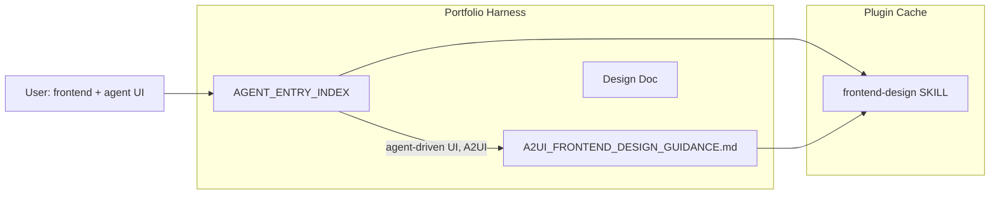

# A2UI Frontend Design Integration Plan

## Context

The approved design adds A2UI (agent-driven UI) guidance to the frontend-design workflow. The [frontend-design skill](C:\Users\schum.cursor\plugins\cache\cursor-public\compound-engineering\e1906592cbd49889beb82e1be76359398b6d3d58\skills\frontend-design\SKILL.md) lives in the compound-engineering plugin. We will **not** edit plugin files (they can be overwritten on update). Instead, we create harness-local supplements that the agent loads when doing frontend work for agent-driven UIs.

## Architecture

When the user asks for frontend design involving agent-driven UIs, the agent loads both the frontend-design skill (from plugin) and A2UI_FRONTEND_DESIGN_GUIDANCE.md (from harness).

## Implementation Steps

### Step 1: Create design doc

**Path:** [docs/plans/2025-03-11-a2ui-frontend-design-design.md](D:/portfolio-harness/docs/plans/2025-03-11-a2ui-frontend-design-design.md)

**Content:** Persist the approved design (Sections 1–3, recommendation, critic report). Create `docs/plans/` if it does not exist.

### Step 2: Create A2UI frontend design guidance doc

**Path:** [.cursor/docs/A2UI_FRONTEND_DESIGN_GUIDANCE.md](D:/portfolio-harness/.cursor/docs/A2UI_FRONTEND_DESIGN_GUIDANCE.md)

**Content:**

- **Agent-driven UI (A2UI) subsection** (Section 1):
  - Use semantic names and roles for components (e.g. `ProductCard`, `DateRangePicker`)
  - Prefer design tokens over hardcoded values (CSS variables for theme, spacing, typography)
  - When building for agents, structure components as a catalog (named, composable, with clear props)
  - Reference: [a2ui.org](https://a2ui.org/), [Custom Components](https://a2ui.org/guides/custom-components/)
- **Component design checklist** (Section 2, optional use):
  - Semantic component names
  - Props that map to declarative fields (`text`, `path`, `usageHint`)
  - Design tokens for theme
  - Accessibility (contrast, focus, ARIA)
- **Future integration** (Section 3):
  - If adding agent-driven UIs (Daggr, context demo), consider A2UI as the protocol
  - Lit/Angular renderers; A2A or AG UI transport

### Step 3: Add AGENT_ENTRY_INDEX row

**File:** [.cursor/docs/AGENT_ENTRY_INDEX.md](D:/portfolio-harness/.cursor/docs/AGENT_ENTRY_INDEX.md)

**Change:** Add one row to the main table:

| If you are …                                                  | Then read …                                                                                          |
| ------------------------------------------------------------- | ---------------------------------------------------------------------------------------------------- |
| Building frontend for agent-driven UIs, A2UI, or A2A surfaces | [A2UI_FRONTEND_DESIGN_GUIDANCE.md](A2UI_FRONTEND_DESIGN_GUIDANCE.md); frontend-design skill (plugin) |

Place near other frontend/UI-related rows (e.g. after browser automation or before agent-native).

### Step 4: Optional rule for automatic loading

**Path:** [.cursor/rules/frontend-a2ui.mdc](D:/portfolio-harness/.cursor/rules/frontend-a2ui.mdc) (optional)

**Content:** Rule that triggers when the task involves frontend design AND agent-driven UI, A2UI, or A2A. Instructs the agent to load A2UI_FRONTEND_DESIGN_GUIDANCE.md before generating components. This ensures the guidance is applied even when the user does not explicitly mention A2UI.

**Decision:** Defer to user preference. The AGENT_ENTRY_INDEX row may be sufficient; a rule adds automatic triggering.

## Files Changed

| File                                                   | Action      |
| ------------------------------------------------------ | ----------- |
| `docs/plans/2025-03-11-a2ui-frontend-design-design.md` | Create      |
| `.cursor/docs/A2UI_FRONTEND_DESIGN_GUIDANCE.md`        | Create      |
| `.cursor/docs/AGENT_ENTRY_INDEX.md`                    | Add one row |

## Out of Scope

- Modifying the plugin frontend-design skill (fragile, overwritten on update)
- Implementing A2UI renderers or adopting A2UI for a specific surface (future work per Section 3)
- Role-routing changes (AGENT_ENTRY_INDEX is the routing mechanism)

## Verification

- Design doc exists and contains Sections 1–3
- A2UI_FRONTEND_DESIGN_GUIDANCE.md exists with subsection, checklist, future integration
- AGENT_ENTRY_INDEX has the new row
- Prompt test: "Build a catalog-ready form component for an agent-driven restaurant booking UI" — agent should load A2UI guidance and apply semantic names, design tokens, checklist

