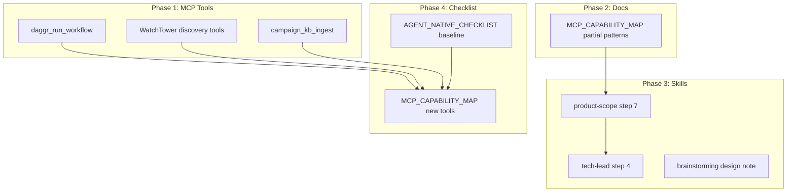

# Action Parity and Agent-Native Improvement Plan

## Current State

- **Action parity score:** 32/58 (55%) — 12 done, 20 partial, 4 missing
- **Missing:** WatchTower discovery (scan, devices, status, failover); campaign_kb ingest dod/campaign-docs
- **Partial:** 20 actions achieved via `run_terminal_cmd` + curl, `read_file`, `write_file` — functional but not first-class MCP tools

---

## Phase 1: Add Missing MCP Tools (Target: 4 missing → 0)

### 1.1 Add `daggr_run_workflow` to Daggr MCP

**File:** [local-proto/scripts/daggr_mcp.py](D:\portfolio-harness\local-proto\scripts\daggr_mcp.py)

**Change:** Add tool that invokes `python -m daggr_workflows.run_workflow <name>` per stack.

```python
@mcp.tool()
def run_workflow(workflow_name: str, stack: str = "WatchTower", inputs_json: str = "{}") -> str:
    """Run a Daggr workflow by name. workflow_name: e.g. 'simple', 'rag', 'ingest'. stack: WatchTower | campaign_kb | harness. inputs_json: optional JSON for workflow inputs. Returns {pass, stdout, stderr}."""
```

**Implementation:** Use `subprocess.run` with `cwd` set to the stack root (WatchTower_main, campaign_kb, harness). Parse `daggr_test_matrix.md` or `run_workflow.py` WORKFLOWS to resolve script path. For `needs_app=True` workflows, document that Flask/FastAPI must be running.

**Impact:** Converts 6+ Gradio workflow actions from Partial to Done (simple, rag, ingest, error-analysis, metrics, campaign_kb ingest/merge).

---

### 1.2 Add WatchTower Discovery Tools

**Option A (recommended):** Extend [daggr_mcp.py](D:\portfolio-harness\local-proto\scripts\daggr_mcp.py) with WatchTower-specific tools when `stack=WatchTower` or add a new `watchtower_mcp.py`.

**Option B:** Create `local-proto/scripts/watchtower_mcp.py` as a thin HTTP client to WatchTower Flask API.

**Tools to add:**


| Tool                                  | HTTP equivalent                   | Parameters               |
| ------------------------------------- | --------------------------------- | ------------------------ |
| `watchtower_discovery_scan`           | POST /discovery/scan              | (optional network_range) |
| `watchtower_discovery_devices`        | GET /discovery/devices            | —                        |
| `watchtower_discovery_devices_status` | GET /discovery/devices/status     | —                        |
| `watchtower_discovery_failover`       | POST /discovery/devices//failover | ip                       |


**Base URL:** Read from `WATCHTOWER_API_URL` or `http://localhost:5000` (Flask default).

**Impact:** Converts 4 Missing → Done.

---

### 1.3 Add campaign_kb Ingest Coverage (dod, campaign-docs)

**Current:** Agent can use `run_terminal_cmd` → `run_workflow ingest` but campaign_kb ingest has multiple source types (pdfs, seeds, dod, docs, repos, campaign-docs). The ingest workflow may not expose dod/campaign-docs.

**Options:**

- **A:** Add `campaign_kb_ingest` tool to daggr_mcp or new `campaign_kb_mcp.py` that POSTs to FastAPI `/ingest/dod`, `/ingest/campaign-docs`, etc.
- **B:** Extend `daggr_run_workflow` with `inputs_json` that passes `source_type` to campaign_kb ingest workflow.

**Recommendation:** Add `campaign_kb_ingest(source: str, **kwargs)` to daggr_mcp. `source` ∈ {pdfs, seeds, dod, docs, repos, campaign-docs}. Tool performs HTTP POST to campaign_kb FastAPI (port from config, e.g. 8001).

**Impact:** Converts 2 Missing → Done.

---

## Phase 2: Document Partial Patterns (Raise Clarity, Not Raw Score)

The audit counts "Partial" when the agent uses `run_terminal_cmd` + curl. These are valid agent capabilities. The improvement is **documentation**, not new tools.

### 2.1 Update MCP_CAPABILITY_MAP.md

**File:** [.cursor/docs/MCP_CAPABILITY_MAP.md](D:\portfolio-harness.cursor\docs\MCP_CAPABILITY_MAP.md)

**Change:** Add a "Partial (run_terminal_cmd) patterns" section that maps user actions to the exact commands agents use. Example:

```markdown
## Partial Patterns (run_terminal_cmd + curl)

| User action | Agent achieves via | Example |
|-------------|-------------------|---------|
| Get encoder status | curl http://localhost:5000/api/encoders/status | run_terminal_cmd("curl -s ...") |
| Control encoder | curl -X POST .../api/encoders/<id>/control | ... |
```

This makes the audit reproducible and helps agents choose the right pattern.

---

### 2.2 Refine Audit Scoring (Optional)

**Current:** Done = direct MCP; Partial = run_terminal_cmd/read_file; Missing = none.

**Proposal:** Keep scoring as-is for consistency. Add a "Partial patterns" appendix to the audit report so implementers know which commands to use. No change to the 55% calculation; the goal is clarity.

---

## Phase 3: Integrate Agent-Native into product-scope, brainstorming, tech-lead

### 3.1 product-scope Skill

**File:** [.cursor/skills/product-scope/SKILL.md](D:\portfolio-harness.cursor\skills\product-scope\SKILL.md)

**Change:** Add step 7 (after stack-framing):

> **7. Action parity (if UI or API):** When the feature adds user actions (buttons, API calls, forms), ask: "Will the agent need to achieve these outcomes?" If yes, add to requirements: "Agent tool parity for [list actions]." Handoff to tech-lead should include this.

---

### 3.2 brainstorming Skill

**File:** Superpowers plugin skill (read-only for plan)

**Change:** In "Presenting the design" section, add: "If the design includes UI or API actions, note which agent tools (or run_terminal_cmd patterns) will achieve parity. Reference [AGENT_NATIVE_CHECKLIST.md](.cursor/docs/AGENT_NATIVE_CHECKLIST.md)."

---

### 3.3 tech-lead Skill

**File:** [.cursor/skills/tech-lead/SKILL.md](D:\portfolio-harness.cursor\skills\tech-lead\SKILL.md)

**Change:** Add to step 4:

> When the change adds UI actions or API endpoints: reference [AGENT_NATIVE_CHECKLIST.md](../../../docs/AGENT_NATIVE_CHECKLIST.md). Ensure placement allows for MCP tool addition or run_terminal_cmd pattern. If adding new API, consider whether a dedicated MCP tool is warranted (vs curl).

---

### 3.4 agent-native-audit Command

**File:** Cursor command definition (in `.cursor/` or plugin)

**Change:** Ensure the action parity sub-agent output references [action_parity_audit_cm3_2026-03-16.md](D:\portfolio-harness.cursor\state\adhoc\action_parity_audit_cm3_2026-03-16.md) as the baseline. Add instruction: "When reporting Partial, cite the run_terminal_cmd or read_file pattern from MCP_CAPABILITY_MAP."

---

## Phase 4: Update AGENT_NATIVE_CHECKLIST and capability map

### 4.1 AGENT_NATIVE_CHECKLIST.md

**File:** [.cursor/docs/AGENT_NATIVE_CHECKLIST.md](D:\portfolio-harness.cursor\docs\AGENT_NATIVE_CHECKLIST.md)

**Change:** Add a "Baseline audit" section:

```markdown
## Baseline Audit

Latest action parity audit: [.cursor/state/adhoc/action_parity_audit_cm3_2026-03-16.md](../state/adhoc/action_parity_audit_cm3_2026-03-16.md). Run `/agent-native-audit action parity` to refresh.
```

---

### 4.2 MCP_CAPABILITY_MAP daggr section

**File:** [.cursor/docs/MCP_CAPABILITY_MAP.md](D:\portfolio-harness.cursor\docs\MCP_CAPABILITY_MAP.md)

**Change:** After Phase 1, add rows for:

- `run_workflow` (daggr)
- `watchtower_discovery`_* (new WatchTower MCP or daggr extension)
- `campaign_kb_ingest` (campaign_kb)

---

## Implementation Order




**Recommended sequence:**

1. Phase 1.1 (daggr_run_workflow) — highest impact, unblocks 6+ partials
2. Phase 1.2 (WatchTower discovery) — fixes 4 missing
3. Phase 1.3 (campaign_kb ingest) — fixes 2 missing
4. Phase 2.1 (MCP_CAPABILITY_MAP partial patterns)
5. Phase 3 (skills integration)
6. Phase 4 (checklist and capability map updates)

---

## Expected Outcome


| Metric  | Before | After Phase 1                                      |
| ------- | ------ | -------------------------------------------------- |
| Missing | 4      | 0                                                  |
| Done    | 12     | 18+ (daggr_run_workflow + discovery + campaign_kb) |
| Partial | 20     | ~14 (some partials become done)                    |
| Score   | 55%    | ~75–80%                                            |


---

## Files to Create/Modify


| File                                                                                                 | Action                                                       |
| ---------------------------------------------------------------------------------------------------- | ------------------------------------------------------------ |
| [local-proto/scripts/daggr_mcp.py](D:\portfolio-harness\local-proto\scripts\daggr_mcp.py)            | Add run_workflow, watchtower_discovery_*, campaign_kb_ingest |
| [local-proto/scripts/watchtower_mcp.py](D:\portfolio-harness\local-proto\scripts\watchtower_mcp.py)  | Optional: new MCP if daggr_mcp gets too large                |
| [.cursor/docs/MCP_CAPABILITY_MAP.md](D:\portfolio-harness.cursor\docs\MCP_CAPABILITY_MAP.md)         | Add partial patterns, new tools                              |
| [.cursor/docs/AGENT_NATIVE_CHECKLIST.md](D:\portfolio-harness.cursor\docs\AGENT_NATIVE_CHECKLIST.md) | Add baseline audit link                                      |
| [.cursor/skills/product-scope/SKILL.md](D:\portfolio-harness.cursor\skills\product-scope\SKILL.md)   | Add step 7 (action parity)                                   |
| [.cursor/skills/tech-lead/SKILL.md](D:\portfolio-harness.cursor\skills\tech-lead\SKILL.md)           | Add AGENT_NATIVE_CHECKLIST reference                         |
| [.cursor/mcp.json](D:\portfolio-harness.cursor\mcp.json)                                             | Register watchtower_mcp if new server created                |


---

## Verification

1. Run `/agent-native-audit action parity` after Phase 1 — expect score ≥ 75%.
2. For each new tool: "Can the agent [user action]?" — test with natural language.
3. product-scope: Scope a mock feature with UI; confirm step 7 prompts for parity.
4. tech-lead: Ask "where does this API go?" for a new endpoint; confirm checklist is referenced.

