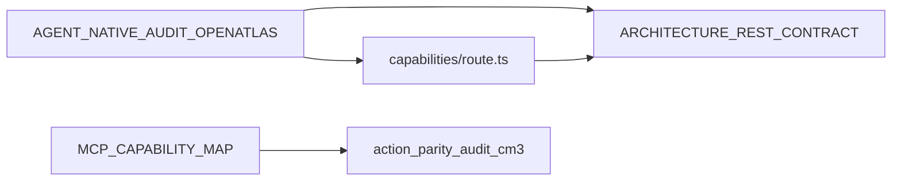

# Grep-driven file list: action parity (starter set)

## Goal

Provide a **repeatable, grep-driven inventory** for **Principle 1 (action parity)** work: surface docs and code that mention agent-native framing, parity, or capabilities; enumerate API routes that reference `/api/` or `api/capabilities`; and locate MCP/tool documentation in portfolio-harness. This complements (does not replace) the hand-maintained `[OpenAtlas/src/app/api/capabilities/route.ts](D:/portfolio-harness/OpenAtlas/src/app/api/capabilities/route.ts)` manifest (OA-REST-2).

## Commands (bash vs Windows)

Run from `**D:\portfolio-harness\OpenAtlas`** for queries 1–2, and `**D:\portfolio-harness`** for query 3.

**Bash / Git Bash**

```bash
cd OpenAtlas
rg -l "agent-native|parity|capabilities" --glob "*.md" --glob "*.{ts,tsx}"
rg -l "api/capabilities|/api/" src/app/api
cd ..
rg -l "MCP|tool" docs .cursor
```

**PowerShell** (use `;` not `&&`; `2>$null` instead of `2>nul` if redirecting stderr)

```powershell
Set-Location D:\portfolio-harness\OpenAtlas
rg -l "agent-native|parity|capabilities" --glob "*.md" --glob "*.{ts,tsx}"
rg -l "api/capabilities|/api/" src/app/api
Set-Location D:\portfolio-harness
rg -l "MCP|tool" docs .cursor
```

---

## Query 1 results: `agent-native|parity|capabilities` (`.md` + `.ts`/`.tsx`)

**Markdown (10 files)** — all under `OpenAtlas/`:


| Path                                                                                                                                                        |
| ----------------------------------------------------------------------------------------------------------------------------------------------------------- |
| `[CONTRIBUTING.md](D:/portfolio-harness/OpenAtlas/CONTRIBUTING.md)`                                                                                         |
| `[docs/AGENT_NATIVE_AUDIT_OPENATLAS.md](D:/portfolio-harness/OpenAtlas/docs/AGENT_NATIVE_AUDIT_OPENATLAS.md)`                                               |
| `[docs/ARCHITECTURE_REST_CONTRACT.md](D:/portfolio-harness/OpenAtlas/docs/ARCHITECTURE_REST_CONTRACT.md)`                                                   |
| `[docs/LOCAL_FIRST_NEWS_POINTER.md](D:/portfolio-harness/OpenAtlas/docs/LOCAL_FIRST_NEWS_POINTER.md)`                                                       |
| `[docs/OPENATLAS_SYSTEMS_INVENTORY.md](D:/portfolio-harness/OpenAtlas/docs/OPENATLAS_SYSTEMS_INVENTORY.md)`                                                 |
| `[docs/agent/INTEGRATION_PATHS.md](D:/portfolio-harness/OpenAtlas/docs/agent/INTEGRATION_PATHS.md)`                                                         |
| `[docs/plans/SCOPE_OPENATLAS_FULL_REVIEW.md](D:/portfolio-harness/OpenAtlas/docs/plans/SCOPE_OPENATLAS_FULL_REVIEW.md)`                                     |
| `[docs/plans/2026-03-19-openatlas-alignment-context-design.md](D:/portfolio-harness/OpenAtlas/docs/plans/2026-03-19-openatlas-alignment-context-design.md)` |
| `[docs/plans/2026-03-19-openatlas-agent-native-audit.md](D:/portfolio-harness/OpenAtlas/docs/plans/2026-03-19-openatlas-agent-native-audit.md)`             |
| `[e2e/maestro/README.md](D:/portfolio-harness/OpenAtlas/e2e/maestro/README.md)`                                                                             |


**TypeScript / TSX (2 files)**


| Path                                                                                                                                      | Note                                                                                                                                                              |
| ----------------------------------------------------------------------------------------------------------------------------------------- | ----------------------------------------------------------------------------------------------------------------------------------------------------------------- |
| `[src/app/api/capabilities/route.ts](D:/portfolio-harness/OpenAtlas/src/app/api/capabilities/route.ts)`                                   | Canonical **capabilities manifest** (keep in sync with API changes).                                                                                              |
| `[src/components/SurveyForm/steps/MotivationStep.tsx](D:/portfolio-harness/OpenAtlas/src/components/SurveyForm/steps/MotivationStep.tsx)` | **Weak signal:** likely matches the word “capabilities” in survey copy, not REST/MCP parity. Treat as optional for parity audits or exclude via stricter pattern. |


**Stricter TS/TSX pattern (optional):** e.g. `rg "parity|agent-native|/api/capabilities" --glob "*.{ts,tsx}"` to drop UI-only matches.

---

## Query 2 results: `api/capabilities|/api/` in `src/app/api`

**3 files** (API route layer only):

- `[src/app/api/capabilities/route.ts](D:/portfolio-harness/OpenAtlas/src/app/api/capabilities/route.ts)`
- `[src/app/api/alignment-context/route.ts](D:/portfolio-harness/OpenAtlas/src/app/api/alignment-context/route.ts)`
- `[src/app/api/alignment-context/[id]/route.ts](D:/portfolio-harness/OpenAtlas/src/app/api/alignment-context/[id]/route.ts)`

This is a **minimal** slice of the App Router tree; it does not list every `route.ts` under `api/`. For a full route inventory, prefer `**glob_file_search`** / `rg --files src/app/api` or the `**CAPABILITIES.routes`** array in the capabilities route (which documents more paths than this grep hits).

---

## Query 3 results: `MCP|tool` in `docs` + `.cursor` (portfolio-harness root)

**Finding:** This query matches **200+ files**, including large, low-signal areas:

- `.cursor/state/ai_trends/raw/`** (transcripts)
- `.cursor/temp/`**
- Ad-hoc state markdown

**Starter subset for action parity / MCP policy** (curated; all exist and are high-signal):


| File                                                                                                                                          | Role                                                                          |
| --------------------------------------------------------------------------------------------------------------------------------------------- | ----------------------------------------------------------------------------- |
| `[.cursor/docs/MCP_CAPABILITY_MAP.md](D:/portfolio-harness/.cursor/docs/MCP_CAPABILITY_MAP.md)`                                               | Authoritative tool-to-action mapping; references CM-3 audit.                  |
| `[.cursor/docs/MCP_SKILL_ROUTING.md](D:/portfolio-harness/.cursor/docs/MCP_SKILL_ROUTING.md)`                                                 | Skill ↔ MCP routing (paired with map per map header).                         |
| `[.cursor/docs/AGENT_NATIVE_CHECKLIST.md](D:/portfolio-harness/.cursor/docs/AGENT_NATIVE_CHECKLIST.md)`                                       | Cross-stack agent-native checklist.                                           |
| `[.cursor/docs/MULTI_STACK_REVIEW_TEMPLATE.md](D:/portfolio-harness/.cursor/docs/MULTI_STACK_REVIEW_TEMPLATE.md)`                             | Evidence template (points to `action_parity_audit_cm3_*.md`).                 |
| `[.cursor/docs/DAGGR_MCP.md](D:/portfolio-harness/.cursor/docs/DAGGR_MCP.md)`                                                                 | Daggr MCP usage.                                                              |
| `[.cursor/docs/TOOL_SAFEGUARDS.md](D:/portfolio-harness/.cursor/docs/TOOL_SAFEGUARDS.md)`                                                     | Tool safety / gates.                                                          |
| `[docs/cognitive-ergonomics-seed/MCP_OPERATION.md](D:/portfolio-harness/docs/cognitive-ergonomics-seed/MCP_OPERATION.md)`                     | MCP operation in cognitive-ergonomics seed.                                   |
| `[.cursor/state/adhoc/action_parity_audit_cm3_2026-03-16.md](D:/portfolio-harness/.cursor/state/adhoc/action_parity_audit_cm3_2026-03-16.md)` | Point-in-time CM-3 table; **superseded for Daggr** by MCP map per its banner. |


**Narrowing query 3 (suggested):**

```text
rg -l "MCP|tool" docs .cursor --glob '!**/.cursor/state/ai_trends/**' --glob '!**/.cursor/temp/**'
```

Or scope to `.cursor/docs` and `docs/cognitive-ergonomics-seed` only for a **minimal** parity doc set.

---

## Anchor files (already in tree)


| Anchor                                                                                                                                                          | Status                                                                 |
| --------------------------------------------------------------------------------------------------------------------------------------------------------------- | ---------------------------------------------------------------------- |
| `[OpenAtlas/docs/AGENT_NATIVE_AUDIT_OPENATLAS.md](D:/portfolio-harness/OpenAtlas/docs/AGENT_NATIVE_AUDIT_OPENATLAS.md)`                                         | Gap report; **§1 Action parity** table + score.                        |
| `[OpenAtlas/src/app/api/capabilities/route.ts](D:/portfolio-harness/OpenAtlas/src/app/api/capabilities/route.ts)`                                               | Machine-readable route manifest (update with API PRs per file header). |
| `[OpenAtlas/docs/ARCHITECTURE_REST_CONTRACT.md](D:/portfolio-harness/OpenAtlas/docs/ARCHITECTURE_REST_CONTRACT.md)`                                             | Normative REST contract (referenced by audit + CONTRIBUTING).          |
| `[portfolio-harness/.cursor/docs/MCP_CAPABILITY_MAP.md](D:/portfolio-harness/.cursor/docs/MCP_CAPABILITY_MAP.md)`                                               | Harness-wide MCP ↔ actions.                                            |
| `[portfolio-harness/.cursor/state/adhoc/action_parity_audit_cm3_2026-03-16.md](D:/portfolio-harness/.cursor/state/adhoc/action_parity_audit_cm3_2026-03-16.md)` | Historical CM-3 parity table; see supersession banner.                 |





---

## How to use this starter set

1. **OpenAtlas PRs that touch `src/app/api/`:** Update `[capabilities/route.ts](D:/portfolio-harness/OpenAtlas/src/app/api/capabilities/route.ts)` and `[ARCHITECTURE_REST_CONTRACT.md](D:/portfolio-harness/OpenAtlas/docs/ARCHITECTURE_REST_CONTRACT.md)` in the same change (per route header and CONTRIBUTING).
2. **Parity review:** Start from **§1** in the agent-native audit, then cross-check `**CAPABILITIES.routes`** vs actual `route.ts` files; use Query 1–2 to catch stale docs.
3. **Multi-stack (WatchTower / campaign_kb):** Prefer `[MCP_CAPABILITY_MAP.md](D:/portfolio-harness/.cursor/docs/MCP_CAPABILITY_MAP.md)` over stale CM-3 counts; use CM-3 for historical gap narrative only.

---

## Optional follow-ups (when you exit plan mode)

- Add a **one-page** `OpenAtlas/docs/ACTION_PARITY_FILE_INDEX.md` (or a row in an existing plan) that embeds this grep recipe + curated lists so agents do not re-run noisy Query 3 blindly.
- Add **CI or a script** that fails if `rg --files src/app/api` finds routes not listed in `CAPABILITIES` (would require agreed rules for dynamic segments).
- Tighten Query 1 TS/TSX glob to exclude `MotivationStep.tsx`-style false positives.

