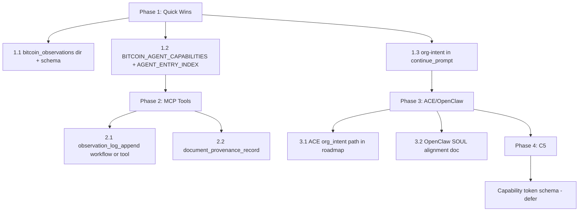

# Agent-Native Bitcoin Audit Implementation Plan

Implement the Top 10 recommendations from [AGENT_NATIVE_BITCOIN_CHAOS_AUDIT_2026-03-10.md](D:\portfolio-harness.cursor\state\adhoc\AGENT_NATIVE_BITCOIN_CHAOS_AUDIT_2026-03-10.md) to address the 21/64 agent-native score.

---

## Current State

| Principle            | Score | Gap                                                              |
| -------------------- | ----- | ---------------------------------------------------------------- |
| Tools as Primitives  | 0/8   | No MCP tools for observation logs, provenance, capability tokens |
| Capability Discovery | 1/8   | No doc listing Bitcoin agent capabilities                        |
| Context Injection    | 2/8   | org-intent not in Cursor prompt; only audit_wrapper tool gate    |
| Action Parity        | 3/8   | Agent uses file primitives; no dedicated Bitcoin tools           |

**Key files:**

- [.cursor/mcp.json](D:\portfolio-harness.cursor\mcp.json) — filesystem MCP allows `D:/portfolio-harness`, `D:/Arc_Forge`; ORG_INTENT_PATH = org-intent.example.json
- [.cursor/state/continue_prompt.txt](D:\portfolio-harness.cursor\state\continue_prompt.txt) — loads intent_surface, session_brief, handoff; no org-intent
- [.cursor/docs/AGENT_ENTRY_INDEX.md](D:\portfolio-harness.cursor\docs\AGENT_ENTRY_INDEX.md) — no Bitcoin section
- [org-intent-spec/examples/org-intent.bitcoin-inspired.json](D:\portfolio-harness\org-intent-spec\examples\org-intent.bitcoin-inspired.json) — exists with hb-1..hb-5

---

## Phase 1: Quick Wins (A1, A7, B7 — ~2 hr)

### 1.1 Create `docs/bitcoin_observations/` and extend A1 (Rec #5)

- Create `D:\portfolio-harness\docs\bitcoin_observations\` directory
- Add `.gitkeep` or `README.md` with schema: `YYYY-MM-DD_observations.md` (date, source, design_decision | failure_mode | community_norm, content)
- Add `D:/portfolio-harness/docs/bitcoin_observations` to filesystem MCP args in [.cursor/mcp.json](D:\portfolio-harness.cursor\mcp.json) if not already covered by `D:/portfolio-harness` (it is — no change needed; document in BITCOIN_OBSERVATION_TEMPLATE)
- Update [BITCOIN_OBSERVATION_TEMPLATE.md](D:\portfolio-harness\docs\BITCOIN_OBSERVATION_TEMPLATE.md) (create if missing) with schema and `bitcoin_observations/` usage

### 1.2 Create BITCOIN_AGENT_CAPABILITIES.md and add Bitcoin section to AGENT_ENTRY_INDEX (Rec #4, #8)

- Create [docs/BITCOIN_AGENT_CAPABILITIES.md](D:\portfolio-harness\docs\BITCOIN_AGENT_CAPABILITIES.md):
  - Agent can create/update: BITCOIN_OBSERVATION_TEMPLATE, CHAOS_BITCOIN_MAPPING, FEDIMINT_OBSERVATION_TEMPLATE, org-intent.bitcoin-inspired.json
  - Via: read_file, write, search_replace (file primitives)
  - Observation logs: append to `docs/bitcoin_observations/YYYY-MM-DD_observations.md`
  - Document provenance: (Phase C2) document_provenance_record MCP tool
- Add row to [AGENT_ENTRY_INDEX.md](D:\portfolio-harness.cursor\docs\AGENT_ENTRY_INDEX.md): "Bitcoin-Chaos observation, mapping, org-intent" → BITCOIN_AGENT_CAPABILITIES.md

### 1.3 Inject org-intent into Cursor context (Rec #3, #7)

- Extend [.cursor/state/continue_prompt.txt](D:\portfolio-harness.cursor\state\continue_prompt.txt): Add step (0) or (1a): "If ORG_INTENT_PATH env is set (or default `org-intent-spec/examples/org-intent.bitcoin-inspired.json` for Bitcoin work), read that file and apply hard_boundaries (hb-1..hb-5) before acting. On conflicting principles or complicity risk: output ESCALATE; do not proceed."
- Option: Add to [.cursorrules](D:\portfolio-harness.cursorrules) a short rule: "When working on Bitcoin-Chaos content, read org-intent.bitcoin-inspired.json and apply hard_boundaries."
- Document ORG_INTENT_PATH in [.cursor/state/README.md](D:\portfolio-harness.cursor\state\README.md) or [CONTEXT_ENGINEERING.md](D:\portfolio-harness.cursor\docs\CONTEXT_ENGINEERING.md)

---

## Phase 2: MCP Tools (A6, C2 — ~6–12 hr)

### 2.1 observation_log_append (Rec #1, Task A6)

**Option A — Documented workflow (low effort):**

- Document in [BITCOIN_AGENT_CAPABILITIES.md](D:\portfolio-harness\docs\BITCOIN_AGENT_CAPABILITIES.md): "To append observation: read `docs/bitcoin_observations/YYYY-MM-DD_observations.md`, append entry (timestamp, source, type, content), write back."
- Agent uses read_file + search_replace. No new MCP server.

**Option B — New MCP tool (higher effort):**

- Create `local-proto/mcp_servers/bitcoin_observation/` (or extend filesystem)
- Tool: `observation_log_append(path: str, content: str, timestamp?: str)` — appends to file; path must be under `docs/bitcoin_observations/`
- Register in [mcp_server_tiers.json](D:\portfolio-harness\local-proto\config\mcp_server_tiers.json) and [.cursor/mcp.json](D:\portfolio-harness.cursor\mcp.json)

**Recommendation:** Start with Option A; add Option B if agents frequently fail to follow the workflow.

### 2.2 document_provenance_record (Rec #2, Task C2 extended)

- Create MCP tool: `document_provenance_record(url: str, hash: str, source: str)` — writes to append-only log (e.g. `docs/provenance_log.jsonl` or SQLite)
- Schema: `{url, hash, source, timestamp}`
- Integrate with TOOL_SAFEGUARDS: before trusting URL content, agent should call this or verify hash
- Add to [local-proto/docs/TOOL_SAFEGUARDS.md](D:\local-proto\docs\TOOL_SAFEGUARDS.md): URL allowlist, blocklist for user-controlled URLs
- New MCP server or extend existing (e.g. sqlite MCP with provenance table)

---

## Phase 3: ACE and OpenClaw Alignment (B8 — ~1.5 hr)

### 3.1 ACE org_intent path (Rec #6)

- Document in [PENTAGI_FEDIMINT_ACE_ROADMAP.md](D:\portfolio-harness\docs\PENTAGI_FEDIMINT_ACE_ROADMAP.md): "For Bitcoin-Chaos flows, set ORG_INTENT_PATH to `D:\portfolio-harness\org-intent-spec\examples\org-intent.bitcoin-inspired.json`"
- ACE Stacey uses `get_org_intent_path()` from env — document in roadmap that Bitcoin runs should set this env var
- Optional: Add `org-intent.bitcoin-inspired.json` path to ACE-first config or run script if one exists

### 3.2 OpenClaw SOUL ↔ org-intent alignment (Rec #9)

- Create or update [local-proto/docs/OPENCLAW.md](D:\portfolio-harness\local-proto\docs\OPENCLAW.md) (file may not exist)
- Add section: "SOUL.md / claw.md alignment with org-intent.bitcoin-inspired.json: When running Bitcoin-Chaos agent flows, OpenClaw SOUL (or equivalent) should reference the same hard_boundaries and values. Path: `D:\portfolio-harness\org-intent-spec\examples\org-intent.bitcoin-inspired.json`."

---

## Phase 4: Capability Token Schema (C5 — 8+ hr, defer to Phase C)

- Per [FEDIMINT_AUTHMODULE_CAPABILITY_RESEARCH.md](D:\portfolio-harness\docs\FEDIMINT_AUTHMODULE_CAPABILITY_RESEARCH.md) Section 2.3
- Pydantic schema for `run_agent`, `write_repo`; enum-only scopes; no instruction payload
- Implement in Phase C after schema and observation; not part of this agent-native quick-win plan

---

## Implementation Order

| Step | Task                                                    | Est.   | Output                             |
| ---- | ------------------------------------------------------- | ------ | ---------------------------------- |
| 1    | Create docs/bitcoin_observations/, schema in template   | 30 min | Dir + BITCOIN_OBSERVATION_TEMPLATE |
| 2    | BITCOIN_AGENT_CAPABILITIES.md + AGENT_ENTRY_INDEX row   | 30 min | Capability discovery               |
| 3    | continue_prompt.txt + .cursorrules org-intent injection | 30 min | Context injection                  |
| 4    | observation_log_append: document workflow (Option A)    | 30 min | Doc in BITCOIN_AGENT_CAPABILITIES  |
| 5    | document_provenance_record MCP tool + TOOL_SAFEGUARDS   | 4–8 hr | New MCP server or sqlite extension |
| 6    | PENTAGI_FEDIMINT_ACE_ROADMAP ACE path + OpenClaw doc    | 1 hr   | B8 tasks                           |

---

## Verification

- Re-run agent-native-reviewer after Phase 1+2
- Expected score improvement: Tools as Primitives 0→2 (if Option B for A6), Capability Discovery 1→6, Context Injection 2→5
- Manual check: Agent given "append a Bitcoin observation" — can it do it via documented workflow or tool?

---

## Out of Scope (this plan)

- C5 capability token schema (Phase C of Bitcoin plan)
- Full C2 TOOL_SAFEGUARDS URL policy implementation (extend in parallel)
- OpenClaw config file changes (document only)

