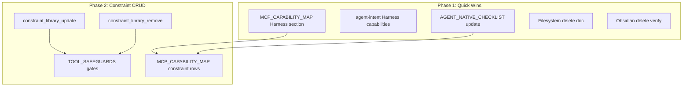

# Agent-Native Parity: Task-Decomposed Implementation Plan

## Scope

Implements solutions for priorities 1–5 (Harness workflow, Constraint-library CRUD, AGENT_NATIVE_CHECKLIST, Filesystem delete, Obsidian delete). **Observation MCP (priority 6)** is out of scope per TOOL_SAFEGUARDS (observability layer is above AI, append-only by design).

---

## Phase 1: Quick Wins (No Code)

### 1.1 Add Harness section to MCP_CAPABILITY_MAP

**File:** [.cursor/docs/MCP_CAPABILITY_MAP.md](D:\portfolio-harness.cursor\docs\MCP_CAPABILITY_MAP.md)

**Action:** Insert a new `## harness` section after `## Workspace` (before obsidian-vault). Map each user action from [COMMANDS_README.md](D:\portfolio-harness.cursor\docs\COMMANDS_README.md) to agent capability.

**Table structure:**


| User action                             | Agent capability                                                         | Status |
| --------------------------------------- | ------------------------------------------------------------------------ | ------ |
| Copy continue prompt                    | `run_terminal_cmd` → `.\.cursor\scripts\copy_continue_prompt.ps1`        | Done   |
| Copy session start prompt               | `run_terminal_cmd` → `.\.cursor\scripts\copy_session_start_prompt.ps1`   | Done   |
| Copy summarize today prompt             | `run_terminal_cmd` → `.\.cursor\scripts\copy_summarize_today_prompt.ps1` | Done   |
| Show next goals                         | `run_terminal_cmd` → `.\.cursor\scripts\show_next_goals.ps1`             | Done   |
| Run meta-review                         | `run_terminal_cmd` → `.\.cursor\scripts\run_meta_review.ps1`             | Done   |
| Run pre-commit security (handoff/state) | `run_terminal_cmd` → sanitize_input, validate_output, mask_secrets       | Done   |
| Run pre-commit security (rules/skills)  | `run_terminal_cmd` → checksum_integrity --verify --strict                | Done   |
| Run context audit                       | `run_terminal_cmd` → audit_context_engineering.ps1 -Rubric               | Done   |
| Run AI evals                            | `run_terminal_cmd` → run_ai_evals.ps1                                    | Done   |
| Run Daggr tests                         | `run_terminal_cmd` → run_daggr_tests.ps1                                 | Done   |
| Setup credentials                       | `run_terminal_cmd` → setup_env.py                                        | Done   |
| Verify PentAGI                          | `run_terminal_cmd` → verify_pentagi_protection.ps1                       | Done   |
| Log agent event                         | `run_terminal_cmd` → log_agent_event.py                                  | Done   |
| Check handoff integrity                 | `run_terminal_cmd` → check_handoff_integrity.py                          | Done   |
| Check intent checksum                   | `run_terminal_cmd` → local-proto check_intent_checksum.ps1               | Done   |


**Note:** Add line: "Agent achieves via `run_terminal_cmd` from repo root. See [COMMANDS_README.md](COMMANDS_README.md) for full command reference."

---

### 1.2 Add Harness capabilities to agent-intent.mdc

**File:** [.cursor/rules/agent-intent.mdc](D:\portfolio-harness.cursor\rules\agent-intent.mdc)

**Action:** Add a new section after "## Optional: private layer" (before end of file):

```markdown
## Harness capabilities (agent discovery)

Key scripts agents can run via `run_terminal_cmd` from repo root. Full list: [COMMANDS_README.md](../docs/COMMANDS_README.md).

| When | Script |
|------|--------|
| Handoff flow | copy_continue_prompt.ps1, copy_session_start_prompt.ps1, copy_summarize_today_prompt.ps1, show_next_goals.ps1 |
| Pre-commit (handoff/state) | sanitize_input.py, validate_output.py, mask_secrets.py |
| Pre-commit (rules/skills) | checksum_integrity.py --verify --strict |
| Meta-review | run_meta_review.ps1 |
| Audits | audit_context_engineering.ps1 -Rubric, run_ai_evals.ps1 |
| Telemetry | log_agent_event.py handoff|skill_load|critic_score |
```

---

### 1.3 Update AGENT_NATIVE_CHECKLIST

**File:** [.cursor/docs/AGENT_NATIVE_CHECKLIST.md](D:\portfolio-harness.cursor\docs\AGENT_NATIVE_CHECKLIST.md)

**Actions:**

1. Add new section: **"When adding harness scripts"**
  - Add script to MCP_CAPABILITY_MAP (Harness section)
  - Add script to COMMANDS_README.md
  - Test with natural language: "Run [script purpose]"
2. Add to **Parity test** section:
  - "Harness: Can the agent run meta-review, pre-commit checks, and handoff flow without being told the exact commands? (Check MCP_CAPABILITY_MAP Harness section.)"
3. Update **Parity workflow** in [MCP_CAPABILITY_MAP.md](D:\portfolio-harness.cursor\docs\MCP_CAPABILITY_MAP.md) to include:
  - "When adding a harness script: add to MCP_CAPABILITY_MAP (Harness section) and COMMANDS_README.md"

---

### 1.4 Filesystem delete: Document workaround

**File:** [.cursor/docs/MCP_CAPABILITY_MAP.md](D:\portfolio-harness.cursor\docs\MCP_CAPABILITY_MAP.md)

**Action:** Expand the filesystem delete note to be more actionable:

```markdown
| Delete file | `move_file` to `.trash/` or outside allowed dirs | Workaround |

**Note:** @modelcontextprotocol/server-filesystem has no `delete_file`. Workaround: `move_file(source, ".trash/filename")` or move outside allowed directories. Create `.trash/` if needed. Status: Done (workaround).
```

Change Status from "Workaround" to "Done (workaround)" for consistency.

---

### 1.5 Obsidian delete: Verify and mark Done

**Action:** Verify the workaround (filesystem `move_file` to trash path, or `apply_patch` to empty). Obsidian notes are files; moving to `.trash/` or deleting content achieves the outcome. Update MCP_CAPABILITY_MAP:

```markdown
| Delete note | filesystem `move_file` to `.trash/` or `apply_patch` (empty content) | Done |
```

Change "Check" to "Done" with workaround documented.

---

## Phase 2: Constraint-Library CRUD (Code)

### 2.1 Add constraint_library_update

**File:** [local-proto/scripts/constraint_library_mcp.py](D:\portfolio-harness\local-proto\scripts\constraint_library_mcp.py)

**Signature:**

```python
@mcp.tool()
def constraint_library_update(
    id: str,
    rejected: str | None = None,
    reason: str | None = None,
    constraint: str | None = None,
    domain: str | None = None,
    pattern: str | None = None,
) -> str:
    """Update a constraint by id (index). Only provided fields are updated. Requires APPROVAL_NEEDED per TOOL_SAFEGUARDS."""
```

**Logic:** Load log, validate id, update only non-None fields, preserve date unless explicitly changed (optional: add `date` param). Save. Return `{"ok": True, "id": id}` or error.

**Gate:** Add to TOOL_SAFEGUARDS: `constraint_library_update` requires APPROVAL_NEEDED (same as add).

---

### 2.2 Add constraint_library_remove

**File:** [local-proto/scripts/constraint_library_mcp.py](D:\portfolio-harness\local-proto\scripts\constraint_library_mcp.py)

**Signature:**

```python
@mcp.tool()
def constraint_library_remove(id: str) -> str:
    """Remove a constraint by id (index). Requires APPROVAL_NEEDED per TOOL_SAFEGUARDS."""
```

**Logic:** Load log, validate id, pop from rejections list, save. Return `{"ok": True, "id": id}` or error.

**Gate:** Add to TOOL_SAFEGUARDS: `constraint_library_remove` requires APPROVAL_NEEDED.

**Note:** After remove, indices shift. Document that list/get use current indices; id is 0-based and changes after removal.

---

### 2.3 Update MCP_CAPABILITY_MAP and TOOL_SAFEGUARDS

**Files:**

- [MCP_CAPABILITY_MAP.md](D:\portfolio-harness.cursor\docs\MCP_CAPABILITY_MAP.md): Add rows for Update constraint, Remove constraint
- [TOOL_SAFEGUARDS.md](D:\portfolio-harness\local-proto\docs\TOOL_SAFEGUARDS.md): Add constraint_library_update and constraint_library_remove to Ask-Gates table

---

## Phase 3: Optional Enhancements

### 3.1 harness_trash_file helper (optional)

**Rationale:** If agents frequently need a consistent delete pattern, a small Python script or harness MCP tool could wrap `move_file` to `.trash/`.

**Implementation options:**

- **A) Script:** `python .cursor/scripts/trash_file.py <path>` — moves to `.trash/` with timestamp
- **B) Harness MCP:** New MCP server with `harness_trash_file(path)` — calls filesystem move

**Recommendation:** Defer until Phase 1–2 are done. If agents struggle with the move_file workaround, add (A).

---

### 3.2 harness_list_scripts / harness_run_script MCP (optional)

**Rationale:** First-class discoverability; agents could call `harness_list_scripts` to see available commands without parsing docs.

**Implementation:** New MCP server (e.g. `harness_mcp.py` in local-proto) with:

- `harness_list_scripts()` → JSON of script name, purpose, command
- `harness_run_script(script_name)` → execute known script (allowlist)

**Recommendation:** Defer. Phase 1 docs + agent-intent injection provide sufficient discoverability. Add if agents still miss these capabilities.

---

## Dependency Graph




Phase 1 tasks are independent. Phase 2 depends on Phase 1 only for MCP_CAPABILITY_MAP update pattern.

---

## Verification

- **Phase 1:** Run agent-native-reviewer subagent; ask agent "Run meta-review" and "Run pre-commit checks for handoff" — verify it finds and executes correct commands.
- **Phase 2:** Test `constraint_library_update` and `constraint_library_remove` via MCP; verify rejection_log.json changes correctly; verify APPROVAL_NEEDED is enforced in TOOL_SAFEGUARDS.

---

## Files to Modify


| File                                                                                                                | Changes                                                                                                   |
| ------------------------------------------------------------------------------------------------------------------- | --------------------------------------------------------------------------------------------------------- |
| [.cursor/docs/MCP_CAPABILITY_MAP.md](D:\portfolio-harness.cursor\docs\MCP_CAPABILITY_MAP.md)                        | Harness section, filesystem delete note, Obsidian delete status, constraint-library rows, Parity workflow |
| [.cursor/rules/agent-intent.mdc](D:\portfolio-harness.cursor\rules\agent-intent.mdc)                                | Harness capabilities section                                                                              |
| [.cursor/docs/AGENT_NATIVE_CHECKLIST.md](D:\portfolio-harness.cursor\docs\AGENT_NATIVE_CHECKLIST.md)                | When adding harness scripts, Parity test                                                                  |
| [local-proto/scripts/constraint_library_mcp.py](D:\portfolio-harness\local-proto\scripts\constraint_library_mcp.py) | constraint_library_update, constraint_library_remove                                                      |
| [local-proto/docs/TOOL_SAFEGUARDS.md](D:\portfolio-harness\local-proto\docs\TOOL_SAFEGUARDS.md)                     | Ask-Gates for update/remove                                                                               |


