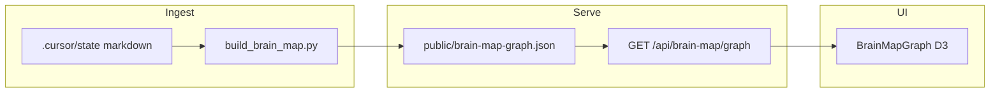

# Agent Context Atlas (Med-Vis) — plan

## 1. Product scope (what changes, what does not)

**In scope**

- User-facing and doc framing: "OpenGrimoire" (operator context + co-access graph), not event/medical surveys.
- Metadata: root layout title/description, home hero, Brain Map panel headings/tooltip copy, [README.md](D:/portfolio-harness/Med-Vis/README.md).
- **Optional** route aliases for clearer URLs while keeping old paths working (redirects or duplicate `page.tsx` that re-exports).
- Authoritative **schema documentation** for graph JSON + **optional** TypeScript interface extensions (extra fields ignored by current D3 code).
- **Runbook**: graph-only mode without Supabase; where future folder-watch / SQLite sync would attach.
- Cross-repo doc touchpoints: [openharness/docs/BRAIN_MAP_E2E.md](D:/openharness/docs/BRAIN_MAP_E2E.md), [openharness/docs/BRAIN_MAP_AUDIT.md](D:/openharness/docs/BRAIN_MAP_AUDIT.md), [.cursor/skills/brain-map-visualization/SKILL.md](D:/openharness/.cursor/skills/brain-map-visualization/SKILL.md) — replace "Med-Vis" naming where it refers to this app.

**Out of scope for this pass (unless you explicitly expand)**

- Rewriting survey **questions** or Supabase schema for submissions (still event-shaped data model).
- Fedimint protocol integration (see **Backlog** at end).
- Replacing D3 force simulation or edge physics in [BrainMapGraph.tsx](D:/portfolio-harness/Med-Vis/src/components/BrainMap/BrainMapGraph.tsx).

**Risk**

- **Low**: copy, README, schema markdown, `package.json` `name` (npm) — no auth behavior change.
- **Medium**: route moves without redirects; changing env var contracts; altering `providers` so login breaks for other features — gate with Playwright.

---

## 2. Tech-lead: where this lives vs OpenHarness


| Layer                    | Location                                                                                                        | Role                                                                                                               |
| ------------------------ | --------------------------------------------------------------------------------------------------------------- | ------------------------------------------------------------------------------------------------------------------ |
| **Viewer (Next.js)**     | [portfolio-harness/Med-Vis](D:/portfolio-harness/Med-Vis)                                                       | UI for atlas + legacy viz/survey/admin                                                                             |
| **Graph builder**        | [portfolio-harness/.cursor/scripts/build_brain_map.py](D:/portfolio-harness/.cursor/scripts/build_brain_map.py) | Writes `nodes`/`edges`/`generated`/`sessionCount` to `Med-Vis/public/brain-map-graph.json` (or `BRAIN_MAP_OUTPUT`) |
| **Public harness clone** | [openharness](D:/openharness)                                                                                   | Docs + `scripts/build_brain_map.py` + skill; references Med-Vis as consumer                                        |


**Principle:** Single JSON contract consumed by [GET /api/brain-map/graph](D:/portfolio-harness/Med-Vis/src/app/api/brain-map/graph/route.ts) and [BrainMapGraph.tsx](D:/portfolio-harness/Med-Vis/src/components/BrainMap/BrainMapGraph.tsx). OpenHarness stays doc/skill source of truth for *how to build* the file; Med-Vis remains the reference viewer inside portfolio-harness.




---

## 3. Refactor-reuse scan (duplicates)

- **Brain map pipeline**: [build_brain_map.py](D:/portfolio-harness/.cursor/scripts/build_brain_map.py) (portfolio) mirrors OpenHarness `scripts/build_brain_map.py` conceptually; keep behavior aligned when extending schema (emit new optional keys from Python in a later phase if desired).
- **Docs/skills**: OpenHarness `brain-map-visualization` + BRAIN_MAP_* docs mention Med-Vis — update names/paths after rebrand.
- **No second React graph implementation** found in OpenHarness from this scan; viewer duplication is not an immediate consolidation target.

---

## 4. Routes (App Router) — inventory

All under [Med-Vis/src/app](D:/portfolio-harness/Med-Vis/src/app):


| Path                                                               | Notes                                                                                                   |
| ------------------------------------------------------------------ | ------------------------------------------------------------------------------------------------------- |
| `/`                                                                | [page.tsx](D:/portfolio-harness/Med-Vis/src/app/page.tsx) — "Event Visualization Platform", survey card |
| `/brain-map`                                                       | [brain-map/page.tsx](D:/portfolio-harness/Med-Vis/src/app/brain-map/page.tsx)                           |
| `/survey`                                                          | [survey/page.tsx](D:/portfolio-harness/Med-Vis/src/app/survey/page.tsx)                                 |
| `/visualization`, `/visualization/alluvial`, `/visualization/dark` | D3 demos                                                                                                |
| `/constellation`                                                   | constellation view                                                                                      |
| `/login`, `/admin`, `/admin/controls`                              | Supabase-related flows                                                                                  |
| `/test`, `/test-supabase`, `/test-context`, `/test-chord`          | dev/test pages                                                                                          |


**E2E coupling:** [e2e/smoke.spec.ts](D:/portfolio-harness/Med-Vis/e2e/smoke.spec.ts), [e2e/survey.spec.ts](D:/portfolio-harness/Med-Vis/e2e/survey.spec.ts) use `/survey` and `nav-link-survey`.

---

## 5. Components / files with event / med / survey wording

**High-signal user-facing**

- [src/app/layout.tsx](D:/portfolio-harness/Med-Vis/src/app/layout.tsx) — `metadata.title` / `description` ("Event…", "event surveys").
- [src/app/page.tsx](D:/portfolio-harness/Med-Vis/src/app/page.tsx) — hero "Event Visualization Platform", "Survey Form" card.
- [src/components/SurveyForm/index.tsx](D:/portfolio-harness/Med-Vis/src/components/SurveyForm/index.tsx) — "Event Survey", community copy; `data-testid="survey-form-container"` (keep testid or update tests if renamed).
- [src/components/BrainMap/BrainMapGraph.tsx](D:/portfolio-harness/Med-Vis/src/components/BrainMap/BrainMapGraph.tsx) — loading "Loading brain map…", header "Brain Map", instruction string (cosmetic only; **no** simulation edits).

**Package / docs**

- [package.json](D:/portfolio-harness/Med-Vis/package.json) — `"name": "med-vis"` → e.g. `agent-context-atlas` (cosmetic for npm; verify no downstream CI depends on old name).
- [README.md](D:/portfolio-harness/Med-Vis/README.md) — title and feature list still "Event Visualization Platform (Med-Vis)" and survey-first narrative → rewrite to atlas-first, keep viz/survey as secondary "legacy sample" if accurate.

**Survey steps** ([SurveyForm/steps/*.tsx](D:/portfolio-harness/Med-Vis/src/components/SurveyForm/steps)): mostly generic labels; **minimal** pass = only shared header in `SurveyForm/index.tsx`. Deeper step copy = separate task.

**Ignore**: D3 callback parameters named `event` in BrainMapGraph (not domain "event").

---

## 6. Diff plan (minimal)

**Phase A — Copy + metadata (no route changes)**

1. `layout.tsx`: title/description → Agent Context Atlas; subtitle about operator context + optional viz/survey.
2. `page.tsx`: hero + cards: rename "Brain Map" card to "Context graph" (or keep path `/brain-map`); "Survey Form" → "Operator intake" or "Legacy survey sample" + description; "Visualizations" unchanged or "Context datasets (D3)".
3. `BrainMapGraph.tsx`: page title/subcopy → "Context atlas"; loading string; tooltip can append optional fields when present (later).
4. `README.md`: reframe; shorten inflated claims if any no longer true (per honest OSS).
5. `package.json` name (optional in same PR).

**Phase B — Optional route aliases (backward compatible)**

- Add `src/app/context-atlas/page.tsx` that re-exports the same dynamic import as `brain-map/page.tsx`, **or** `next.config.js` `redirects` from `/brain-map` → `/context-atlas` (prefer **additive** route + keep `/brain-map` to avoid breaking bookmarks and OpenHarness docs until updated).
- Similarly optional: `/operator-intake` duplicating `/survey` + update home `href` and e2e URLs in one go.

**Phase C — Schema documentation**

- New doc: e.g. [Med-Vis/docs/BRAIN_MAP_SCHEMA.md](D:/portfolio-harness/Med-Vis/docs/BRAIN_MAP_SCHEMA.md) (or under `portfolio-harness/docs/`) with sections below.

**Phase D — Cross-repo doc renames**

- OpenHarness BRAIN_MAP_* + skill: "Med-Vis" → "Agent Context Atlas (Med-Vis folder)" or similar + link to schema doc.

**Phase E — Verification**

- `npm run lint` / `type-check` in Med-Vis; `playwright test` for smoke + survey if routes/testids changed.
- Critic JSON pass per workspace rule after multi-file doc+code touch.

---

## 7. JSON schema (current + backward-compatible extensions)

**Current contract** (from [BrainMapGraph.tsx](D:/portfolio-harness/Med-Vis/src/components/BrainMap/BrainMapGraph.tsx) + [build_brain_map.py](D:/portfolio-harness/.cursor/scripts/build_brain_map.py)):

```json
{
  "nodes": [
    {
      "id": "string",
      "group": "core|memory|publishing|tools|skills|general",
      "accessCount": 0,
      "path": "string"
    }
  ],
  "edges": [
    {
      "source": "nodeId",
      "target": "nodeId",
      "weight": 0,
      "sessionType": "strategy|memory|publishing|infrastructure|research|general",
      "sessions": ["string"]
    }
  ],
  "generated": "ISO8601 UTC string",
  "sessionCount": 0
}
```

**Proposed optional fields (ignored by current renderer if absent)**

- **On nodes**
  - `constraint?: string` — short human-readable rule/decision bound to this artifact.
  - `source?: "handoff" | "vault" | "git"` — provenance category (handoff/daily/decision-log could map to `handoff`; future vault export → `vault`; git-derived → `git`).
  - `risk_tier?: "low" | "medium" | "high" | "critical"` — align with harness risk tiers.
  - `review_status?: "draft" | "reviewed" | "stale"` — operator workflow.
- **On edges** (optional)
  - Same four fields if co-access should inherit provenance; or omit and inherit from endpoints in UI later.

**Backward compatibility**

- TypeScript: extend `BrainMapNode` / `BrainMapEdge` with optional props; do not require them in `fetch` handler.
- Python: when you extend the builder, use `.setdefault` / only add keys when known; old JSON without keys must still load.
- UI: optional later pass — tooltip/filter chips using new fields; **not required** for Phase A.

**API** ([route.ts](D:/portfolio-harness/Med-Vis/src/app/api/brain-map/graph/route.ts)): unchanged behavior — continues to return parsed JSON; optional `BRAIN_MAP_SECRET` / `x-brain-map-key` unchanged.

---

## 8. Running without Supabase for the graph path

**Already true:** The graph is **static file** `public/brain-map-graph.json` served by the API route; **no Supabase call** in [BrainMapGraph.tsx](D:/portfolio-harness/Med-Vis/src/components/BrainMap/BrainMapGraph.tsx) or [route.ts](D:/portfolio-harness/Med-Vis/src/app/api/brain-map/graph/route.ts).

**Document in README / schema doc**

1. **Offline / local:** `next dev` or static export (if you adopt export for atlas-only) with env **without** Supabase keys — graph page works if JSON exists.
2. **Optional secret:** `BRAIN_MAP_SECRET` on server + `NEXT_PUBLIC_BRAIN_MAP_SECRET` for client header (already wired).
3. **Ingest:** Run `python .cursor/scripts/build_brain_map.py` with `CURSOR_STATE_DIR` / `BRAIN_MAP_OUTPUT` as today.

**Where sync would plug in (future, not this PR)**

- **Folder watch:** small Node or Python watcher on `.cursor/state/**/*.md` → debounce → rerun `build_brain_map.py` → write JSON; Med-Vis hot-reloads via refetch (already `Cache-Control: no-store`).
- **SQLite:** optional local store for "last seen hashes" or multi-workspace graph merge; writer still outputs same JSON file for the viewer. Aligns with [D:/local-first/README.md](D:/local-first/README.md) themes: *data ownership*, optional sync engines ([RESOURCES.md](D:/local-first/RESOURCES.md)), and [AI_SECURITY.md](D:/local-first/AI_SECURITY.md) (traceability, HITL) for anything that aggregates operator context.

---

## 9. Workflow order you requested

1. **Product-scope** — this section + your approval on optional route aliases.
2. **Tech-lead** — section 2.
3. **Refactor-reuse** — section 3; before coding, quick grep BrainMap / `build_brain_map` in both repos.
4. **Implementation** — phases A→E.
5. **Critic pass** — JSON gate after multi-file change.

---

## 10. Backlog (do not implement now; do not surface as Cursor todo list)

**Bitcoin / Fedimint (honest scope):** Map Fedimint ecosystem concepts (guardians, modules, ecash) to **optional graph node types and documentation links only** — no protocol integration claims until specified. If any ingest pulls chain or inscription text, apply **SCP / provenance** per harness rules ([local-proto/docs/TOOL_SAFEGUARDS](D:/local-proto/docs/TOOL_SAFEGUARDS.md) / BITCOIN_AGENT_CAPABILITIES as referenced in harness).

---

## 11. Suggested tools/skills when executing

- **refactor-reuse** + grep: confirm no duplicate graph viewer.
- **local-first** + [D:/local-first](D:/local-first): wording for README sync section.
- **docs** skill: README + schema file structure.
- **secure-contain-protect**: if future ingest includes untrusted text for nodes.

