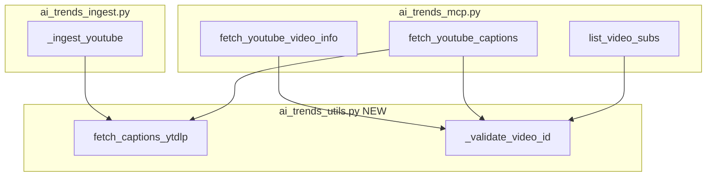

# AI Trends Critic Fixes Plan

## Summary

Implement the six fixes from the critic report to raise the score above threshold and pass the critic-loop-gate.

## Architecture

## Changes

### 1. Create shared utils module

**New file:** [local-proto/scripts/ai_trends_utils.py](D:\portfolio-harness\local-proto\scripts\ai_trends_utils.py)

- `_validate_video_id(video_id: str) -> bool` — validate with `re.match(r'^[a-zA-Z0-9_-]{11}$', video_id)`
- `fetch_captions_ytdlp(video_id: str, log: logging.Logger | None = None) -> str | None` — single implementation with:
  - Improved VTT parsing: extend skip regex to `r'^(\d+:\d+)?\.?\d+$'` for timestamp-only lines (e.g. `00:01`, `0.5`)
  - Log exceptions when `log` is provided (ingest passes logger; MCP passes None and uses `_err` at tool level)
  - No URL allowlist (caller responsibility)

### 2. Security: Add allowlist check in fetch_youtube_captions

**File:** [ai_trends_mcp.py](D:\portfolio-harness\local-proto\scripts\ai_trends_mcp.py)

- At start of `fetch_youtube_captions`: validate `video_id`; if invalid, return error JSON
- Before calling `_fetch_captions_ytdlp` fallback: construct URL, call `_url_allowed(url)`; if not allowed, return error JSON (do not bypass allowlist on fallback path)

### 3. Extract shared helper and remove duplication

- **ai_trends_mcp.py:** Remove `_fetch_captions_ytdlp`, import `fetch_captions_ytdlp` and `validate_video_id` from `ai_trends_utils`
- **ai_trends_ingest.py:** Remove `_fetch_captions_ytdlp`, import `fetch_captions_ytdlp` from `ai_trends_utils`; pass `log` for error logging

### 4. Guard against None in list_video_subs and fetch_youtube_video_info

**File:** [ai_trends_mcp.py](D:\portfolio-harness\local-proto\scripts\ai_trends_mcp.py)

- After `ydl.extract_info(...)`: add `if not info: return json.dumps({"error": "Could not extract video info", "video_id": video_id})`
- Apply in both `list_video_subs` and `fetch_youtube_video_info`

### 5. Improve VTT parsing (in shared utils)

- Skip lines matching timestamp patterns: `re.match(r'^(\d+:\d+)?\.?\d+$', s)` (covers `00:01`, `0.5`, `1`)
- Keep existing skips: empty, `WEBVTT`, `Kind:`, `Language:`, `-->`

### 6. Improve error handling

- **ai_trends_utils.fetch_captions_ytdlp:** Replace `except Exception: pass` with `except Exception as e: log.warning(...) if log else None; pass` (log when logger provided)
- **ai_trends_mcp.fetch_youtube_captions:** Keep `except Exception: pass` for youtube-transcript-api (intentional fallback); no logging needed at MCP level since we fall through to yt-dlp

### 7. Validate video_id in all YouTube tools

- Add `_validate_video_id` (or inline check) at entry of: `list_video_subs`, `fetch_youtube_captions`, `fetch_youtube_video_info`
- Return `{"error": "Invalid video_id format", "video_id": video_id}` when invalid
- Ingest: video IDs come from yt-dlp channel fetch (trusted); optional validation for defense-in-depth

## File Edit Summary

| File                                      | Action                                                                                    |
| ----------------------------------------- | ----------------------------------------------------------------------------------------- |
| `local-proto/scripts/ai_trends_utils.py`  | Create (validate, fetch_captions_ytdlp)                                                   |
| `local-proto/scripts/ai_trends_mcp.py`    | Add allowlist + validation; import utils; None guards; remove local _fetch_captions_ytdlp |
| `local-proto/scripts/ai_trends_ingest.py` | Import fetch_captions_ytdlp from utils; remove local copy; pass log                       |

## Verification

- Run `list_video_subs`, `fetch_youtube_captions`, `fetch_youtube_video_info` with valid/invalid IDs
- Run ingest: `python ai_trends_ingest.py --sources youtube`
- Re-run critic; expect pass and score >= 0.85

