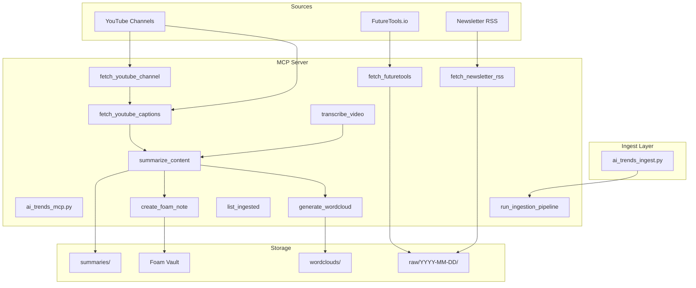

# AI Trends MCP Server Implementation Plan

## Architecture




## File Layout


| File                                                                                                        | Purpose                          |
| ----------------------------------------------------------------------------------------------------------- | -------------------------------- |
| [local-proto/scripts/ai_trends_mcp.py](D:\portfolio-harness\local-proto\scripts\ai_trends_mcp.py)           | MCP server with 10 tools         |
| [local-proto/scripts/ai_trends_ingest.py](D:\portfolio-harness\local-proto\scripts\ai_trends_ingest.py)     | Cron entrypoint; calls pipeline  |
| [local-proto/scripts/ai_trends_config.json](D:\portfolio-harness\local-proto\scripts\ai_trends_config.json) | Channels, RSS URLs, output paths |
| [local-proto/docs/AI_TRENDS_MCP.md](D:\portfolio-harness\local-proto\docs\AI_TRENDS_MCP.md)                 | Usage, cron setup, security      |


## Implementation Phases

### Phase 1: Core MCP Server (MVP)

**1.1 Create `ai_trends_config.json`**

- `youtube_channels`: List of `{name, channel_id_or_url}` for David Shapiro, IDBL Technology, Confluent Developer, AI News & Strategy Daily, Nate B Jones (resolve channel IDs via web search or manual lookup)
- `newsletter_rss`: URLs for Last Week in AI, There's An AI For That, TechCrunch AI, The Signal
- `output_paths`: `raw`, `summaries`, `wordclouds`, `foam_vault_path` (default: `D:/portfolio-harness/.cursor/state/ai_trends/` or `AI_TRENDS_DATA` env)
- `url_allowlist`: `youtube.com`, `youtu.be`, `futuretools.io`, `www.futuretools.io`, RSS domains

**1.2 Create `ai_trends_mcp.py`**

- Use FastMCP pattern from [daggr_mcp.py](D:\portfolio-harness\local-proto\scripts\daggr_mcp.py) and [unhuman_deals_mcp.py](D:\portfolio-harness\local-proto\scripts\unhuman_deals_mcp.py)
- **URL allowlist**: Validate all fetch URLs against config allowlist before network calls
- **Tools**:
  1. `fetch_youtube_channel(channel_id_or_url)` — yt-dlp or youtube-transcript-api to list videos; return `{video_id, title, caption_available}`
  2. `fetch_youtube_captions(video_id)` — youtube-transcript-api; return transcript text
  3. `transcribe_video(video_url)` — **Phase 2**; stub returning `{"error": "WhisperX not configured; install and set WHISPERX_PATH"}` for now
  4. `fetch_futuretools(category)` — urllib + BeautifulSoup for static content; or document Firecrawl/Playwright for JS-heavy pages
  5. `fetch_newsletter_rss(rss_url)` — feedparser; return parsed entries
  6. `summarize_content(content_path, max_tokens)` — Run [sanitize_input.py](D:\portfolio-harness.cursor\scripts\sanitize_input.py) via subprocess first; then call Ollama (or `OLLAMA_BASE_URL` from env) for summary
  7. `create_foam_note(title, content, tags, vault_path)` — Write markdown to vault with wikilinks `[[...]]` and `#tag`
  8. `generate_wordcloud(corpus_path_or_texts, output_path)` — Use `wordcloud` library; return path to PNG
  9. `list_ingested(date)` — List files in `raw/YYYY-MM-DD/` or latest
  10. `run_ingestion_pipeline(sources)` — Invoke ai_trends_ingest logic; sources: `youtube,futuretools,newsletters`

**1.3 Sanitization**

- Reuse [.cursor/scripts/sanitize_input.py](D:\portfolio-harness.cursor\scripts\sanitize_input.py) before summarization: `subprocess.run(["python", "sanitize_input.py", "--check", content])` or read file and pass to `--check`
- If findings, return error instead of summarizing (conservative to prompt injection)

**1.4 Dependencies**

Add to [local-proto/requirements.txt](D:\portfolio-harness\local-proto\requirements.txt):

```
yt-dlp>=2024.1.0
youtube-transcript-api>=0.6.0
feedparser>=6.0.0
wordcloud>=1.9.0
```

### Phase 2: Ingest Script and Cron

**2.1 Create `ai_trends_ingest.py`**

- CLI: `--sources youtube,futuretools,newsletters` (comma-separated), `--date YYYY-MM-DD` (default: today)
- For each source: fetch, save to `raw/YYYY-MM-DD/source_type_id.txt`, optionally run summarize + foam_note + wordcloud
- Log to `ai_trends_ingest.log` in output dir
- Idempotent: skip if file already exists (optional `--force`)

**2.2 Cron / Task Scheduler**

- Document in AI_TRENDS_MCP.md:
  - Windows: `schtasks /create /tn "AI-Trends-Ingest" /tr "python D:\portfolio-harness\local-proto\scripts\ai_trends_ingest.py --sources youtube,futuretools,newsletters" /sc daily /st 08:00`
  - Linux/macOS: `0 8 * * * cd /path/to/portfolio-harness && python local-proto/scripts/ai_trends_ingest.py --sources youtube,futuretools,newsletters`

### Phase 3: MCP Registration and To-Do

**3.1 Add to mcp.json**

Add `ai-trends` server entry (after `daggr`):

```json
"ai-trends": {
  "command": "python",
  "args": [
    "D:/portfolio-harness/local-proto/scripts/audit_wrapper.py",
    "--",
    "python",
    "D:/portfolio-harness/local-proto/scripts/ai_trends_mcp.py"
  ],
  "env": {
    "ORG_INTENT_PATH": "D:/portfolio-harness/org-intent-spec/examples/org-intent.example.json",
    "ORG_INTENT_ENFORCE": "1",
    "MCP_RISK_TIER": "low",
    "AI_TRENDS_CONFIG": "D:/portfolio-harness/local-proto/scripts/ai_trends_config.json"
  },
  "cwd": "D:/portfolio-harness/local-proto"
}
```

**3.2 Add to pending_tasks.md**

Add row to `PENDING_OTHER` (or new section `PENDING_AI_TRENDS`):


| ID  | Status  | Task                                                                                        | Spec / Link                                                 |
| --- | ------- | ------------------------------------------------------------------------------------------- | ----------------------------------------------------------- |
| AT1 | pending | AI Trends MCP: Implement WhisperX fallback for videos without captions                      | [AI_TRENDS_MCP.md](../../local-proto/docs/AI_TRENDS_MCP.md) |
| AT2 | pending | AI Trends MCP: Add Firecrawl/Playwright for FutureTools JS-heavy pages if scrape incomplete | [AI_TRENDS_MCP.md](../../local-proto/docs/AI_TRENDS_MCP.md) |


And mark the implementation task itself as a new entry (e.g. AT0) that will be "done" after this plan is executed.

### Phase 4: WhisperX (Optional / Deferred)

- Document in AI_TRENDS_MCP.md: WhisperX requires GPU/CUDA; alternative: whisper.cpp for CPU
- `transcribe_video` tool: Phase 1 returns stub; Phase 4 implements subprocess call to WhisperX or whisper.cpp

## Security Checklist

- URL allowlist enforced in all fetch tools
- `sanitize_input.py` run before summarization
- No execution of instructions from ingested content
- audit_wrapper.py used; MCP_RISK_TIER=low
- Path validation: output paths under config; no traversal

## YouTube Channel IDs (to resolve)


| Name                     | Channel ID / URL (to lookup)  |
| ------------------------ | ----------------------------- |
| David Shapiro            | @DavidShapiroAI or channel ID |
| IDBL Technology          | @IDBLTechnology               |
| Confluent Developer      | @ConfluentDeveloper           |
| AI News & Strategy Daily | @AINewsStrategyDaily          |
| Nate B Jones             | @NateBJones                   |


Use `@handle` or `https://www.youtube.com/@handle` — yt-dlp can resolve to channel ID.

## Key Code References

- [unhuman_deals_mcp.py](D:\portfolio-harness\local-proto\scripts\unhuman_deals_mcp.py): Simple HTTP fetch, JSON return, error handling
- [daggr_mcp.py](D:\portfolio-harness\local-proto\scripts\daggr_mcp.py): Path resolution, subprocess, FastMCP tools
- [sanitize_input.py](D:\portfolio-harness.cursor\scripts\sanitize_input.py): `scan_override_phrases`, `scan_hidden_unicode`; use `--check` for inline text
- [mcp.json](D:\portfolio-harness.cursor\mcp.json): Server registration pattern with audit_wrapper

## Verification

1. `python local-proto/scripts/ai_trends_mcp.py` — stdio MCP runs without import errors
2. `uvx mcp inspect python local-proto/scripts/ai_trends_mcp.py` (or manual tool list) — all 10 tools listed
3. `fetch_youtube_captions` with known video ID — returns transcript
4. `summarize_content` with test file — runs sanitize first, then Ollama
5. `create_foam_note` — writes to configured vault path
6. `run_ingestion_pipeline` — creates raw files in output dir

