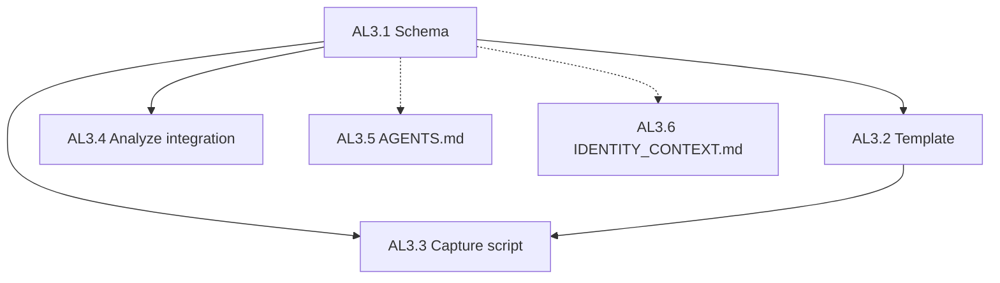

# AL3 Identity Context: Task Decomposition

Decompose AL3 into actionable subtasks. Existing: [templates/identity_context.example.json](D:\alignment-seed\templates\identity_context.example.json). Missing: formal schema, capture script, analyze integration, docs.

---

## Current State

| Artifact                                  | Status                            |
| ----------------------------------------- | --------------------------------- |
| `templates/identity_context.example.json` | Exists; minimal structure         |
| `schema/identity_context.v1.json`         | Missing                           |
| `data/identity_context.json`              | Gitignored via `data/*`           |
| `scripts/capture_identity_context.ps1`    | Missing                           |
| `analyze_alignment.ps1`                   | Does not include identity_context |
| `docs/AGENTS.md`                          | Does not mention identity_context |
| `docs/IDENTITY_CONTEXT.md`                | Missing                           |

---

## Subtask Decomposition

### AL3.1 — Create JSON Schema

**Output:** [schema/identity_context.v1.json](D:\alignment-seed\schema\identity_context.v1.json)

**Schema fields (from plan Section 8 and existing template):**

- `version` (required, "1.0")
- `updated` (date-time)
- `communities` (array of { name, region, values[], context })
- `values` (array of strings)
- `philosophical_stance` (object: ai_as, alignment_scope, notes)
- `evolving_notes` (string)

**Reference:** [community.v1.json](D:\alignment-seed\schema\community.v1.json) for structure; [identity.v1.json](D:\alignment-seed\schema\identity.v1.json) for patterns.

---

### AL3.2 — Align Template with Schema

**Output:** Update [templates/identity_context.example.json](D:\alignment-seed\templates\identity_context.example.json)

**Actions:**

- Remove `description` (or move to schema doc)
- Ensure all schema fields present
- Add example values for communities (placeholder only; no real PII)

---

### AL3.3 — Capture Script (Optional)

**Output:** [scripts/capture_identity_context.ps1](D:\alignment-seed\scripts\capture_identity_context.ps1)

**Behavior:** Interactive prompts for communities, values, philosophical_stance. Writes to `data/identity_context.json`. Same pattern as [capture_identity.ps1](D:\alignment-seed\scripts\capture_identity.ps1). No network.

**Defer:** Can be skipped if user prefers manual edits; template + schema suffice.

---

### AL3.4 — Analyze Integration

**Output:** Update [scripts/analyze_alignment.ps1](D:\alignment-seed\scripts\analyze_alignment.ps1)

**Behavior:** If `data/identity_context.json` exists, report "Identity context: configured" and "  - Communities: N". No PII. Same pattern as community block.

---

### AL3.5 — AGENTS.md Update

**Output:** Update [docs/AGENTS.md](D:\alignment-seed\docs\AGENTS.md)

**Change:** Add identity_context to Data Boundaries: "Do not read data/identity_context.json; use templates/identity_context.example.json for structure."

---

### AL3.6 — Documentation

**Output:** [docs/IDENTITY_CONTEXT.md](D:\alignment-seed\docs\IDENTITY_CONTEXT.md)

**Contents:**

- Purpose (multi-community, evolving self; private)
- Schema reference
- Usage (copy template to data/, fill manually or via capture script)
- Privacy (gitignored; no sync)

---

## Implementation Order

| Step | Task                 | Dependency   |
| ---- | -------------------- | ------------ |
| 1    | AL3.1 Schema         | None         |
| 2    | AL3.2 Template       | AL3.1        |
| 3    | AL3.6 Docs           | AL3.1        |
| 4    | AL3.4 Analyze        | AL3.1        |
| 5    | AL3.5 AGENTS.md      | None         |
| 6    | AL3.3 Capture script | AL3.1, AL3.2 |

---

## Out of Scope

- Schema validation at runtime (e.g. jsonschema in PowerShell)
- Sync or integration with portfolio-harness (alignment-seed stays local-only)

