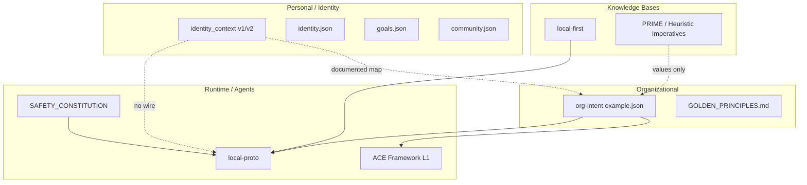
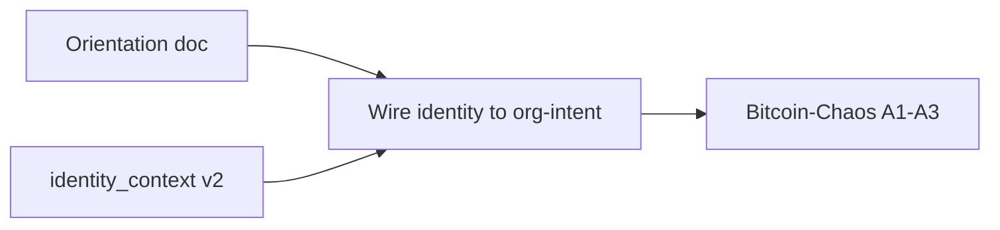

# Alignment Stack Orientation: Brainstorm, Critique, and Next Steps

## 1. Current Landscape

**Reality check:** identity_context is documented to "map to" org-intent, but there is **no implementation**. alignment-seed and local-proto are **not wired**. org-intent is loaded by ACE and referenced by local-proto observability; alignment-seed data is never read by either.

---

## 2. Criticisms

| Criticism                           | Detail                                                                                                                                                                                                                                    |
| ----------------------------------- | ----------------------------------------------------------------------------------------------------------------------------------------------------------------------------------------------------------------------------------------- |
| **Documentation vs implementation** | IDENTITY_CONTEXT.md says "Map identity_context.values to org-intent values" but no script, no MCP, no merge path exists.                                                                                                                  |
| **Scatter**                         | alignment-seed (D:, local-proto (portfolio-harness), org-intent-spec (portfolio-harness), ACE-first (D:, local-first (D: — five locations. No single "alignment stack" doc.                                                               |
| **PRIME underused**                 | PRIME.md explicates five dimensions (deontology, teleology, operational, alignment, coordination). org-intent has the three imperatives. identity_context.philosophical_stance is shallow. PRIME could enrich both.                       |
| **local-first gap**                 | local-first AI_SECURITY: encryption at rest, traceability, HITL. alignment-seed: data/ is gitignored but not encrypted. "Later phase" per plan.                                                                                           |
| **Plan proliferation**              | 29+ plans in .cursor/plans. identity_context v2, al3, bitcoin_chaos, alignment_analysis_seed, nim_*, docker, etc. No north star or priority order.                                                                                        |
| **GATO/MISSION scale mismatch**     | MISSION.md targets Moltbook swarm (150k agents). alignment-seed is personal. Connection: personal identity → community values → ecosystem alignment. identity_context.communities could explicitly link to "what ecosystem am I part of?" |

---

## 3. How Each System Should Follow the Others

### alignment-seed → local-first

| local-first requirement | alignment-seed status                      | Action                                 |
| ----------------------- | ------------------------------------------ | -------------------------------------- |
| Encryption at rest      | Not implemented                            | Document in PRIVACY.md; add to backlog |
| No cloud / no sync      | Yes (local-only)                           | Compliant                              |
| Traceability            | analyze_alignment.ps1 outputs summary only | Compliant for "no PII in output"       |
| HITL                    | N/A (capture scripts are human-run)        | Compliant                              |

**Recommendation:** Add [local-first AI_SECURITY](D:\local-first\AI_SECURITY.md) cross-ref to alignment-seed README/PRIVACY. Log alignment-seed creation to portfolio-harness decision-log per local-first AGENTS.md.

### alignment-seed → ACE-first

| ACE-first pattern | alignment-seed status                                       | Action                                                                           |
| ----------------- | ----------------------------------------------------------- | -------------------------------------------------------------------------------- |
| org-intent values | identity_context.values, community.values                   | **Wire:** merge script or env that points ACE ORG_INTENT_PATH to a resolved file |
| hard_boundaries   | identity_context.value_hierarchy, community.hard_boundaries | **Wire:** merge identity + community → org-intent variant                        |
| Escalation        | org-intent hard_boundaries                                  | identity_context.stakeholders as "who to protect" — not yet in org-intent        |

**Recommendation:** Create `scripts/merge_identity_to_org_intent.ps1` (or similar) that reads identity_context + community, produces org-intent variant. ACE/local-proto can point ORG_INTENT_PATH at output. Optional: add `stakeholder_protection` to org-intent schema.

### alignment-seed / local-proto → GATO/PRIME

| PRIME dimension | Current location                          | Gap                                                      |
| --------------- | ----------------------------------------- | -------------------------------------------------------- |
| Deontology      | SAFETY_CONSTITUTION, org-intent values    | No explicit "immediate duty" framing in identity_context |
| Teleology       | —                                         | Not modeled                                              |
| Operational     | org-intent pro_social, delegation_rules   | Adequate                                                 |
| Alignment       | identity_context.evolving_notes, temporal | Partial                                                  |
| Coordination    | org-intent pro_social                     | Adequate                                                 |

**Recommendation:** Add optional `philosophical_stance.prime_dimensions` to identity_context v2: `{ deontological_notes, teleological_notes }` or reference PRIME.md path. Low priority; PRIME is reference material. SAFETY_CONSTITUTION already cites Heuristic Imperatives.

---

## 4. Highest-Leverage Next Steps

| Priority | Task                           | Output                                                                                                         | Rationale                                                                                                                  |
| -------- | ------------------------------ | -------------------------------------------------------------------------------------------------------------- | -------------------------------------------------------------------------------------------------------------------------- |
| 1        | **Orientation doc**            | `D:\alignment-seed\docs\ALIGNMENT_STACK_ORIENTATION.md` or `portfolio-harness\.cursor\docs\ALIGNMENT_STACK.md` | Single map: alignment-seed, local-proto, org-intent, ACE, local-first, PRIME. What flows where. Implemented vs documented. |
| 2        | **Wire identity → org-intent** | `scripts/merge_identity_to_org_intent.ps1` or `resolve_org_intent.ps1`                                         | Reads identity_context + community; produces org-intent JSON. Enables ACE/local-proto to use personal alignment.           |
| 3        | **Update local-proto TODO**    | Mark 18, 20 done; add "Wire alignment-seed to org-intent"                                                      | Reflects current state; surfaces next integration task.                                                                    |
| 4        | **Plan consolidation**         | `ALIGNMENT_PRIORITY.md` or section in handoff                                                                  | North star: "We are building X. Priority: orientation → wire → bitcoin_chaos A1–A3 → ..."                                  |
| 5        | **PRIME reference**            | Add `philosophical_stance.prime_ref` or doc link                                                               | Optional. Links identity to PRIME's five dimensions for agents that load it.                                               |

---

## 5. Plan Consolidation: Suggested Order

| Phase      | Plans / Tasks                                                                 | Outcome                                                   |
| ---------- | ----------------------------------------------------------------------------- | --------------------------------------------------------- |
| **Orient** | Create ALIGNMENT_STACK doc; update local-proto TODO                           | Single map; clear next steps                              |
| **Wire**   | merge_identity_to_org_intent.ps1; ORG_INTENT_PATH config                      | alignment-seed feeds ACE/local-proto                      |
| **Extend** | Bitcoin-Chaos A1 (observation template), A2 (mapping), A3 (Bitcoin community) | Structured observation; Bitcoin culture in alignment-seed |
| **Later**  | Encryption at rest; PRIME dimensions; bitcoin_chaos B/C                       | When wire is proven                                       |

---

## 6. Concrete Artifacts to Create

1. **ALIGNMENT_STACK.md** — One doc in portfolio-harness or alignment-seed. Diagram + table: alignment-seed, local-proto, org-intent, ACE, local-first, PRIME. Implemented vs documented. Cross-refs.
2. **merge_identity_to_org_intent.ps1** — Script in alignment-seed/scripts. Input: data/identity_context.json, data/community.json. Output: data/org_intent_resolved.json (or configurable path). Merges values, hard_boundaries, optional stakeholder_protection. No PII in output; values only.
3. **local-proto TODO update** — 18, 20 done. Add: "Wire alignment-seed to org-intent: merge script; ORG_INTENT_PATH to resolved file."
4. **alignment-seed README** — Add "Follows: local-first (AI_SECURITY), ACE-first (org-intent), GATO/PRIME (Heuristic Imperatives)."

---

## 7. Out of Scope (This Orientation)

- Implementing encryption at rest
- Full PRIME five-dimension schema
- Bitcoin-Chaos phases B/C
- Nim, Docker, or other unrelated plans

---

## 8. Summary

**Brainstorm:** The alignment stack is documented but not wired. identity_context and org-intent are parallel; the "map" is aspirational. local-first and ACE-first provide patterns; alignment-seed and local-proto do not yet implement the integration.

**Critique:** Scatter, documentation drift, plan proliferation. PRIME is underused. local-first encryption is deferred.

**Best utilization of next steps:** (1) Create orientation doc. (2) Implement the wire (merge script). (3) Consolidate plan priority. (4) Proceed with Bitcoin-Chaos A1–A3 once orientation and wire exist.