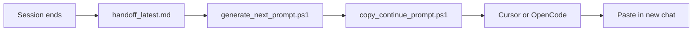
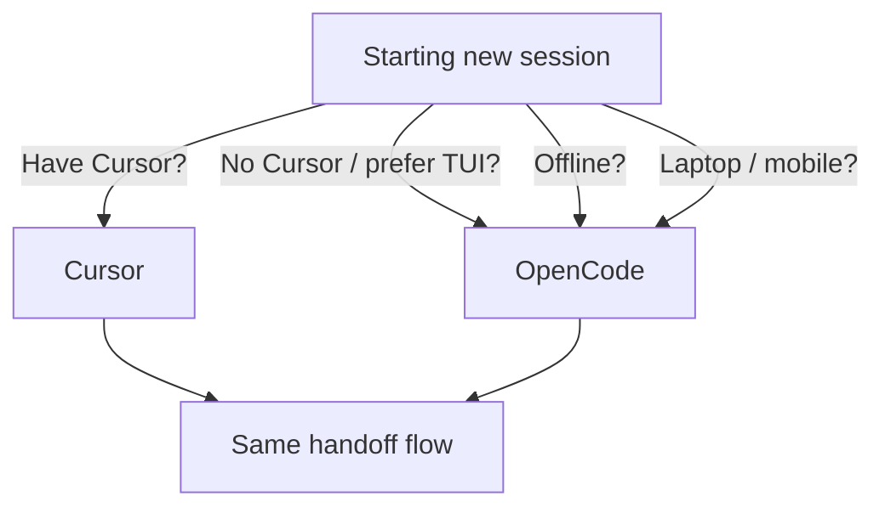

# Async Development Runbook Documentation

## Goal

Document the six async development workflows (split sessions, device mobility, offline, plan vs build, async HITL, multi-host) in a dedicated runbook with mermaid diagrams and step-by-step flows. Cross-link from existing docs so agents and humans can find it.

---

## 1. Create new runbook

**File:** [local-proto/docs/ASYNC_DEVELOPMENT_RUNBOOK.md](D:/portfolio-harness/local-proto/docs/ASYNC_DEVELOPMENT_RUNBOOK.md)

**Structure:**

### 1.1 Overview

- Brief intro: async dev = handoff flows across clients (Cursor, OpenCode) and devices
- Core invariant: same `.cursor/state/handoff_latest.md`, same Ollama, different UIs

### 1.2 Core flow diagram

### 1.3 Per-scenario sections

Each scenario gets:

- **Mermaid flowchart** (client/device/time)
- **Step-by-step runbook** (numbered, copy-pasteable)
- **Prerequisites** (Ollama, config, scripts)
- **Verification** (checklist)

| Scenario            | Diagram focus                           | Key steps                                                          |
| ------------------- | --------------------------------------- | ------------------------------------------------------------------ |
| **Split sessions**  | Cursor ↔ OpenCode, same machine         | Morning Cursor → handoff → evening OpenCode (or reverse)           |
| **Device mobility** | Desktop vs laptop, shared state         | Handoff on desktop; copy; paste on laptop OpenCode                 |
| **Offline**         | Online → offline                        | Generate handoff when online; paste into OpenCode later (no cloud) |
| **Plan vs build**   | OpenCode plan mode → Cursor build       | OpenCode explores; handoff carries plan; Cursor implements         |
| **Async HITL**      | Agent → handoff → human approve → paste | Next: "Awaiting approval"; approve via Signal; paste when ready    |
| **Multi-host**      | 1060 + Jetson                           | Cursor/OpenCode on 1060; Ollama on Jetson; baseURL in config       |

### 1.4 Decision tree

"When to use which client" flowchart:

### 1.5 Prerequisites summary

- Ollama running; model pulled
- generate_next_prompt.ps1, copy_continue_prompt.ps1
- opencode.json (for OpenCode); mcp.json (for Cursor)
- Repo at D:/portfolio-harness (or adjust paths)

### 1.6 Troubleshooting

- Reuse table from [HANDOFF_E2E_RUNBOOK.md](D:/portfolio-harness/local-proto/docs/HANDOFF_E2E_RUNBOOK.md#troubleshooting)
- Add: "OpenCode not starting" → check npm/scoop/choco install; opencode.json paths

---

## 2. Cross-link from existing docs

### 2.1 [OPENCODE.md](D:/portfolio-harness/local-proto/docs/OPENCODE.md)

- In "Async development" section: add link to full runbook
- Replace table with: "See [ASYNC_DEVELOPMENT_RUNBOOK.md](ASYNC_DEVELOPMENT_RUNBOOK.md) for diagrams and step-by-step flows per scenario."

### 2.2 [HANDOFF_E2E_RUNBOOK.md](D:/portfolio-harness/local-proto/docs/HANDOFF_E2E_RUNBOOK.md)

- After "OpenCode variant" section: add "For all async scenarios (split sessions, device mobility, offline, etc.), see [ASYNC_DEVELOPMENT_RUNBOOK.md](ASYNC_DEVELOPMENT_RUNBOOK.md)."

### 2.3 [AI_USAGE_ENGINEERING.md](D:/portfolio-harness/.cursor/docs/AI_USAGE_ENGINEERING.md)

- In "Local async setup" table: add row for "Async runbook" → [local-proto/docs/ASYNC_DEVELOPMENT_RUNBOOK.md](../../local-proto/docs/ASYNC_DEVELOPMENT_RUNBOOK.md)

### 2.4 [AGENT_ENTRY_INDEX.md](D:/portfolio-harness/.cursor/docs/AGENT_ENTRY_INDEX.md)

- Add row: "Async dev (split sessions, device mobility, offline, plan vs build)" → [ASYNC_DEVELOPMENT_RUNBOOK.md](../../local-proto/docs/ASYNC_DEVELOPMENT_RUNBOOK.md)

---

## 3. File summary

| Action | File                                                       |
| ------ | ---------------------------------------------------------- |
| Create | local-proto/docs/ASYNC_DEVELOPMENT_RUNBOOK.md              |
| Edit   | local-proto/docs/OPENCODE.md (add runbook link)            |
| Edit   | local-proto/docs/HANDOFF_E2E_RUNBOOK.md (add runbook link) |
| Edit   | .cursor/docs/AI_USAGE_ENGINEERING.md (add table row)       |
| Edit   | .cursor/docs/AGENT_ENTRY_INDEX.md (add index row)          |

---

## 4. Out of scope

- No automation (scripts, shortcuts) — documentation only
- No changes to generate_next_prompt.ps1 or copy_continue_prompt.ps1
- No new MCP or config — only docs

