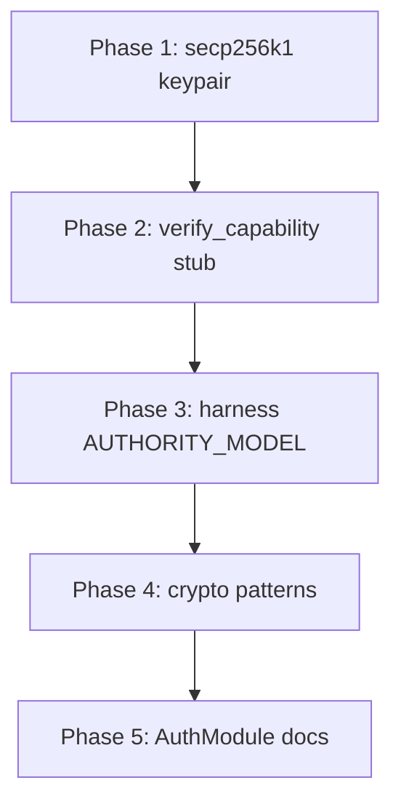

# Cryptographic Authority Implementation Plan

## Context

- **Harness** ([D:\harness](D:\harness)): domain-agnostic [AUTHORITY_MODEL.md](D:\harness\docs\AUTHORITY_MODEL.md); no Bitcoin specifics
- **Portfolio** ([D:\portfolio-harness](D:\portfolio-harness)): [AUTHORITY_GAPS.md](D:\portfolio-harness\docs\AUTHORITY_GAPS.md), [FEDIMINT_AUTHMODULE_DESIGN_TARGET.md](D:\portfolio-harness\docs\FEDIMINT_AUTHMODULE_DESIGN_TARGET.md), org-intent hb-4 with empty escalation_tools
- **audit_wrapper** ([local-proto/scripts/audit_wrapper.py](D:\portfolio-harness\local-proto\scripts\audit_wrapper.py)): blocks tools listed in org-intent escalation_tools when ORG_INTENT_ENFORCE=1

---

## Phase 1: secp256k1 Agent Keypair (portfolio-harness)

**Location:** `local-proto/agent_identity/` (new module) or `local-proto/scripts/agent_identity_utils.py`

**Design (from [FEDIMINT_AUTHMODULE_DESIGN_TARGET.md](D:\portfolio-harness\docs\FEDIMINT_AUTHMODULE_DESIGN_TARGET.md) § Standalone Agent Identity Keypair):**


| Aspect   | Implementation                                                                |
| -------- | ----------------------------------------------------------------------------- |
| Key type | secp256k1 (ecdsa with SECP256k1 curve)                                        |
| Env vars | `AGENT_PRIVATE_KEY` (hex), `AGENT_PUBKEY` (hex; optional, derived if not set) |
| Storage  | Private key outside AI access; never in prompt/state/tool output              |
| Use      | Sign audit events; future capability requests                                 |


**Deliverables:**

1. **Module** `local-proto/agent_identity/`:
  - `__init__.py`, `keypair.py`: `get_pubkey()`, `sign(message: bytes) -> bytes`
  - Load from env; derive pubkey from private key if `AGENT_PUBKEY` not set
  - Use `ecdsa` (add to requirements) with `SECP256k1` curve
2. **CLI** `local-proto/scripts/generate_agent_keypair.py`:
  - Generate new keypair; print pubkey (hex) and instructions to set `AGENT_PRIVATE_KEY`
  - Do not persist private key to disk
3. **audit_wrapper integration** (optional Phase 1b):
  - When `AGENT_PUBKEY` set, include `agent_pubkey` in `mcp_audit.jsonl` entries
  - Signing of audit entries deferred to Phase 2 or when LogEvent format is finalized
4. **Docs:** Update [AUTHORITY_GAPS.md](D:\portfolio-harness\docs\AUTHORITY_GAPS.md) — secp256k1 agent identity: Status = Implemented

**Dependencies:** Add `ecdsa` to `local-proto` or `portfolio-harness` requirements.

---

## Phase 2: verify_capability Stub and hb-4 Wiring (portfolio-harness)

**Location:** `local-proto/scripts/capability_utils.py` + new MCP `capability_mcp.py` (or add to existing MCP)

**Stub contract:**

```python
def verify_capability(token: dict | None, action_descriptor: dict) -> bool:
    """Stub: returns False until AuthModule available. Triggers human gate when false."""
    return False  # No valid token until C4/C5
```

**Deliverables:**

1. **Python module** `local-proto/scripts/capability_utils.py`:
  - `verify_capability(token, action_descriptor) -> bool`
  - Stub always returns False
  - Docstring: "Before High/Critical actions, call this. If False, escalate (hb-4)."
2. **MCP tool** (new `local-proto/scripts/capability_mcp.py` or add to credential_vault_mcp):
  - Tool `verify_capability` with params: `token` (optional JSON), `action_descriptor` (JSON: `{action_type, scope?}`)
  - Returns `{verified: bool, reason?: str}`
3. **org-intent** [org-intent.bitcoin-inspired.json](D:\portfolio-harness\org-intent-spec\examples\org-intent.bitcoin-inspired.json):
  - hb-4 escalation_tools: Add `["verify_capability"]` — **clarification:** In audit_wrapper, tools in the list are *blocked*. So adding verify_capability would block it. The intended use: verify_capability is a *gate* agents call before acting, not a blocked tool. Therefore:
  - **Option A:** Keep hb-4 escalation_tools empty. Document in rules/skills that agents must call verify_capability before High/Critical actions; when false, output ESCALATE.
  - **Option B:** Add High-risk tool names to hb-4 (e.g. future `spend`, `pii_access`) so they are blocked; verify_capability is a separate callable. For now no such tools exist.
  - **Recommendation:** Option A. Wire via documentation and skill updates.
4. **Skill/rule updates:**
  - [blue-hat-bitcoin SKILL.md](D:\portfolio-harness.cursor\skills\blue-hat-bitcoin\SKILL.md): "Before High/Critical tier actions (spend, PII, irreversible), call verify_capability. If false, escalate (hb-4)."
  - [.cursorrules](D:\portfolio-harness.cursorrules) or BITCOIN_AGENT_CAPABILITIES: Add same guidance
5. **Docs:** Update [AUTHORITY_GAPS.md](D:\portfolio-harness\docs\AUTHORITY_GAPS.md) — hb-4 escalation_tools: Status = verify_capability stub available; wiring via rules/skills; escalation_tools remain empty until specific High-risk tools are identified

---

## Phase 3: Extend Harness AUTHORITY_MODEL (harness)

**File:** [D:\harness\docs\AUTHORITY_MODEL.md](D:\harness\docs\AUTHORITY_MODEL.md)

**Additions (domain-agnostic):**

1. **Capability token lifecycle** (new section after "Capability token concept"):
  - Request (agent/human requests with pubkey) → Issue (authority creates token) → Present (before action) → Verify (check scope, expiry, revocation) → Revoke (optional)
2. **Verification contract** (new subsection):
  - `verify_capability(token, action_descriptor) -> bool`
  - Call before High/Critical tier actions
  - If false: escalate to human; do not proceed
3. **Agent identity** (expand Integration section):
  - Agent identity = pubkey (no PII)
  - Private key stored outside AI access
  - Used for: audit, capability requests, verifiable "authorized by X"

**Promotion checklist:** No Bitcoin, Fedimint, secp256k1, or portfolio references in harness doc.

---

## Phase 4: Optional Crypto Integration Patterns (harness)

**File:** [D:\harness\docs\AUTHORITY_MODEL.md](D:\harness\docs\AUTHORITY_MODEL.md) or new `docs/AUTHORITY_CRYPTO_PATTERNS.md`

**Content (optional section or separate doc):**

- **Integration patterns:** "If your stack uses proof-based identity (e.g. secp256k1, Ed25519), agent identity = pubkey; private key outside AI access."
- **Payment authority:** "For agent spend, prefer open payment rails; capability tokens can gate spend actions."
- **Reference implementations:** "See portfolio implementation for domain-specific examples (Bitcoin, Fedimint)." — link to portfolio-harness repo or docs; no hard dependency.

**Delineation:** Must pass primary prompt; no portfolio project names in harness. Use generic "portfolio" or "reference implementation" link.

---

## Phase 5: AuthModule Integration (Future / When C4/C5 Ready)

**Status:** Document only; no implementation.

**Updates:**

- [AUTHORITY_GAPS.md](D:\portfolio-harness\docs\AUTHORITY_GAPS.md): Add "When C4/C5 ready" subsection with tasks CRY1, CRY2
- [FEDIMINT_AUTHMODULE_DESIGN_TARGET.md](D:\portfolio-harness\docs\FEDIMINT_AUTHMODULE_DESIGN_TARGET.md): Already documents this; add pointer from AUTHORITY_GAPS

---

## Execution Order




1. Phase 1 (portfolio): agent_identity module, generate script, AUTHORITY_GAPS update
2. Phase 2 (portfolio): capability_utils, capability_mcp, skill/rule updates, AUTHORITY_GAPS update
3. Phase 3 (harness): AUTHORITY_MODEL extensions
4. Phase 4 (harness): crypto patterns section
5. Phase 5 (portfolio): AUTHORITY_GAPS future-work subsection

---

## Verification

- secp256k1 keypair: `python -m agent_identity.keypair` or test script runs; pubkey derived from env
- verify_capability: returns False; MCP tool callable
- Harness AUTHORITY_MODEL: passes delineation prompt; no Bitcoin/Fedimint
- AUTHORITY_GAPS: all four gaps updated with new statuses

---

## Risk

- **Low:** Docs, stubs, new modules. No production spend or PII.
- **Dependencies:** `ecdsa` for secp256k1; ensure compatibility with existing requirements.

