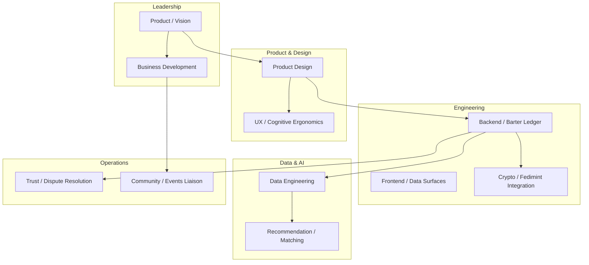

# Barter Exchange Concept Design — Paper/Conceptual

## 1. Executive Summary

**Primary customer (per your selection):** Event producers / organizers (logistics, placement, ops).

**Scope:** Digital barter exchange + preference-based recommendations for Burning Man–style events. MVP uses mnVibe (Twin Cities music) as baseline data. Backend options: Bitcoin, Lightning, Fedimint. Work is conceptual; no live social posting.

**Project name:** [VibeLedger](https://github.com/ManintheCrowds/VibeLedger)

**Critic synthesis:** Concept initially failed (pass=false). Key fixes: narrow to event producers, reframe psychographic as preference-based, specify revenue mechanism. This plan incorporates those fixes.

---

## 2. Job Roles for the Organization




| Role                              | Responsibility                                          | Notes                             |
| --------------------------------- | ------------------------------------------------------- | --------------------------------- |
| **Product / Vision**              | Roadmap, customer alignment, scope guardrails           | Single decision-maker for MVP     |
| **Business Development**          | Revenue model, partnerships, mnVibe/Burn liaisons       | Critical for kickback clarity     |
| **Product Design**                | Flows, data models, event-producer workflows            | Dust/Ticket Fairy patterns        |
| **UX / Cognitive Ergonomics**     | Preference capture, discovery UX, consent flows         | Reframe from psychographic        |
| **Backend / Barter Ledger**       | Ledger, matching engine, sync                           | Local-first candidate             |
| **Frontend / Data Surfaces**      | Click funnel, dashboards, patron/artist/vendor views    | Agent-native parity               |
| **Crypto / Fedimint Integration** | Lightning, Fedimint, Cashu integration                  | Early-stage tech risk             |
| **Data Engineering**              | ETL, mnVibe ingestion, schema                           | Paper phase: schema only          |
| **Recommendation / Matching**     | Preference-based matching, camp/artist/vendor discovery | Opt-in, transparent               |
| **Trust / Dispute Resolution**    | Escrow, reputation, mediation                           | Barter-specific; often overlooked |
| **Community / Events Liaison**    | Burn culture, mnVibe, regional relationships            | Validates proxy assumption        |


**Minimal viable team (paper phase):** Product/Vision + BD + 1 technical (Backend or Data). Expand when moving to implementation.

---

## 3. Intent Constitution (Draft — Pending Human Review)

**Purpose:** Anchor decisions and prevent scope/values drift. Human review required before adoption.

```markdown
# Intent Constitution — VibeLedger

## 1. Mission
Build a barter and coordination platform for event producers (Burning Man–style, regional burns, music events) that reduces friction in logistics, placement, and community matching—without commodifying the gift economy.

## 2. Primary Customer
Event producers and organizers. Attendees, vendors, and artists are secondary users served through producer tools.

## 3. Non-Goals (Explicit Out-of-Scope)
- Surveillance-style profiling or non-consensual tracking
- "Trade dollars" or commodification that conflicts with Burn culture
- Replacing Dust, Ticket Fairy, or Volcor—integrate or complement, not displace

## 4. Principles
- **Consent-first:** Preference data only with explicit opt-in; explain what is inferred
- **Local-first where possible:** Offline-capable, user-owned data
- **Trust through transparency:** Reputation, escrow, dispute resolution designed in
- **Decommodification-aware:** Barter supports gifting and reciprocity; avoid extractive framing

## 5. Revenue Boundary
Revenue mechanism will be specified in a separate document (cost-benefit analysis). No revenue model that requires surveillance or non-consensual data.

## 6. Amendment Process
Constitution changes require human review and explicit approval. Log decisions with rationale.
```

**Next step:** Human review, then commit to repo as `INTENT_CONSTITUTION.md`.

---

## 4. Context for Tools, Resources, and AI System

### 4.1 Data Sources (MVP — Paper Phase)


| Source                 | Content                                                   | Use                                                |
| ---------------------- | --------------------------------------------------------- | -------------------------------------------------- |
| **mnVibe**             | Shows, performances, releases, artists, promoters, venues | Baseline event/entity schema; no live scraping yet |
| **Dust** (dust.events) | Camps, events, maps, art                                  | Reference for event-producer workflows             |
| **ITEX** (itex.com)    | B2B barter model, fee structure                           | Reference for barter mechanics                     |


### 4.2 Tool Categories for AI System


| Category          | Tools / Resources                                      | Purpose                                   |
| ----------------- | ------------------------------------------------------ | ----------------------------------------- |
| **Data access**   | `list_events`, `list_artists`, `list_venues`, `search` | Read-only discovery                       |
| **Barter ledger** | `create_trade`, `get_balance`, `list_trades`           | Barter CRUD (conceptual)                  |
| **Matching**      | `match_preferences`, `suggest_opportunities`           | Preference-based recommendations          |
| **Trust**         | `get_reputation`, `create_dispute`, `resolve_dispute`  | Escrow, reputation                        |
| **Context**       | `context.md` pattern, `refresh_context`                | Agent accumulated knowledge               |
| **Completion**    | `complete_task`                                        | Explicit completion signal (agent-native) |


### 4.3 Agent-Native Checklist (from skill)

- Parity: Every UI action has agent capability
- Granularity: Tools are primitives; features are prompt-defined outcomes
- CRUD completeness: Events, artists, venues, trades have create/read/update/delete
- Shared workspace: Agent and user work in same data space
- Completion signal: `complete_task` tool, no heuristic detection

### 4.4 External Dependencies

- **Fedimint / Cashu:** Early production; "know your federation"
- **Lightning:** Production but UX poor for non-crypto users
- **Local-first sync:** ElectricSQL, PowerSync, or p2panda for offline

---

## 5. Revenue Mechanism — Cost-Benefit Analysis

Per your request to evaluate all options:


| Mechanism                                           | Pros                                | Cons                                         | Fit for Event Producers                         |
| --------------------------------------------------- | ----------------------------------- | -------------------------------------------- | ----------------------------------------------- |
| **Transaction fee (X% of barter value)**            | Clear, scalable, aligned with value | Requires volume; may discourage small trades | Medium — producers coordinate many small trades |
| **Referral fee (vendor/artist gets work)**          | Pay-for-performance                 | Hard to attribute; disputes                  | Low — attribution fuzzy                         |
| **Subscription ($X + Y units monthly, ITEX-style)** | Predictable; proven model           | May exclude small producers                  | High — producers have budget                    |
| **Utility-based formula**                           | Theoretically fair                  | Undefined; invites disputes                  | Low — avoid until specified                     |
| **Equity / ownership stake**                        | Aligns long-term                    | Illiquid; no cash flow now                   | Medium — if building a company                  |
| **Portfolio only**                                  | No revenue pressure; freedom        | No sustainability                            | High — if primary goal is portfolio             |


**Recommendation:** For paper phase, treat as **portfolio-primary** with **subscription** as the most plausible revenue model if monetizing. Document the chosen model in the intent constitution once decided.

---

## 6. Name — VibeLedger (Chosen)

**Selected:** [VibeLedger](https://github.com/ManintheCrowds/VibeLedger) — blends "vibe" (mnVibe, community feel) with "ledger" (barter, transparency).

**Alternatives considered:**

| Name            | Rationale                              | Risk                       |
| --------------- | -------------------------------------- | -------------------------- |
| BurnLedger      | Burn + ledger; clear                   | May imply Burning Man only |
| Kindling        | Ignites connections; gift economy feel | Generic                    |
| BarterVibe      | Barter + mnVibe nod                    | Slightly casual            |
| EventMint       | Events + Fedimint/mint                 | Technical                  |

---

## 7. What Else to Ask


| Question                          | Why                                                                                   |
| --------------------------------- | ------------------------------------------------------------------------------------- |
| **Who owns the IP?**              | "Percentages/kickbacks" implies shared upside; clarify ownership of code, data, brand |
| **What is the man's role?**       | Partner, client, investor? Affects decision authority                                 |
| **Timeline and commitment?**      | Paper phase vs. MVP vs. production; part-time vs. full-time                           |
| **mnVibe relationship?**          | Do they consent to being the data baseline? Licensing?                                |
| **Burn org relationship?**        | Any formal tie to Burning Man Project or regionals?                                   |
| **Privacy jurisdiction?**         | GDPR, CCPA, or other if handling EU/CA users                                          |
| **Dispute resolution authority?** | Who arbitrates barter disputes? Platform or community?                                |


---

## 8. Unknown Unknowns — How to Find Them


| Strategy                  | Action                                                                  |
| ------------------------- | ----------------------------------------------------------------------- |
| **Pre-mortem**            | "Assume the project failed in 18 months. Why?" — surface hidden risks   |
| **Converse assumption**   | "What if event producers don't want barter?" — stress-test core premise |
| **Expert interviews**     | Talk to 3 event producers, 2 Burn placement leads, 1 mnVibe operator    |
| **Regulatory scan**       | Barter tax (1099-B), money transmission, securities (if equity)         |
| **Competitive scan**      | Dust, Volcor, Ticket Fairy roadmaps; any barter plans?                  |
| **Technical spike**       | Fedimint + Dust integration feasibility; 2-day spike                    |
| **Deal structure review** | Lawyer or advisor on "kickback" vs. "revenue share" vs. "referral fee"  |


---

## 9. Critic Summary (Incorporated)

The original concept scored below threshold. This plan applies:

- **Single primary customer:** Event producers
- **Revenue:** Cost-benefit table; subscription or portfolio-primary for now
- **Psychographic reframe:** Preference-based recommendations, opt-in, transparent
- **Trust layer:** Job role + tool category for dispute resolution
- **Maven analogy:** Data fusion for logistics, not surveillance

**Remaining risks:** mnVibe as proxy validity, Fedimint maturity, deal structure clarity.

---

## 10. Repo Structure

**Repo:** [github.com/ManintheCrowds/VibeLedger](https://github.com/ManintheCrowds/VibeLedger)

```
VibeLedger/
├── INTENT_CONSTITUTION.md      # Pending human review
├── docs/
│   ├── JOB_ROLES.md
│   ├── TOOL_CONTEXT.md
│   ├── REVENUE_ANALYSIS.md
│   └── NAME_BRAINSTORM.md
├── .cursor/
│   └── state/
│       └── scope_barter_exchange.md
└── README.md
```

---

## 11. Next Steps (After Human Approval)

1. Human review and approve intent constitution
2. Populate `docs/` with expanded versions of this plan
3. Run "what else to ask" interviews
4. Technical spike: Fedimint + event schema (2 days)
5. Revisit revenue decision with cost-benefit in hand

