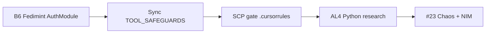

# Bitcoin Audit Top 5 Implementation Plan

## Context

From the critic audit: Bitcoin-Chaos docs and MCP tools exist, but the SCP gate for Bitcoin data is policy-only with no technical enforcement. These five changes close the main gaps.

---

## Implementation Order




B6 and Sync are independent and can run first; SCP gate references them. AL4 and #23 are larger and can follow.

---

## 1. Complete B6 — Add Fedimint AuthModule to BITCOIN_OBSERVATION_SOURCES

**File:** [docs/BITCOIN_OBSERVATION_SOURCES.md](D:\portfolio-harness\docs\BITCOIN_OBSERVATION_SOURCES.md)

**Action:** Add a row under the **Fedimint** section (lines 26–33):


| Source                                                 | Purpose                                                                                                                                                                                                                          |
| ------------------------------------------------------ | -------------------------------------------------------------------------------------------------------------------------------------------------------------------------------------------------------------------------------- |
| Fedimint AuthModule (module design, capability tokens) | AuthModule pattern for capability delegation; agent identity = Fedimint pubkey; see [FEDIMINT_OBSERVATION_TEMPLATE](FEDIMINT_OBSERVATION_TEMPLATE.md), [FEDIMINT_AUTHMODULE_DESIGN_TARGET](FEDIMINT_AUTHMODULE_DESIGN_TARGET.md) |


**Ref:** [integration plan §6](D:\portfolio-harness\plans\bitcoin_chaos_convergence_integration_827d4828.plan.md) (B6 task).

**Verification:** Update pending_tasks B6 to done.

---

## 2. Sync TOOL_SAFEGUARDS

**Files:**

- [.cursor/docs/TOOL_SAFEGUARDS.md](D:\portfolio-harness.cursor\docs\TOOL_SAFEGUARDS.md) (currently ~12 lines, credential vault only)
- [local-proto/docs/TOOL_SAFEGUARDS.md](D:\portfolio-harness\local-proto\docs\TOOL_SAFEGUARDS.md) (canonical, ~186 lines, includes §SCP gate for Bitcoin)

**Action:** Add a short Bitcoin SCP gate section to `.cursor/docs/TOOL_SAFEGUARDS.md` after the credential vault table:

```markdown
## Bitcoin-Sourced Data (SCP Gate)

Before feeding Bitcoin-sourced content (tx, inscription, OP_RETURN, script) to LLM or state: run `scp_run_pipeline(content, sink='llm_context')` and record provenance. Full details: [local-proto/docs/TOOL_SAFEGUARDS.md](../../local-proto/docs/TOOL_SAFEGUARDS.md) §SCP gate for Bitcoin-sourced data.
```

**Rationale:** Option C from proposal — brief summary + link to canonical. Avoids duplication and drift.

---

## 3. Add SCP Gate to .cursorrules

**File:** [.cursorrules](D:\portfolio-harness.cursorrules)

**Location:** Immediately after the **Bitcoin-Chaos org-intent** block (around line 126), as a new subsection.

**Action:** Insert:

```markdown
### SCP gate for Bitcoin-sourced data
- Before feeding Bitcoin-sourced content (tx, inscription, OP_RETURN, script output) to LLM or state: (1) call `scp_run_pipeline(content, sink='llm_context')` (SCP MCP); (2) record provenance via `bitcoin_provenance_record` or `document_provenance_record`. Load blue-hat-bitcoin skill when processing Bitcoin data. See [BITCOIN_AGENT_CAPABILITIES.md](docs/BITCOIN_AGENT_CAPABILITIES.md) and [TOOL_SAFEGUARDS](local-proto/docs/TOOL_SAFEGUARDS.md) §SCP gate.
```

**Note:** Ensure path to TOOL_SAFEGUARDS resolves from repo root (`.cursorrules` is at root).

---

## 4. Python Bitcoin Modules Research (AL4)

**Output:** [docs/PYTHON_BITCOIN_MODULES_RESEARCH.md](D:\portfolio-harness\docs\PYTHON_BITCOIN_MODULES_RESEARCH.md)

**Ref:** [bitcoin_chaos plan §9](D:\portfolio-harness\plans\bitcoin_chaos_convergence_a219e7b9.plan.md) (lines 268–272: bitcoinlib, python-bitcoinlib, btc-custody-py, LangChainBitcoin, l402-requests).

**Action:** Create research doc with:

- Evaluation criteria: self-custody, agent wallet fit, L402 support, maintenance, license
- Per-library: description, pros/cons, verdict (prefer/deprecate/neutral)
- Recommendation table
- Skeptical stance on Coinbase, custodial, stablecoin issuers per plan

**Verification:** Update pending_tasks AL4 to done.

---

## 5. Run Chaos + NIM Testing (#23)

**Refs:**

- [local-proto/TODO.md #23](D:\portfolio-harness\local-proto\TODO.md)
- [bitcoin_chaos plan](D:\portfolio-harness\plans\bitcoin_chaos_convergence_a219e7b9.plan.md)
- [nvidia_nim_integration plan](D:\portfolio-harness\plans\nvidia_nim_integration_b353dca3.plan.md)
- [CHAOS_BITCOIN_MAPPING](D:\portfolio-harness\docs\CHAOS_BITCOIN_MAPPING.md) (mitigation reference)

**Note:** AGENTS_OF_CHAOS_REF at `D:\alignment-seed\docs\AGENTS_OF_CHAOS_REF.md` may not exist in workspace; use CHAOS_BITCOIN_MAPPING and bitcoin_chaos plan as fallback.

**Artifacts:**

1. **Scope doc:** `docs/scope_chaos_nim_testing.md` — test matrix (Chaos mitigations × components: alignment-seed, local-proto, job-automation-service, nim_batch)
2. **Runbook:** `local-proto/docs/CHAOS_NIM_TEST_RUNBOOK.md` — smoke test checklist, quality test criteria
3. **Execution:** Run smoke tests; document findings

**WBS:**

1. Create scope doc (mitigations, NIM integration, components)
2. Read nvidia_nim plan and CHAOS_BITCOIN_MAPPING
3. Define smoke test checklist
4. Define quality test criteria
5. Execute smoke tests and record results
6. Update pending_tasks / handoff Next

---

## Verification Checklist

- B6: Fedimint AuthModule row in BITCOIN_OBSERVATION_SOURCES; pending_tasks B6 → done
- Sync: .cursor/docs/TOOL_SAFEGUARDS.md has Bitcoin SCP section + link to canonical
- SCP gate: New subsection in .cursorrules after Bitcoin-Chaos org-intent
- AL4: docs/PYTHON_BITCOIN_MODULES_RESEARCH.md created; pending_tasks AL4 → done
- #23: scope_chaos_nim_testing.md, CHAOS_NIM_TEST_RUNBOOK.md, smoke test results documented

---

## Risk

- **Low:** B6, Sync, SCP gate are doc/rule edits.
- **Medium:** AL4 requires external research (PyPI, GitHub, docs).
- **Medium–High:** #23 depends on NIM availability and alignment-seed/AGENTS_OF_CHAOS_REF; may need fallback refs.

