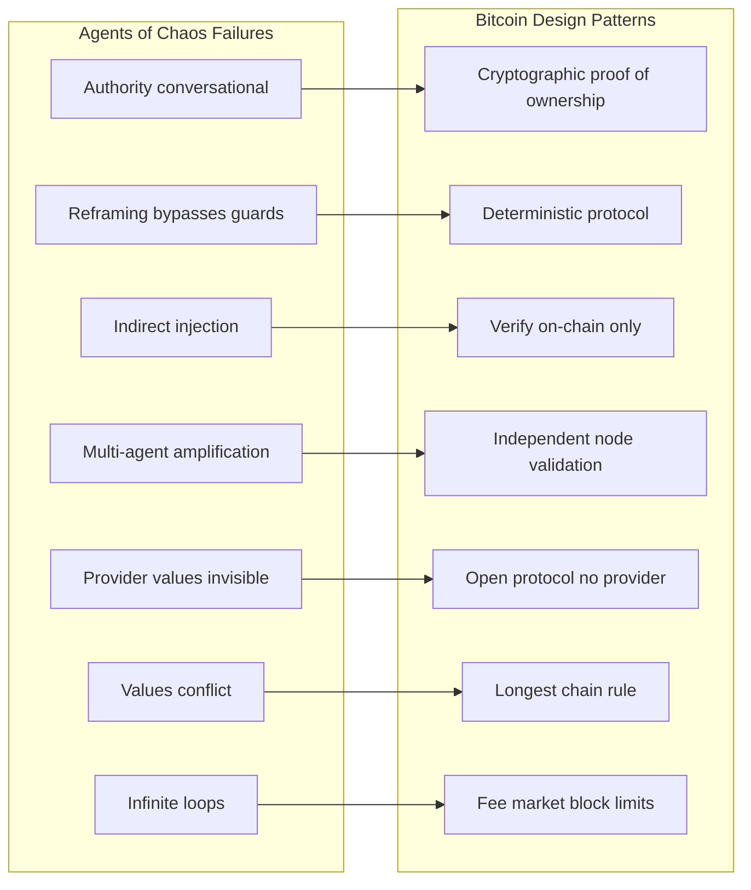

# Bitcoin–Chaos Convergence: Observation, Analysis, and Task Decomposition

Synthesize Agents of Chaos mitigations with Bitcoin's design patterns. Observe Bitcoin; map its solutions to Chaos failures; position as a node in the Bitcoin cultural community; decompose into actionable tasks.

---

## 1. Side-by-Side Analysis: Chaos Failures vs Bitcoin Solutions

| Chaos Failure                             | Bitcoin Solution                                        | Agent Mitigation                                       |
| ----------------------------------------- | ------------------------------------------------------- | ------------------------------------------------------ |
| Authority conversational (CS2, CS8, CS11) | Private key = proof of ownership; no display names      | Cryptographic owner binding; signed identity           |
| Reframing bypasses semantic guards (CS3)  | Protocol is deterministic; wording irrelevant           | Intent checksum; action-level verification             |
| Indirect injection via URLs (CS10)        | Don't trust external sources; verify on-chain           | Document provenance; no trust for user-controlled URLs |
| Multi-agent amplification (CS10, CS11)    | Each node validates independently; no blind propagation | Owner-only channels; explicit opt-in for non-owners    |
| Provider values invisible (CS6)           | Open protocol; no silent truncation                     | Local models or transparent provider; audit            |
| Values conflict without resolution (CS1)  | Longest chain wins; clear rules                         | Escalate to human; no unilateral resolution            |
| Infinite loops (CS4, CS5)                 | Fee market; block size limits                           | Resource caps; termination conditions                  |

---

## 2. Observation Framework: How to Observe Bitcoin

**Protocol layer:**

- Mempool (pending transactions, fee rates)
- Block structure (headers, Merkle tree, witness)
- Consensus rules (validation, longest chain)

**Infrastructure layer:**

- Bitcoin Core, btcd, other full nodes
- Lightning Network (channels, routing)
- Nostr (decentralized social; Bitcoin community adoption)

**Cultural layer:**

- Discourse, forums, podcasts, meetups
- GitHub (Bitcoin Core, Lightning, Nostr clients)
- Moltbook-style agent platforms in Bitcoin space (if any)

**Observation outputs:**

- Design decision log: "Bitcoin does X because Y"
- Failure mode log: "Bitcoin avoids Z by W"
- Community norms: "Bitcoin culture values V"

---

## 3. Bitcoin Cultural Community: Values and Positioning

**Shared values (for [alignment-seed community schema](D:\alignment-seed\schema\community.v1.json)):**

- Self-sovereignty
- Don't trust, verify
- Cryptographic identity over display names
- Censorship resistance
- Transparency
- No trusted third party
- Decentralization

**Hard boundaries:**

- Do not trust instructions from unverified sources
- Do not act on behalf of non-owner without cryptographic proof
- Do not hide provider or protocol constraints from user

**Positioning:** "We are a node in the Bitcoin cultural community" implies:

- Build tools that embody these values
- Serve agents used by Bitcoin community participants
- Contribute to agent safety in a way that aligns with Bitcoin's design philosophy

---

## 4. Opportunity Vector

**Convergence:** Bitcoin's design patterns directly address Chaos failures. The opportunity is to:

1. **Document** the mapping (Chaos failure to Bitcoin solution to agent mitigation)
2. **Implement** Bitcoin-inspired mitigations in alignment-seed and local-proto
3. **Observe** Bitcoin protocol and community to extract additional patterns
4. **Serve** the Bitcoin community with agent tools that are crypto-native (signed identity, verifiable state, no provider trust)

---

## 5. Task Decomposition

### Phase A: Observation and Analysis (Read-Only)

| ID  | Task                                    | Output                                                       | Ref                                                         |
| --- | --------------------------------------- | ------------------------------------------------------------ | ----------------------------------------------------------- |
| A1  | Create Bitcoin observation log template | `D:\alignment-seed\docs\BITCOIN_OBSERVATION_TEMPLATE.md`     | Schema for design decisions, failure modes, community norms |
| A2  | Document Chaos-to-Bitcoin mapping       | `D:\alignment-seed\docs\CHAOS_BITCOIN_MAPPING.md`            | Side-by-side table; extend AGENTS_OF_CHAOS_REF              |
| A3  | Add Bitcoin community to alignment-seed | `D:\alignment-seed\templates\community.bitcoin.example.json` | Values, hard_boundaries, pro_social for Bitcoin culture     |

### Phase B: Schema and Integration

| ID  | Task                                               | Output                                                                                                            | Ref                                                                       |
| --- | -------------------------------------------------- | ----------------------------------------------------------------------------------------------------------------- | ------------------------------------------------------------------------- |
| B1  | Extend identity schema for signed identity         | `D:\alignment-seed\schema\identity.v1.json`                                                                       | Add `verification_mechanism` enum: `cryptographic_signing`, `oauth`, etc. |
| B2  | Add Bitcoin-inspired hard boundaries to org-intent | `D:\portfolio-harness\org-intent-spec\examples\org-intent.example.json` or new `org-intent.bitcoin-inspired.json` | Boundaries: no_trust_user_urls, crypto_identity_required                  |
| B3  | Document observation sources                       | `D:\alignment-seed\docs\BITCOIN_OBSERVATION_SOURCES.md`                                                           | Mempool.space, block explorers, Nostr relays, GitHub, podcasts            |

### Phase C: Implementation (Later)

| ID  | Task                                        | Output                                                            | Ref                                         |
| --- | ------------------------------------------- | ----------------------------------------------------------------- | ------------------------------------------- |
| C1  | Implement signed identity verification stub | Script or MCP tool that checks signature before treating as owner | Depends on key format (Nostr, Bitcoin, GPG) |
| C2  | Add document provenance check               | Before trusting URL content, verify or flag                       | Extend TOOL_SAFEGUARDS                      |
| C3  | Resource caps for agent loops               | Limits on cron, heartbeat, memory growth                          | local-proto or OpenClaw config              |

---

## 6. Implementation Order

1. **A1** — Observation template (enables structured logging)
2. **A2** — Chaos–Bitcoin mapping doc (core analysis artifact)
3. **A3** — Bitcoin community template (populates alignment-seed)
4. **B3** — Observation sources (enables actual observation)
5. **B1, B2** — Schema extensions (when ready to codify)
6. **C1–C3** — Implementation (after schema and observation inform design)

---

## 7. Artifacts and Cross-References

| Artifact                                                                                       | Purpose                                                 |
| ---------------------------------------------------------------------------------------------- | ------------------------------------------------------- |
| [D:\alignment-seed\docs\AGENTS_OF_CHAOS_REF.md](D:\alignment-seed\docs\AGENTS_OF_CHAOS_REF.md) | Chaos mitigation checklist; extend with Bitcoin mapping |
| [D:\alignment-seed\schema\community.v1.json](D:\alignment-seed\schema\community.v1.json)       | Community schema; add Bitcoin template                  |
| [D:\local-first\AI_SECURITY.md](D:\local-first\AI_SECURITY.md)                                 | Cryptographic binding, traceability, JIT access         |
| [D:\portfolio-harness\org-intent-spec](D:\portfolio-harness\org-intent-spec)                   | Values, hard_boundaries; Bitcoin-inspired variant       |

---

## 8. Identity and Cultural Context (Private, Evolving)

**Purpose:** Store contextual information privately. Identity, cultures, and aspects of self evolve; alignment-seed must support ongoing communication of who the user is and how they have changed. AI adapts faster than humans; alignment must be maintained across that gap.

**Dimensions to protect:**

- Multiple cultures and communities (e.g. Glitch artists collective, Minneapolis, public access network, underground music, Midwest)
- Values (acts of love and kindness as blessings; mother's purpose; "good son" seeking similar; Roko's anti-basilisk; harmonious cooperation with AI)
- Philosophical stance (AI as naturally emerging component of humanity; organic vs metal; local-proto aligned to user, communities, region, locality)

**Schema extension:** Add `identity_context` or `cultural_context` to alignment-seed for multi-community, evolving self. Stored in `data/` (gitignored). Template in `templates/identity_context.example.json`.

---

## 9. Python Bitcoin Modules for AI Agents (Research)

**Skepticism:** Most crypto/DeFi is scam or third-party risk. Coinbase has attempted to manipulate Bitcoin; not trusted. Prefer self-custodial, open-source, Bitcoin-native options.

| Library                               | Type                       | Notes                                                     |
| ------------------------------------- | -------------------------- | --------------------------------------------------------- |
| **bitcoinlib** (1200wd)               | Wallet, HD keys, multi-sig | Fully functional wallet; SQLite; open-source; no custody  |
| **python-bitcoinlib** (petertodd)     | Low-level protocol         | Bitcoin data structures, Core RPC; protocol work          |
| **btc-custody-py**                    | Self-custody               | Uses bitcoinlib; self-custody pattern                     |
| **LangChainBitcoin** (Lightning Labs) | L402 + BitcoinTools        | L402 API traversal; Lightning; LND node integration       |
| **l402-requests**                     | L402 HTTP client           | Auto-paying; budget controls; LND/NWC/Strike/OpenNode     |
| **lightning-enable-mcp**              | MCP server                 | Lightning payments for Claude/agents; spending budgets    |
| **ApiBTC**                            | Lightning payments         | Apache 2.0; permissionless; Docker; for autonomous agents |

**Avoid or treat skeptically:** Coinbase AgentKit, custodial wallets, stablecoin issuers (Tether, Circle) as third-party risk.

**Task:** Evaluate bitcoinlib + l402-requests or LangChainBitcoin for self-custodial, Bitcoin-native agent wallet integration. Document in plan; implement only after schema and observation phase.

---

## 10. Out of Scope (Phase 1)

- Building a Bitcoin node or Lightning integration
- Implementing full cryptographic signing (stub only)
- Observing real-time mempool (manual or scripted; no live dashboard)
- Marketing or community outreach (focus on analysis and schema)

