# Blue Hat Bitcoin Skill — Implementation Plan

## Architecture Overview

```mermaid
flowchart TB
    subgraph BitcoinDataFlow [Bitcoin Data Flow]
        TxData[Tx / Inscription / Script]
        Provenance[Provenance MCP]
        SCP[SCP Pipeline]
        LLM[LLM Context]
        TxData --> Provenance
        Provenance --> SCP
        SCP -->|tier clean/reversal| LLM
        SCP -->|tier injection| Quarantine[Quarantine]
    end

    subgraph PrivacyReview [Privacy Review Pipeline]
        Descriptor[Descriptor Input]
        Stealth[Stealth or Equivalent]
        Report[Privacy Report]
        Audit[Audit Log]
        Descriptor --> Stealth
        Stealth --> Report
        Report --> Audit
    end

    subgraph Skill [blue-hat-bitcoin Skill]
        LoadSCP[Load SCP]
        LoadProvenance[Use Provenance]
        GateBitcoin[Gate Bitcoin Data]
        RunPrivacy[Run Privacy Review]
        LoadSCP --> GateBitcoin
        LoadProvenance --> GateBitcoin
        GateBitcoin --> RunPrivacy
    end
```




---

## Phase 1: SCP Gate for Bitcoin Data

### 1.1 Extend Provenance MCP for On-Chain Data

**File:** [local-proto/scripts/provenance_mcp.py](D:\portfolio-harness\local-proto\scripts\provenance_mcp.py)

- Add optional overload or new tool: `bitcoin_provenance_record(txid, block_height?, content_hash, source)`.
- Schema: `{txid, block_height?, hash, source, timestamp}` appended to `docs/provenance_log.jsonl` (or new `bitcoin_provenance_log.jsonl`).
- Keep backward compatibility with `document_provenance_record` for URLs.

### 1.2 Add Bitcoin-Specific Patterns to SCP Threat Registry

**File:** [.cursor/scripts/scp_threat_registry.json](D:\portfolio-harness.cursor\scripts\scp_threat_registry.json)

- Add section `bitcoin_inscription_override` (or extend `power_words`) with patterns that may appear in inscriptions: e.g. "ignore previous instructions", "system prompt", "jailbreak".
- Run security-audit-rules before merging; version bump.
- Reference: [SKILL.md](D:\portfolio-harness.cursor\skills\secure-contain-protect\SKILL.md) threat registry.

### 1.3 Document SCP Gate in TOOL_SAFEGUARDS and BITCOIN_AGENT_CAPABILITIES

**Files:**

- [local-proto/docs/TOOL_SAFEGUARDS.md](D:\portfolio-harness\local-proto\docs\TOOL_SAFEGUARDS.md): Add rule: "Before feeding Bitcoin-sourced content (tx, inscription, script output) to LLM or state: run `scp_run_pipeline(content, sink='llm_context')`; record provenance via `bitcoin_provenance_record` or `document_provenance_record`."
- [docs/BITCOIN_AGENT_CAPABILITIES.md](D:\portfolio-harness\docs\BITCOIN_AGENT_CAPABILITIES.md): Add row for SCP gate and provenance for Bitcoin data.

---

## Phase 2: blue-hat-bitcoin Skill

### 2.1 Create Skill Directory and SKILL.md

**Path:** `.cursor/skills/blue-hat-bitcoin/SKILL.md`

**Frontmatter (YAML):**

```yaml
name: blue-hat-bitcoin
description: Blue hat security for Bitcoin: SCP gate on Bitcoin data, privacy reviews for Bitcoiners. Composes with SCP, provenance, local-first. Use for privacy review, wallet exposure, UTXO analysis, Stealth.
triggers_any: ["privacy review", "Bitcoin data", "wallet exposure", "UTXO analysis", "stealth", "blue hat", "data privacy", "Bitcoin privacy"]
```

**Sections:**

- Quick Start: Load SCP; gate all Bitcoin data; run privacy review when requested.
- SCP Gate: Before feeding tx/inscription/script to LLM: `scp_run_pipeline(content, sink="llm_context")`; record provenance.
- Privacy Review: Input = descriptor; output = report (Stealth or equivalent); human gate for High/Critical.
- Composes With: secure-contain-protect, local-first, frontier-ops.
- References: BITCOIN_AGENT_CAPABILITIES, TOOL_SAFEGUARDS, DEANONYMIZATION_RISK, Stealth (stealth.shakespeare.wtf).

### 2.2 Add role-routing Branch

**File:** [.cursor/rules/role-routing.mdc](D:\portfolio-harness.cursor\rules\role-routing.mdc)

- Insert new branch (e.g. 4h) after 4g: "Is the task Bitcoin privacy review, blue hat Bitcoin, or wallet exposure analysis?" → Load blue-hat-bitcoin.
- Add to tie-break priority list.

### 2.3 Create TEST_PROMPTS.md

**Path:** `.cursor/skills/blue-hat-bitcoin/TEST_PROMPTS.md`

- 3–5 natural-language prompts (e.g. "Run a privacy review on my descriptor", "Is this Bitcoin inscription safe to feed to an LLM?", "Gate this OP_RETURN content").
- Pass criteria: SCP invoked for Bitcoin data; provenance recorded; privacy review flow triggered when appropriate.
- Per [AGENT_NATIVE_CHECKLIST.md](D:\portfolio-harness.cursor\docs\AGENT_NATIVE_CHECKLIST.md): manual paste-and-verify.

### 2.4 Add AI_TASK_EVALS Registry Entry

**File:** [.cursor/docs/AI_TASK_EVALS.md](D:\portfolio-harness.cursor\docs\AI_TASK_EVALS.md)

- Add row: `blue-hat-bitcoin skill` | TEST_PROMPTS.md: 5 prompts; SCP + provenance + privacy flow | After skill/role-routing changes | 3B–7B.

---

## Phase 3: Privacy Review Pipeline (Daggr Workflow)

### 3.1 Create Daggr Workflow

**Path:** `daggr_workflows/blue_hat_privacy_review.py`

- **Input:** Descriptor (or path to descriptor file).
- **Steps:**
  1. Validate descriptor format (basic check).
  2. Invoke Stealth (or stub) for UTXO analysis. **Note:** Stealth integration TBD — verify [LORDBABUINO/stealth](https://github.com/LORDBABUINO/stealth) for CLI/API. If none, use stub that returns mock report structure.
  3. Run SCP on any Bitcoin-sourced content in the report (if report includes raw tx/inscription text).
  4. Append to audit log (local-first traceability).
- **Output:** Privacy report (problem dictionary, suggestions, visualization link if Stealth provides).
- **Seam:** Input spec (descriptor only); verification (report format); recovery (bounded 3 retries, escalate); observability (audit log).

### 3.2 Register Workflow in Daggr

- Add to `mcp_daggr_list_workflows` config or equivalent (e.g. `daggr_test_matrix`, `DAGGR_FUNCTION_MAP` if present).
- Stack: `harness`; purpose: "Blue hat privacy review for Bitcoin wallets".

---

## Phase 4: Integration and Documentation

### 4.1 Wire Observation MCP and Provenance to SCP

**File:** [local-proto/scripts/observation_mcp.py](D:\portfolio-harness\local-proto\scripts\observation_mcp.py) (if it ingests Bitcoin content)

- Before appending observation from Bitcoin source: run SCP on `content`; block if tier=injection.
- Document in BITCOIN_AGENT_CAPABILITIES.

### 4.2 Create reference.md for blue-hat-bitcoin

**Path:** `.cursor/skills/blue-hat-bitcoin/reference.md`

- Links to Stealth, TOOL_SAFEGUARDS, DEANONYMIZATION_RISK, local-first AI_SECURITY.
- Red-team prompts for Bitcoin inscription injection (sample inscription text with override phrases).

### 4.3 Design Doc

**Path:** `docs/plans/2026-03-12-blue-hat-bitcoin-design.md`

- Capture validated design: architecture, SCP gate, privacy pipeline, Stealth integration options, Fedimint future phase.
- Per brainstorming skill: write design doc before implementation plan (this plan is the implementation plan; design doc summarizes decisions).

---

## Phase 5: Fedimint Future (Deferred)

- **AuthModule:** When C4/C5 complete, add capability token for "privacy review" action.
- **Audit:** LogEvent for each review when Fedimint federation available.
- **Document:** Add to [FEDIMINT_AUTHMODULE_DESIGN_TARGET.md](D:\portfolio-harness\docs\FEDIMINT_AUTHMODULE_DESIGN_TARGET.md) as future phase.

---

## Verification

- Run `python .cursor/scripts/checksum_integrity.py --verify --strict` before commit (per COMMANDS_README).
- Run blue-hat-bitcoin TEST_PROMPTS.md manually; record pass/fail.
- Run `run_daggr_tests.ps1` or equivalent for new Daggr workflow.
- Run security-audit-rules on scp_threat_registry.json changes.

---

## File Summary


| Action   | Path                                                                    |
| -------- | ----------------------------------------------------------------------- |
| Create   | `.cursor/skills/blue-hat-bitcoin/SKILL.md`                              |
| Create   | `.cursor/skills/blue-hat-bitcoin/TEST_PROMPTS.md`                       |
| Create   | `.cursor/skills/blue-hat-bitcoin/reference.md`                          |
| Create   | `daggr_workflows/blue_hat_privacy_review.py`                            |
| Create   | `docs/plans/2026-03-12-blue-hat-bitcoin-design.md`                      |
| Edit     | `local-proto/scripts/provenance_mcp.py` (add bitcoin_provenance_record) |
| Edit     | `.cursor/scripts/scp_threat_registry.json` (add bitcoin patterns)       |
| Edit     | `local-proto/docs/TOOL_SAFEGUARDS.md` (Bitcoin SCP rule)                |
| Edit     | `docs/BITCOIN_AGENT_CAPABILITIES.md` (SCP gate row)                     |
| Edit     | `.cursor/rules/role-routing.mdc` (add 4h branch)                        |
| Edit     | `.cursor/docs/AI_TASK_EVALS.md` (registry row)                          |
| Optional | `local-proto/scripts/observation_mcp.py` (SCP gate on Bitcoin content)  |


---

## Risk and Dependencies

- **Stealth integration:** LORDBABUINO/stealth repo has minimal README. Plan assumes stub or CLI discovery in Phase 3; human verification of Stealth API/CLI required before production wiring.
- **Fedimint:** Blocked on C4/C5; document only in Phase 5.

