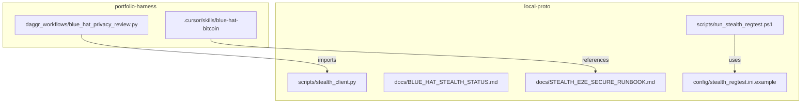

# Blue Hat E2E Status, Secure Laptop Testing, and local-proto Consolidation

## 1. Current Status Note (where we are)

**Location:** `[.cursor/state/pending_tasks.md](D:\portfolio-harness\.cursor\state\pending_tasks.md)` PENDING_BLUE_HAT section, plus a new status doc.

**Status summary to add:**

| Phase                               | Status  | Blocker / Note                                                                          |
| ----------------------------------- | ------- | --------------------------------------------------------------------------------------- |
| Stealth HTTP integration            | Done    | `blue_hat_privacy_review.py` calls `GET /api/wallet/scan`; stub fallback on 500/timeout |
| Stealth backend                     | Runs    | Quarkus on 8080; returns 500 when `detect.py` runs without `bitcoin-cli`                |
| Bitcoin Core regtest                | Blocked | `bitcoind` not installed; Stealth requires Bitcoin Core >= 26                           |
| Full E2E (descriptor → real report) | Blocked | Needs Bitcoin Core + setup.sh + reproduce.py                                            |
| TEST_PROMPTS 2–4                    | Pass    | 5 fails (SCP/provenance not invoked for clean content)                                  |

**New file:** `local-proto/docs/BLUE_HAT_STEALTH_STATUS.md` — single source of truth for E2E status, updated as phases complete.

---

## 2. Secure Laptop Testing (brainstorm + tech-lead)

### Risk vectors on a laptop

| Risk               | Mitigation                                                                                     |
| ------------------ | ---------------------------------------------------------------------------------------------- |
| Accidental mainnet | Hardcode `network=regtest` in config; no mainnet RPC                                           |
| Real keys in test  | Use only descriptors from Stealth `setup.sh` / `reproduce.py`; never paste mainnet descriptors |
| Descriptor leakage | `.gitignore` for `bitcoin-data/`, `*.descriptor` if storing; SCP mask_secrets on logs          |
| Disk persistence   | Regtest datadir is disposable; `setup.sh --fresh` wipes chain                                  |
| Port conflicts     | Stealth 8080, bitcoind 18444 (regtest); document in runbook                                    |

### Secure testing model

1. **Regtest-only:** Stealth `backend/script/config.ini` must have `network = regtest`. No mainnet config.
2. **Isolated datadir:** `bitcoin-data/` (or equivalent) in `.gitignore`; never commit chain data.
3. **Test descriptors only:** Use descriptors generated by Stealth setup (e.g. from `setup.sh` output or `reproduce.py`). Document in runbook: "Do not paste mainnet descriptors into test runs."
4. **Human gate for real descriptors:** When testing with user-provided descriptors, treat as High-risk per TOOL_SAFEGUARDS; optional `APPROVAL_NEEDED` before scan.
5. **Run scripts in local-proto:** `run_stealth_regtest.ps1` (or `.sh`) that: checks `bitcoin-cli` exists, runs `setup.sh`, starts Stealth backend, prints descriptor for testing.

### Tech-lead placement

| Artifact               | Path                                             | Rationale                                                               |
| ---------------------- | ------------------------------------------------ | ----------------------------------------------------------------------- |
| Stealth client module  | `local-proto/scripts/stealth_client.py`          | Reusable HTTP client; single place for API URL, timeout, error handling |
| E2E run script         | `local-proto/scripts/run_stealth_regtest.ps1`    | Orchestrates bitcoind + Stealth; Windows-first (user is on Windows)     |
| Status doc             | `local-proto/docs/BLUE_HAT_STEALTH_STATUS.md`    | Canonical E2E status; linked from pending_tasks                         |
| Secure testing runbook | `local-proto/docs/STEALTH_E2E_SECURE_RUNBOOK.md` | Regtest-only rules, descriptor policy, setup steps                      |
| Config template        | `local-proto/config/stealth_regtest.ini.example` | Regtest-only config.ini for Stealth; user copies to Stealth repo        |

**Stealth repo stays external** (D:\software\stealth). local-proto owns: client library, run scripts, docs, config template. No copy of Stealth source into local-proto.

---

## 3. Full Consolidation into local-proto

### What moves into local-proto

### Concrete changes

| Action       | Path                                             | Detail                                                                                                                                                           |
| ------------ | ------------------------------------------------ | ---------------------------------------------------------------------------------------------------------------------------------------------------------------- |
| **Create**   | `local-proto/scripts/stealth_client.py`          | Extract `_call_stealth_api`, `_validate_descriptor`, `_stealth_to_report` from `blue_hat_privacy_review.py`. Export `call_stealth(descriptor) -> dict            |
| **Refactor** | `daggr_workflows/blue_hat_privacy_review.py`     | Import from `local_proto.scripts.stealth_client` (or `sys.path` to local-proto/scripts). Keep Daggr graph, Gradio UI, metrics; delegate Stealth calls to client. |
| **Create**   | `local-proto/scripts/run_stealth_regtest.ps1`    | Check `bitcoin-cli`; run Stealth `setup.sh` (or equivalent) if needed; start Quarkus backend; print test descriptor. Document Stealth repo path (configurable).  |
| **Create**   | `local-proto/docs/BLUE_HAT_STEALTH_STATUS.md`    | Status table, blockers, next steps. Linked from pending_tasks.                                                                                                   |
| **Create**   | `local-proto/docs/STEALTH_E2E_SECURE_RUNBOOK.md` | Regtest-only policy, descriptor rules, setup steps, troubleshooting.                                                                                             |
| **Create**   | `local-proto/config/stealth_regtest.ini.example` | Copy of Stealth `config.ini` with `network=regtest`; instructions to copy into Stealth repo.                                                                     |
| **Update**   | `local-proto/docs/TOOL_SAFEGUARDS.md`            | Add link to STEALTH_E2E_SECURE_RUNBOOK in blue-hat section.                                                                                                      |
| **Update**   | `.cursor/state/pending_tasks.md`                 | Add BH0 "Bitcoin Core regtest setup" with link to runbook; link BH1 to stealth_client.                                                                           |

### What stays in harness

- **daggr_workflows/blue_hat_privacy_review.py** — Thin wrapper: imports stealth_client, builds Daggr graph, launches Gradio. No Stealth logic.
- **.cursor/skills/blue-hat-bitcoin/** — Skill and TEST_PROMPTS stay in harness (agent-level).
- **run_workflow.py** — No change; still launches blue_hat_privacy.

### Dependency flow

- `blue_hat_privacy_review.py` adds: `sys.path` to `local-proto/scripts` (or package import if local-proto is a package).
- `stealth_client.py` has no dependency on daggr/gradio; pure HTTP + validation.

---

## 4. Implementation Order

1. **Status note** — Add BLUE_HAT_STEALTH_STATUS.md; update pending_tasks PENDING_BLUE_HAT.
2. **stealth_client.py** — Extract and create module in local-proto.
3. **Refactor blue_hat_privacy_review.py** — Use stealth_client.
4. **run_stealth_regtest.ps1** — Create run script (checks, setup, start).
5. **STEALTH_E2E_SECURE_RUNBOOK.md** — Secure testing rules and setup.
6. **stealth_regtest.ini.example** — Config template.
7. **TOOL_SAFEGUARDS** — Link to runbook.

---

## 5. Brainstorming Gate (per skill)

Before implementation: confirm design. Questions to resolve:

1. **Stealth repo path:** Should `run_stealth_regtest.ps1` assume `D:\software\stealth` or read from env (e.g. `STEALTH_REPO_PATH`)?
2. **Bitcoin Core install:** Runbook only documents "install Bitcoin Core >= 26" or also add a Windows download/install step?
3. **MCP exposure:** Do we want `blue_hat_mcp.py` (privacy_review as MCP tool) in this phase, or defer?

