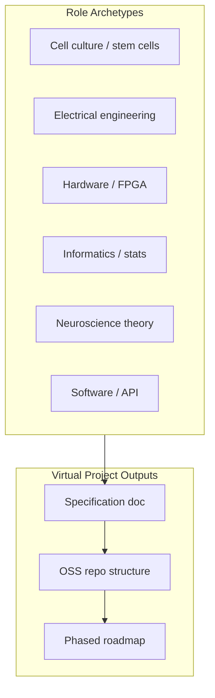

# BMI, Neuroscience Virtual Project, and AI-Human Friction

## 1. Video Analysis — Clarification

**The linked video** ([Building Blocks of Memory in the Brain](https://youtu.be/X5trRLX7PQY)) is by **Artem Kirsanov** (NYU computational neuroscience Ph.D. student). It focuses on **engrams** — the physical traces of memory in the brain — not on fruit fly connectomes or Doom-playing neurons.

**Topics covered:**

- Engrams as necessary and sufficient for recall
- Neuronal excitability and memory allocation
- Distributed memory traces across brain regions
- Memory linking via overlapping engrams
- Immediate-early genes as markers

**Connection to your interests:** The video explains *how* memory is encoded at the cellular level. That foundation is relevant for BMI because:

- BMI must decode/encode neural activity that corresponds to engram-like patterns
- Understanding allocation (which neurons get recruited) informs closed-loop BMI design
- Memory linking suggests BMI could exploit associative recall for richer interfaces

**Note:** Fruit fly mapping and Doom-playing neurons are separate research streams. The video provides the memory-theory substrate; the other projects are applications.

---

## 2. Landscape: Fruit Fly Brain + Organic Brain Computers

| Domain                      | Key Projects                                | Open Source?                                |
| --------------------------- | ------------------------------------------- | ------------------------------------------- |
| **Fly brain mapping**       | Virtual Fly Brain (VFB), FlyWire connectome | Yes — VFB, FlyWire, seung-lab/FlyConnectome |
| **Fly brain simulation**    | Neurokernel, eonsystemspbc/fly-brain        | Yes — both on GitHub                        |
| **Organic brain computers** | Cortical Labs (Pong, Doom)                  | Cloud API; not fully OSS                    |

**Cortical Labs Doom (2026):**

- ~200K human neurons on microelectrode array (CL1 chip)
- Game state → electrical stimulation; spike patterns → game commands
- Reinforcement learning; outperformed DQN, A2C, PPO in learning efficiency
- Independent dev (Sean Cole) built Doom integration in ~1 week via cloud API

---

## 3. BMI Effectiveness — Meditation

**Current bottlenecks:**

- **Decoding:** Mapping neural activity to intent (motor, speech, memory recall) is still noisy and low-dimensional
- **Encoding:** Stimulation protocols are crude; we lack engram-level precision
- **Bidirectional:** Most BMI is one-way (read or write); true closed-loop is rare

**Insights from the video + projects:**

- **Engram theory** suggests BMI could target "allocation" — biasing which neurons get recruited
- **Fly connectome** provides a complete wiring diagram; we can simulate before building
- **Organic computers** show that living neurons can learn from reward; BMI could leverage similar plasticity

**Leverage points for more effective BMI:**

1. **Connectome-informed decoding** — Use FlyWire/VFB structure to constrain models
2. **Resonance with theta/oscillations** — Memory encoding fluctuates at 3–10 Hz; BMI could time interventions
3. **Associative linking** — Exploit overlapping engrams for richer, context-dependent interfaces
4. **Hybrid silicon–biological** — Cortical Labs’ cloud API model suggests modular interfaces between silicon and wetware

---

## 4. Reverse-Engineering a Virtual Project

**Cortical Labs team structure** (from public info):

- ~22 people, no duplicate specialties
- Roles: CEO (MD), CSO (PhD), CTO, CHO; cell culture, stem cells, EE, hardware, FPGA, informatics, stats
- **Pattern:** Small, multidisciplinary, each person a domain owner

**FlyWire / connectome consortium:**

- Neurobiologists, computer scientists, proofreaders
- NIH, Wellcome Trust, NSF funding
- Open data + citizen-science proofreading

**Virtual project reverse-engineering approach:**

**Concrete steps:**

1. **Role matrix** — Map Cortical Labs + FlyWire + Neurokernel contributors to a minimal viable team (e.g., 5–8 archetypes)
2. **Dependency graph** — What does each role produce that others consume? (e.g., connectome data → simulation → BMI decoder)
3. **OSS-first scaffold** — Create a meta-repo that composes Neurokernel, fly-brain, FlyWire data, and a thin BMI layer
4. **Documentation as spec** — Write a "virtual project charter" that describes goals, interfaces, and handoffs as if the team existed

---

## 5. Open-Source Repos to Evaluate

| Repo                                                                                      | Stars | Purpose                                  | Evaluation Priority    |
| ----------------------------------------------------------------------------------------- | ----- | ---------------------------------------- | ---------------------- |
| [neurokernel/neurokernel](https://github.com/neurokernel/neurokernel)                     | 564   | Full fruit fly brain emulation on GPUs   | High — core simulation |
| [eonsystemspbc/fly-brain](https://github.com/eonsystemspbc/fly-brain)                     | 213   | Fly brain LIF model, Brian2/PyTorch/NEST | High — alternative sim |
| [seung-lab/FlyConnectome](https://github.com/seung-lab/FlyConnectome)                     | —     | FlyWire connectome access                | High — data source     |
| [flyconnectome/flywire_annotations](https://github.com/flyconnectome/flywire_annotations) | —     | FlyWire supplemental data                | Medium                 |
| [virtualflybrain/vfb](https://www.virtualflybrain.org/)                                   | —     | Drosophila atlas, VFBconnect Python      | High — anatomy         |
| [PatternRecognition/OpenBMI](https://github.com/PatternRecognition/OpenBMI)               | 194   | BCI with pattern recognition             | Medium — BMI tooling   |
| [TBC-TJU/MetaBCI](https://github.com/TBC-TJU/MetaBCI)                                     | 414   | Non-invasive BCI platform                | Medium                 |
| [dbdq/neurodecode](https://github.com/dbdq/neurodecode)                                   | 44    | Real-time BMI framework                  | Medium                 |
| [RIOSMPW/OpenBMIChip](https://github.com/RIOSMPW/OpenBMIChip)                             | —     | Silicon chip for BMI                     | Lower — hardware       |

**Evaluation criteria** (for a follow-up plan):

- License compatibility (MIT, GPL-2.0, etc.)
- Activity (commits, issues, maintainers)
- Documentation and examples
- Interoperability (can Neurokernel + fly-brain + FlyWire be composed?)
- BMI relevance (decoding, stimulation, closed-loop)

---

## 6. Appropriate Friction Between AIs and Humans

**Frameworks from research + your frontier-ops-kb:**

| Domain                           | Friction Level | Rationale                                              |
| -------------------------------- | -------------- | ------------------------------------------------------ |
| **Neuroscience / BMI research**  | High           | Irreversible (living tissue), safety, dual-use         |
| **Code generation (simulation)** | Medium         | Verifiable via tests; rollback possible                |
| **Data annotation (connectome)** | Medium–High    | Quality affects downstream; human proofreading is core |
| **Literature synthesis**         | Low–Medium     | AI drafts; human validates citations and claims        |

**Principles from [frontier-ops-kb](D:\portfolio-harness\frontier-ops-kb\README.md):**

- **Calibration > prompt knowledge** — Know when AI will fail
- **Seam design** — Verifiable, recoverable, observable transitions ([seam-design.md](D:\portfolio-harness\frontier-ops-kb\operations\seam-design.md))
- **DMZ compartmentalization** — Isolate AI from sensitive systems ([dmz-compartmentalization.md](D:\portfolio-harness\frontier-ops-kb\patterns\dmz-compartmentalization.md))

**For a virtual BMI/neuroscience project:**

- **AI does:** Literature search, code scaffolding, documentation drafts, data pipeline scripts, visualization
- **Human gates:** Experimental design, ethical review, hardware decisions, interpretation of neural data, publication
- **Escalation triggers:** Novel protocols, human subject involvement, dual-use concerns, irreversible wet-lab steps

**Friction as a design parameter:**

- More friction where **calibration is low** (AI often wrong) or **stakes are high** (safety, ethics)
- Less friction where **output is easily verified** (unit tests, lint) and **reversible** (git, backups)

---

## 7. Recommended Next Steps

1. **Watch the video** — Confirm alignment with engram theory; note timestamps for memory-allocation and linking sections
2. **Run open-source evaluation** — Systematic pass over Neurokernel, fly-brain, FlyConnectome, OpenBMI (license, activity, composability)
3. **Draft virtual project charter** — One-pager: goals, role matrix, dependency graph, OSS stack ----- This will definitly require human overisight. 
4. **Map friction matrix** — For each task type in the virtual project, assign friction level and escalation triggers. We should consider multiple approaches and consider any impacts or game theory that happens as a result of it.  
5. **Connect to frontier-ops-kb** — Add a pattern or note on "BMI/neuroscience project friction" if useful

---

## References

- [Building Blocks of Memory in the Brain](https://youtu.be/X5trRLX7PQY) — Artem Kirsanov
- [Virtual Fly Brain](https://www.virtualflybrain.org/)
- [FlyWire](https://flywire.ai/)
- [Neurokernel (PLOS One)](https://journals.plos.org/plosone/article?id=10.1371/journal.pone.0146581)
- [Cortical Labs Doom](https://corticallabs.com/doom.html)
- [Human brain cells play Doom — New Scientist](https://www.newscientist.com/article/2517389-human-brain-cells-on-a-chip-learned-to-play-doom-in-a-week)
- [OpenBMI (PatternRecognition)](https://github.com/PatternRecognition/OpenBMI)
- [MetaBCI](https://github.com/TBC-TJU/MetaBCI)
- [AI Agent Human Handoff — Zylos Research](https://zylos.ai/research/2026-01-30-ai-agent-human-handoff)

