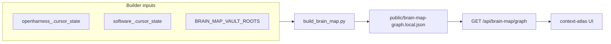

# Brain map coverage + OpenGrimoire git hygiene

## Why this matters

- **Context Atlas** reads graph JSON from `[OpenGrimoire/public/](D:/portfolio-harness/OpenGrimoire/public/)` via `[src/app/api/brain-map/graph/route.ts](D:/portfolio-harness/OpenGrimoire/src/app/api/brain-map/graph/route.ts)` (prefers `brain-map-graph.local.json`, else `brain-map-graph.json`). Coverage grows only when the **builder** ingests more roots and you **rebuild** the JSON.
- `[build_brain_map.py](D:/portfolio-harness/.cursor/scripts/build_brain_map.py)` already documents `CURSOR_STATE_DIRS`, `BRAIN_MAP_VAULT_ROOTS`, and `BRAIN_MAP_OUTPUT`. With vault roots set and `BRAIN_MAP_OUTPUT` unset, default output is `**OpenGrimoire/public/brain-map-graph.local.json`** (gitignored per `[OpenGrimoire/.gitignore](D:/portfolio-harness/OpenGrimoire/.gitignore)`).




## 1. Expand brain-map inputs (your machine)

**Multi-repo state (merge handoffs/dailies):**

- Set `CURSOR_STATE_DIRS` to semicolon-separated absolute paths to each repo’s `**.cursor/state`** directory, e.g. `D:\openharness\.cursor\state;D:\software\.cursor\state` (adjust to your layout).
- Optionally set `CURSOR_STATE_DIR_LABELS` to matching prefixes (`openharness`, `software`) so session ids do not collide (see script docstring for `resolve_state_entries`).

**Include `openharness/docs` (or a whole repo tree) as vault:**

- Set `BRAIN_MAP_VAULT_ROOTS` to a folder whose `*.md` files you want as nodes/edges (e.g. `D:\openharness\docs` or a symlink/junction that includes `docs`).
- If multiple vault roots, use `BRAIN_MAP_VAULT_LABELS` aligned by order.

**Rebuild command (from repo root):**

```text
python .cursor/scripts/build_brain_map.py
```

(or pass `--state-dir` / `--vault-root` repeatedly; see script `--help`).

**Output choice:**

- Prefer writing `**OpenGrimoire/public/brain-map-graph.local.json`** for personal merges (default when vault roots are set and `BRAIN_MAP_OUTPUT` unset), or set `BRAIN_MAP_OUTPUT` explicitly.
- Leave committed `[public/brain-map-graph.json](D:/portfolio-harness/OpenGrimoire/public/brain-map-graph.json)` as the **shared default** unless you intentionally update it for the team.

## 2. Tie docs into edges (no code)

- **Co-access** links drive edges: add wikilinks or `path/to/file.md` mentions in handoffs, dailies, or vault notes so the builder connects `openharness/docs/...` to other nodes.

## 3. Alignment context (unchanged role)

- Keep short **intent** in Supabase `alignment_context_items`; it is not a replacement for doc trees.

## 4. Git hygiene in OpenGrimoire (fix dirty `git status`)

`[OpenGrimoire/.gitignore](D:/portfolio-harness/OpenGrimoire/.gitignore)` already lists `.next`, `*.tsbuildinfo`, and `public/brain-map-graph.local.json`. If `git status` still shows **modified** files under `.next/` or `*.tsbuildinfo`, those paths are almost certainly **tracked** in history.

**Fix (run inside OpenGrimoire submodule):**

1. Confirm: `git ls-files .next` — if any files list, remove from index: `git rm -r --cached .next` (does not delete working tree).
2. Same for `tsbuildinfo` if listed: `git ls-files '*.tsbuildinfo'` then `git rm --cached <file>` if needed.
3. **Do not** commit `brain-map-graph.local.json` (already ignored).
4. For `**public/brain-map-graph.json`**: only commit when you intentionally ship an updated default graph; otherwise revert local changes or regenerate from a known baseline.

**Optional repo improvement:** add a one-line note to `[OpenGrimoire/README.md](D:/portfolio-harness/OpenGrimoire/README.md)` or `[CONTRIBUTING.md](D:/portfolio-harness/OpenGrimoire/CONTRIBUTING.md)`: “Personal graph: `brain-map-graph.local.json`; run `build_brain_map.py` with `CURSOR_STATE_DIRS` / `BRAIN_MAP_VAULT_ROOTS`.”

## 5. Future “doc KB” (out of scope)

- Full crawl of `openharness/docs` with RAG/chunking inside OpenGrimoire is **new product work**; this plan is coverage + hygiene only.

## Risk

- **Low** for docs/gitignore. **Medium** if `BRAIN_MAP_VAULT_ROOTS` points at huge trees (build time, SCP skips on injection-tier files).

