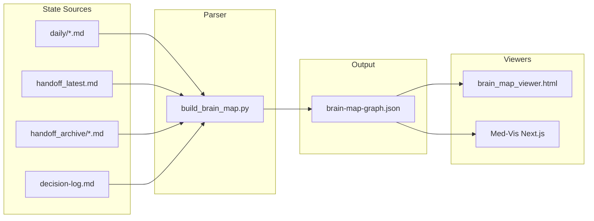

# Brain Map in Harness

## Scope

1. **Parser** — Copy and adapt `build_brain_map.py` into [D:\harness\scripts(D:\harness\scripts with env-based paths
2. **Docs** — Add [D:\harness\docs\BRAIN_MAP.md](D:\harness\docs\BRAIN_MAP.md)
3. **Skill** — Add [D:\harnesscursor\skills\brain-map-visualization\SKILL.md](D:\harness.cursor\skills\brain-map-visualization\SKILL.md)
4. **Rule** — Update [D:\harnesscursor\rules\capability-summary.mdc](D:\harness.cursor\rules\capability-summary.mdc)
5. **Standalone viewer** — Add [D:\harness\scripts\brain_map_viewer.html](D:\harness\scripts\brain_map_viewer.html) (vis-network, no Next.js)
6. **OpenHarness rename** — Document as a separate-chat task with prompt and RENAME_CHECKLIST.md

---

## 1. Parser: `scripts/build_brain_map.py`

**Source:** [D:\portfolio-harnesscursor\scripts\build_brain_map.py](D:\portfolio-harness.cursor\scripts\build_brain_map.py)

**Adaptations for Harness:**

- **Root detection:** `script_dir.parent` (Harness has `scripts/` at repo root; portfolio-harness has `.cursor/scripts/` under project)
- **State dir:** Prefer `CURSOR_STATE_DIR` env; else check `root/state` then `root/.cursor/state` (Harness uses `state/`; projects often use `.cursor/state`)
- **Output:** `BRAIN_MAP_OUTPUT` env; else `root/.cursor/state/brain-map-graph.json` or `root/state/brain-map-graph.json`
- **Path normalization:** Remove hardcoded `portfolio-harness`; strip common workspace prefixes generically (e.g. detect root from state path)
- **Med-Vis fallback:** Remove (Harness is framework-agnostic); projects can set `BRAIN_MAP_OUTPUT` to their own public dir

**Key change in `main()`:**

```python
script_dir = Path(__file__).resolve().parent
root = script_dir.parent  # Harness: scripts/ at root
state_dir = Path(os.environ.get("CURSOR_STATE_DIR", "")) or _find_state_dir(root)
output_path = Path(os.environ.get("BRAIN_MAP_OUTPUT", "")) or (state_dir / "brain-map-graph.json")
```

Helper `_find_state_dir(root)` returns `root/state` if exists, else `root/.cursor/state`.

---

## 2. Docs: `docs/BRAIN_MAP.md`

**Content:**

- Purpose: visualize agent cognition from session journals and handoffs
- Data sources: `daily/`, `handoff_latest.md`, `handoff_archive/`, `decision-log.md`
- Graph schema: nodes `{id, group, accessCount, path}`, edges `{source, target, weight, sessionType, sessions}`
- Env vars: `CURSOR_STATE_DIR`, `BRAIN_MAP_OUTPUT`
- How to run: `python scripts/build_brain_map.py` from project root
- How to view: standalone HTML (see below) or Next.js/Med-Vis if project has it
- Link to skill and capability-summary

---

## 3. Skill: `brain-map-visualization`

**Pattern:** Follow [D:\harnesscursor\skills\docs\SKILL.md](D:\harness.cursor\skills\docs\SKILL.md) frontmatter and structure.

**Triggers:** "brain map", "cognition visualization", "session journal graph", "visualize handoffs", "note co-access graph"

**Steps:**

1. Run `python scripts/build_brain_map.py` (or `python .cursor/scripts/build_brain_map.py` if project uses .cursor layout)
2. Point user to `brain-map-graph.json` and viewer options
3. If standalone: serve `scripts/` with `python -m http.server 8080`, open `brain_map_viewer.html`

---

## 4. Rule: `capability-summary.mdc`

Add row to the harness tools table:

```
| harness | run_terminal_cmd → scripts (..., build_brain_map, brain_map_viewer.html) |
```

Or a dedicated brain-map row if preferred. Keep existing scripts listed.

---

## 5. Standalone HTML Viewer: `scripts/brain_map_viewer.html`

**Tech:** Single HTML file, vis-network from CDN (e.g. `https://cdn.jsdelivr.net/npm/vis-network@10/standalone/umd/vis-network.min.js`), no build step.

**Behavior:**

- Load `brain-map-graph.json` from same directory when opened via HTTP (e.g. `http://localhost:8080/brain_map_viewer.html`)
- Fallback: file input (drag-drop or choose) for `file://` or when JSON is elsewhere
- Map Brain Map schema to vis-network: nodes `{id, label, group}` (label = basename or path), edges `{from: source, to: target}` (vis uses `from`/`to`)
- Color nodes by `group` (core, memory, publishing, tools, skills, general) — match [BrainMapGraph.tsx](D:\portfolio-harness\Med-Vis\src\components\BrainMap\BrainMapGraph.tsx) palette
- Tooltip on hover: path, accessCount, group
- Zoom, pan, drag (vis-network default)

**CORS / file://:** Browsers block `fetch()` of local files. Options:

- **A (recommended):** Document "run `python -m http.server 8080` in scripts/ (or dir containing viewer + JSON), then open `http://localhost:8080/brain_map_viewer.html`"
- **B:** File input for user to select JSON (works without server)

Implement both: try `fetch('brain-map-graph.json')` first; on failure or empty, show "Drag JSON file here or choose file" and parse via FileReader.

---

## 6. OpenHarness Rename (Separate Chat)

**Do not implement in this plan.** Document for a new chat:

1. Create `RENAME_CHECKLIST.md` in Harness root listing: repo/folder name, files with "Harness"/"harness", package names, URLs, org refs, LICENSE, git remote
2. Run the phased prompt (Phase 1: docs, Phase 2: rules/skills, Phase 3: repo rename) with human approval per phase
3. Attach RENAME_CHECKLIST.md to final summary for traceability

**Prompt for new chat:**

```
Rename the Harness repo to OpenHarness. Follow this process:

1. **Scope** — Create RENAME_CHECKLIST.md listing: repo/folder name, all files containing "Harness"/"harness", package names, URLs, org references, LICENSE, git remote.

2. **Phase 1: Documentation** — Update README.md, docs/*.md to use "OpenHarness" as product name. Keep "harness" lowercase where it refers to the concept.

3. **Phase 2: Rules and skills** — Update .cursor/rules/*.mdc and .cursor/skills/*/SKILL.md.

4. **Phase 3: Repo rename** — Rename repo/folder if desired. Document new clone path.

5. **Do not** — Change behavior, logic, or schema.

Approve each phase before proceeding. Attach RENAME_CHECKLIST.md to the final summary.
```

---

## Data Flow




---

## File Summary


| Action | Path                                                         |
| ------ | ------------------------------------------------------------ |
| Create | `D:\harness\scripts\build_brain_map.py`                      |
| Create | `D:\harness\docs\BRAIN_MAP.md`                               |
| Create | `D:\harness\.cursor\skills\brain-map-visualization\SKILL.md` |
| Create | `D:\harness\scripts\brain_map_viewer.html`                   |
| Edit   | `D:\harness\.cursor\rules\capability-summary.mdc`            |


---

## Verification

- Run `python D:\harness\scripts\build_brain_map.py` from Harness root (or a project with state); confirm JSON written
- Open viewer via `python -m http.server 8080` in scripts/; confirm graph renders
- File-input fallback: select JSON manually; confirm graph renders
- Skill triggers on "brain map" and guides user through run + view

