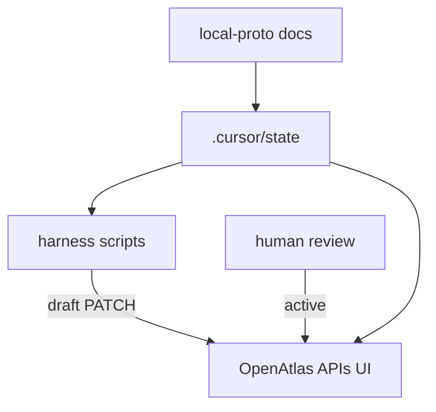

# Scope, agent-native, architect, and continual-learning synthesis

## Source of truth

Brainstorm: [D:/portfolio-harness/docs/brainstorms/2026-03-22-openatlas-intent-triage-hardware-obs.md](D:/portfolio-harness/docs/brainstorms/2026-03-22-openatlas-intent-triage-hardware-obs.md). Your inline edits resolve **automation** (Q1): alignment create/update **scripted from handoff with human review**. **NAS** (Q2): **audit + user Q&A first** before choosing OpenAtlas alignment item vs local-proto-only. **Jetson** (Q3) remains open until you decide Nano role.

---

## 1. Product-scope (requirements and acceptance)

**Requirements (numbered)**

1. Operators can relate `.cursor/state` themes to tactical intents (`alignment_context`) and strategic intents (`local-proto/docs`, especially HARDWARE and NAS scope).
2. OpenAtlas “context monitoring” has a defined **audit checklist** (brain-map build, API auth, SCP behavior, E2E)—success is verifiable, not subjective.
3. Machine-stack observation (GPU, NAS, Jetson) is **documented separately** from OpenAtlas graph health; v1 is checklist + logs, not a merged dashboard.
4. Post–v1 matrix, handoff flow may **propose** alignment drafts via automation; **human review** gates `draft` → `active` and destructive updates.

**Acceptance criteria (testable)**

| ID  | Given                                                       | When                                               | Then                                                                                                       |
| --- | ----------------------------------------------------------- | -------------------------------------------------- | ---------------------------------------------------------------------------------------------------------- |
| AC1 | A theme appears in `decision-log` or handoff                | Weekly sweep or milestone                          | Intent matrix row exists or is explicitly “deferred” with reason                                           |
| AC2 | `build_brain_map.py` runs with chosen `CURSOR_STATE_DIR(s)` | Operator opens `/context-atlas` or loads graph API | Graph reflects cited paths; SCP skips explain empty subgraphs                                              |
| AC3 | Production OpenAtlas                                        | Client calls alignment API without secret          | 401/503 per [ALIGNMENT_CONTEXT_API.md](D:/portfolio-harness/OpenAtlas/docs/agent/ALIGNMENT_CONTEXT_API.md) |
| AC4 | Hardware on bench                                           | Operator runs v1 checklist                         | Ollama GPU, NAS path, Jetson smoke (if applicable) recorded in one place (see placement below)             |
| AC5 | Automated handoff → alignment proposal                      | Script or agent posts draft                        | Item remains `draft` until human PATCH; no silent `active`                                                 |

Optional scope note (not in brainstorm): if you want a single file for operators, add `docs/scope_openatlas_intent_triage.md` or `.cursor/state/scope_alignment_triage.md` in a **later** implementation step—only if you want harness handoff to link a stable scope URI.

---

## 2. Agent-native architecture (parity and automation)

**Parity (already strong):** Alignment is full CRUD via HTTP + CLI ([alignment-context-cli.mjs](D:/portfolio-harness/OpenAtlas/scripts/alignment-context-cli.mjs)); agents can match UI outcomes if they have the secret—see [OPENATLAS_SYSTEMS_INVENTORY](D:/portfolio-harness/OpenAtlas/docs/OPENATLAS_SYSTEMS_INVENTORY.md).

**Your chosen automation pattern**

- **Primitives:** Handoff markdown/YAML + alignment API (POST/PATCH) + existing CLI.
- **Feature as outcome:** “After handoff, alignment drafts reflect new commitments” is a **prompt + script** loop with an explicit **human approval** step—not a silent workflow tool that bundles judgment (matches agent-native “approval matches stakes”).

**Capability map (concise)**

| Outcome                | User path       | Agent path                                                                         |
| ---------------------- | --------------- | ---------------------------------------------------------------------------------- |
| Create alignment draft | Admin UI or CLI | POST `/api/alignment-context` with header                                          |
| Promote to active      | UI / PATCH      | PATCH after human confirms                                                         |
| Propose from handoff   | Manual copy     | Script reads handoff → POST draft **or** agent proposes PATCH diff for human apply |

**Gap to close in implementation (later plan):** Document the **approval seam** in one place (e.g. HANDOFF_FLOW or alignment doc): what field proves “human reviewed” (e.g. status transition only via logged-in admin or explicit CLI from operator).

---

## 3. Tech-lead / architect placement (`/openharness/architect`)

| Artifact                       | Path                                                                                                                                                                                   | Layer                                  | Rationale                                                          |
| ------------------------------ | -------------------------------------------------------------------------------------------------------------------------------------------------------------------------------------- | -------------------------------------- | ------------------------------------------------------------------ |
| Intent matrix (A)              | `[portfolio-harness/docs/](D:/portfolio-harness/docs/)` e.g. `docs/intent_matrix.md` **or** a row in `[local-proto/docs/](D:/portfolio-harness/local-proto/docs/)` if hardware-centric | Docs / operator                        | Same pattern as other brainstorms; not OpenAtlas app code          |
| v1 stack checklist             | `[local-proto/docs/](D:/portfolio-harness/local-proto/docs/)` (e.g. extend [HARDWARE.md](D:/portfolio-harness/local-proto/docs/HARDWARE.md) or `STACK_OBSERVATION_CHECKLIST.md`)       | Docs                                   | Machine health stays out of Next.js unless you add a design note   |
| Handoff → alignment script     | `[portfolio-harness/.cursor/scripts/](D:/portfolio-harness/.cursor/scripts/)`                                                                                                          | Harness automation                     | Sits beside `build_brain_map.py`; no new service boundary          |
| OpenAtlas changes (if any)     | `[OpenAtlas/](D:/portfolio-harness/OpenAtlas)`                                                                                                                                         | App                                    | Only if you add UI for review queue—defer per brainstorm non-goals |
| NAS canonical pointer decision | TBD after Q&A                                                                                                                                                                          | Alignment item **or** local-proto only | You flagged **audit + user Q&A** first; do not lock until then     |

**Conflict guard:** Do not put Prometheus/Grafana into OpenAtlas in v1; that would blur layer C (split observability) without an explicit design note.

---

## 4. Continual-learning (AGENTS.md vs brainstorm)

**Do not** bulk-copy brainstorm prose into [AGENTS.md](D:/portfolio-harness/.cursor/state/AGENTS.md) from this session.

**Eligible for AGENTS.md later** (only if the same preference repeats or you explicitly ask to log):

- Stable preference: **alignment promotion requires human review** (already aligns with portfolio `.cursorrules` human-gated autonomy).
- Stable workspace fact: **canonical triage backlog is portfolio-harness `.cursor/state`** (if not already there).

**Exclude:** One-off NAS Q&A outcomes, Jetson role, checklist filenames until stable—those belong in decision-log, handoff, or the intent matrix.

**Continual-learning workflow:** When you finalize NAS/Jetson decisions in a few sessions, run the continual-learning skill against transcripts to extract **one bullet** if the rule stabilizes.

---

## 5. Recommended next actions (for you or `/workflows:plan`)

1. **Clean up Open questions in the brainstorm** (editorial): move Q1 to **Resolved** with wording “Scripted proposal from handoff; human gates `draft` → `active`.” Leave Q2 as “Pending NAS Q&A” and Q3 until Jetson role is chosen—or ask in chat.
2. **Planning phase:** Use this scope doc as input to `/workflows:plan` for: intent matrix file, checklist doc, optional `post_handoff_alignment_draft` script stub, and E2E audit steps—**no** new OpenAtlas routes unless scope expands.

---

## Open items only you can close

- **Jetson daily note:** Yes/no once orchestrator-only role is confirmed (affects `daily/*.md` template and brain-map edges).
- **NAS canonical location:** After Q&A, pick alignment item vs local-proto-only and update matrix + [scope_nas_assistant.md](D:/portfolio-harness/local-proto/docs/scope_nas_assistant.md) cross-links.

