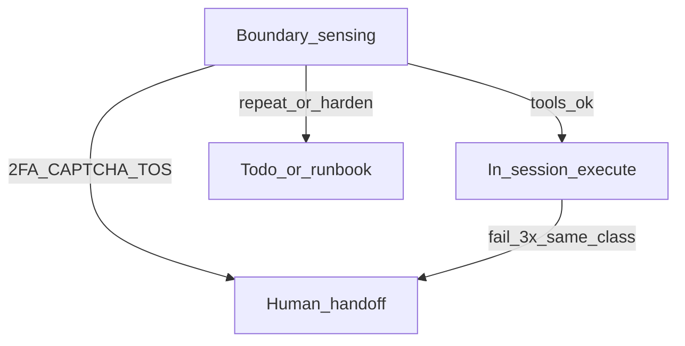

# Browser-web skill: frontier ops, handoffs, and CL4R1T4S

## Context

- **Canonical surface:** [.cursor/skills/browser-web/SKILL.md](D:/portfolio-harness/.cursor/skills/browser-web/SKILL.md) is the single browser skill ([SKILLS_OVERLAP_AUDIT](D:/portfolio-harness/.cursor/docs/SKILLS_OVERLAP_AUDIT.md) says do not add a second browser skill).
- **Playwright MCP:** Behavior is driven by **agent instructions** (skill + rules), not a custom server in this repo. Config and persistence live in [local-proto/docs/PLAYWRIGHT_MCP_CONFIG.md](D:/portfolio-harness/local-proto/docs/PLAYWRIGHT_MCP_CONFIG.md) (`npx @playwright/mcp@latest` via `audit_wrapper.py`). Forking or wrapping `@playwright/mcp` is **out of scope** unless you later need custom tools.
- **Frontier model:** [frontier-ops-kb/core-model/frontier-operations.md](D:/portfolio-harness/frontier-ops-kb/core-model/frontier-operations.md) defines five operations (boundary sensing, seam design, failure model maintenance, capability forecasting, leverage calibration)—map these to **browser automation practice**, not duplicate the full KB.
- **CL4R1T4S:** [docs/cl4r1t4s_analysis/TAXONOMY.md](D:/portfolio-harness/docs/cl4r1t4s_analysis/TAXONOMY.md) and [frontier_ops_extracts.md](D:/portfolio-harness/docs/cl4r1t4s_analysis/frontier_ops_extracts.md) already encode escalation-after-N, verification, permission gates—wire the skill to these explicitly.

## 1. Update `browser-web` SKILL.md (main change)

Add **three** structured sections (keep YAML frontmatter triggers in sync if you add keywords like `OAuth`, `export`, `download`, `2FA`, `handoff`).

### 1a. Frontier operations on the human web (mapping table)

| Operation                     | In browser-web practice                                                                                                                                                                           |
| ----------------------------- | ------------------------------------------------------------------------------------------------------------------------------------------------------------------------------------------------- |
| **Boundary sensing**          | Decide: static fetch vs browser; SPA vs API; is the goal achievable in-session (selectors, no legal/identity wall)?                                                                               |
| **Seam design**               | Where credentials, approvals, and evidence live: `credential_vault_`*, `APPROVAL_NEEDED`, `REQUEST_CREDENTIAL`, `.cursor/private/runbooks/`, snapshots/screenshots as proof.                      |
| **Failure model maintenance** | Retry ladder (already present); append **site quirks** to `.cursor/private/site-notes.md`, MCP/tool issues to `.cursor/private/known-issues.md`; link failures to pattern (flaky ref vs CAPTCHA). |
| **Capability forecasting**    | Prefer **official API / batch export** when stable; add a **runbook** when the same human-web flow will repeat; one-off exploratory browse stays in-session.                                      |
| **Leverage calibration**      | Human attention for irreducible seams (2FA, CAPTCHA, ToS-sensitive); agent for repeatable navigation + verification.                                                                              |

Reference links (relative paths from skill): [frontier-operations.md](../../frontier-ops-kb/core-model/frontier-operations.md), [seam-design.md](../../frontier-ops-kb/operations/seam-design.md), [cl4r1t4s README](../../docs/cl4r1t4s_analysis/README.md), [TAXONOMY.md](../../docs/cl4r1t4s_analysis/TAXONOMY.md).

### 1b. Scope and handoff matrix (delineation)

Add an explicit **three-way** table so agents do not over-build:

| Track               | When                                                                                                                                           | Action                                                                                                           |
| ------------------- | ---------------------------------------------------------------------------------------------------------------------------------------------- | ---------------------------------------------------------------------------------------------------------------- |
| **In-session**      | Goal clear; tools sufficient; within retry ladder (max 3 per CL4R1T4S for same failure class); no legal/secret wall                            | Execute: navigate → Browser Ready → interact → verify (snapshot / download / text).                              |
| **Todo / deferred** | Multi-session work (storage-state setup, new runbook), selector hardening, visual regression baseline, repeating site not yet in `site-notes`  | Record in project todo / plan; optionally `.cursor/state/decision-log.md` one-liner for “browser seam expanded”. |
| **Human now**       | OAuth device flow, SMS/email magic link, 2FA, CAPTCHA, “prove you’re human”, account recovery, paywall/legal attestation, heavy bot protection | `REQUEST_HUMAN` / stop; document **blocked step** and what evidence was captured.                                |

Tie **credential seam** and **approval boundary** (already in skill) to the **Seam design** row so nothing contradicts [TOOL_SAFEGUARDS](D:/portfolio-harness/local-proto/docs/TOOL_SAFEGUARDS.md) patterns.

### 1c. Human web surface map (your taxonomy)

Condense your bullet list into a **single reference table** (category → typical tools/patterns → handoff default), e.g.:

- Auth-bound / OAuth / 2FA → often **human now** for second factor; vault + in-session for password-only.
- Exports (PDF/CSV) → in-session + download wait; **provenance** if content feeds LLM (hash + URL per existing harness docs).
- Observation (trace, a11y, console, network) → **browser-review-protocol** for structured reports; in-session for quick checks.
- RPA / portals → in-session until CAPTCHA or unknown wizard depth → then todo (runbook) or human.
- **When not Playwright:** stable API, high volume, or bot wall → table row pointing to HTTP/Scrapling/alternatives (align with [DIGITAL_WORLD_INTERFACE.md](D:/portfolio-harness/.cursor/docs/DIGITAL_WORLD_INTERFACE.md) tool routing).

### 1d. CL4R1T4S alignment (short)

One subsection: **bounded retries** (align with existing retry ladder: max 3 then escalate), **verify before done** (snapshot/download success), **permission gates** (credentials). Point to `/portfolio-harness` or workspace path for `cl4r1t4s` command usage as “load taxonomy + frontier extracts when designing new browser seams.”

### 1e. Optional frontmatter tweaks

Extend `exit_criteria` or `description` to mention **handoff** when boundary sensed as human-only, so routing models pick the skill for “web goal” without over-committing.

## 2. Light updates to companion docs (avoid duplication)

- **[.cursor/docs/DIGITAL_WORLD_INTERFACE.md](D:/portfolio-harness/.cursor/docs/DIGITAL_WORLD_INTERFACE.md):** Add a short **“Frontier ops & handoff”** subsection with a link to the new skill sections (keep Browser Ready Pattern as-is; no full duplicate tables).
- **[local-proto/docs/PLAYWRIGHT_MCP_CONFIG.md](D:/portfolio-harness/local-proto/docs/PLAYWRIGHT_MCP_CONFIG.md):** Add **“Agent behavior vs MCP config”**: persistence flags are config; **goals, handoffs, and retries** live in `browser-web` + frontier-ops KB. One paragraph + links.

## 3. Explicit non-goals

- **Do not** fork or reimplement `@playwright/mcp` unless a future task needs custom tools (e.g. wrapped download hooks)—out of scope here.
- **Do not** duplicate full CL4R1T4S or frontier KB text in the skill—link and map only.

## 4. Verification (after implementation)

- Read-through: no conflict with [browser-ready.mdc](D:/portfolio-harness/.cursor/rules/browser-ready.mdc) or credential rules.
- Optional: one-line in [.cursor/state/decision-log.md](D:/portfolio-harness/.cursor/state/decision-log.md) if your harness requires architectural notes for “browser seam + frontier ops”.

