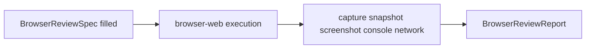

# Standard browser review protocol (skill + hooks)

## Goal

Turn “review the frontend” into a **repeatable script**: fixed context (URL, auth, viewports), 3–5 flows with expected outcomes, and mandatory evidence (snapshot, screenshot on critical screens, console, failed network).

## Canonical location

Primary home: **[portfolio-harness](D:\portfolio-harness)** — same place as `[.cursor/skills/browser-web/SKILL.md](D:\portfolio-harness\.cursor\skills\browser-web\SKILL.md)` and `[.cursor/skills/qa-verifier/SKILL.md](D:\portfolio-harness\.cursor\skills\qa-verifier\SKILL.md)`. If you later want the same artifact under `D:\software`, add a short doc there that links to the harness skill (avoid drifting two full copies).

## Deliverable shape: skill-first

**New file:** `.cursor/skills/browser-review-protocol/SKILL.md`

- **YAML frontmatter:** `name`, `description`, `triggers_any` (e.g. review frontend, smoke UI, manual browser QA, verify UI), `composes_with: [browser-web, qa-verifier]`, `exit_criteria` (PASS/FAIL per flow + evidence attached), `output_schema` (structured report below).
- **Section 1 — When to load:** Any frontend change, PR UI review, or “does the UI work” after implementation. Compose with **browser-web** for execution (Browser Ready Pattern, `browser_resize`, navigate/wait/snapshot) and **qa-verifier** for pass/fail reporting.
- **Section 2 — Task author template (copy-paste):** Markdown block the human or planner fills *before* review:

```markdown
## BrowserReviewSpec
- **Base URL:** 
- **Route(s):** 
- **Auth:** test account / bypass / none (where creds live: vault / env / doc)
- **Viewports:** e.g. 375x667 (mobile), 1280x720 (desktop); add one if tablet matters
- **Flows (3–5):**
  1. … → **Expected:** …
  2. …
- **Critical screens** (snapshot + screenshot each): …
```

- **Section 3 — Executor checklist (agent):** Ordered steps:
  1. Resolve URL (local: [PORT_REGISTRY](D:\portfolio-harness\docs\PORT_REGISTRY.md) / `ports.json` per browser-web).
  2. For each viewport: `browser_resize` → navigate → Browser Ready Pattern → per-flow actions.
  3. After each critical screen: `browser_snapshot` then `browser_take_screenshot` (snapshot first, per browser-web).
  4. `browser_console_messages` (errors/warnings summary in report).
  5. `browser_network_requests` — list failed (4xx/5xx, blocked, CORS) with URL + status.
  6. Emit **BrowserReviewReport**: table Flow | Result | Notes; attachments referenced by filename/path; blockers (auth, env).
- **Section 4 — Tool map (cursor-ide-browser):** One line each: resize, navigate, wait, snapshot, screenshot, console, network — so subagents do not guess.

Optional **thin doc** (only if you want discoverability outside skills): `[.cursor/docs/BROWSER_REVIEW_PROTOCOL.md](D:\portfolio-harness\.cursor\docs\BROWSER_REVIEW_PROTOCOL.md)` = link + same template + “see SKILL for full checklist” (~40 lines). Otherwise the skill alone is enough.

## Integration edits (small)


| File                                                                                          | Change                                                                                                                                                                              |
| --------------------------------------------------------------------------------------------- | ----------------------------------------------------------------------------------------------------------------------------------------------------------------------------------- |
| `[.cursor/rules/role-routing.mdc](D:\portfolio-harness\.cursor\rules\role-routing.mdc)`       | Add branch **after** `frontend-a2ui` (e.g. `4m`): “structured frontend review / smoke / manual UI verification” → load **browser-review-protocol** (and browser-web for execution). |
| `[browser-web/SKILL.md](D:\portfolio-harness\.cursor\skills\browser-web\SKILL.md)`            | “Composes with” + one line: structured reviews → follow browser-review-protocol template + report.                                                                                  |
| `[qa-verifier/SKILL.md](D:\portfolio-harness\.cursor\skills\qa-verifier\SKILL.md)`            | In verification matrix, add row: **manual browser UI** → browser-review-protocol + runtime evidence; pointer to BRAIN_MAP_E2E as example instance.                                  |
| `[.cursor/docs/AGENT_ENTRY_INDEX.md](D:\portfolio-harness\.cursor\docs\AGENT_ENTRY_INDEX.md)` | One bullet under verification / frontend if the index has a suitable section.                                                                                                       |


**openharness:** If you keep skills mirrored, repeat the same skill file + routing tweak in [D:\openharness](D:\openharness) only if you use that repo standalone; otherwise a single canonical copy in portfolio-harness is enough.

## Flow (mermaid)




## Risk

**Low** (docs/skills only). Rollback: delete new skill and revert routing cross-links.

## Out of scope (unless you ask)

- Playwright/BrowserStack automation scripts (different artifact; protocol is manual/agent-MCP).
- Storing secrets in the spec (reference vault/env only).

