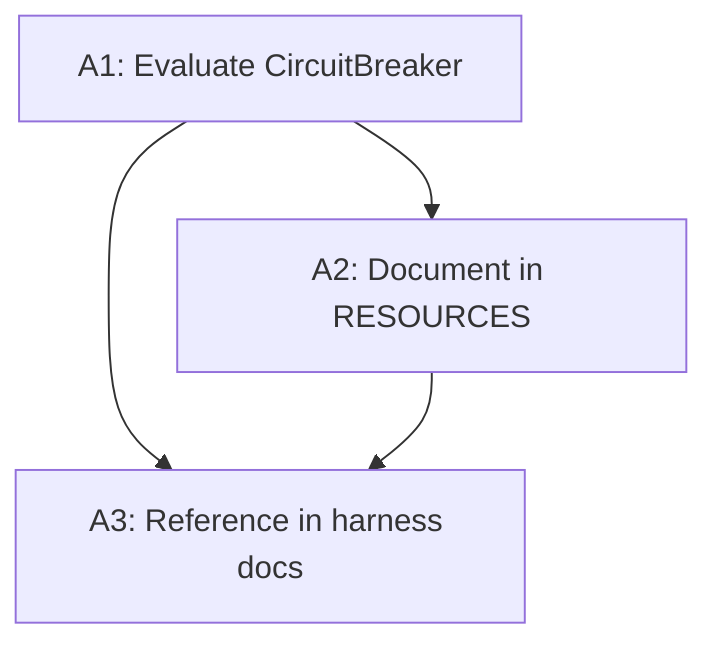

# CircuitBreaker Action Items — Feature Evaluation Playbook Output

Per [feature_evaluation_playbook.plan.md](D:\portfolio-harness\plans\feature_evaluation_playbook.plan.md). Target: portfolio-harness / local-proto / local-first. Constraint: CircuitBreaker is NOT local-first; it is complementary infra visibility for Proxmox.

---

## 1. Product-Scope (Success Criteria per Action)

| Action                                          | Success Criteria                                                                                                                                                                                                                                                                                                       | For Whom                                                         |
| ----------------------------------------------- | ---------------------------------------------------------------------------------------------------------------------------------------------------------------------------------------------------------------------------------------------------------------------------------------------------------------------- | ---------------------------------------------------------------- |
| **A1: Evaluate CircuitBreaker adoption**        | Decision documented: adopt / defer / reject with rationale. If adopt: install path, integration points, and constraints captured.                                                                                                                                                                                      | Proxmox homelab operators; portfolio-harness users running infra |
| **A2: Document CircuitBreaker in RESOURCES.md** | New section in [D:\local-first\RESOURCES.md](D:\local-first\RESOURCES.md) (e.g. "Infra / Homelab") with CircuitBreaker entry. Explicit note: NOT local-first sync; complementary Proxmox/IPAM visualization.                                                                                                           | Local-first readers; Proxmox users who land on local-first       |
| **A3: Reference in DevOps/harness docs**        | CircuitBreaker discoverable from AGENT_ENTRY_INDEX or docker-mcp skill when user asks about Proxmox visibility. Optional: one-line in [docker-mcp SKILL](D:\portfolio-harness.cursor\skills\docker-mcp\SKILL.md) "Additional resources" or [AGENT_ENTRY_INDEX](D:\portfolio-harness.cursor\docs\AGENT_ENTRY_INDEX.md). | Agents and humans doing Proxmox/DevOps tasks                     |

---

## 2. Gap Analysis Matrix

| Action | What Exists                                                                                                                                                                                                                                                                                                                                                                       | What We Need                                                                                               | Recommendation                                                                     |
| ------ | --------------------------------------------------------------------------------------------------------------------------------------------------------------------------------------------------------------------------------------------------------------------------------------------------------------------------------------------------------------------------------- | ---------------------------------------------------------------------------------------------------------- | ---------------------------------------------------------------------------------- |
| **A1** | Proxmox mentioned in [role-routing](D:\portfolio-harness.cursor\rules\role-routing.mdc), [.cursorrules](D:\portfolio-harness.cursorrules) (Flask, VLAN), [docker-mcp SKILL](D:\portfolio-harness.cursor\skills\docker-mcp\SKILL.md). No infra visualization tool. [HARDWARE.md](D:\portfolio-harness\local-proto\docs\HARDWARE.md) describes 1060 + Jetson topology, not Proxmox. | Evaluation doc: fit for Proxmox, install path, integration with local-proto/harness. No code overlap.      | **New** — no existing CircuitBreaker or equivalent.                                |
| **A2** | [RESOURCES.md](D:\local-first\RESOURCES.md) has Sync Engines, Tools, P2P, Exemplar Apps, AI+Security, Community, Learning, Other. No "Infra / Homelab" section. No CircuitBreaker.                                                                                                                                                                                                | New section + row. Clarify "complementary, not sync engine."                                               | **Adapt** — add section; follow existing table format.                             |
| **A3** | [AGENT_ENTRY_INDEX](D:\portfolio-harness.cursor\docs\AGENT_ENTRY_INDEX.md) has 60+ entries; no Proxmox visibility / homelab mapping. [docker-mcp SKILL](D:\portfolio-harness.cursor\skills\docker-mcp\SKILL.md) has "Additional resources" (Watchtower scope, Watchtower docs).                                                                                                   | One entry or one-line reference so agents/humans find CircuitBreaker when asking about Proxmox visibility. | **Reuse** — add row to AGENT_ENTRY_INDEX; optionally extend docker-mcp references. |

**Refactor-reuse:** No overlapping CircuitBreaker implementation. Documentation-only changes. Reuse existing RESOURCES table schema and AGENT_ENTRY_INDEX row format.

---

## 3. WBS (Work Breakdown Structure)

| Step | Task                                                                                                                                                                                    | Depends On   | Parallel? | Est. |
| ---- | --------------------------------------------------------------------------------------------------------------------------------------------------------------------------------------- | ------------ | --------- | ---- |
| 1    | **A1.1** Draft evaluation: fit (Proxmox, local-proto), install path, constraints. Output: inline or `state/scope_circuitbreaker_eval.md`                                                | —            | —         | <1h  |
| 2    | **A1.2** Value assessment for A1 (build/defer/reject). Log decision to decision-log if adopt or reject                                                                                  | 1            | —         | <30m |
| 3    | **A2.1** Add "Infra / Homelab" section to [RESOURCES.md](D:\local-first\RESOURCES.md) with CircuitBreaker row. Include: URL, description, "NOT local-first; complementary Proxmox/IPAM" | 2 (if build) | —         | <30m |
| 4    | **A3.1** Add AGENT_ENTRY_INDEX row: "Proxmox homelab visibility" → CircuitBreaker (or link to RESOURCES section)                                                                        | 3            | —         | <15m |
| 5    | **A3.2** (Optional) Add one-line to docker-mcp SKILL "Additional resources" referencing CircuitBreaker for Proxmox topology                                                             | 4            | —         | <15m |

**Dependencies:** A2 and A3 depend on A1 decision (build). If A1 = defer/reject, skip A2/A3 or log to backlog.

---

## 4. Value Assessment

| Action | Impact     | Effort  | Decision  | Rationale                                                           |
| ------ | ---------- | ------- | --------- | ------------------------------------------------------------------- |
| **A1** | 2 (Medium) | 1 (Low) | **Build** | Proxmox users get clarity; eval is doc-only, <1h.                   |
| **A2** | 2 (Medium) | 1 (Low) | **Build** | Prevents misclassification as local-first; small doc edit.          |
| **A3** | 1 (Low)    | 1 (Low) | **Defer** | Nice-to-have; build only if A1/A2 done and no higher-priority work. |

**Tie-breaker:** A3 is defer by rubric (Impact=1). Reassess in next planning cycle.

---

## 5. Dependencies and Blockers

| Dependency                                  | Blocker? | Notes                                               |
| ------------------------------------------- | -------- | --------------------------------------------------- |
| CircuitBreaker (BlkLeg) repo accessible     | No       | Public GitHub                                       |
| local-first RESOURCES.md writable           | No       | In workspace                                        |
| portfolio-harness plans submodule           | No       | Plans in portfolio-harness or software              |
| Proxmox cluster available for A1 validation | Optional | Eval can be doc-only; live test improves confidence |

**External:** None. All artifacts are docs/markdown.

---

## 6. Implementation Order (If Approved)

1. Execute A1 (evaluation + value assessment).
2. If A1 = **build**: Execute A2 (RESOURCES.md).
3. If capacity: Execute A3.1 (AGENT_ENTRY_INDEX). A3.2 optional.

---

## 7. Output Artifacts

| Artifact               | Path                                                                                                          |
| ---------------------- | ------------------------------------------------------------------------------------------------------------- |
| Scope / evaluation     | `.cursor/state/scope_circuitbreaker_eval.md` or inline in plan                                                |
| RESOURCES.md edit      | [D:\local-first\RESOURCES.md](D:\local-first\RESOURCES.md) — new section                                      |
| AGENT_ENTRY_INDEX edit | [D:\portfolio-harnesscursor\docs\AGENT_ENTRY_INDEX.md](D:\portfolio-harness.cursor\docs\AGENT_ENTRY_INDEX.md) |
| Decision log           | `.cursor/state/decision-log.md` (if adopt/reject)                                                             |

---

## 8. Approval Gate

**Before implementing:** Confirm A1 (build) and A2 (build). A3 can remain deferred.