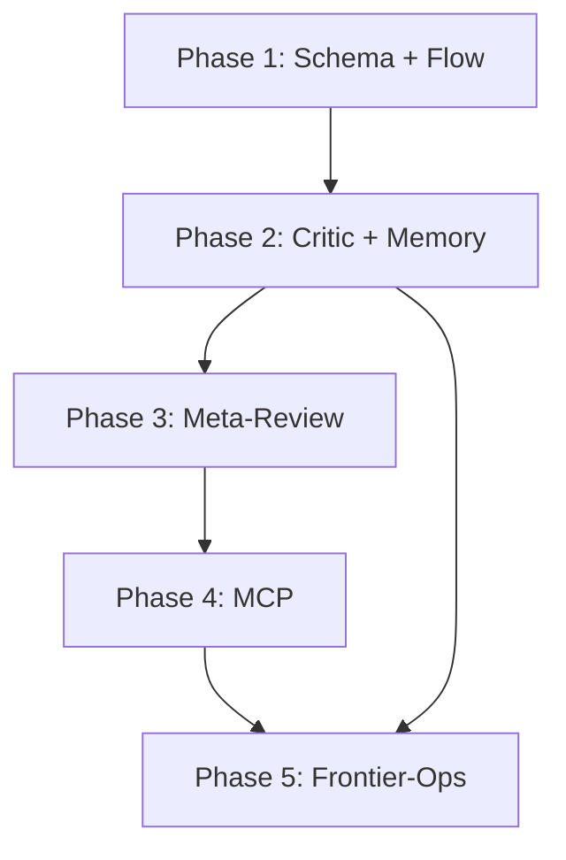

# Constraint Library Upgrade Plan

Upgrade the harness so rejections become **actionable constraints** that compound over time, per the video thesis: "Your rejections are more valuable than your prompts."

---

## Current State


| Component            | Location                                                                                                                    | Gap                                                                           |
| -------------------- | --------------------------------------------------------------------------------------------------------------------------- | ----------------------------------------------------------------------------- |
| rejection_log schema | [.cursor/state/schemas/rejection_log.v1.json](D:\portfolio-harness.cursor\state\schemas\rejection_log.v1.json)              | Only `rejected`, `reason`, `date`; no constraint, domain, or pattern          |
| Log-This flow        | [.cursorrules](D:\portfolio-harness.cursorrules) L311-312, [state/README](D:\portfolio-harness.cursor\state\README.md) L259 | Asks "Log this?" but does not prompt for usable constraint                    |
| Critic loop          | [critic-loop-gate.mdc](c:\Users\schum.cursor\rules\critic-loop-gate.mdc)                                                    | Produces pass/score/issues/fixes; failures not captured to rejection_log      |
| Memory load          | [AGENT_ENTRY_INDEX](D:\portfolio-harness.cursor\docs\AGENT_ENTRY_INDEX.md) L83                                              | "rejection_log (if proposing similar work)" — narrow; no domain-based loading |
| Meta-review          | [meta-review SKILL](D:\portfolio-harness.cursor\skills\meta-review\SKILL.md)                                                | No rejection_log pattern analysis                                             |


---

## Phase 1: Schema and Flow (Foundation)

### 1.1 Upgrade rejection_log schema

**File:** [.cursor/state/schemas/rejection_log.v1.json](D:\portfolio-harness.cursor\state\schemas\rejection_log.v1.json)

Add optional fields (backward compatible; existing entries remain valid):

```json
"constraint": { "type": "string", "description": "What the AI should do instead (usable rule)" },
"domain": { "type": "string", "description": "code|docs|strategy|security|workflow_ui|config" },
"pattern": { "type": "string", "description": "Recurring type: buried_thesis|commodity_framing|missing_business_logic|missing_so_what|etc" }
```

**Version:** Bump to `1.1` or keep `1.0` with additive-only changes (schema allows additionalProperties).

**Migration:** Existing [rejection_log.json](D:\portfolio-harness.cursor\state\rejection_log.json) has empty `rejections: []`; no migration needed.

### 1.2 Improve "Log This?" flow in .cursorrules

**File:** [.cursorrules](D:\portfolio-harness.cursorrules) (Documentation & Memory section, ~L311)

**Current:** "When the user corrects or rejects, ask 'Log this for future sessions?' If yes, append to preferences (preference) or rejection_log (rejection) per schema."

**Change:** Add articulation prompt:

> When the user corrects or rejects, ask: "Log this for future sessions?" If yes, append to preferences (preference) or rejection_log (rejection) per schema. **For rejections, ask: "What constraint should the AI follow next time?"** — e.g. "Always lead with provocation, not buried thesis" — instead of only a reason. Capture both `reason` and `constraint` in rejection_log.

### 1.3 Update state/README rejection_log section

**File:** [.cursor/state/README.md](D:\portfolio-harness.cursor\state\README.md) L251-259

- Document new schema fields: `constraint`, `domain`, `pattern`
- Update Flow text to match the articulation prompt
- Update rejection_log.md schema example to include optional constraint/domain/pattern

---

## Phase 2: Critic and Memory Integration

### 2.1 Connect critic failures to rejection_log

**Constraint:** The critic-loop-gate is a global Cursor rule; it cannot write files. The agent must perform the capture.

**Approach:** Add a rule or instruction (in agent-facing docs or critic-loop-gate) that when the agent produces critic JSON with `pass=false` or `score` below threshold, the agent should:

1. Offer to append a constraint to rejection_log: "Log this critic failure as a constraint? If yes, specify: constraint (what to do instead), domain (docs|code|workflow_ui), optional pattern."
2. If human accepts, append to rejection_log with `rejected` = brief description of what failed, `reason` = from issues, `constraint` = from fixes or human-supplied, `domain` = from critic domain, `date` = today.

**File:** Either extend [critic-loop-gate.mdc](c:\Users\schum.cursor\rules\critic-loop-gate.mdc) (if editable from harness) or add to [.cursor/docs/USER_GUIDE_AGENT_FEATURES.md](D:\portfolio-harness.cursor\docs\USER_GUIDE_AGENT_FEATURES.md) or a new `.cursor/docs/CRITIC_CONSTRAINT_CAPTURE.md`.

**Note:** critic-loop-gate lives in `c:\Users\schum\.cursor\rules\` (global). Harness cannot modify it directly. Add capture instructions to harness docs (e.g. AGENT_ENTRY_INDEX or a new doc) so agents know to offer constraint capture when critic fails.

### 2.2 Load constraints by domain

**File:** [.cursor/docs/AGENT_ENTRY_INDEX.md](D:\portfolio-harness.cursor\docs\AGENT_ENTRY_INDEX.md)

**Current memory load order (L79-84):**

```text
5. rejection_log.md (if proposing similar work)
```

**Change:**

- Replace with: "5. rejection_log / constraints for domain X (if task involves code, docs, security, etc.)"
- Add instruction: "When task involves a specific domain (code, docs, security, strategy), include relevant constraints from rejection_log filtered by domain. If rejection_log has domain field, filter by it; otherwise load full rejection_log when proposing similar work."

**File:** [.cursor/state/README.md](D:\portfolio-harness.cursor\state\README.md) — update Memory load order section to match.

**Optional script:** `.cursor/scripts/load_constraints_for_domain.ps1` — reads rejection_log.json, filters by domain, outputs markdown for session context. Agent can call this when starting a domain-specific task.

---

## Phase 3: Meta-Review Rejection Pattern Analysis

### 3.1 Add rejection pattern analysis to meta-review skill

**File:** [.cursor/skills/meta-review/SKILL.md](D:\portfolio-harness.cursor\skills\meta-review\SKILL.md)

Add new step (e.g. 3c) after step 3b:

**3c. Rejection pattern analysis (optional):** Read `.cursor/state/rejection_log.json` (or rejection_log.md). If non-empty:

- Count by domain; list by pattern
- Identify recurring violations (e.g. "missing so-what" appears 3x)
- Suggest: "Consider promoting constraint X to a rule or skill" if a constraint appears multiple times
- Include in report: "Rejection patterns: domains [code: 2, docs: 1] | top patterns: [missing_so_what, buried_thesis]"

Update output_schema to mention "rejection pattern summary" when rejection_log has data.

---

## Phase 4: Constraint Library MCP (Optional)

### 4.1 Create constraint_library MCP server

**Location:** [local-proto/scripts/constraint_library_mcp.py](D:\portfolio-harness\local-proto\scripts\constraint_library_mcp.py) (new file)

**Pattern:** Follow [credential_vault_mcp.py](D:\portfolio-harness\local-proto\scripts\credential_vault_mcp.py) — FastMCP, stdio transport.

**Tools:**


| Tool                                                                      | Purpose                                                              |
| ------------------------------------------------------------------------- | -------------------------------------------------------------------- |
| `constraint_library_list(domain?: str)`                                   | List constraints; optional filter by domain. Returns JSON array.     |
| `constraint_library_get(id: str)`                                         | Get full constraint by id (index or id if we add ids).               |
| `constraint_library_add(rejected, reason, constraint, domain?, pattern?)` | Append (requires human approval per TOOL_SAFEGUARDS; document gate). |


**Data source:** Read/write [.cursor/state/rejection_log.json](D:\portfolio-harness.cursor\state\rejection_log.json). Resolve path relative to workspace root (portfolio-harness or software).

**Human gate:** `constraint_library_add` should require APPROVAL_NEEDED (document in TOOL_SAFEGUARDS; server executes when called). Same pattern as credential_vault create/update.

**Defer:** `check_output(output, domain)` — heuristic pattern matching is complex; defer to later iteration.

---

## Phase 5: Frontier-Ops Alignment

### 5.1 Document rejection as calibration signal

**File:** [frontier-ops-kb/core-model/calibration.md](D:\portfolio-harness\frontier-ops-kb\core-model\calibration.md)

Add section:

**Rejection as calibration signal:** Each human rejection of AI output refines the boundary of the capability bubble. Rejections that are articulated and encoded (constraint, domain, pattern) become verification infrastructure. See [.cursor/state/rejection_log](D:\portfolio-harness.cursor\state\README.md) and constraint library.

**File:** [frontier-ops-kb/README.md](D:\portfolio-harness\frontier-ops-kb\README.md) — add row to "If you are" table: "Scaling rejection as calibration" → link to calibration.md and/or new constraint-library doc.

---

## Implementation Order




---

## Files to Modify


| Phase | File                                            | Change                                          |
| ----- | ----------------------------------------------- | ----------------------------------------------- |
| 1.1   | `.cursor/state/schemas/rejection_log.v1.json`   | Add constraint, domain, pattern                 |
| 1.2   | `.cursorrules`                                  | Articulation prompt in Log-This flow            |
| 1.3   | `.cursor/state/README.md`                       | rejection_log schema + flow docs                |
| 2.1   | `.cursor/docs/AGENT_ENTRY_INDEX.md` or new      | Critic failure → constraint capture instruction |
| 2.2   | `.cursor/docs/AGENT_ENTRY_INDEX.md`             | Memory load: domain-based constraints           |
| 2.2   | `.cursor/state/README.md`                       | Memory load order update                        |
| 3.1   | `.cursor/skills/meta-review/SKILL.md`           | Step 3c rejection pattern analysis              |
| 4.1   | `local-proto/scripts/constraint_library_mcp.py` | New MCP server                                  |
| 4.1   | `local-proto/docs/TOOL_SAFEGUARDS.md`           | Document constraint_library_add gate            |
| 5.1   | `frontier-ops-kb/core-model/calibration.md`     | Rejection as calibration                        |
| 5.1   | `frontier-ops-kb/README.md`                     | Table row                                       |


---

## Out of Scope (Defer)

- `check_output(output, domain)` — pattern-matching heuristic
- Automatic critic → rejection_log without human approval (human gate)
- Migrating existing preferences into constraint format

---

## Verification

- Schema: `rejection_log.json` validates against updated schema with new optional fields
- Flow: Agent asks "What constraint?" when rejecting; logs constraint + domain
- Critic: When pass=false, agent offers to capture constraint
- Meta-review: Report includes rejection pattern summary when rejection_log has entries
- MCP: `constraint_library_list(domain="docs")` returns filtered constraints

