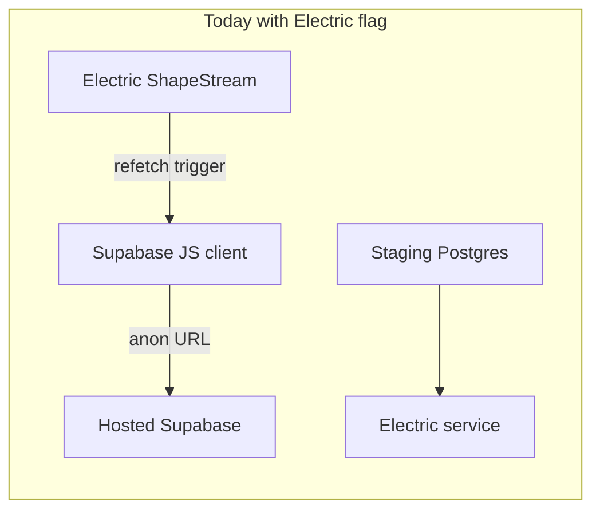

# Context database v1 intent + Electric local smoke

## Current architecture (facts)

- **Schema contract** is already split: Supabase-target migrations under [OpenGrimoire/supabase/migrations/](D:/portfolio-harness/OpenGrimoire/supabase/migrations/) and **vanilla** Postgres under [OpenGrimoire/supabase/migrations/vanilla/](D:/portfolio-harness/OpenGrimoire/supabase/migrations/vanilla/) (see [SELF_HOSTED_POSTGRES_SCHEMA.md](D:/portfolio-harness/OpenGrimoire/docs/SELF_HOSTED_POSTGRES_SCHEMA.md)).
- **“Context” in product terms** maps to:
  - `survey_responses.context_snapshot` / `intent_snapshot` / `alignment_schema_version` ([CONTEXT_INTENT_IA.md](D:/portfolio-harness/OpenGrimoire/docs/CONTEXT_INTENT_IA.md)).
  - `alignment_context_items` for operator notes ([vanilla migration 004](D:/portfolio-harness/OpenGrimoire/supabase/migrations/vanilla/004_alignment_context_items.sql), [alignment-context/db.ts](D:/portfolio-harness/OpenGrimoire/src/lib/alignment-context/db.ts)).
- **App still uses Supabase** for survey POST and visualization reads: [survey/route.ts](D:/portfolio-harness/OpenGrimoire/src/app/api/survey/route.ts) calls `createAttendee` / `createSurveyResponse` from [supabase/db.ts](D:/portfolio-harness/OpenGrimoire/src/lib/supabase/db.ts); visualization uses `supabase.from('survey_responses')...` in [useVisualizationData.ts](D:/portfolio-harness/OpenGrimoire/src/components/DataVisualization/shared/useVisualizationData.ts).
- **Electric** only signals **when** to refetch; [electricVizRefresh.ts](D:/portfolio-harness/OpenGrimoire/src/lib/sync/electricVizRefresh.ts) explicitly notes data still loads via Supabase until replaced.

**Implication:** Running Docker + migrations + Electric **without** pointing Supabase at the same data as the staging DB will not show staging rows in the viz (you may see mock/error depending on Supabase env). “Leaving Supabase data behind” requires a **follow-up** to read/write the vanilla DB (or a single PostgREST/Next API in front of it), not only Electric refresh.

## Phase 1 — Analyze codebases and freeze “v1 intent” (documentation)

**Scope (recommended):** portfolio-harness **OpenGrimoire** + cross-links already referenced in docs (e.g. [INTENT_ENGINEERING.md](D:/openharness/docs/INTENT_ENGINEERING.md) if present), plus [local-first STACK_MATRIX](D:/local-first/STACK_MATRIX.md) for sync choice. Optional: skim [D:/software](D:/software) `.cursor/plans` only for OpenGrimoire-related plans if you want workspace-wide alignment—avoid a full-repo scan unless you explicitly need it.

**Deliverable:** one new doc, e.g. `OpenGrimoire/docs/DATABASE_V1_INTENT.md`, containing:

1. **Purpose statement** — operator alignment context + human context/intent snapshots (what the DB is *for*, not just tables).
2. **Entity list** — tables from vanilla migrations in order: `attendees`, `survey_responses` (with `tenure_years`, JSONB snapshots), `peak_performance_definitions`, `moderation`, `alignment_context_items`, `opengrimoire_admin_users`; note RLS vs `opengrimoire_authenticated` / `opengrimoire.user_id` ([SELF_HOSTED_POSTGRES_SCHEMA.md](D:/portfolio-harness/OpenGrimoire/docs/SELF_HOSTED_POSTGRES_SCHEMA.md)).
3. **First-state semantics** — what “empty but valid” means: no rows vs seed rows for `peak_performance_definitions` (already inserted in migration), optional seed for admin UUIDs in `opengrimoire_admin_users`.
4. **Cross-reference** — link to CONTEXT_INTENT_IA, PRODUCTION_CUTOVER_RUNBOOK when migrating from Supabase.

No code change required for this phase if you only want the analysis artifact.

## Phase 2 — Local Electric-driven viz refresh (exact commands)

Run from [OpenGrimoire/](D:/portfolio-harness/OpenGrimoire):

1. `docker compose -f docker-compose.staging.yml up -d`
2. `.\scripts\apply-vanilla-migrations.ps1` (or `.sh` on Unix)
3. **Verify Electric:** `docker compose -f docker-compose.staging.yml up -d electric` and `docker logs` for the electric container (expects `ELECTRIC_INSECURE` in [docker-compose.staging.yml](D:/portfolio-harness/OpenGrimoire/docker-compose.staging.yml)).
4. In `.env.local`: `NEXT_PUBLIC_ELECTRIC_SERVICE_URL=http://127.0.0.1:3030`, `NEXT_PUBLIC_OPENGRIMOIRE_VIZ_USE_ELECTRIC=1` (see [docs/env.staging.example](D:/portfolio-harness/OpenGrimoire/docs/env.staging.example), [SELF_HOSTED_STAGING.md](D:/portfolio-harness/OpenGrimoire/docs/SELF_HOSTED_STAGING.md)).
5. `npm run dev` and open the visualization route; confirm **Electric subscription** (no Supabase Realtime path when `shouldUseElectricVizRealtime()` is true).

**Expectation:** refresh path uses Electric; **row content** still depends on Supabase unless you also point Supabase env at a project that holds the same data or complete Phase 3.

## Phase 3 — Leave Supabase data behind (engineering, not in Phase 1 doc only)

To align visualization (and eventually survey POST) with **staging Postgres only**:

- **Option A:** Add server-side routes (or extend existing API) that use `pg` / `postgres.js` with `OPENGRIMOIRE_STAGING_DATABASE_URL` and replace `supabase.from` in `useVisualizationData` with `fetch('/api/...')` or a small client wrapper.
- **Option B:** Consume **Electric shape payloads** in the client for display (fewer round trips; more refactor).
- **Option C:** Deploy Supabase-compatible **PostgREST** against vanilla Postgres (larger ops surface).

**Auth:** vanilla RLS uses `opengrimoire_authenticated` and GUCs; service role or server-side connection must be documented for API routes.

## Phase 4 — Optional seed for “first state” narrative

If you want reproducible demo data on staging: add `supabase/migrations/vanilla/006_seed_demo.sql` (or a `scripts/seed-staging.sql`) with explicit insert policy—only after you approve what is safe to commit (no PII).

## Suggested order

1. Write **DATABASE_V1_INTENT.md** (Phase 1).
2. Run **Phase 2** locally and note whether viz shows real data or mock (confirms Supabase vs staging gap).
3. Schedule **Phase 3** when you are ready to drop Supabase client reads for the visualization slice.
