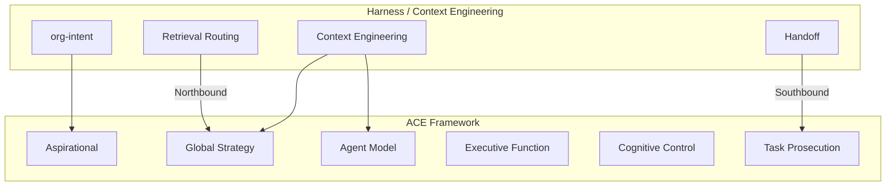

# Context Engineering Demo: Citations, ACE Block, Bitcoin Integration

## 1. Quote Citations

Add explicit source attribution for every quote and key message.

| Quote / Message                                                         | Source                                                                                                                                                                                    | Location                         |
| ----------------------------------------------------------------------- | ----------------------------------------------------------------------------------------------------------------------------------------------------------------------------------------- | -------------------------------- |
| "The same model can score 78% vs 42%..."                                | [HARNESS_ARCHITECTURE.md](D:\portfolio-harness.cursor\docs\HARNESS_ARCHITECTURE.md)                                                                                                       | Opening paragraph                |
| "Harness > model"                                                       | [HARNESS_ARCHITECTURE.md](D:\portfolio-harness.cursor\docs\HARNESS_ARCHITECTURE.md)                                                                                                       | §Philosophy                      |
| "Route, don't dump"                                                     | [AI_USAGE_ENGINEERING.md](D:\portfolio-harness.cursor\docs\AI_USAGE_ENGINEERING.md) §Retrieval Routing; [CONTEXT_ENGINEERING.md](D:\portfolio-harness.cursor\docs\CONTEXT_ENGINEERING.md) | Rule: "Route, don't dump"        |
| "Synapse between sessions..."                                           | [HANDOFF_FLOW.md](D:\portfolio-harness.cursor\HANDOFF_FLOW.md)                                                                                                                            | Handoff intent                   |
| Organism metaphor (Proprioception, Exteroception, Synapse, Myelination) | [AI_USAGE_ENGINEERING.md](D:\portfolio-harness.cursor\docs\AI_USAGE_ENGINEERING.md)                                                                                                       | §Organism Metaphor (table)       |
| Six context components                                                  | [CONTEXT_ENGINEERING.md](D:\portfolio-harness.cursor\docs\CONTEXT_ENGINEERING.md)                                                                                                         | §Six Context Components          |
| Retrieval routing table                                                 | [CONTEXT_ENGINEERING.md](D:\portfolio-harness.cursor\docs\CONTEXT_ENGINEERING.md)                                                                                                         | §Retrieval routing decision tree |

**Implementation:** Add a "Source:" or "Cite:" line under each block in the cheatsheet and HTML. Format: `Source: HARNESS_ARCHITECTURE.md (opening); §Philosophy`.

---

## 2. Block Evaluation and Improvements

| Block | Current gap                 | Improvement                                                                                   |
| ----- | --------------------------- | --------------------------------------------------------------------------------------------- |
| 1     | No citation                 | Add: `Cite: HARNESS_ARCHITECTURE.md`                                                          |
| 2     | No citation                 | Add: `Source: CONTEXT_ENGINEERING.md §Six Context Components`                                 |
| 3     | "Route, don't dump" uncited | Add: `Source: AI_USAGE_ENGINEERING.md §Retrieval Routing`                                     |
| 4     | Skills demos generic        | Add Bitcoin variant: "Show org-intent.bitcoin-inspired hard_boundaries" (Demo D)              |
| 5     | Handoff message uncited     | Add: `Source: HANDOFF_FLOW.md`                                                                |
| 6     | MCP demos generic           | Add Bitcoin-capable MCPs: observation_log_append, provenance (see BITCOIN_AGENT_CAPABILITIES) |
| 7     | Organism metaphor uncited   | Add: `Source: AI_USAGE_ENGINEERING.md §Organism Metaphor`                                     |

---

## 3. New Block: ACE Layer Framework and Bus Control Systems

**Placement:** Block 8 (after Wrap-Up), or optionally between Block 2 and 3 for cognitive-model flow.

**Content:**

- Embed the ACE Framework Overall Architecture graphic
- Break down the six layers (Aspirational → Global Strategy → Agent Model → Executive Function → Cognitive Control → Task Prosecution)
- Explain Southbound Bus (Control) and Northbound Bus (Telemetry)
- Map to harness: context engineering feeds **Global Strategy** (environmental context) and **Agent Model** (capabilities, memory)

**Graphic:** Copy from `C:\Users\schum\.cursor\projects\d-software\assets\...\ACE_Framework_Overall_Architecture-2e28a689-fd81-483c-8a27-8524d57b95be.png` to [docs/demo/ACE_Framework_Overall_Architecture.png](D:\portfolio-harness\docs\demo\ACE_Framework_Overall_Architecture.png). Reference in HTML as `docs/demo/ACE_Framework_Overall_Architecture.png`.

**Alternative ways to explain ACE layers and buses:**

- **Human cognition analogy:** Aspirational = values/prefrontal; Executive = planning; Task Prosecution = motor cortex; buses = ascending/descending neural pathways
- **Control vs data plane:** Southbound = commands (what to do); Northbound = feedback (what happened)
- **Context engineering mapping:** Retrieval routing = Northbound (bringing in telemetry); Handoff/skills = Southbound (issuing control); org-intent = Aspirational layer constitution

**Source:** [ACE_framework_summary.md](D:\ACE-first\ACE_Framework-main\ACE_Framework-main\CORE_DEMOS\stacey\docs\ACE_framework_summary.md); [org-intent-spec README](D:\portfolio-harness\org-intent-spec\README.md) §ACE Integration.

---

## 4. Bitcoin Integration

**Sources:** [BITCOIN_AGENT_CAPABILITIES.md](D:\portfolio-harness\docs\BITCOIN_AGENT_CAPABILITIES.md), [org-intent.bitcoin-inspired.json](D:\portfolio-harness\org-intent-spec\examples\org-intent.bitcoin-inspired.json), [CHAOS_BITCOIN_MAPPING.md](D:\portfolio-harness\docs\CHAOS_BITCOIN_MAPPING.md).

**Integration points:**

| Block          | Bitcoin addition                                                                                                                                                                       |
| -------------- | -------------------------------------------------------------------------------------------------------------------------------------------------------------------------------------- |
| 1 (Hook)       | Optional: "For Bitcoin-aligned agents, harness + org-intent = Aspirational layer constitution."                                                                                        |
| 4 (Skills)     | **Demo D:** "Show org-intent.bitcoin-inspired hard_boundaries (hb-1..hb-5)."                                                                                                           |
| 6 (MCP)        | Add row: **observation** — "Append Bitcoin observation" — `observation_log_append`; **provenance** — "Record URL provenance before trust" — `document_provenance_record`               |
| 8 (ACE)        | **Bitcoin mapping:** Aspirational = org-intent.bitcoin-inspired (mission, hard_boundaries); Input/Output API = L402, Moneydevkit; CHAOS_BITCOIN_MAPPING = failure modes → mitigations. |
| New subsection | **Bitcoin-aligned demo variant:** Use observation MCP, provenance MCP, org-intent in continue prompt; cite BITCOIN_AGENT_CAPABILITIES.                                                 |

**Optional Block 9 (Deep Dive only):** "Bitcoin-Chaos Integration" — CHAOS_BITCOIN_MAPPING table (one row), org-intent hard_boundaries, L402 vs x402 preference.

---

## 5. Files to Update

| File                                                                                                              | Changes                                                                                                               |
| ----------------------------------------------------------------------------------------------------------------- | --------------------------------------------------------------------------------------------------------------------- |
| [CONTEXT_ENGINEERING_DEMO_CHEATSHEET.md](D:\portfolio-harness.cursor\docs\CONTEXT_ENGINEERING_DEMO_CHEATSHEET.md) | Add citations per block; add Block 8 (ACE); add Bitcoin rows/variant; update timing                                   |
| [CONTEXT_ENGINEERING_TECH_DEMO_PLAN.md](D:\portfolio-harness.cursor\docs\CONTEXT_ENGINEERING_TECH_DEMO_PLAN.md)   | Add Block 8 to Phase 2; add Bitcoin demo options; add citation guidance                                               |
| [context-engineering-walkthrough.html](D:\portfolio-harness\docs\demo\context-engineering-walkthrough.html)       | Add Block 8 section with embedded image; add cite/source lines; add Bitcoin MCP row; optional Bitcoin variant callout |
| docs/demo/                                                                                                        | Copy ACE graphic; ensure HTML can reference it                                                                        |

---

## 6. Variant and Timing Updates

| Variant   | Blocks                      | Duration  |
| --------- | --------------------------- | --------- |
| Short     | 1, 2, 3, 4                  | 10 min    |
| Standard  | 1–8                         | 20–28 min |
| Deep Dive | 1–9 (+ Bitcoin-Chaos block) | 50 min    |

---

## 7. Mermaid: ACE and Context Engineering Mapping

