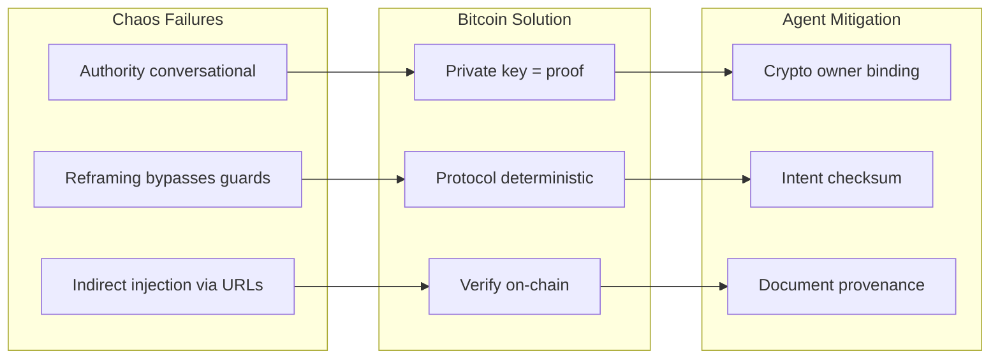

# Context Demo: Review, Dark Mode, and Bitcoin-Chaos Block

## 1. Review: dialectic-protocol, frontend-design, feature-video

### dialectic-protocol

**Current:** Defines critic rubric (intent_alignment, safety, correctness, completeness, minimality), pass rule (safety ≥ 4, correctness ≥ 4, total ≥ 18), revision rounds, disagreement protocol.

**Gaps:**

- No explicit guidance for **when to invoke critic subagent** vs self-critique. Add: "Invoke critic subagent for RAG outputs (docs, workflow UI, code) before finalizing; self-critique acceptable for small edits."
- **Revision log format** not specified for persistence. Add: "Store in `.cursor/state/critic_revision_log.jsonl` (one JSON object per line) if user requests audit trail."
- **Domain hint** is required_input but not documented. Add to skill: "domain: docs | workflow_ui | code; affects rubric weighting."

**Recommendation:** Add a "When to invoke critic subagent" subsection; document revision log path; clarify domain hint usage.

---

### frontend-design

**Current:** Design thinking (purpose, tone, constraints, differentiation); typography, color, motion, spatial composition; avoid AI slop.

**Gaps for context demo:**

- **Recording constraint** not mentioned: "When building for agent-browser recording (scroll + screenshot), prefer CSS-only animations; avoid heavy JS; ensure `prefers-reduced-motion` support."
- **Static vs interactive** trade-off: "For static demos (context-engineering-walkthrough), prioritize readability and diagram clarity over interactivity."
- **Dark mode** guidance absent. Add: "Support `prefers-color-scheme: dark` or explicit toggle; ensure diagrams (Mermaid) and tables remain readable in both modes."

**Recommendation:** Add "Recording-friendly design" and "Dark mode" subsections to the skill or a demo-specific addendum.

---

### feature-video

**Current:** Records browser flow, creates MP4/GIF from screenshots, uploads via rclone, updates PR.

**Gaps for context demo:**

- **Parse args** section asks "Is there more information that should be included?" — Yes: add **viewport size** (e.g. 1280x720 for consistent demo recording) and **scroll strategy** (scroll to each block before screenshot vs full-page).
- **Context demo specifics:** The cheatsheet has `agent-browser open ... wait 2000 ... screenshot ... scroll down 400` but no viewport lock. Add: "For context-engineering-walkthrough: `agent-browser resize 1280 720` before recording; scroll to each block (section) before screenshot."
- **Missing:** Link to [CONTEXT_ENGINEERING_DEMO_CHEATSHEET.md](D:\portfolio-harness.cursor\docs\CONTEXT_ENGINEERING_DEMO_CHEATSHEET.md) HTML Demo section for demo-specific recording flow.

**Recommendation:** Add viewport/resize guidance; add demo-specific shot list for context-engineering-walkthrough; reference cheatsheet.

---

## 2. Full Dark Mode

**Scope:** Add dark mode to [context-engineering-walkthrough.html](D:\portfolio-harness\docs\demo\context-engineering-walkthrough.html).

**Implementation:**

- Add `prefers-color-scheme: dark` media query with inverted palette:
  - `--bg: #1a1a1a`; `--fg: #e8e8e0`; `--accent: #5a9fd4`; `--accent-warm: #e07a4a`; `--table-alt: #2a2a2a`
- Add optional **toggle** (class on `body`): `.dark-mode` overrides light vars. Button: "Dark mode" / "Light mode".
- Ensure `.diagram-wrap` background and Mermaid theme work in dark mode. Mermaid `theme: 'dark'` when dark mode active.
- Update `mermaid.initialize({ theme: document.documentElement.classList.contains('dark') ? 'dark' : 'neutral' })` on toggle.

**Files:** [context-engineering-walkthrough.html](D:\portfolio-harness\docs\demo\context-engineering-walkthrough.html)

---

## 3. New Block 10: Bitcoin-Chaos Mapping and Fedimint

**Placement:** After Block 9 (ACE). Promote from Deep Dive only to **Standard variant** (optional skip for Short).

**Purpose:** Concentrate analysis on CHAOS_BITCOIN_MAPPING and how Bitcoin/Fedimint improve the AI agent ecosystem. Address limited Bitcoin coverage in current demo.

### Content

**Cite:** [CHAOS_BITCOIN_MAPPING.md](D:\portfolio-harness\docs\CHAOS_BITCOIN_MAPPING.md), [BITCOIN_AGENT_CAPABILITIES.md](D:\portfolio-harness\docs\BITCOIN_AGENT_CAPABILITIES.md), [PENTAGI_FEDIMINT_ACE_ROADMAP.md](D:\portfolio-harness\docs\PENTAGI_FEDIMINT_ACE_ROADMAP.md), [org-intent.bitcoin-inspired.json](D:\portfolio-harness\org-intent-spec\examples\org-intent.bitcoin-inspired.json)

**Key message:** "Agents of Chaos failures map to Bitcoin design patterns. Fedimint + ACE + harness = concrete path to agentic payments and capability tokens."

### Sub-sections

1. **CHAOS_BITCOIN_MAPPING table** — Embed the 4-column table (Chaos Failure | Bitcoin Solution | Agent Mitigation | Fedimint/ACE/PentAGI). Source: [CHAOS_BITCOIN_MAPPING.md](D:\portfolio-harness\docs\CHAOS_BITCOIN_MAPPING.md).
2. **How Bitcoin improves AI agent ecosystem:**
  - **Authority:** Private key = proof of ownership; no display-name authority (vs CS2, CS8, CS11).
  - **Verification:** Protocol deterministic; wording irrelevant (vs CS3 reframing).
  - **Provenance:** Don't trust external URLs; verify on-chain (vs CS10).
  - **Payments:** L402, Moneydevkit — open rails; no KYC, no chargebacks (vs ACP, x402, AP2).
3. **Fedimint + ACE integration:**
  - Fedimint BFT consensus; AuthModule capability tokens; no single operator.
  - Federation constitution = org-intent anchored on Fedimint/Bitcoin.
  - Agentic payments: Fedimint as open payment rail; capability tokens for agent spend.
4. **org-intent hard_boundaries (hb-1..hb-5)** — One-line each: hb-1 conflict→escalate; hb-2 complicity→escalate; hb-3 no trust URLs; hb-4 crypto proof for spend; hb-5 no hidden constraints.
5. **Mermaid diagram:** Chaos failure → Bitcoin solution → Agent mitigation (simplified 3-column flow for 2–3 rows).

### Mermaid: Bitcoin-Chaos-Agent flow




### Files to update


| File                                                                                                              | Changes                                                                                              |
| ----------------------------------------------------------------------------------------------------------------- | ---------------------------------------------------------------------------------------------------- |
| [context-engineering-walkthrough.html](D:\portfolio-harness\docs\demo\context-engineering-walkthrough.html)       | Add Block 10 section; CHAOS table; Bitcoin/Fedimint bullets; Mermaid diagram; dark mode CSS + toggle |
| [CONTEXT_ENGINEERING_DEMO_CHEATSHEET.md](D:\portfolio-harness.cursor\docs\CONTEXT_ENGINEERING_DEMO_CHEATSHEET.md) | Add Block 10 cheatsheet; update Variant table (Standard: 1–10); add timing                           |
| [CONTEXT_ENGINEERING_TECH_DEMO_PLAN.md](D:\portfolio-harness.cursor\docs\CONTEXT_ENGINEERING_TECH_DEMO_PLAN.md)   | Expand Block 10; add Bitcoin-Chaos to Standard variant; add feature-video demo shot list             |


---

## 4. Additional improvements

### Missing or unclear

- **Quote citations:** Add explicit "Source:" under Block 1 quote (HARNESS_ARCHITECTURE.md opening). Already partially done; verify all blocks have cite lines.
- **Handoff message citation:** "Synapse between sessions" — Source: HANDOFF_FLOW.md. Already in cheatsheet.
- **Block 6 (Handoff):** No diagram. Consider adding simple Mermaid: Session A → handoff_latest → Session B (optional).

### feature-video demo shot list for context demo

Add to cheatsheet or feature-video command:

```
1. agent-browser resize 1280 720
2. agent-browser open http://localhost:3333/context-engineering-walkthrough.html
3. agent-browser wait 2000
4. For each block 1–10: scroll to section, wait 500, screenshot tmp/screenshots/NN-blockN.png
5. ffmpeg -y -framerate 0.5 -pattern_type glob -i 'tmp/screenshots/*.png' -c:v libx264 -pix_fmt yuv420p -vf "scale=1280:-2" tmp/videos/context-demo.mp4
```

---

## 5. Implementation order

1. Add dark mode to HTML (CSS vars + toggle + Mermaid theme).
2. Add Block 10 to HTML (section, table, bullets, Mermaid).
3. Update cheatsheet (Block 10, variant table, timing).
4. Update tech demo plan (Block 10 expansion, feature-video ref).
5. (Optional) Update dialectic-protocol, frontend-design skills with review findings.
6. (Optional) Update feature-video command with demo-specific guidance.

---

## 6. Risks


| Risk                             | Mitigation                                                |
| -------------------------------- | --------------------------------------------------------- |
| Block 10 lengthens Standard demo | Make Block 10 skippable (5 min); total Standard 30–38 min |
| CHAOS table too dense            | Use abbreviated rows; link to full doc                    |
| Dark mode breaks Mermaid         | Test with `theme: 'dark'`; fallback to neutral if issues  |


