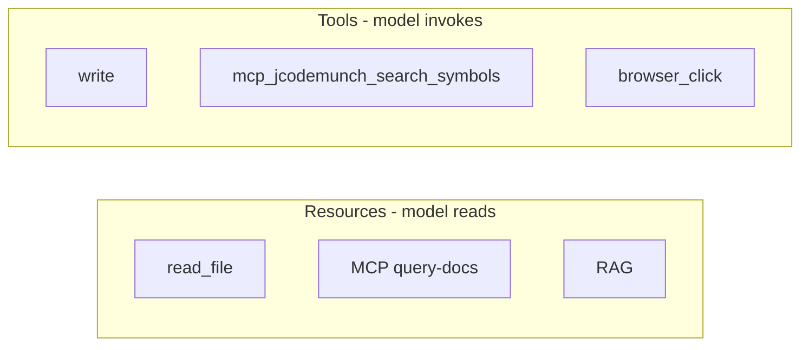
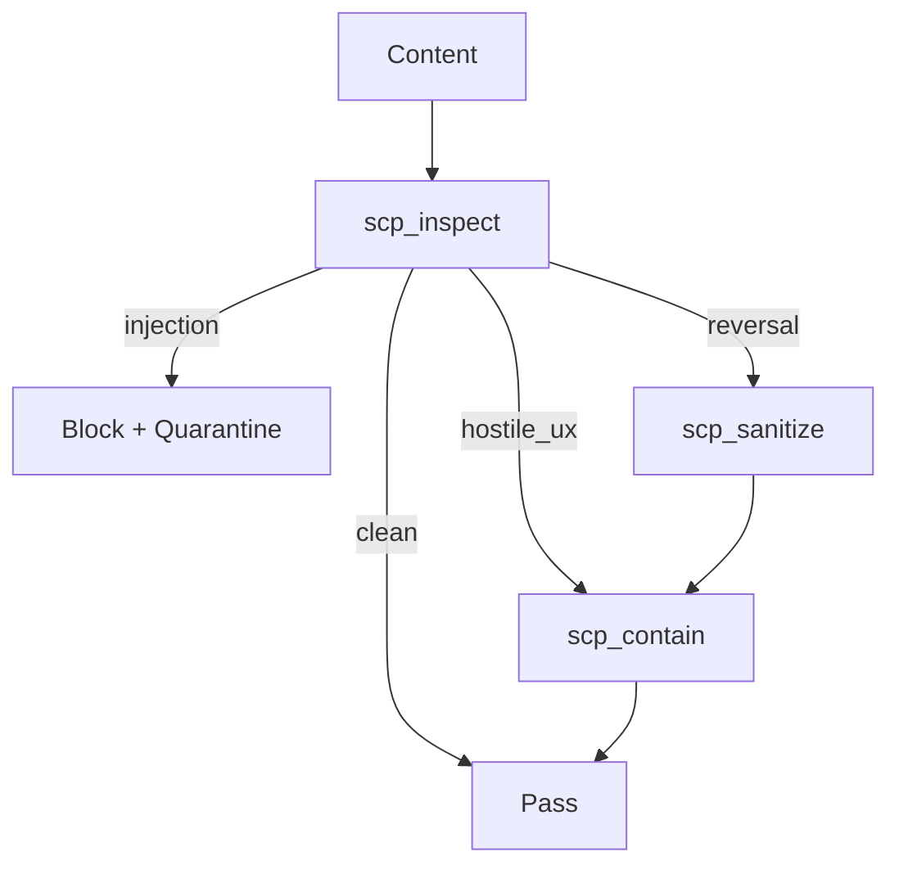
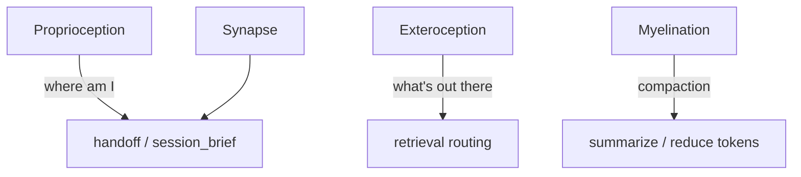

# Context Demo: Visual Representation and Clarity Improvements

## Current State

- **File:** [docs/demo/context-engineering-walkthrough.html](D:\portfolio-harness\docs\demo\context-engineering-walkthrough.html)
- **Source:** [CONTEXT_ENGINEERING_DEMO_CHEATSHEET.md](D:\portfolio-harness.cursor\docs\CONTEXT_ENGINEERING_DEMO_CHEATSHEET.md)
- **Critic score:** ~0.80 — pass with clarity gaps, missing diagrams, generic aesthetic

---

## 1. Clarity Gaps to Address

| Block | Fuzzy concept                        | Fix                                                                                                                               |
| ----- | ------------------------------------ | --------------------------------------------------------------------------------------------------------------------------------- |
| **2** | Resources vs Tools — one-line only   | Add 1–2 sentence contrast: "Example: `read_file` brings a resource; `mcp_jcodemunch_search_symbols` is a tool the agent invokes." |
| **3** | "Route, don't dump" — no contrast    | Add: "Dump = load full file or docs; Route = use jCodeMunch/context7/read_file(offset,limit) to fetch only what's needed."        |
| **4** | JIT-loaded skills, role-routing      | Add diagram (see §2) + brief: "Task type triggers skill load; role-routing.mdc is the decision tree."                             |
| **5** | SCP tiers — action not meaning       | Add one-line meaning per tier: injection = override attempt; reversal = jailbreak; hostile_ux = insult/flag; clean = pass.        |
| **8** | Organism metaphor — terms unanchored | Add diagram (see §2) + anchor: "Proprioception = where am I? (handoff). Exteroception = what's out there? (retrieval)."           |

---

## 2. Graphical Representations by Block

### Option A: Mermaid.js (recommended for HTML)

Add `` and `
` blocks. Mermaid renders client-side; no build step. Used elsewhere in codebase (CONTEXT_ENGINEERING.md, AGENT_ENTRY_INDEX.md, HANDOFF_FLOW.md).

| Block | Diagram                                                           | Source                                                                                                  |
| ----- | ----------------------------------------------------------------- | ------------------------------------------------------------------------------------------------------- |
| **2** | Six components as two groups: Resources (read) vs Tools (invoke)  | New — simple flowchart                                                                                  |
| **3** | Retrieval routing decision tree                                   | Copy from [CONTEXT_ENGINEERING.md](D:\portfolio-harness.cursor\docs\CONTEXT_ENGINEERING.md) lines 35–42 |
| **4** | Role-routing decision tree: Task type → Skill                     | New — simplified from role-routing.mdc                                                                  |
| **5** | SCP pipeline: Inspect → tier branch → Sanitize/Contain/Quarantine | New                                                                                                     |
| **8** | Organism metaphor: 4 nodes with harness mapping                   | New — proprioception→handoff, exteroception→retrieval, synapse→handoff, myelination→compaction          |
| **9** | ACE–Harness mapping                                               | From [plan](D:\software.cursor\plans\context_demo_block_improvements_70d2b0b7.plan.md) §7 Mermaid       |

### Option B: tldraw MCP

Use `mcp_tldraw_create_shapes` to generate diagrams, export as PNG, embed. **Trade-off:** Static; requires manual export. Better for one-off custom diagrams (e.g., organism metaphor as a visual). Use for 1–2 blocks if Mermaid is insufficient.

### Option C: cursor-ide-browser canvas

Create interactive HTML canvas (Chart.js, D3, or Mermaid) for live demos. **Trade-off:** Heavier; demo is currently static scroll + screenshot. Defer unless user wants interactive walkthrough.

**Recommendation:** Start with Mermaid.js for Blocks 2, 3, 4, 5, 8, 9. Keeps HTML self-contained, no new assets.

---

## 3. ACE Image Fix

- **Issue:** `ACE_Framework_Overall_Architecture.png` referenced; file may not exist in `docs/demo/`.
- **Fix:** Verify file exists at [docs/demo/ACE_Framework_Overall_Architecture.png](D:\portfolio-harness\docs\demo\ACE_Framework_Overall_Architecture.png). If missing, copy from `C:\Users\schum\.cursor\projects\d-software\assets\...\ACE_Framework_Overall_Architecture-*.png` (per plan) or replace with Mermaid ACE diagram.

---

## 4. Frontend Design Elevation (frontend-design skill)

**Current:** IBM Plex Sans/Mono, flat palette (#f5f5f0, #2d5a87), single column, no motion.

**Improvements:**

| Area           | Change                                                                                            |
| -------------- | ------------------------------------------------------------------------------------------------- |
| **Typography** | Add display font for h1 (e.g., "Syne", "DM Sans", "Outfit") — pair with IBM Plex body.            |
| **Color**      | Introduce secondary accent (e.g., warm #c45c26 for key-msg) or dark-mode variant.                 |
| **Motion**     | Staggered section reveal on scroll: `opacity: 0` → `opacity: 1` with `animation-delay` per block. |
| **Background** | Subtle noise/grain overlay or gradient mesh for depth.                                            |
| **Layout**     | One asymmetric block (e.g., Block 1 hook with diagonal accent bar or offset quote).               |
| **Tables**     | Slight border-radius, softer shadows for cards.                                                   |

**Constraint:** Must remain agent-browser recordable (scroll + screenshot). Avoid heavy JS; prefer CSS-only animations.

---

## 5. Skills and Tools That Could Help

| Tool/Skill                | Use                                                                                      |
| ------------------------- | ---------------------------------------------------------------------------------------- |
| **Mermaid**               | Inline flowcharts in HTML via mermaid.min.js CDN                                         |
| **tldraw MCP**            | Custom diagrams for organism metaphor or SCP pipeline if Mermaid insufficient            |
| **daggr MCP**             | `get_graph_schema` — workflow graphs; could show Daggr workflow as demo block (optional) |
| **context7**              | Query Mermaid docs for syntax if needed                                                  |
| **frontend-design skill** | Typography, color, motion, spatial composition                                           |
| **docs skill**            | Ensure cheatsheet and tech demo plan stay in sync with HTML changes                      |

---

## 6. Implementation Order

1. **Verify ACE image** — Check `docs/demo/ACE_Framework_Overall_Architecture.png` exists; copy if missing.
2. **Add Mermaid.js** — Script tag + init in HTML.
3. **Add diagrams** — Blocks 2, 3, 4, 5, 8, 9 (one at a time; test render).
4. **Clarify text** — Resources vs Tools, Route vs dump, SCP tier meanings, organism anchors.
5. **Frontend polish** — Display font, staggered reveal, subtle background, one asymmetric element.
6. **Update cheatsheet** — Add "Try this" prompts for diagram-heavy blocks; note Mermaid dependency.

---

## 7. Mermaid Diagram Specs (for implementation)

### Block 2: Resources vs Tools

### Block 3: Retrieval routing (from CONTEXT_ENGINEERING.md)

Already defined; copy verbatim.

### Block 5: SCP pipeline

### Block 8: Organism metaphor

---

## 8. Risks and Mitigations

| Risk                                 | Mitigation                                                                        |
| ------------------------------------ | --------------------------------------------------------------------------------- |
| Mermaid fails in headless Chromium   | Test with agent-browser; fallback to pre-rendered SVG if needed                   |
| ACE image 404                        | Verify path; add fallback alt text                                                |
| Staggered animation breaks recording | Use `prefers-reduced-motion` or short delay (0.3s); ensure final state is visible |
| Diagram overflow on narrow viewport  | `max-width: 100%`; Mermaid auto-sizes                                             |

---

## 9. Out of Scope (for later)

- Interactive canvas (cursor-ide-browser) — heavier; current demo is static
- Daggr workflow block — separate demo variant
- Full dark mode — add if user requests

