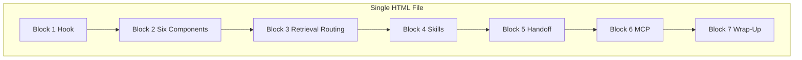

# Context Engineering Demo HTML Walkthrough

## Goal

Create [docs/demo/context-engineering-walkthrough.html](D:\portfolio-harness\docs\demo\context-engineering-walkthrough.html) so you can:

1. Serve it locally (`npx serve docs/demo -p 3333`)
2. Record with agent-browser (scroll + screenshot per block)
3. Produce a video explaining context engineering via ffmpeg

---

## Content Source

All content from [CONTEXT_ENGINEERING_DEMO_CHEATSHEET.md](D:\portfolio-harness.cursor\docs\CONTEXT_ENGINEERING_DEMO_CHEATSHEET.md). Each block maps to one scrollable section.

---

## Structure




**7 sections**, each with:

- `id="block-N"` for scroll targeting
- Heading (e.g. "Block 1: Hook")
- Cheatsheet content (tables, lists, key message)
- Optional "Next block" anchor for agent-browser

---

## Block-by-Block Content


| Block | Content to include                                                                     |
| ----- | -------------------------------------------------------------------------------------- |
| 1     | Hook quote ("78% vs 42%"), "Harness > model"                                           |
| 2     | Six context components table, Resources vs Tools distinction                           |
| 3     | Demo prompt, routing table (Need / Route / Tool), "Route, don't dump"                  |
| 4     | Planning/Tech-lead/SCP demos, SCP pipeline (inspect → sanitize → contain → quarantine) |
| 5     | Handoff 6-step list, "Synapse between sessions"                                        |
| 6     | MCP demo table (scp, context7, jcodemunch, unhuman-deals)                              |
| 7     | Organism metaphor (4 bullets), Entry points (3 links)                                  |


---

## Design

- **Aesthetic:** Industrial / editorial — technical, structured, no generic AI look
- **Fonts:** Google Fonts — e.g. "IBM Plex Sans" (body), "IBM Plex Mono" (code); avoid Inter, Roboto, Arial
- **Layout:** Single column, max-width ~900px, generous padding; each block ~min-height for viewport
- **Colors:** CSS variables; dark-on-light or light-on-dark (pick one, consistent)
- **Tables:** Styled with borders, alternating row background for readability
- **No JS required** — static HTML + CSS only; scroll-based recording

---

## Agent-Browser Recording Flow

After serving:

```bash
agent-browser open http://localhost:3333/context-engineering-walkthrough.html
agent-browser wait 2000
agent-browser screenshot tmp/screenshots/01-block1.png
agent-browser scroll down 400   # or scroll to #block-2
agent-browser screenshot tmp/screenshots/02-block2.png
# ... repeat for blocks 3-7
```

Alternative: add `data-block` attributes and use `scrollIntoView` via a minimal script if needed; prefer pure scroll for simplicity.

---

## File Layout

```
D:\portfolio-harness\
  docs/
    demo/
      context-engineering-walkthrough.html   # New file
```

Create `docs/demo/` if it does not exist.

---

## Implementation Notes

- Self-contained: no images, no external CSS; inline styles or single `<style>` block
- Links in Block 7 (AGENT_ENTRY_INDEX, CONTEXT_ENGINEERING, MCP_CAPABILITY_MAP) can be `#` or relative paths to `.cursor/docs/` — they are informational, not required to resolve
- Ensure tables render correctly in headless Chromium (agent-browser)
- Viewport meta for consistent 1280px recording: `<meta name="viewport" content="width=1280">` or similar

---

## Verification

- Open in browser; all 7 blocks visible when scrolling
- `npx serve docs/demo -p 3333` serves the file
- agent-browser can open, scroll, screenshot without errors
- ffmpeg produces readable video from screenshots

