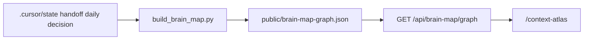

# Context-atlas “no nodes” + harness tracking + E2E scope

## Why you see no nodes

**Two separate mechanisms:**

1. **Committed graph is empty** — `[OpenGrimoire/public/brain-map-graph.json](D:\portfolio-harness\OpenGrimoire\public\brain-map-graph.json)` currently has `"nodes": []`, `"edges": []`, `sessionCount: 0`. The builder ran but found **no `.md` path citations** in the configured state roots for that run (see `[build_brain_map.py](D:\portfolio-harness\.cursor\scripts\build_brain_map.py)`: only paths appearing in `daily/`, `handoff_latest.md`, `handoff_archive/`, `decision-log.md` become nodes).
2. **Vault layer + placeholder graph** — When the API returns zero nodes, `[BrainMapGraph.tsx](D:\portfolio-harness\OpenGrimoire\src\components\BrainMap\BrainMapGraph.tsx)` substitutes `EMPTY_GRAPH` (three sample nodes). Those nodes have **no `layer` field**; `[nodeLayer](D:\portfolio-harness\OpenGrimoire\src\components\BrainMap\BrainMapGraph.tsx)` treats them as `**state`**. If the UI **Layer** tab is **Vault**, `[filterGraphByLayer](D:\portfolio-harness\OpenGrimoire\src\components\BrainMap\BrainMapGraph.tsx)` keeps only `layer === 'vault'`, so **all placeholder nodes disappear** and you get the status: *“No nodes in this layer for the current filter. Choose **All** or another layer.”*

**Immediate checks:** On `/context-atlas`, set **Layer → All** or **State** (not **Vault**) after a refresh. If you still want real data, regenerate JSON (below).

## How to populate the graph (track harness work, not raw chat)

The brain map is **not** wired to Cursor chat transcripts. It tracks **markdown files co-cited in session journals** written under `.cursor/state/`.

| Goal                                              | Action                                                                                                                                                                                                                                                                 |
| ------------------------------------------------- | ---------------------------------------------------------------------------------------------------------------------------------------------------------------------------------------------------------------------------------------------------------------------- |
| Nodes for skills, docs, plans you touch in Cursor | Ensure **handoffs / daily notes / decision-log** include **wikilinks or `path/to/file.md`** to those artifacts; then run `python .cursor/scripts/build_brain_map.py` from portfolio-harness root (see [BRAIN_MAP_HUB.md](D:\portfolio-harness\docs\BRAIN_MAP_HUB.md)). |
| Merge OpenHarness + portfolio-harness             | Set `CURSOR_STATE_DIRS` (and optional labels) per [OPENGRIMOIRE_SYSTEMS_INVENTORY.md](D:\portfolio-harness\OpenGrimoire\docs\OPENGRIMOIRE_SYSTEMS_INVENTORY.md).                                                                                                                |
| Vault / Obsidian                                  | Use `BRAIN_MAP_VAULT_ROOTS` / `--vault-root`; builder emits `layer: 'vault'` nodes ([schema](D:\portfolio-harness\OpenGrimoire\docs\BRAIN_MAP_SCHEMA.md)).                                                                                                                |
| See new JSON in app                               | Prefer `Refresh graph` or reload; API reads `brain-map-graph.local.json` first if present ([route](D:\portfolio-harness\OpenGrimoire\src\app\api\brain-map\graph\route.ts)).                                                                                              |

**To “track all customizations from chatting”** you need a **human- or agent-written artifact** (e.g. handoff section “Paths touched”, daily note, or decision-log line) that lists `.md` paths; the parser does not read Cursor internal chat logs.

## E2E coverage to add or extend

Existing Playwright specs: `[e2e/context-atlas.spec.ts](D:\portfolio-harness\OpenGrimoire\e2e\context-atlas.spec.ts)`, `[smoke.spec.ts](D:\portfolio-harness\OpenGrimoire\e2e\smoke.spec.ts)`, `[visualization.spec.ts](D:\portfolio-harness\OpenGrimoire\e2e\visualization.spec.ts)`, `[survey.spec.ts](D:\portfolio-harness\OpenGrimoire\e2e\survey.spec.ts)`.

**Suggested priorities:**

| Area                       | Why                                                                                                                                                              |
| -------------------------- | ---------------------------------------------------------------------------------------------------------------------------------------------------------------- |
| **Context atlas**          | Assert **Layer All** shows table rows or graph circles; **Layer Vault** with fixture that has only state nodes → empty message (regression for the quirk above). |
| `**/api/brain-map/graph`** | 200 + JSON shape; optional 401 when `BRAIN_MAP_SECRET` set (copy pattern from security docs).                                                                    |
| **Alignment API**          | If in scope: `GET`/`POST`/`PATCH` per `[ALIGNMENT_CONTEXT_API.md](D:\portfolio-harness\OpenGrimoire\docs\agent\ALIGNMENT_CONTEXT_API.md)`.                          |
| **Supabase routes**        | `/login`, `/admin/*` only if CI has test env; skip or mock otherwise.                                                                                            |
| `**/visualization`**       | D3 demo shell loads (already partially in visualization.spec).                                                                                                   |

Use `[playwright.config.ts](D:\portfolio-harness\OpenGrimoire\playwright.config.ts)` `webServer` for local runs; seed `**public/brain-map-graph.json**` (or `.local.json`) in CI with a **small fixture** so tests are not dependent on your laptop’s handoff content.

## Optional small improvements (after you approve implementation)

1. **EMPTY_GRAPH nodes** — Set explicit `"layer": "state"` on each placeholder node so behavior matches the schema and filtering is less surprising.
2. **UX** — If `sessionCount === 0` and using fallback graph, show a one-line hint: *“Placeholder graph — switch Layer to All or State, or rebuild JSON.”*
3. **Docs** — One paragraph in [BRAIN_MAP_AUDIT.md](D:\portfolio-harness\docs\BRAIN_MAP_AUDIT.md) or README linking **Vault vs State** to the empty message.

## What you do not get without new work

- **Automatic** ingestion of “every file Cursor touched” from IDE telemetry.
- **Full** catalog of MCP tools/rules unless those paths appear in cited markdown.

---

**Summary:** Empty committed JSON + **Vault** filter on a placeholder graph explains the UI; **fix UX by layer tab + rebuild**; **track harness specs by citing paths in state markdown and rebuilding**; **E2E** should add fixture-backed brain-map JSON and layer-tab assertions.