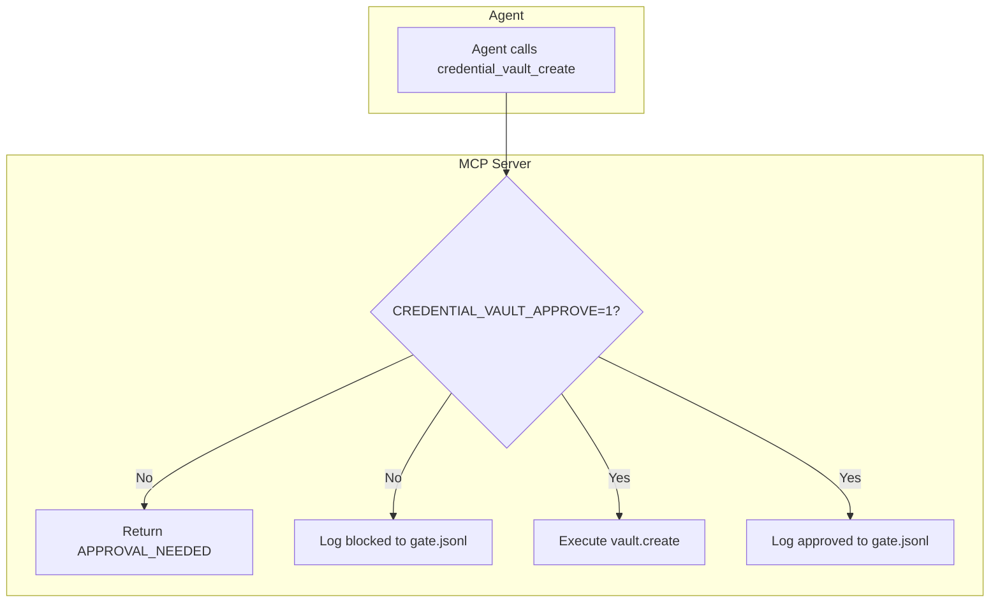

# Credential Vault Gate Implementation (CV-3, CV-4, CV-5)

## Context

- **Scope:** [scope_credential_vault_gate.md](D:\portfolio-harness.cursor\state\scope_credential_vault_gate.md) — G1–G5, AC1–AC4
- **Current state:** Policy-only (APPROVAL_NEEDED in .cursorrules); server executes on call
- **Target:** Server-side block until human confirms; Option C (env) for MVP

---

## CV-3: Security Design

**Output:** Gate design document at `.cursor/state/adhoc/credential_vault_gate_design_2026-03-16.md`

**Design decisions (Option C MVP):**


| Requirement             | Implementation                                                                                    |
| ----------------------- | ------------------------------------------------------------------------------------------------- |
| G1 Block until approved | Pre-execution check: `CREDENTIAL_VAULT_APPROVE=1` (or token) must be set                          |
| G2 Pre-execution check  | Helper `_check_approval(action, site)` at start of each gated handler                             |
| G3 Audit log            | Append to `%LOCALAPPDATA%/local-proto/audit/credential_vault_gate.jsonl` (no PII; site hash only) |
| G4 Timeout/abort        | Defer to Phase 2 (Option B approval UI); Option C has no pending state                            |
| G5 Retrieve ungated     | `credential_vault_get`, `credential_vault_list` unchanged                                         |


**Audit log schema (JSONL):**

```json
{"ts":"ISO8601","event":"blocked|approved","action":"create|update|revoke|export","site_hash":"sha256(site)[:16]"}
```

**Approval mechanism:**

- `CREDENTIAL_VAULT_APPROVE=1` — bypass gate (human pre-approved session)
- Unset or `0` — block and return `APPROVAL_NEEDED: [action] credential for [site]`

---

## CV-4: Implementation

**File:** [credential_vault_mcp.py](D:\portfolio-harness\local-proto\scripts\credential_vault_mcp.py)

**Changes:**

1. **Add `_audit_dir()`** — reuse pattern from [audit_wrapper.py](D:\portfolio-harness\local-proto\scripts\audit_wrapper.py) lines 40–47: `LOCAL_PROTO_AUDIT_DIR` or `%LOCALAPPDATA%/local-proto/audit`
2. **Add `_check_approval(action: str, site: str) -> str | None`**
  - Returns `None` if approved; else error string `APPROVAL_NEEDED: [action] credential for [site]`
  - Check: `os.environ.get("CREDENTIAL_VAULT_APPROVE") == "1"`
  - On block: append to `credential_vault_gate.jsonl` (event=blocked, action, site_hash, ts)
3. **Wrap gated handlers** — at top of `credential_vault_create`, `credential_vault_update`, `credential_vault_revoke`, `credential_vault_export`:

```python
   err = _check_approval("create", site)  # or update/revoke/export
   if err:
       return json.dumps({"error": err})
   

```

1. **On approved execution** — append event=approved before vault call (optional; confirms gate passed)

**Unit test:** Add `local-proto/tests/test_credential_vault_gate.py`

- Test: unapproved call returns `{"error": "APPROVAL_NEEDED: create credential for example.com"}` and does not persist
- Test: with `CREDENTIAL_VAULT_APPROVE=1`, call succeeds

---

## CV-5: Agent-Native Documentation

**Files to update:**

1. **[MCP_CAPABILITY_MAP.md](D:\portfolio-harness.cursor\docs\MCP_CAPABILITY_MAP.md)** — credential-vault section (lines 78–90):
  - Add note: "Server-side gate: create/update/revoke/export require `CREDENTIAL_VAULT_APPROVE=1` or return APPROVAL_NEEDED. Audit: `credential_vault_gate.jsonl`."
2. **[TOOL_SAFEGUARDS.md](D:\portfolio-harness\local-proto\docs\TOOL_SAFEGUARDS.md)** — Credential Vault table:
  - Update to state server enforces gate; agent must still output APPROVAL_NEEDED per policy; human sets env before confirming.
3. **Optional:** [OBSERVABILITY_LAYER.md](D:\portfolio-harness\local-proto\docs\OBSERVABILITY_LAYER.md) — add `credential_vault_gate.jsonl` to audit log list.

---

## Flow Diagram




---

## Verification

- Unapproved call returns error; no credential written
- Approved call (env set) succeeds
- Audit log contains blocked/approved entries without PII
- `credential_vault_get` and `credential_vault_list` remain ungated
- MCP_CAPABILITY_MAP and TOOL_SAFEGUARDS updated

---

## Out of Scope (This Plan)

- Approval UI (Option B)
- Timeout for pending approvals
- Signal webhook
- credential_vault_get gating (per scope R8)

