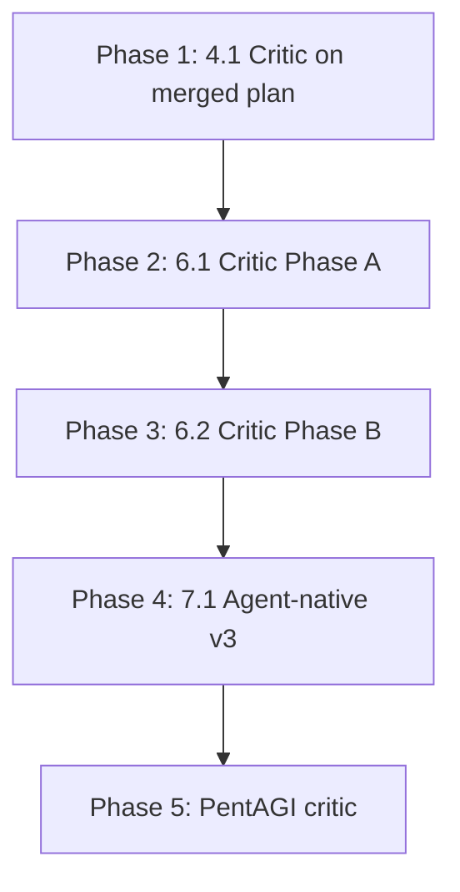

# Critic Gates and Agent-Native Audit Execution Plan

Execute the deferred tasks from [bitcoin_workflow_status_50c35113.plan.md](D:\software.cursor\plans\bitcoin_workflow_status_50c35113.plan.md) and [pentagi_protection_verification_044c4634.plan.md](D:\software.cursor\plans\pentagi_protection_verification_044c4634.plan.md).

---

## Prerequisites

- Plans submodule initialized: `git submodule update --init` (if `plans/` is empty)
- Merged plan path: [D:\software\plans\bitcoin_chaos_convergence_integration_827d4828.plan.md](D:\software\plans\bitcoin_chaos_convergence_integration_827d4828.plan.md)
- Critic invocation: `mcp_task` with `subagent_type: "critic"` (domain: docs or code)
- Agent-native audit: `mcp_task` with `subagent_type: "agent-native-reviewer"`
- Output dir for reports: `D:\portfolio-harness\.cursor\state\adhoc\` (create if missing)

---

## Phase 1: Task 4.1 — Critic on Merged Plan

**Input:** [bitcoin_chaos_convergence_integration_827d4828.plan.md](D:\software\plans\bitcoin_chaos_convergence_integration_827d4828.plan.md)

**Action:**

1. Invoke critic subagent via `mcp_task` (subagent_type: critic, domain: docs)
2. Pass the plan content or path; request critic JSON per [critic-loop-gate](c:\Users\schum.cursor\rules\critic-loop-gate.mdc)
3. If `pass=false` or score below threshold: fix issues (broken links, missing cross-refs, inconsistent task IDs), re-run critic
4. Save report: `AGENT_NATIVE_BITCOIN_CHAOS_CRITIC_PLAN_YYYYMMDD.json` in `.cursor/state/adhoc/`

**Est:** 15–30 min

---

## Phase 2: Task 6.1 — Critic on Phase A Artifacts

**Artifacts and domains:**

| ID  | Path                                                                                                                                        | Domain |
| --- | ------------------------------------------------------------------------------------------------------------------------------------------- | ------ |
| A1  | [docs/BITCOIN_OBSERVATION_TEMPLATE.md](D:\portfolio-harness\docs\BITCOIN_OBSERVATION_TEMPLATE.md)                                           | docs   |
| A2  | [docs/CHAOS_BITCOIN_MAPPING.md](D:\portfolio-harness\docs\CHAOS_BITCOIN_MAPPING.md)                                                         | docs   |
| A3  | [org-intent-spec/examples/org-intent.bitcoin-inspired.json](D:\portfolio-harness\org-intent-spec\examples\org-intent.bitcoin-inspired.json) | docs   |
| A4  | [docs/FEDIMINT_OBSERVATION_TEMPLATE.md](D:\portfolio-harness\docs\FEDIMINT_OBSERVATION_TEMPLATE.md)                                         | docs   |
| A5  | (same as A2 — CHAOS_BITCOIN_MAPPING)                                                                                                        | docs   |
| A6  | [local-proto/scripts/observation_mcp.py](D:\portfolio-harness\local-proto\scripts\observation_mcp.py)                                       | code   |
| A7  | [docs/BITCOIN_AGENT_CAPABILITIES.md](D:\portfolio-harness\docs\BITCOIN_AGENT_CAPABILITIES.md)                                               | docs   |

**Action:** For each artifact, invoke critic subagent with appropriate domain. Produce critic JSON; fix issues if score below threshold. Save per-artifact reports (e.g. `critic_A1_*.json`).

**Order:** A1, A2, A3, A4, A5, A6, A7 (or batch: docs first, then code)

**Est:** 1–2 hr

---

## Phase 3: Task 6.2 — Critic on Phase B Artifacts

**Artifacts and domains:**

| ID  | Path                                                                                                                                        | Domain      |
| --- | ------------------------------------------------------------------------------------------------------------------------------------------- | ----------- |
| B2  | [org-intent-spec/examples/org-intent.bitcoin-inspired.json](D:\portfolio-harness\org-intent-spec\examples\org-intent.bitcoin-inspired.json) | docs        |
| B3  | [docs/BITCOIN_OBSERVATION_SOURCES.md](D:\portfolio-harness\docs\BITCOIN_OBSERVATION_SOURCES.md)                                             | docs        |
| B4  | [docs/PENTAGI_FEDIMINT_ACE_ROADMAP.md](D:\portfolio-harness\docs\PENTAGI_FEDIMINT_ACE_ROADMAP.md)                                           | docs        |
| B5  | (Section 2 in B4)                                                                                                                           | docs        |
| B6  | (same as B3 — BITCOIN_OBSERVATION_SOURCES)                                                                                                  | docs        |
| B7  | continue_prompt.txt, .cursorrules                                                                                                           | docs/config |
| B8  | [local-proto/docs/OPENCLAW.md](D:\portfolio-harness\local-proto\docs\OPENCLAW.md) SOUL section                                              | docs        |

**Action:** Same as 6.1. Domain: docs for markdown; docs or config for .cursorrules/continue_prompt.

**Est:** 1–2 hr

---

## Phase 4: Task 7.1 — Agent-Native Audit v3

**Rationale:** v2 (39/64) was before Remaining Gaps. Since then: observation_log_append MCP, org-intent.bitcoin-inspired injection. v3 confirms Tools as Primitives and Action Parity improvements.

**Action:**

1. Invoke agent-native-reviewer subagent via `mcp_task` (subagent_type: agent-native-reviewer)
2. Scope: portfolio-harness + local-proto
3. Compare to v2 baseline (39/64); expect Tools as Primitives 5→6 or 7, Action Parity 5→6
4. Save output: `AGENT_NATIVE_BITCOIN_CHAOS_AUDIT_2026-03-XX_v3.md` in `.cursor/state/adhoc/`

**Est:** 30–45 min

---

## Phase 5: PentAGI — Critic on New Docs

**Artifacts (from pentagi_protection_verification plan):**

- [pentagi/docs/HITL_PLAYBOOK.md](D:\portfolio-harness\pentagi\docs\HITL_PLAYBOOK.md) §10 Verification
- [pentagi/docs/DEANONYMIZATION_RISK.md](D:\portfolio-harness\pentagi\docs\DEANONYMIZATION_RISK.md) §4a update
- [.cursor/docs/AGENT_ENTRY_INDEX.md](D:\portfolio-harness.cursor\docs\AGENT_ENTRY_INDEX.md) exposure-check row

**Action:** Invoke critic subagent (domain: docs) on the updated content. Produce critic JSON. If `pass=false`, revise and re-run. Save report: `pentagi_protection_critic_YYYYMMDD.json`.

**Est:** 15–20 min

---

## Implementation Order

**Recommended sequence:** 4.1 → 6.1 → 6.2 → 7.1 → PentAGI. Phases 2 and 3 can be parallelized by artifact (e.g. dispatch multiple critic tasks) if mcp_task supports concurrent invocation.

---

## Verification

- Plan critic (4.1): `pass=true`, score ≥ threshold
- Per-artifact critics (6.1, 6.2): all pass or issues documented and fixed
- v3 audit (7.1): score ≥ 39/64; Tools as Primitives and Action Parity improved vs v2
- PentAGI critic: `pass=true` or issues fixed

---

## Output Summary

| Task    | Output file                                                                |
| ------- | -------------------------------------------------------------------------- |
| 4.1     | `.cursor/state/adhoc/AGENT_NATIVE_BITCOIN_CHAOS_CRITIC_PLAN_YYYYMMDD.json` |
| 6.1     | Per-artifact critic JSONs (A1–A7)                                          |
| 6.2     | Per-artifact critic JSONs (B2–B8)                                          |
| 7.1     | `.cursor/state/adhoc/AGENT_NATIVE_BITCOIN_CHAOS_AUDIT_2026-03-XX_v3.md`    |
| PentAGI | `.cursor/state/adhoc/pentagi_protection_critic_YYYYMMDD.json`              |

---

## Optional: Update bitcoin_workflow_status Plan

After completion, update [bitcoin_workflow_status_50c35113.plan.md](D:\software.cursor\plans\bitcoin_workflow_status_50c35113.plan.md) Step 4, 6, 7 status to **DONE** with evidence (paths to critic reports and v3 audit).