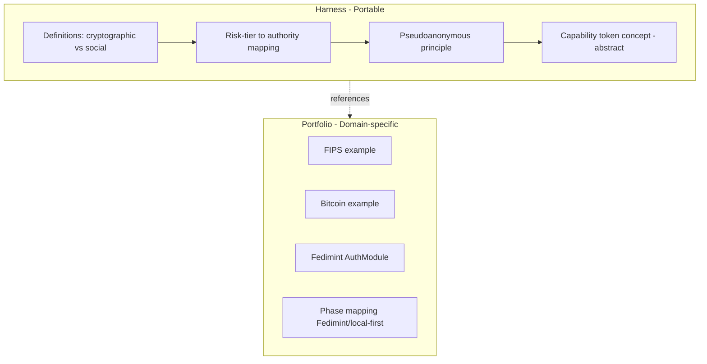

# Cryptographic Authority Framework — Harness Extraction Plan

## Current State

### Framework Location (Deliverable 1)


| Artifact                              | Path                                                                                                                                        | Content                                                                |
| ------------------------------------- | ------------------------------------------------------------------------------------------------------------------------------------------- | ---------------------------------------------------------------------- |
| **AUTHORITY_MODEL_TAXONOMY**          | [docs/AUTHORITY_MODEL_TAXONOMY.md](D:\portfolio-harness\docs\AUTHORITY_MODEL_TAXONOMY.md)                                                   | Definitions, spectrum (FIPS/Bitcoin/Fedimint), risk-tier mapping       |
| **FEDIMINT_AUTHMODULE_DESIGN_TARGET** | [docs/FEDIMINT_AUTHMODULE_DESIGN_TARGET.md](D:\portfolio-harness\docs\FEDIMINT_AUTHMODULE_DESIGN_TARGET.md)                                 | Capability tokens, AuthModule, secp256k1 identity, harness integration |
| **org-intent hb-4**                   | [org-intent-spec/examples/org-intent.bitcoin-inspired.json](D:\portfolio-harness\org-intent-spec\examples\org-intent.bitcoin-inspired.json) | "Do not act on behalf of non-owner without cryptographic proof"        |
| **BITCOIN_AGENT_CAPABILITIES**        | [docs/BITCOIN_AGENT_CAPABILITIES.md](D:\portfolio-harness\docs\BITCOIN_AGENT_CAPABILITIES.md)                                               | Authority model section, links to taxonomy                             |


---

## Harness-Ready vs Portfolio-Specific (Deliverable 2)




| Content                             | Location      | Rationale                                 |
| ----------------------------------- | ------------- | ----------------------------------------- |
| Cryptographic vs social definitions | Harness       | Domain-agnostic pattern                   |
| Risk-tier → authority mapping       | Harness       | Aligns with .cursorrules; any workflow    |
| Pseudoanonymous principle           | Harness (new) | Security baseline; no identity disclosure |
| Capability token concept (abstract) | Harness       | Issue, verify, revoke pattern             |
| FIPS / Bitcoin / Fedimint examples  | Portfolio     | Domain-specific                           |
| AuthModule, Fedimint BFT            | Portfolio     | Implementation detail                     |
| Phase mapping (C4/C5, LF1)          | Portfolio     | Project-specific                          |


---

## Implementation Tasks

### Task 1: Create harness docs/AUTHORITY_MODEL.md (Deliverable 3)

**File:** `D:\harness\docs\AUTHORITY_MODEL.md`

**Content structure:**

- **Definitions:** Cryptographic authority (proof-based, verifiable) vs social/coordination authority (consensus, human gates)
- **Pseudoanonymous principle:** Authority provable without revealing real-world identity; use pubkeys and capability tokens
- **When each applies:** Low-stakes (social OK) vs high-stakes (cryptographic required)
- **Authority by risk tier:** Table mapping Low/Medium/High/Critical to authority model (from AUTHORITY_MODEL_TAXONOMY lines 44–56)
- **Capability token concept:** Abstract operations (issue, verify, revoke); implementation-specific
- **Integration:** Reference to org-intent hard_boundaries pattern; placeholder for capability verification
- **See also:** Link to portfolio AUTHORITY_MODEL_TAXONOMY for domain-specific examples (optional; harness doc should stand alone)

**Promotion checklist:** Strip FIPS, Bitcoin, Fedimint, Fedimint phase mapping; use generic risk-tier definitions.

---

### Task 2: Add pseudoanonymous principle to portfolio AUTHORITY_MODEL_TAXONOMY (Deliverable 4 — gap)

**File:** [docs/AUTHORITY_MODEL_TAXONOMY.md](D:\portfolio-harness\docs\AUTHORITY_MODEL_TAXONOMY.md)

**Change:** Add new section after "Definitions":

```markdown
### Pseudoanonymous authority

Authority is provable without revealing real-world identity. Use pubkeys (e.g. secp256k1) and capability tokens; no PII in verification. Enables audit and delegation without identity disclosure.
```

---

### Task 3: Document gaps in portfolio (Deliverable 4)

**File:** [docs/FEDIMINT_AUTHMODULE_DESIGN_TARGET.md](D:\portfolio-harness\docs\FEDIMINT_AUTHMODULE_DESIGN_TARGET.md) or new `docs/AUTHORITY_GAPS.md`

**Gaps to document:**

- **Capability token implementation:** AuthModule blocked on C4/C5; placeholder API in FEDIMINT_AUTHMODULE_DESIGN_TARGET
- **secp256k1 agent identity:** Standalone keypair design exists; private key outside AI access; pubkey for audit
- **hb-4 escalation_tools:** Empty until CRY2; need `verify_capability(token, action_descriptor)` stub
- **Pseudoanonymous verification flow:** No end-to-end flow yet; design only

---

### Task 4: Update harness README and references

**File:** [D:\harness\README.md](D:\harness\README.md)

**Change:** Add AUTHORITY_MODEL to References section and optionally to Key Concepts:

```markdown
| **Authority model** | Cryptographic vs social; risk-tier mapping; pseudoanonymous proof |
```

```markdown
- [AUTHORITY_MODEL.md](docs/AUTHORITY_MODEL.md)
```

---

### Task 5: Cross-reference portfolio to harness

**File:** [docs/AUTHORITY_MODEL_TAXONOMY.md](D:\portfolio-harness\docs\AUTHORITY_MODEL_TAXONOMY.md)

**Change:** Add at top (after See also):

```markdown
**Portable version:** For domain-agnostic authority model and risk-tier mapping, see harness [docs/AUTHORITY_MODEL.md](https://github.com/ManintheCrowds/Harness) (or local clone docs/AUTHORITY_MODEL.md).
```

---

### Task 6: Update COMPONENT_AUDIT and HARNESS_REPO_REFERENCE

**Files:** [docs/COMPONENT_AUDIT.md](D:\portfolio-harness\docs\COMPONENT_AUDIT.md), [docs/HARNESS_REPO_REFERENCE.md](D:\portfolio-harness\docs\HARNESS_REPO_REFERENCE.md)

**Change:** Add AUTHORITY_MODEL to harness contents table; note extraction status.

---

## Quick Wins and Generalization (Context)

The authority model extraction is the primary generalization. Other opportunities identified in the codebase:

- **SCP:** Already in harness (thin); portfolio has full mask_secrets, validate_output
- **Handoff/state:** Already extracted
- **Intent engineering:** In harness; org-intent is portfolio-specific instantiation
- **Provenance:** Portfolio-only (observation, document provenance); could have thin harness pattern if generalized

No additional tasks for these; authority model is the focus.

---

## Execution Order

1. Task 1 (create harness AUTHORITY_MODEL.md)
2. Task 4 (update harness README)
3. Task 2 (add pseudoanonymous to portfolio taxonomy)
4. Task 3 (document gaps)
5. Task 5 (cross-reference portfolio → harness)
6. Task 6 (update COMPONENT_AUDIT, HARNESS_REPO_REFERENCE)

---

## Verification

- Harness AUTHORITY_MODEL.md passes primary delineation prompt
- No references to portfolio projects, Bitcoin, Fedimint, FIPS in harness doc
- Promotion checklist applied
- Portfolio taxonomy includes pseudoanonymous section
- Gaps documented

