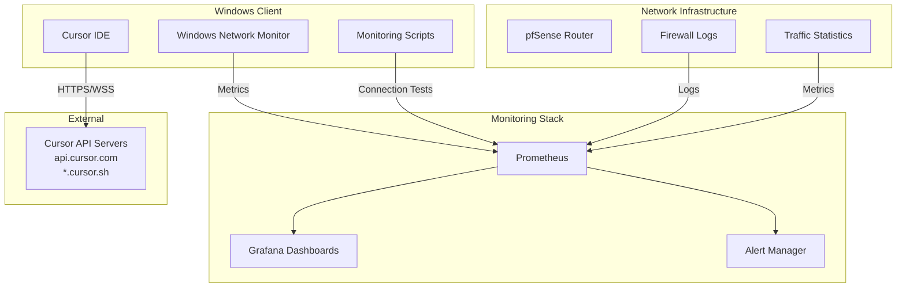

# Cursor Connection Monitoring and Optimization Plan

## Problem Statement

Cursor IDE is experiencing repeated disconnects affecting AI features. We need to:

1. **Observe** Cursor's network connections and utilization patterns
2. **Diagnose** the root causes of disconnects
3. **Optimize** network configuration to improve stability

## Architecture Overview

## Phase 1: Discovery and Mapping

### 1.1 Identify Cursor Network Endpoints

**Objective**: Determine what domains, IPs, and ports Cursor connects to.**Tasks**:

- Research Cursor's API endpoints (likely `api.cursor.com`, `*.cursor.sh`, WebSocket endpoints)
- Use Windows `netstat` and `Get-NetTCPConnection` to identify active Cursor connections
- Capture DNS queries from Cursor process
- Document all discovered endpoints

**Deliverables**:

- Document: `docs/CURSOR_NETWORK_ENDPOINTS.md` listing all domains, IPs, ports, and protocols
- Script: `scripts/monitoring/cursor-endpoint-discovery.ps1` to automate discovery

### 1.2 Network Path Analysis

**Objective**: Understand the network path from Windows client to Cursor servers.**Tasks**:

- Create traceroute/mtr scripts to Cursor endpoints
- Identify routing hops and potential bottlenecks
- Test DNS resolution times for Cursor domains
- Measure baseline latency and packet loss

**Deliverables**:

- Script: `scripts/monitoring/cursor-path-analysis.ps1`
- Baseline metrics document

## Phase 2: Windows Client Monitoring

### 2.1 Process-Level Monitoring

**Objective**: Monitor Cursor process network activity on Windows.**Tasks**:

- Create PowerShell script to monitor Cursor.exe network connections
- Track connection count, bytes sent/received, connection duration
- Monitor connection state changes (established, closed, reset)
- Log connection failures and timeouts

**Implementation**:

- Use `Get-NetTCPConnection` filtered by Cursor process ID
- Use `Get-Process` to track Cursor resource usage
- Export metrics in Prometheus format or JSON for ingestion

**Deliverables**:

- Script: `scripts/monitoring/cursor-process-monitor.ps1`
- Prometheus exporter: `monitoring/cursor-exporter/cursor_windows_exporter.py` (if needed)

### 2.2 Connection Quality Monitoring

**Objective**: Measure connection quality metrics (latency, packet loss, jitter).**Tasks**:

- Create continuous ping/traceroute monitoring to Cursor endpoints
- Measure WebSocket connection stability
- Track HTTP request/response times
- Monitor DNS resolution performance

**Deliverables**:

- Script: `scripts/monitoring/cursor-connection-quality.ps1`
- Metrics: latency, packet_loss, dns_resolution_time, connection_duration

### 2.3 Windows Event Log Monitoring

**Objective**: Capture Windows network events related to Cursor.**Tasks**:

- Monitor Windows Event Log for network adapter events
- Track firewall events (if Windows Firewall is involved)
- Log network interface state changes

**Deliverables**:

- Script: `scripts/monitoring/cursor-event-log-monitor.ps1`

## Phase 3: Network Infrastructure Monitoring

### 3.1 pfSense Firewall Log Analysis

**Objective**: Monitor Cursor traffic through pfSense firewall.**Tasks**:

- Configure pfSense to log all outbound connections to Cursor domains/IPs
- Create firewall aliases for Cursor endpoints
- Set up log forwarding to monitoring system
- Parse firewall logs for connection patterns

**Implementation**:

- Add firewall rules with logging enabled for Cursor endpoints
- Use pfSense API or syslog to forward logs
- Create Prometheus exporter or log parser

**Deliverables**:

- pfSense configuration: `config/pfsense/cursor-firewall-rules.xml`
- Log parser: `monitoring/cursor-exporter/pfsense_log_parser.py`

### 3.2 Traffic Statistics Collection

**Objective**: Collect bandwidth and connection statistics for Cursor traffic.**Tasks**:

- Use pfSense SNMP or API to collect interface statistics
- Filter traffic by destination (Cursor endpoints)
- Track bytes in/out, connection counts, error rates
- Monitor for traffic anomalies

**Deliverables**:

- Prometheus scrape config for pfSense Cursor metrics
- Grafana queries for traffic visualization

### 3.3 DNS Monitoring

**Objective**: Monitor DNS resolution for Cursor domains.**Tasks**:

- Track DNS query times for Cursor domains
- Monitor DNS server response times
- Detect DNS resolution failures
- Log DNS cache hits/misses

**Deliverables**:

- DNS monitoring script or Prometheus DNS exporter integration

## Phase 4: Prometheus Integration

### 4.1 Metrics Collection

**Objective**: Aggregate all Cursor monitoring data in Prometheus.**Metrics to Collect**:

- `cursor_connections_active` - Current active connections
- `cursor_connections_total` - Total connection attempts
- `cursor_connection_duration_seconds` - Connection duration histogram
- `cursor_bytes_sent_total` - Total bytes sent
- `cursor_bytes_received_total` - Total bytes received
- `cursor_latency_seconds` - Latency to Cursor endpoints
- `cursor_packet_loss_ratio` - Packet loss percentage
- `cursor_dns_resolution_seconds` - DNS resolution time
- `cursor_connection_errors_total` - Connection error count
- `cursor_disconnects_total` - Disconnect events

**Tasks**:

- Create Prometheus exporters for Windows and pfSense data
- Configure Prometheus scrape jobs
- Set up metric relabeling and aggregation

**Deliverables**:

- Exporter: `monitoring/cursor-exporter/cursor_exporter.py`
- Configuration: `prometheus/prometheus.yml` updates
- Documentation: `docs/monitoring/CURSOR_MONITORING.md`

### 4.2 Alert Rules

**Objective**: Create alerts for connection issues.**Alert Rules**:

- High latency (>500ms sustained)
- High packet loss (>5%)
- Frequent disconnects (>3 in 5 minutes)
- DNS resolution failures
- Connection timeouts
- Zero active connections for extended period

**Deliverables**:

- Alert rules: `prometheus/alert_rules.yml` additions

## Phase 5: Grafana Dashboards

### 5.1 Connection Overview Dashboard

**Panels**:

- Active connections gauge
- Connection duration over time
- Bytes sent/received rate
- Connection state breakdown (established, closed, reset)
- Top Cursor endpoints by traffic

### 5.2 Connection Quality Dashboard

**Panels**:

- Latency to Cursor endpoints (line graph)
- Packet loss percentage
- DNS resolution time
- Connection success/failure rate
- Error rate by type

### 5.3 Network Path Dashboard

**Panels**:

- Traceroute visualization
- Hop-by-hop latency
- Interface bandwidth usage
- Firewall rule hit counts
- Traffic patterns over time

### 5.4 Diagnostic Dashboard

**Panels**:

- Disconnect events timeline
- Correlation with network events
- System resource usage during disconnects
- Error logs and messages

**Deliverables**:

- Dashboard JSON: `monitoring/grafana/dashboards/cursor-connections.json`

## Phase 6: Diagnostic Tools

### 6.1 Connection Test Script

**Objective**: Automated connection testing to Cursor endpoints.**Features**:

- Test HTTP connectivity
- Test WebSocket connectivity
- Measure latency
- Test DNS resolution
- Generate diagnostic report

**Deliverables**:

- Script: `scripts/monitoring/cursor-connection-test.ps1`

### 6.2 Disconnect Analysis Tool

**Objective**: Analyze disconnect patterns and correlations.**Features**:

- Parse logs for disconnect events
- Correlate with network events
- Identify patterns (time of day, network conditions)
- Generate analysis report

**Deliverables**:

- Script: `scripts/monitoring/cursor-disconnect-analysis.ps1`

## Phase 7: Optimization Strategies

### 7.1 DNS Optimization

**Strategies**:

- Use faster DNS servers (Cloudflare 1.1.1.1, Google 8.8.8.8)
- Enable DNS caching on pfSense
- Configure DNS prefetching
- Monitor and optimize DNS resolution times

**Deliverables**:

- DNS configuration guide
- DNS performance monitoring

### 7.2 Firewall Rule Optimization

**Strategies**:

- Ensure Cursor endpoints are not blocked
- Optimize firewall rule order (most common first)
- Disable unnecessary deep packet inspection for Cursor traffic
- Configure connection tracking timeouts appropriately

**Deliverables**:

- Optimized firewall rules
- Performance testing results

### 7.3 Quality of Service (QoS)

**Strategies**:

- Prioritize Cursor traffic (if bandwidth is limited)
- Configure traffic shaping for Cursor endpoints
- Set bandwidth limits to prevent saturation
- Monitor for bandwidth contention

**Deliverables**:

- QoS configuration for pfSense
- Bandwidth monitoring

### 7.4 Network Path Optimization

**Strategies**:

- Test alternative DNS servers
- Evaluate VPN/proxy impact (if used)
- Check for MTU issues
- Optimize TCP settings (if accessible)

**Deliverables**:

- Optimization recommendations document
- Testing results

### 7.5 Connection Pooling and Keep-Alive

**Strategies**:

- Ensure TCP keep-alive is enabled
- Monitor connection reuse
- Optimize connection timeouts
- Configure appropriate retry logic

**Deliverables**:

- Configuration recommendations

## Phase 8: Continuous Monitoring

### 8.1 Automated Reporting

**Objective**: Regular reports on connection health.**Tasks**:

- Daily connection health summary
- Weekly trend analysis
- Monthly optimization recommendations

**Deliverables**:

- Reporting script: `scripts/monitoring/cursor-health-report.ps1`

### 8.2 Baseline Establishment

**Objective**: Establish normal operating baselines.**Tasks**:

- Collect 1-2 weeks of baseline data
- Identify normal patterns
- Set appropriate alert thresholds
- Document expected behavior

**Deliverables**:

- Baseline metrics document

## Implementation Files

### New Files to Create

1. `docs/CURSOR_NETWORK_ENDPOINTS.md` - Documented endpoints
2. `docs/monitoring/CURSOR_MONITORING.md` - Monitoring guide
3. `scripts/monitoring/cursor-endpoint-discovery.ps1` - Endpoint discovery
4. `scripts/monitoring/cursor-process-monitor.ps1` - Process monitoring
5. `scripts/monitoring/cursor-connection-quality.ps1` - Quality monitoring
6. `scripts/monitoring/cursor-path-analysis.ps1` - Path analysis
7. `scripts/monitoring/cursor-connection-test.ps1` - Connection testing
8. `scripts/monitoring/cursor-disconnect-analysis.ps1` - Disconnect analysis
9. `scripts/monitoring/cursor-health-report.ps1` - Health reporting
10. `scripts/monitoring/cursor-event-log-monitor.ps1` - Event log monitoring
11. `monitoring/cursor-exporter/cursor_exporter.py` - Prometheus exporter
12. `monitoring/cursor-exporter/pfsense_log_parser.py` - Log parser
13. `monitoring/grafana/dashboards/cursor-connections.json` - Grafana dashboard
14. `config/pfsense/cursor-firewall-rules.xml` - Firewall rules

### Files to Modify

1. `prometheus/prometheus.yml` - Add Cursor scrape jobs
2. `prometheus/alert_rules.yml` - Add Cursor alerts
3. `monitoring/README.md` - Add Cursor monitoring section

## Success Criteria

1. **Visibility**: All Cursor connections are monitored and visible in Grafana
2. **Diagnostics**: Disconnects can be diagnosed within 5 minutes using dashboards
3. **Optimization**: Connection stability improved (measured by reduced disconnect frequency)
4. **Automation**: Automated monitoring and alerting in place
5. **Documentation**: Complete documentation for ongoing maintenance

## Risk Assessment

- **Low Risk**: Monitoring setup, dashboard creation, documentation
- **Medium Risk**: pfSense configuration changes (requires testing)
- **Low Risk**: Script development (non-invasive monitoring)

## Dependencies

- Prometheus and Grafana already deployed
- pfSense accessible and configurable
- Windows PowerShell execution policy allows scripts
- Network access to Cursor endpoints for testing

## Estimated Effort

- Phase 1 (Discovery): 4-6 hours
- Phase 2 (Windows Monitoring): 6-8 hours
- Phase 3 (Network Monitoring): 4-6 hours
- Phase 4 (Prometheus): 3-4 hours
- Phase 5 (Grafana): 4-6 hours
- Phase 6 (Diagnostics): 3-4 hours
- Phase 7 (Optimization): 4-8 hours (ongoing)
- Phase 8 (Continuous): 2-3 hours setup, ongoing maintenance