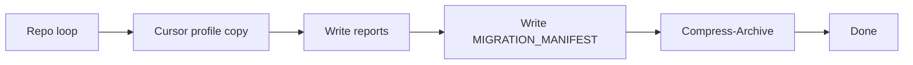

# Cursor profile copy: skip locked files and complete bundle

## Context

- Failure: `Copy-Item` on `[C:\Users\...\AppData\Roaming\Cursor\Network\Cookies](file:///C:/Users/schum/AppData/Roaming/Cursor/Network/Cookies)` with **"being used by another process"** while Cursor is running.
- Root cause: `[$ErrorActionPreference = 'Stop'](D:/software/scripts/export_dev_migration_bundle.ps1)` + **unhandled** `Copy-Item` failure in `[Copy-TreeFiltered](D:/software/scripts/export_dev_migration_bundle.ps1)` (file branch ~~160–171) and optional top-level AppData file copy (~~452–460).
- Existing debug instrumentation: `Write-AgentDebugLog` → `[D:\software\debug-91f5e8.log](D:/software/debug-91f5e8.log)`, `copy_failed` + `profile_copy_start` (keep through verification; remove `#region agent log` block only after a successful post-fix run and your OK).

Today, an IOException in **profile** stops the script **before** reports/manifest/zip.

## Implementation (single file)

**File:** `[D:/software/scripts/export_dev_migration_bundle.ps1](D:/software/scripts/export_dev_migration_bundle.ps1)`

1. **Centralize safe copy** (e.g. `Copy-Item-SkipIfLocked` or inline pattern):
  - Attempt `Copy-Item -LiteralPath ... -Destination ... -Force`.
  - On failure, if the exception message indicates **sharing / in use** (or `IOException` / `UnauthorizedAccessException` as appropriate on Windows), **do not throw**:
    - `Write-Warning` with short path.
    - `Write-AgentDebugLog` with `message: copy_skipped_locked`, same `hypothesisId` (e.g. H1), `data`: `src`, `dst`, `error`.
    - Append `src` to a script-level list `$script:ProfileCopySkipped` (or similar).
  - For **unexpected** errors (e.g. disk full), still **rethrow** or log and stop—only treat known lock/sharing cases as skippable.
2. **Apply** the helper in:
  - `[Copy-TreeFiltered](D:/software/scripts/export_dev_migration_bundle.ps1)` file branch (replace current try/catch that only logs and **throws**).
  - Top-level AppData file copy block (~452–460).
3. **Persist skips for audit:** After the machine profile block (or in the existing `# Write reports` section), if `$script:ProfileCopySkipped` has entries, write `[bundle/reports/MACHINE_PROFILE_SKIPPED.txt](D:/software/scripts/export_dev_migration_bundle.ps1)` (UTF-8) with one path per line and a one-line header explaining *locked while Cursor running; close Cursor and re-run to retry*.
4. **Manifest text:** Extend the `CURSOR PROFILE` section in the here-string (~533–536) to mention that **some profile files may be skipped** if locked, and point to `reports\MACHINE_PROFILE_SKIPPED.txt`.
5. **Docs (optional, minimal):** Add 2–4 lines to `[D:/software/scripts/MIGRATION_BUNDLE_README.md](D:/software/scripts/MIGRATION_BUNDLE_README.md)` under troubleshooting: locked `Network\Cookies` / run with Cursor closed vs accept skips.

## Verification

| Step        | Command                                                                                                                                                         | Pass criteria                                                                                                                                                                            |
| ----------- | --------------------------------------------------------------------------------------------------------------------------------------------------------------- | ---------------------------------------------------------------------------------------------------------------------------------------------------------------------------------------- |
| Fast repro  | `Set-Location D:\software\scripts`; `$env:DEBUG_RUN_ID='post-fix'`; `.\export_dev_migration_bundle.ps1 -RepoRoots @('D:\software') -ConfirmSingleRepo -SkipZip` | Console shows **Done. Stage root:** …; `bundle\reports\`* written; `MIGRATION_MANIFEST.txt` exists; `debug-91f5e8.log` contains `copy_skipped_locked` **or** clean run if nothing locked |
| Full bundle | `.\export_dev_migration_bundle.ps1` (or `-SkipZip` if you want to inspect tree first)                                                                           | **8** repos listed; `bundle\repos\` has eight folders; zip created unless `-SkipZip`                                                                                                     |

## Instrumentation cleanup

- After one **post-fix** successful run and your confirmation: remove `#region agent log` / `Write-AgentDebugLog` / `$script:DebugAgentLogPath` usage, **or** gate behind `-DebugMigrationLog` switch if you want to keep optional diagnostics.

## Risk

- **Low:** Skipping locked cookies/network DB does not block code/ignored-file migration; user can close Cursor and re-run to fill gaps.

