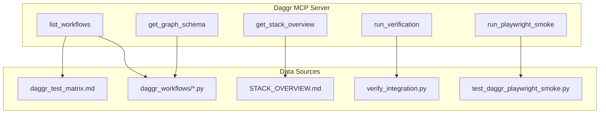

# Daggr MCP Server Implementation Plan

## Scope and Requirements

**Tools to implement:**

1. **list_workflows** – Return workflows from [daggr_test_matrix.md](D:\portfolio-harness.cursor\docs\daggr_test_matrix.md) or by scanning `daggr_workflows/*.py` per stack
2. **get_graph_schema(workflow_name)** – Import workflow module, introspect the Daggr Graph, return `{nodes, edges}` as JSON
3. **get_stack_overview** – Return stack registry (projects, ports, data flows) from [STACK_OVERVIEW.md](D:\portfolio-harness.cursor\docs\STACK_OVERVIEW.md)
4. **run_verification** – Call `verify_integration` per stack and return pass/fail
5. **run_playwright_smoke** (optional) – Run Playwright smoke test for simple workflow; agent can also use cursor-ide-browser or Playwright MCP directly

**Agent-native alignment:** Tools are atomic primitives (list, get, run). Parity: agent can list workflows, inspect schemas, verify integration, and run smoke tests—same as human via CLI/docs.

---

## Architecture

---

## Implementation Details

### 1. Placement and Structure

| Item           | Path                                                                                                                                  | Rationale                                                    |
| -------------- | ------------------------------------------------------------------------------------------------------------------------------------- | ------------------------------------------------------------ |
| MCP server     | [local-proto/scripts/daggr_mcp.py](D:\portfolio-harness\local-proto\scripts\daggr_mcp.py)                                             | Matches credential_vault_mcp, constraint_library_mcp pattern |
| Config / paths | Env: `DAGGR_WATCHTOWER_ROOT`, `DAGGR_CAMPAIGN_KB_ROOT`, `DAGGR_ARC_FORGE_ROOT`; fallback to `portfolio-harness` + `Arc_Forge` sibling | Multi-stack; paths configurable                              |
| MCP config     | Add `daggr` entry to [.cursor/mcp.json](D:\portfolio-harness.cursor\mcp.json)                                                         | Same pattern as credential-vault                             |

### 2. Tool Specifications

**list_workflows(stack?: string)**

- `stack`: `"WatchTower"` | `"campaign_kb"` | `"all"` (default: `"all"`)
- Primary source: parse [daggr_test_matrix.md](D:\portfolio-harness.cursor\docs\daggr_test_matrix.md) workflow table (regex or simple line-by-line)
- Fallback: scan `daggr_workflows/*.py` for files with `graph = Graph(` and derive name from filename
- Returns: `[{stack, name, script, needs_app, purpose}]`

**get_graph_schema(workflow_name: str, stack?: string)**

- Resolve script path from list_workflows or `run_workflow.WORKFLOWS`
- Use `runpy.run_path(script, run_name="__load__")` to load module without executing `__main`__
- Extract `graph` from globals
- Introspect: `graph.nodes` (dict), `graph.get_connections()` → `[(src, src_out, tgt, tgt_in), ...]`
- Return JSON: `{name, nodes: [{id, type, inputs?, outputs?}], edges: [{source, sourceOutput, target, targetInput}]}`

**get_stack_overview()**

- Read [.cursor/docs/STACK_OVERVIEW.md](D:\portfolio-harness.cursor\docs\STACK_OVERVIEW.md)
- Parse Components table and Data Flow section
- Return structured JSON: `{components: [{project, purpose, ports, paths}], data_flow: string}`

**run_verification(stack?: string)**

- `stack`: `"WatchTower"` | `"campaign_kb"` | `"all"` (default: `"all"`)
- For each stack: `subprocess.run(["python", "-m", "daggr_workflows.verify_integration"], cwd=stack_root, capture_output=True)`
- Return: `{stack: {pass: bool, stdout?, stderr?}}`

**run_playwright_smoke(stack?: string)** (optional)

- Run `pytest tests/e2e/test_daggr_playwright_smoke.py -v` from WatchTower root
- Requires `DAGGR_E2E_SERVER=auto` (starts Gradio) or `manual` (assumes server running)
- Return: `{pass: bool, output: string}`

### 3. Graph Introspection (Daggr API)

Verified via local run:

- `graph.nodes`: `{node_name: FnNode}`
- `graph.get_connections()`: `[(src_node, src_output, tgt_node, tgt_input), ...]`
- `graph.name`: graph display name

Node serialization: `id` (name), `type` ("FnNode" or "GradioNode"), optional `inputs`/`outputs` keys (no Gradio component serialization).

### 4. Multi-Stack Path Resolution

| Stack       | Root                                        | verify_integration                             | run_workflow                           |
| ----------- | ------------------------------------------- | ---------------------------------------------- | -------------------------------------- |
| WatchTower  | `{harness}/WatchTower_main/WatchTower_main` | `python -m daggr_workflows.verify_integration` | `run_workflow.WORKFLOWS`               |
| campaign_kb | `{Arc_Forge}/campaign_kb`                   | same                                           | campaign_kb has its own `run_workflow` |

MCP will add both roots to `sys.path` when loading; use `stack` param to choose which `daggr_workflows` package to import from.

### 5. Playwright / MCP Integration

- **Option A (recommended):** `run_playwright_smoke` tool runs pytest subprocess. Simple, no new MCP dependency.
- **Option B:** Document that agent can use `cursor-ide-browser` or `playwright` MCP to navigate to `http://localhost:7860` and drive the Gradio UI. No new tool; capability discovery via MCP_CAPABILITY_MAP.

Plan includes Option A as a concrete tool; Option B is documented for agents that already have browser MCP.

### 6. Dependencies

- `mcp` (FastMCP) – already in local-proto
- `daggr`, `gradio` – only needed when loading workflows; MCP can run without them if only `list_workflows` (from matrix) and `get_stack_overview` are used
- Graceful degradation: if `daggr` not importable, `get_graph_schema` returns error; `list_workflows` from matrix still works

---

## Files to Create/Modify

| Action | File                                                                                                                      |
| ------ | ------------------------------------------------------------------------------------------------------------------------- |
| Create | [local-proto/scripts/daggr_mcp.py](D:\portfolio-harness\local-proto\scripts\daggr_mcp.py) – MCP server with 4–5 tools     |
| Modify | [.cursor/mcp.json](D:\portfolio-harness.cursor\mcp.json) – add `daggr` server entry                                       |
| Modify | [.cursor/docs/MCP_CAPABILITY_MAP.md](D:\portfolio-harness.cursor\docs\MCP_CAPABILITY_MAP.md) – add Daggr section          |
| Create | [.cursor/docs/DAGGR_MCP.md](D:\portfolio-harness.cursor\docs\DAGGR_MCP.md) – tool docs, usage, Playwright note (optional) |

---

## Verification

1. **Unit test:** `python -c "from daggr_mcp import *"` (or minimal import test) – server loads
2. **Tool test:** With MCP running, call each tool via Cursor and assert JSON shape
3. **Integration:** `run_verification` matches `python -m daggr_workflows.verify_integration` exit code
4. **Schema:** `get_graph_schema("simple", "WatchTower")` returns nodes `add_numbers`, `multiply` and one edge

---

## Risk and Rollback

- **Risk:** Low. Read-only tools plus subprocess for verification; no persistent state changes.
- **Rollback:** Remove `daggr` from mcp.json; delete daggr_mcp.py.

