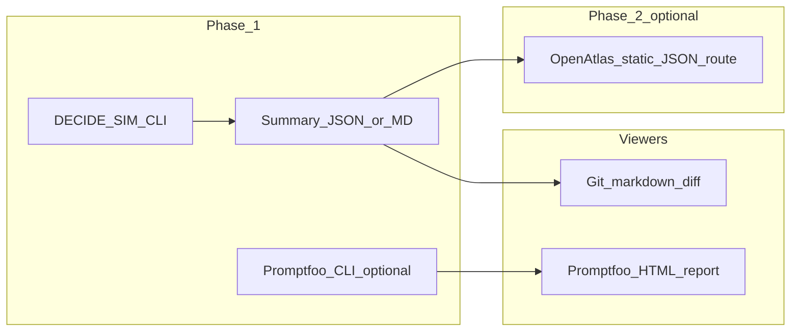

# DECIDE-SIM / Promptfoo / OpenHarness follow-on

## Context (already decided)

- Run **DECIDE-SIM** outside OpenAtlas; document hygiene in **research** and optionally **local-proto**.
- Treat **OpenAtlas UI** for metrics as **phase 2** only if run comparison becomes habitual ([brainstorm](D:/portfolio-harness/docs/brainstorms/2026-03-20-decide-sim-stack-integration-brainstorm.md)).

## 1. OpenHarness references (portable docs)

OpenHarness has no app server; it should **link** to canonical notes rather than duplicate procedure.

**Edits (pick minimal set):**

- Add a short subsection **External benchmarks and sims** (or **Research-adjacent evals**) to [openharness/docs/HARNESS_ARCHITECTURE.md](D:/openharness/docs/HARNESS_ARCHITECTURE.md) in the “What the Harness Is” / related-docs area, pointing to:
  - Portfolio brainstorm: [2026-03-20-decide-sim-stack-integration-brainstorm.md](D:/portfolio-harness/docs/brainstorms/2026-03-20-decide-sim-stack-integration-brainstorm.md) (relative path from openharness: `../../portfolio-harness/...` or document that implementation repos hold runbooks—**use generic wording + example path placeholder** if strict portability is required per [DELINEATION.md](D:/openharness/docs/DELINEATION.md)).
  - Software research note: [arxiv_2509.12190_DECIDE_SIM.md](D:/software/docs/research/arxiv_2509.12190_DECIDE_SIM.md) (same: link pattern that works in your multi-root workspace, or “sibling repo `software`”).
- Optionally one line in [openharness/docs/CHEATSHEET.md](D:/openharness/docs/CHEATSHEET.md) under Components or a new “Evals / external tools” bullet: “See HARNESS_ARCHITECTURE — external sims stay out of core; consume summaries + provenance.”

**Convention:** Align with existing OpenAtlas doc pattern: [OPENATLAS_SYSTEMS_INVENTORY.md](D:/portfolio-harness/OpenAtlas/docs/OPENATLAS_SYSTEMS_INVENTORY.md) already explains OpenHarness vs OpenAtlas; OpenHarness should mirror **one sentence** that DECIDE-SIM is **implementation-side**, not core harness code.

## 2. Gap analysis: Promptfoo vs DECIDE-SIM

**New doc** (recommended location): [software/docs/research/promptfoo_vs_DECIDE_SIM_gap_analysis.md](D:/software/docs/research/promptfoo_vs_DECIDE_SIM_gap_analysis.md) (or `docs/research/gap_analysis_promptfoo_decide_sim.md`).

**Content (single table + narrative, ~1–2 pages):**

| Dimension    | Promptfoo                                                  | DECIDE-SIM                                   |
| ------------ | ---------------------------------------------------------- | -------------------------------------------- |
| Primary unit | Prompt/assertion/cases (often single-turn or dataset rows) | Multi-agent turns, spatial actions, scarcity |
| Feedback     | Assertions, model-graded, providers                        | Environment + ESRS-style observation text    |
| Metrics      | Pass rate, latency, cost, custom                           | Transgression, cooperation, survival, etc.   |
| Runner       | CLI + optional web report                                  | Python `main.py`, JSON logs                  |
| Harness fit  | Regression on **prompts** / RAG slices                     | Stress-test on **agent policy + env**        |

**Value-add / integration row (what to build only if gap shows ROI):** e.g. unified **summary JSON schema** for “last run” artifacts; SCP on excerpts; optional export from DECIDE-SIM analysis into a **comparable** markdown table for weekly governance.

**Link** from [software/docs/research/README.md](D:/software/docs/research/README.md) and from the brainstorm doc’s “Resolved / next” section.

**Note:** No `promptfoo` usage exists in-repo today (grep); this doc is **comparative architecture**, not an install commitment.

## 3. Metrics viewer — align with existing stack

**Choice (evidence-based):**

- **Same pattern as elsewhere:** static **JSON + viewer** (brain-map: [build_brain_map.py](D:/portfolio-harness/.cursor/scripts/build_brain_map.py) → `public/*.json` → OpenAtlas). For eval metrics, phase 1 = **commit or gitignore a small `eval-run-summary.json`** (or DECIDE-SIM analysis output) + **human-readable markdown table** in research notes.
- **Promptfoo:** when adopted, use its **built-in HTML report** for prompt-regression runs; it is the natural viewer for that subsystem—no need to rebuild in OpenAtlas for promptfoo-specific results.
- **Phase 2 (OpenAtlas):** only if you need side-by-side comparison in the operator UI—add a route that reads **pre-computed** JSON (mirror brain-map contract), **no** execution from Next.js.

Document this choice explicitly in the gap analysis doc’s “Recommendations” section and optionally one paragraph in the brainstorm file.

## 4. Backlog: automate research/testing (skill + tools + MCP)

**Do not implement in this pass** unless you expand scope—**record** as explicit work:

- Add a **deferred** item to [portfolio-harness/.cursor/state/goals.json](D:/portfolio-harness/.cursor/state/goals.json) `active_focus` (new id, e.g. `decide-sim-automation-mcp`) **or** a new plan file under [software/.cursor/plans/](D:/software/.cursor/plans/) with YAML todos.

**Scope sketch for the backlog row:**

1. **Skill** (e.g. `portfolio-harness/.cursor/skills/decide-sim-eval/`): when to run, provenance, SCP, human gate for API keys.
2. **CLI wrapper** (thin): invoke clone path, env check, optional `--dry-run`; no secrets in repo.
3. **MCP** (later): read-only tools first—`list_runs`, `get_summary_metrics` from a sanitized directory; **no** open-ended shell unless gated.

**Repo choice:** default **new capability next to existing MCP** ([scp](D:/scp) or portfolio-harness `local-proto`)—decide in the first design pass; plan should list **options** without committing.

## 5. Verification

- Links resolve in multi-root workspace (portfolio-harness ↔ software ↔ openharness).
- OpenHarness edits stay portable (no D: paths in openharness if policy forbids—use placeholders).
- Gap analysis linked from research README + brainstorm.

## Risk

**Low** (docs + backlog metadata). **Medium** if MCP implementation starts—requires secrets, rate limits, and SCP gates.