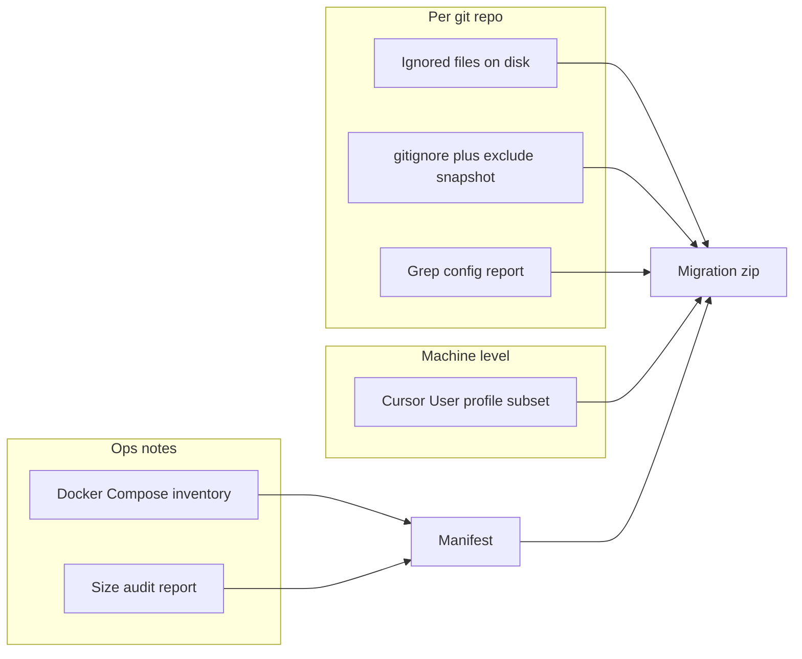

# Compressed migration bundle (second dev machine)

## Scope (confirmed)

- **Repos:** [D:\software](D:\software), [D:\portfolio-harness](D:\portfolio-harness), [D:\openharness](D:\openharness), [D:\scp](D:\scp), [D:\moltbook-watchtower](D:\moltbook-watchtower), [D:\Arc_Forge](D:\Arc_Forge), [D:\prusa_XL_soft](D:\prusa_XL_soft), [D:\VibeLedger](D:\VibeLedger).
- **Machine-level Cursor:** Include `%APPDATA%\Cursor` and `%USERPROFILE%\.cursor` with **cache/log exclusions** to keep the zip usable (see below).

## What to copy (conceptual)

### 1) Per-repo: “what GitHub does not have”

- **Snapshot ignore rules:** Copy each repo’s root [.gitignore](D:\software.gitignore) and nested `.gitignore` files that exist; copy [.git/info/exclude](D:\software.git\info\exclude) if present (path may not exist in all clones—skip if missing).
- **Enumerate ignored files that exist:** From each repo root, use Git’s index of ignored/untracked files, then **filter out regenerable giants**:
  - **Always exclude from copy (still list in “skipped_large.txt”):** `node_modules`, `.pnpm-store`, `venv`, `.venv`, `ENV`, `__pycache__`, `.pytest_cache`, `.tox`, `dist`, `build`, `.next`, `target`, `.gradle`, `.git` (optional: never copy `.git`—you will `git clone` on the new machine).
  - **Include as candidates:** patterns your trees already ignore, e.g. `.env`, `.env.*` (except `.env.example`), `[D:\software\.gitignore](D:\software\.gitignore)` lines 27–34 (`.cursor/brain-map.env`), `[D:\portfolio-harness\.gitignore](D:\portfolio-harness\.gitignore)` `orchestrator_config.json`, `.cursor/private/`, local SQLite (`*.db`, `*.sqlite` per software root ignore), and any other small/medium ignored files.

**Implementation note:** `git ls-files -o -i --exclude-standard` lists ignored, untracked paths—ideal for “USB candidates.” Pipe through a filter script that drops excluded directory prefixes.

### 2) Config-loading discovery (report, not necessarily every file)

- Run **bounded** ripgrep (or `findstr` fallback) per repo for: `dotenv`, `load_dotenv`, `process.env`, `os.environ`, `getenv`, `config/local`, `.env`.
- Write `**CONFIG_HINTS.txt`** (one section per repo) listing matching files/lines count—used to remind you what to recreate if a path was skipped.

### 3) Size audit

- For each repo root, emit **top N largest directories** (PowerShell `Get-ChildItem -Directory -Recurse` is slow on huge trees—prefer **one-level** size plus **depth-2** for `subprojects` only, or use `robocopy /L /NJH /BYTES` trick for top folders). Goal: separate **regenerable** (e.g. `node_modules`) from **data** (e.g. `*.sqlite`, `uploads/`).

### 4) Services inventory (Docker)

- Discover compose files (examples already under [D:\software](D:\software): [docker-compose.yml](D:\software\docker-compose.yml), `docker-compose.prod.yml`, `docker-compose.vlans.yml`, [job-automation-service/docker-compose.yml](D:\software\job-automation-service\docker-compose.yml), etc.).
- In the manifest, for each compose file: **service names**, **bind mounts**, **named volumes** (e.g. `postgres_data` in root compose). Add a short **“data not in repo”** note: named volumes require `docker run` backup or accepting fresh DB on new PC.

### 5) Machine-level Cursor export (your choice)

- Copy `**%APPDATA%\Cursor\User`** (or the folder that contains `settings.json` / `keybindings.json`) and `**%USERPROFILE%\.cursor`**.
- **Exclude** (typical bloat / non-portable): `**/Cache/`**, `**/CachedData/`**, `**/GPUCache/**`, `**/Code Cache/**`, `**/logs/**`, `**/*.log`, large `**/blob_storage/**` if present. Keep: `settings.json`, `keybindings.json`, `snippets`, `globalStorage` selectively if small (or full `globalStorage` if you rely on extension state—accept larger zip).

### 6) Single manifest

Create `**MIGRATION_MANIFEST.txt**` at the zip root with:

- Table: **repo name | absolute source path | relative paths copied | skipped patterns | install on new machine** (e.g. `git clone …`, `pnpm i` / `pip install -r`, `docker compose up`, “copy `.env` from bundle to …”).
- **Security line:** “Contains secrets—encrypt archive; rotate keys after migration if disk was not encrypted.”
- **Docker:** volume backup commands or “recreate empty DB” decision.

### 7) Compress

- Stage everything under a single folder, e.g. `D:\migration_export_YYYYMMDD\`.
- Produce `**dev-migration_YYYYMMDD.zip`** (PowerShell `Compress-Archive` or **7-Zip** with AES if available).
- **Do not** rely on USB confidentiality; treat the zip as sensitive if `.env` or orchestrator configs are inside ([portfolio-harness ignores](D:\portfolio-harness.gitignore) `orchestrator_config.json` and `.cursor/private/`).

## Deliverable in repo (implementation after you approve)

- Add `**scripts/export_dev_migration_bundle.ps1`** (or under `D:\software\scripts\` if you prefer one repo to own it) that:
  - Accepts `-RepoRoots` (defaults to the eight paths), `-OutputDir`, `-ExcludeDirPatterns`, `-IncludeAppDataCursor` switch.
  - Writes `CONFIG_HINTS.txt`, `SIZE_AUDIT.txt`, `DOCKER_INVENTORY.txt`, `skipped_large.txt`, `MIGRATION_MANIFEST.txt`, then zips.

## Execution order (when you run it, post-approval)

1. Run script once in **dry-run** mode (list files only, no copy) and review size.
2. Adjust excludes if a needed path was filtered.
3. Full run + zip.
4. On new PC: clone repos, restore profile folders, copy per-repo ignored files into matching paths, reinstall deps, restore or recreate Docker volumes per manifest.

## Risks / gaps

- **VibeLedger** may have an unusual layout (`VibeLedger/` untracked nested); script should log if `.git` is missing or repo is not a clean clone.
- **SSH keys** are not in git but are not under these repos—manifest should **remind** to copy `%USERPROFILE%\.ssh` separately if you rely on the same keys (or regenerate on new machine).
- **Portfolio-harness** ignores extensive `[.cursor/state](D:\portfolio-harness\.gitignore)` paths; decide case-by-case whether to copy `handoff_latest.md` etc.—script can include an **optional** `-IncludeCursorState` flag for a second, larger “context” add-on zip.

