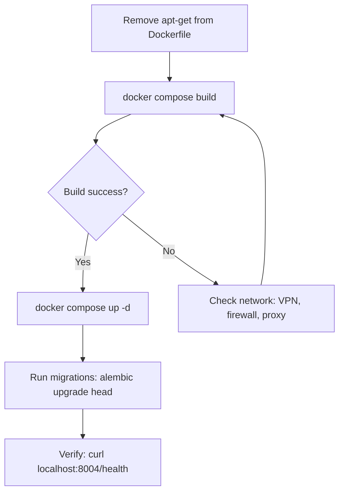

# Docker Integration and Dependency To-Do Plan

## Current State

- **Docker build**: Fails at `apt-get update` with "Connection refused" to deb.debian.org (network/firewall)
- **PostgreSQL containers** (mystifying_gates, confident_sanderson): Exited with "POSTGRES_PASSWORD not specified" — these appear to be standalone `docker run` attempts, not from compose
- **docker-compose.yml**: Correctly sets `POSTGRES_PASSWORD=password` for `job-automation-db`
- **Volume**: `job-automation-service_jobautomation_db` (47.1 MB) exists — stack ran successfully before

---

## 1. Docker Build Fix (Primary)

**Root cause**: `apt-get` cannot reach deb.debian.org. The Dockerfile installs `gcc`, `libpq-dev`, `postgresql-client` for psycopg2 source-build fallback.

**Solution**: Remove the apt-get step. `psycopg2-binary>=2.9.11` has pre-built wheels for Python 3.11 on Linux — no compilation needed. Pip fetches from PyPI (different hosts than Debian), so the build may succeed even when Debian mirrors are blocked.

**Change** in [job-automation-service/Dockerfile](D:\software\job-automation-service\Dockerfile):

```dockerfile
FROM python:3.11-slim

WORKDIR /app

# psycopg2-binary has wheels for cp311; no apt-get needed (avoids deb.debian.org network dependency)
# Copy requirements and install Python dependencies
COPY requirements.txt .
RUN pip install --no-cache-dir -r requirements.txt
```

Remove lines 5–10 (the entire `RUN apt-get update && apt-get install...` block).

---

## 2. If Build Still Fails (Network Blocks PyPI Too)

If pip also cannot reach PyPI, the problem is broader network restriction. Document in [job-automation-service/README.md](D:\software\job-automation-service\README.md) troubleshooting:

- **VPN**: Disconnect or configure split-tunneling so Docker can reach the internet
- **Firewall**: Allow Docker Desktop / WSL2 outbound HTTP (80) and HTTPS (443)
- **Proxy**: Configure Docker daemon proxy if behind corporate proxy
- **Test**: `docker run --rm alpine ping -c 2 8.8.8.8` and `docker run --rm alpine wget -qO- https://pypi.org` to isolate DNS/HTTP

---

## 3. PostgreSQL Container (mystifying_gates, confident_sanderson)

Those containers failed because they were started **without** `POSTGRES_PASSWORD` (e.g. `docker run postgres:15-alpine`). The compose stack sets it correctly.

**Action**: Delete those failed containers. When using `docker compose up -d`, the `job-automation-db` service will start with `POSTGRES_PASSWORD=password` from [docker-compose.yml](D:\software\job-automation-service\docker-compose.yml) lines 6–8.

---

## 4. To-Do: Pip Dependency Conflict Warnings

Add to [docs/TODO_FIXME_TRACKING.md](D:\software\docs\TODO_FIXME_TRACKING.md) (or a new `docs/DEPENDENCY_CONFLICTS.md`):

**Item**: Pip dependency conflicts when installing D:\software requirements alongside chromadb, daggr, gradio, mcp, ollama, theharvester, etc.

**Proposed solutions**:


| Solution                      | Effort | Trade-off                                                                                                                                 |
| ----------------------------- | ------ | ----------------------------------------------------------------------------------------------------------------------------------------- |
| **A. Virtual environment**    | Low    | `python -m venv .venv` then `pip install -r requirements.txt`. Isolates D:\software from global packages. Recommended for development.    |
| **B. Project-specific venv**  | Low    | Add `.venv/` to `.gitignore`, document `source .venv/bin/activate` (or `.venv\Scripts\activate` on Windows) in README.                    |
| **C. Relax version pins**     | Medium | Loosen D:\software pins (e.g. `httpx>=0.25.2`, `uvicorn>=0.24.0`) to allow newer versions. Risk: may break compatibility with older code. |
| **D. Ignore warnings**        | None   | If conflicting tools still work, no action. Pip does not block install.                                                                   |
| **E. Separate envs per tool** | High   | Use `uv`, `poetry`, or `conda` with per-project lockfiles. Best isolation, more setup.                                                    |


**Recommendation**: A + B — use a venv for D:\software and document it.

---

## 5. Execution Order




---

## Files to Modify

1. **[job-automation-service/Dockerfile](D:\software\job-automation-service\Dockerfile)** — Remove apt-get block
2. **[docs/TODO_FIXME_TRACKING.md](D:\software\docs\TODO_FIXME_TRACKING.md)** — Add dependency conflict to-do with solutions (or create `docs/DEPENDENCY_CONFLICTS.md`)
3. **[job-automation-service/README.md](D:\software\job-automation-service\README.md)** — Expand "Docker build fails" troubleshooting if needed (already has a stub)

---

## Verification

After applying the Dockerfile change:

```powershell
cd D:\software\job-automation-service
docker compose build job-automation-service
docker compose up -d
docker compose ps
curl http://localhost:8004/health
```

