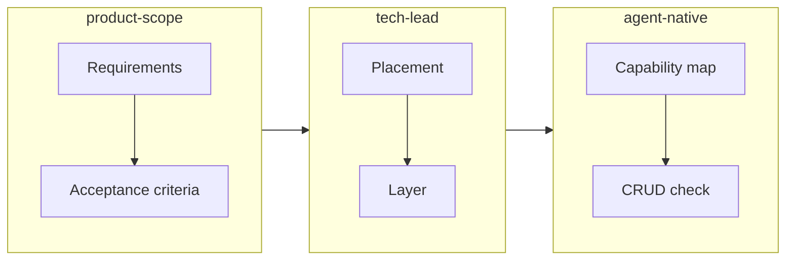

# Best Prompt for Creating a Docker MCP Skill

## Context

You already have:

- **docker-mcp skill** (`[.cursor/skills/docker-mcp/SKILL.md](d:\portfolio-harness\.cursor\skills\docker-mcp\SKILL.md)`) — documents the `uvx docker-mcp` MCP server
- **docker MCP** in [mcp.json](d:\portfolio-harness.cursor\mcp.json) — list, inspect, create, start, stop, remove, prune, logs, stats
- **MCP_CAPABILITY_MAP** — user action → agent tool mapping

**Watchtower** ([containrrr.dev/watchtower](https://containrrr.dev/watchtower/)) adds: automated image updates, `--run-once`, scheduling, HTTP API mode, rolling restarts, lifecycle hooks. The current docker MCP does not expose Watchtower-style automation.

---

## Recommended Meta-Prompt (Copy-Paste Ready)

Use this prompt to elicit a well-scoped, agent-native Docker MCP skill:

```
Create an MCP skill for managing and automating Docker containers. Apply product-scope, tech-lead, and agent-native-architecture disciplines.

**Scope:**
- Extend or complement the existing docker-mcp skill (uses uvx docker-mcp)
- Include Watchtower (containrrr.dev/watchtower) for automated image updates: run-once, scheduling, HTTP API, rolling restarts
- Agent should achieve parity with what a human can do via Docker CLI + Watchtower

**Constraints:**
- Destructive ops (remove, prune) require APPROVAL_NEEDED; SAFETY_ALLOW_DESTRUCTIVE_OPERATIONS=false by default
- Follow existing patterns in .cursor/skills/docker-mcp/SKILL.md
- Update MCP_CAPABILITY_MAP.md with new user actions → agent tools

**Deliverables:**
1. Product-scope: Requirements (numbered), acceptance criteria (Given/When/Then)
2. Tech-lead: Placement (extend docker-mcp vs new skill), path, rationale
3. Agent-native: Capability map (user action → agent tool), CRUD completeness for containers/images, tools-as-primitives check
4. SKILL.md with triggers, capability map, approval boundary, compose/deploy workflow

**Reference:** [Watchtower docs](https://containrrr.dev/watchtower/), [docker-mcp SKILL](.cursor/skills/docker-mcp/SKILL.md)
```

---

## Workflow: product-scope → tech-lead → agent-native




1. **product-scope first** — Elicit: What Docker + Watchtower actions must the agent achieve? Success criteria?
2. **tech-lead second** — Decide: Extend [docker-mcp SKILL](d:\portfolio-harness.cursor\skills\docker-mcp\SKILL.md) vs new `docker-watchtower` or `docker-automation` skill. Path: `.cursor/skills/<name>/SKILL.md`.
3. **agent-native third** — Verify: Action parity, tools as primitives, CRUD completeness, capability discovery.

---

## Key Design Decisions to Resolve


| Decision                  | Options                                                      | Recommendation                                                                                                                                 |
| ------------------------- | ------------------------------------------------------------ | ---------------------------------------------------------------------------------------------------------------------------------------------- |
| **Skill vs MCP**          | Skill only (orchestrates run_terminal_cmd) vs new MCP server | Skill + run_terminal_cmd for Watchtower; docker-mcp already covers container CRUD. No new MCP unless you need programmatic Watchtower control. |
| **Extend vs new**         | Extend docker-mcp vs new skill                               | Extend docker-mcp: add "Automation" section for Watchtower (run-once, schedule, HTTP API). Single skill, single source of truth.               |
| **Watchtower invocation** | MCP tool vs run_terminal_cmd                                 | `run_terminal_cmd` to `docker run containrrr/watchtower --run-once ...` is sufficient. Agent composes; no new MCP needed.                      |


---

## Agent-Native Audit Checklist (Docker Layer)

Before finalizing, verify against [agent-native-architecture](C:\Users\schum.cursor\plugins\cache\cursor-public\compound-engineering\e1906592cbd49889beb82e1be76359398b6d3d58\skills\agent-native-architecture\SKILL.md):


| Principle                | Docker MCP                                              | Watchtower                   | Gap                                                |
| ------------------------ | ------------------------------------------------------- | ---------------------------- | -------------------------------------------------- |
| **Action parity**        | list, inspect, create, start, stop, remove, prune, logs | run-once, schedule, HTTP API | Add Watchtower run-once/schedule to capability map |
| **Tools as primitives**  | docker_* are primitives                                 | N/A (CLI invocation)         | OK                                                 |
| **CRUD completeness**    | Container: C,R,U,D; Image: R,D (create via pull)        | N/A                          | Image Create = pull; document in skill             |
| **Capability discovery** | Skill describes capability map                          | —                            | Ensure Watchtower actions in skill description     |


---

## Suggested Prompt Phases

**Phase 1 (scope):** "What Docker + Watchtower actions must the agent achieve? List requirements and acceptance criteria."

**Phase 2 (placement):** "Where should Watchtower automation live? Extend docker-mcp or new skill? Path and rationale."

**Phase 3 (implementation):** "Create/update the SKILL.md with Watchtower section, capability map, and approval boundary. Update MCP_CAPABILITY_MAP."

---

## Files to Touch

- `[.cursor/skills/docker-mcp/SKILL.md](d:\portfolio-harness\.cursor\skills\docker-mcp\SKILL.md)` — add Watchtower automation section
- `[.cursor/docs/MCP_CAPABILITY_MAP.md](d:\portfolio-harness\.cursor\docs\MCP_CAPABILITY_MAP.md)` — add Watchtower user actions
- Optional: `.cursor/state/scope_docker_watchtower.md` — if scope is large enough

---

## Critic Report (Pre-Completion)

```json
{
  "pass": true,
  "score": 0.85,
  "issues": [
    {"type": "scope", "detail": "Clarify whether Watchtower HTTP API mode needs agent-triggered updates vs cron-only"},
    {"type": "parity", "detail": "Verify docker-compose deploy is fully covered in existing docker-mcp"}
  ],
  "fixes": [
    {"action": "elicit", "detail": "Ask user: Do you need agent to trigger Watchtower updates via HTTP API, or is run-once/schedule sufficient?"},
    {"action": "audit", "detail": "Run agent-native audit on docker layer after skill update"}
  ]
}
```

