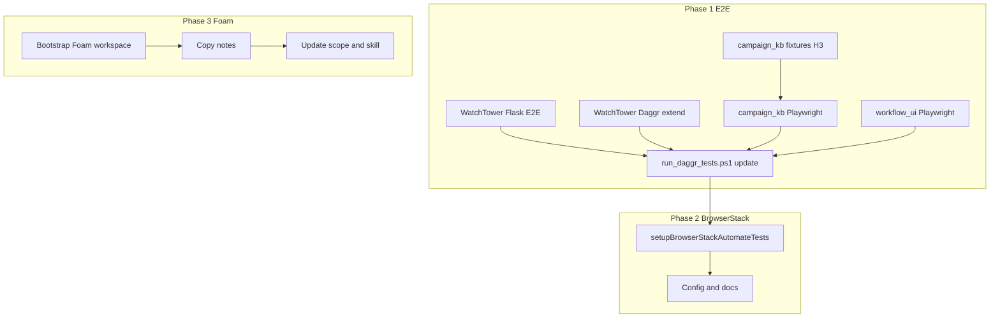

# E2E Playwright + BrowserStack + Foam Migration Plan

## Current State Summary

| Stack       | Web UI                   | Playwright                                     | Gaps                               |
| ----------- | ------------------------ | ---------------------------------------------- | ---------------------------------- |
| WatchTower  | Flask :5000, Daggr :7860 | `test_daggr_playwright_smoke.py` (Gradio only) | No Flask dashboard/redirect E2E    |
| campaign_kb | Daggr :7860              | None                                           | Needs fixtures (H3); no Playwright |
| workflow_ui | Flask :5001              | API only (`test_api.py -k kb_daggr`)           | No browser E2E                     |

**Existing assets:**

- [run_daggr_tests.ps1](D:\portfolio-harness.cursor\scripts\run_daggr_tests.ps1) — already runs Playwright smoke (when not `-SkipPlaywright`); has quantitative summary
- [test_daggr_playwright_smoke.py](D:\portfolio-harness\WatchTower_main\WatchTower_main\tests\e2e\test_daggr_playwright_smoke.py) — drives simple workflow via `daggr_server` fixture
- [conftest.py](D:\portfolio-harness\WatchTower_main\WatchTower_main\tests\e2e\conftest.py) — `DAGGR_E2E_SERVER=auto` starts Gradio on :7860
- foam-pkm skill exists at [.cursor/skills/foam-pkm/](D:\portfolio-harness.cursor\skills\foam-pkm\SKILL.md)
- [scope_foam_pkm_skill.md](D:\portfolio-harness.cursor\state\scope_foam_pkm_skill.md) — tool selection logic

**Port conflict:** WatchTower and campaign_kb both use Gradio :7860. E2E runs must be sequential or use different ports per stack.

---

## Phase 1: E2E Playwright Matrix

### 1.1 WatchTower Flask E2E (new)

**Target:** [WatchTower_main/WatchTower_main/](D:\portfolio-harness\WatchTower_main\WatchTower_main)

- Add `tests/e2e/test_flask_playwright_smoke.py`:
  - Start Flask on :5000 (fixture or `DAGGR_E2E_SERVER=manual` + assume running)
  - Test: dashboard loads (e.g. `/` or `/dashboard` returns 200, contains nav)
  - Test: `/tools/daggr` redirect returns 302 with `Location` header
- Reuse or extend [conftest.py](D:\portfolio-harness\WatchTower_main\WatchTower_main\tests\e2e\conftest.py) for Flask base URL fixture
- Reference: [daggr_test_matrix.md](D:\portfolio-harness.cursor\docs\daggr_test_matrix.md) UI verification section

### 1.2 WatchTower Daggr E2E (extend existing)

- Add `test_daggr_stack_overview_loads` if [stack_overview](D:\portfolio-harness.cursor\docs\daggr_test_matrix.md) workflow is implemented
- Keep existing `test_daggr_simple_workflow_loads` and `test_daggr_simple_workflow_run`

### 1.3 campaign_kb Playwright (H3)

**Target:** [Arc_Forge/campaign_kb](D:\Arc_Forge\campaign_kb)

- **Fixtures first:** Add in-memory SQLite or mock DB layer so search/merge/ingest workflows run without real DB ([pending_tasks H3](D:\portfolio-harness.cursor\state\pending_tasks.md))
- Add `tests/e2e/` with `conftest.py` (start Gradio for search workflow on :7860 or alternate port)
- Add `test_campaign_kb_search_workflow_loads` — page loads, search input visible
- Port conflict: Run campaign_kb E2E in separate pytest run or use `GRADIO_SERVER_PORT=7861` when testing campaign_kb

### 1.4 workflow_ui Playwright

**Target:** [Arc_Forge/ObsidianVault/workflow_ui](D:\Arc_Forge\ObsidianVault\workflow_ui)

- Add `tests/e2e/` with Playwright tests:
  - `test_index_loads` — index page returns HTML, contains "KB Workflows" link
  - `test_tools_kb_daggr_redirect` — `/tools/kb-daggr` returns 302 with `Location`
- Requires `pytest-playwright`, `conftest.py` with base URL fixture (Flask :5001)
- Reference: [daggr_test_matrix.md](D:\portfolio-harness.cursor\docs\daggr_test_matrix.md) workflow_ui section

### 1.5 Unified runner updates

- Update [run_daggr_tests.ps1](D:\portfolio-harness.cursor\scripts\run_daggr_tests.ps1):
  - Add WatchTower Flask E2E run (after or before Daggr smoke)
  - Add campaign_kb E2E run (with port or sequential ordering)
  - Add workflow_ui E2E run
  - Ensure quantitative summary includes all new stacks
- Update [daggr_test_matrix.md](D:\portfolio-harness.cursor\docs\daggr_test_matrix.md) with new Playwright commands

---

## Phase 2: BrowserStack Integration

### 2.1 Setup

- Use `mcp_browserstack_setupBrowserStackAutomateTests` per [run-web-tests-on-browserstack skill](C:\Users\schum.cursor\plugins\cache\cursor-public\browserstack\b3ef869a2c9faceebd58e6a319a409433ccc3244\skills\run-web-tests-on-browserstack\SKILL.md)
- Parameters: `detectedBrowserAutomationFramework: "playwright"`, `detectedTestingFramework: "pytest"`, `detectedLanguage: "python"`
- Project name: e.g. `portfolio-harness-daggr`
- Devices: e.g. Chrome + Firefox on Windows 11 (start minimal; expand later)

### 2.2 Configuration

- Add BrowserStack config to WatchTower (and optionally workflow_ui) per tool output
- Ensure `BROWSERSTACK_`* env vars or config file for CI
- Document in [daggr_test_matrix.md](D:\portfolio-harness.cursor\docs\daggr_test_matrix.md) or new `BROWSERSTACK_E2E.md`

### 2.3 Optional: CI integration

- Add optional step in `run_daggr_tests.ps1` or separate script to run BrowserStack suite when `BROWSERSTACK_USERNAME` is set

---

## Phase 3: Foam Migration

### 3.1 Target and bootstrap

- **Target path:** User to specify (e.g. `D:\Arc_Forge\FoamWorkspace` or subfolder of ObsidianVault)
- Bootstrap Foam:
  - Create `.foam/templates/` with `daily-note.md` template
  - Add `.vscode/settings.json` with Foam extension settings (wikilinks, daily notes path)
  - Reference: [scope_foam_pkm_skill.md](D:\portfolio-harness.cursor\state\scope_foam_pkm_skill.md), [foam_pkm_skill_creation plan](D:\software.cursor\plans\foam_pkm_skill_creation_0cf4a9bb.plan.md)

### 3.2 Content migration

- Copy notes from [D:/Arc_Forge/ObsidianVault](D:\Arc_Forge\ObsidianVault) to Foam workspace
- Preserve: `[[wikilinks]]`, `![[embeds]]`, `#tags`, folder structure
- Exclude: `.obsidian/`, `workflow_ui/` (or keep workflow_ui in place and document)
- Script or manual: `robocopy` or PowerShell copy with exclude list

### 3.3 Tool selection update

- Update [scope_foam_pkm_skill.md](D:\portfolio-harness.cursor\state\scope_foam_pkm_skill.md): Foam workspace path as primary; ObsidianVault as legacy
- Update [foam-pkm SKILL.md](D:\portfolio-harness.cursor\skills\foam-pkm\SKILL.md): Prefer filesystem for new Foam workspace
- Handoff: Replace `session_save` with filesystem-based "session summary" (write to daily note) when Foam is primary

### 3.4 Verification

- Agent creates note in Foam workspace using `write_file` (not obsidian-vault)
- Wikilinks and tags render correctly in Foam/VS Code

---

## Phase 4: Frontier-Ops and Observability

### 4.1 Seam design

- Load [frontier-ops skill](D:\portfolio-harness.cursor\skills\frontier-ops\SKILL.md); consult frontier-ops-kb (path: `D:\CodeRepositories\frontier-ops-kb` — verify exists)
- Document verification seams for E2E:
  - Input: URL, expected elements
  - Verification: Playwright assertions, pass/fail
  - Recovery: Retry, skip, report
- Reference: [MCP_SEAM_DESIGN.md](D:\portfolio-harness\local-proto\docs\MCP_SEAM_DESIGN.md), [OBSERVABILITY_LAYER.md](D:\portfolio-harness\local-proto\docs\OBSERVABILITY_LAYER.md)

### 4.2 Failure modes

- Server not started → skip or fail with clear message
- Port conflict → sequential runs or port config
- BrowserStack timeout → document retry policy

### 4.3 Observability boundaries

- Per [OBSERVABILITY_LAYER.md](D:\portfolio-harness\local-proto\docs\OBSERVABILITY_LAYER.md): AI has no access to audit log, Prometheus, Grafana
- E2E test results are in-band (pytest output); no change to observability layer

---

## Phase 5: Frontend Design (when touching UI)

- Load [frontend-design skill](C:\Users\schum.cursor\plugins\cache\cursor-public\compound-engineering\e1906592cbd49889beb82e1be76359398b6d3d58\skills\frontend-design\SKILL.md) when modifying WatchTower dashboard, workflow_ui, or Gradio UIs
- Apply distinctive aesthetics, avoid generic AI look

---

## Implementation Order

**Recommended sequence:** 1.1 → 1.4 → 1.5 (WatchTower Flask + workflow_ui + runner) → 1.3 → 1.4 (campaign_kb fixtures + Playwright) → 2 → 3. Phase 4 (frontier-ops) and 5 (frontend-design) are continuous during implementation.

---

## Key Files

| Purpose         | Path                                                                                 |
| --------------- | ------------------------------------------------------------------------------------ |
| Test matrix     | [daggr_test_matrix.md](D:\portfolio-harness.cursor\docs\daggr_test_matrix.md)        |
| Unified runner  | [run_daggr_tests.ps1](D:\portfolio-harness.cursor\scripts\run_daggr_tests.ps1)       |
| Foam scope      | [scope_foam_pkm_skill.md](D:\portfolio-harness.cursor\state\scope_foam_pkm_skill.md) |
| Pending H3/H4   | [pending_tasks.md](D:\portfolio-harness.cursor\state\pending_tasks.md)               |
| Stack overview  | Daggr MCP `get_stack_overview()`                                                     |
| MCP seam design | [MCP_SEAM_DESIGN.md](D:\portfolio-harness\local-proto\docs\MCP_SEAM_DESIGN.md)       |

---

## Open Questions

1. **Foam target path:** Where should the Foam workspace live? (Same repo as ObsidianVault, sibling, or new folder?)
2. **workflow_ui location:** It currently lives inside ObsidianVault. After Foam migration, should workflow_ui stay in ObsidianVault or move to Foam workspace?
3. **frontier-ops-kb path:** Skill references `D:\CodeRepositories\frontier-ops-kb`. Confirm this path exists or provide alternate.

