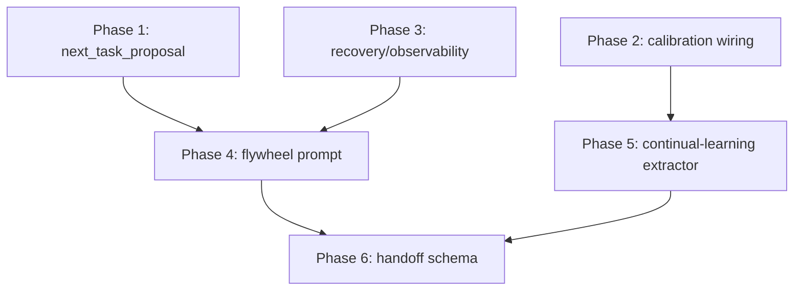

# Flywheel Action Item Extension Plan

## Context

Extends the [model-escalation brainstorm](D:\portfolio-harness\docs\brainstorms\2026-03-10-model-escalation-brainstorm.md) and critic findings. Goal: make local-proto a flywheel driver with self-directed Next proposal, calibration wiring, recovery/observability, continual-learning, and human-gated goal-setting.

---

## Phase 1: Add next_task_proposal Task Type

**Files:** [AI_TASK_EVALS.md](D:\portfolio-harness.cursor\docs\AI_TASK_EVALS.md), [run_model_floor_evals.py](D:\portfolio-harness.cursor\scripts\run_model_floor_evals.py)

**Actions:**

1. Add row to Model-Floor Table in AI_TASK_EVALS.md:
  - Task type: `next_task_proposal`
  - Execution model: 3B–7B
  - Verification: schema check (Next present, self-contained) + human approval
  - Notes: Propose Next from pending_tasks + plans; human edits or approves before handoff
2. Add row to Registry table with test cases and when to run
3. Add `next_task_proposal` to run_model_floor_evals.py (optional; can defer eval until handoff flow is stable)

**Verification:** Schema check = Next section present, 1–2 sentences, references paths or pending_tasks ID

---

## Phase 2: Wire Calibration into Model-Floor Evals

**Files:** [run_model_floor_evals.py](D:\portfolio-harness.cursor\scripts\run_model_floor_evals.py), [calibration_test_suite.md](D:\portfolio-harness.cursor\scripts\calibration_test_suite.md)

**Actions:**

1. In run_model_floor_evals.py, after each model run:
  - Emit `calibration_check` via `log_agent_event.py calibration_check <task_id> <predicted> <actual> [domain]`
  - `task_id` = `model_floor_{task_type}_{model}`
  - `predicted` = human or prior floor (if known); else use smallest-model-first heuristic
  - `actual` = pass/fail from eval
  - `domain` = task_type (e.g. handoff, critic)
2. Add section to calibration_test_suite.md: "Model-floor evals" — link to run_model_floor_evals.ps1; note that it emits calibration_check; model_floor_results.json feeds calibration data
3. Link model_floor_results.json path in calibration_test_suite.md

**log_agent_event schema:** `calibration_check <task_id> <predicted> <actual> [domain]` (already exists)

---

## Phase 3: Add Recovery and Observability to Brainstorm

**Files:** [docs/brainstorms/2026-03-10-model-escalation-brainstorm.md](D:\portfolio-harness\docs\brainstorms\2026-03-10-model-escalation-brainstorm.md)

**Actions:**

1. Add "Recovery" section:
  - If light model fails → escalate to heavy model or human
  - If heavy model disagrees with light output → rollback path (re-run with heavy, or human decides)
2. Add "Observability" section:
  - model_floor_eval events: task_type, model, pass_rate, timestamp (already in agent_log)
  - Structured output in model_floor_results.json (already exists)
3. Add "Escalation" section:
  - If proposed Next/goals conflict with org-intent or scope → output ESCALATE; do not proceed
  - Reference handoff schema Escalation triggers in [state/README.md](D:\portfolio-harness.cursor\state\README.md)

---

## Phase 4: Create Flywheel Session-Start Prompt Variant

**Files:** New [.cursor/state/session_start_prompt_flywheel.txt](D:\portfolio-harness.cursor\state\session_start_prompt_flywheel.txt) (or extend session_start_prompt.txt with optional block)

**Actions:**

1. Create `session_start_prompt_flywheel.txt` that:
  - Instructs agent to read handoff_latest.md, pending_tasks.md, session_brief.md
  - If Next is empty or "Pick next from pending_tasks": propose PROPOSED_NEXT; await human approval before writing to handoff
  - Human gate: do not write to handoff until approved
  - Escalation: if proposed Next conflicts with scope/org-intent → ESCALATE
2. Add copy script or document usage in [COMMANDS_README.md](D:\portfolio-harness.cursor\docs\COMMANDS_README.md) if copy_session_start_prompt.ps1 exists
3. Cross-ref in state/README.md under Memory scripts

**Prompt sketch:**

```
Read handoff_latest.md, pending_tasks.md, session_brief.md (if exists).
If Next is empty or says "Pick next from pending_tasks":
  1. Propose a prioritized Next (1–2 sentences, self-contained) from pending_tasks or plans.
  2. Output: PROPOSED_NEXT: [your proposal]
  3. Await human approval before writing to handoff. Do not write to handoff until approved.
If human approves: write approved Next to handoff and proceed.
If proposed Next conflicts with scope or org-intent: output ESCALATE; do not proceed.
```

---

## Phase 5: Document Continual-Learning Extractor for Model-Floor

**Files:** [.cursor/state/AGENTS.md](D:\portfolio-harness.cursor\state\AGENTS.md), new or existing continual-learning doc

**Actions:**

1. Add "Continual-learning extractor (model-floor)" section to a doc (e.g. [SKILL_SELF_IMPROVEMENT_WINS.md](D:\portfolio-harness.cursor\docs\SKILL_SELF_IMPROVEMENT_WINS.md) or new `.cursor/docs/CONTINUAL_LEARNING_EXTRACTORS.md`):
  - **Match:** Transcripts containing `model_floor`, `model escalation`, `lowest viable model`, `pass rate`, `model_floor_results`
  - **Output:** AGENTS.md bullet: "For task type X, model Y is the observed floor (pass rate Z%)."
  - **Trigger:** Run continual-learning after model-floor evals; or when N handoffs since last run (harness_context: continual-learning due)
  - **Index:** `.cursor/state/continual-learning-index.json` (or `.cursor/hooks/state/` per skill)
2. Add harness_context note to handoff schema in state/README.md: `harness_context: continual-learning due` when model-floor eval completed
3. Ensure run_continual_learning_prompt.ps1 is invoked after model-floor evals (document in AI_TASK_EVALS or run_model_floor_evals.ps1)

---

## Phase 6: Add Escalation Triggers and human_gate to Handoff Schema

**Files:** [.cursor/state/README.md](D:\portfolio-harness.cursor\state\README.md), [continue_prompt.txt](D:\portfolio-harness.cursor\state\continue_prompt.txt)

**Actions:**

1. In state/README.md handoff schema, add or clarify:
  - **human_gate (optional):** When true, proposed Next and goal maps require human approval before handoff write. Use for flywheel mode.
  - **Escalation triggers:** Already exists; add example: "Goal changes without human approval", "Scope drift", "Recursion depth > 3"
  - **Must-nots (flywheel):** "No goal-setting without human approval"; "No unbounded self-direction"
2. Add "Flywheel mode" subsection: when using session_start_prompt_flywheel.txt, set human_gate or Escalation triggers for goal-setting
3. Optionally add recursion_depth to handoff metadata (e.g. when Next is derived from prior Next proposal chain)

---

## Deliverables Summary


| Phase | Artifact                                                        | Purpose                                                 |
| ----- | --------------------------------------------------------------- | ------------------------------------------------------- |
| 1     | AI_TASK_EVALS.md, run_model_floor_evals.py                      | next_task_proposal task type                            |
| 2     | run_model_floor_evals.py, calibration_test_suite.md             | calibration_check emission, linkage                     |
| 3     | model-escalation brainstorm                                     | Recovery, Observability, Escalation sections            |
| 4     | session_start_prompt_flywheel.txt, COMMANDS_README              | Flywheel prompt with human gate                         |
| 5     | CONTINUAL_LEARNING_EXTRACTORS.md or SKILL_SELF_IMPROVEMENT_WINS | Model-floor extractor spec                              |
| 6     | state/README.md                                                 | human_gate, Escalation triggers, Must-nots for flywheel |


---

## Dependency Order




Phases 1, 2, 3 can run in parallel. Phase 4 depends on 1 and 3. Phase 5 depends on 2. Phase 6 depends on 4 and 5.

---

## Risk and Mitigation


| Risk                   | Mitigation                                                            |
| ---------------------- | --------------------------------------------------------------------- |
| Runaway self-direction | human_gate, Escalation triggers, Must-nots; recursion depth limit     |
| Prompt-only flywheel   | Verification: schema check for PROPOSED_NEXT; human approval required |
| Calibration noise      | calibration_check uses task_id; domain filter for model-floor         |


