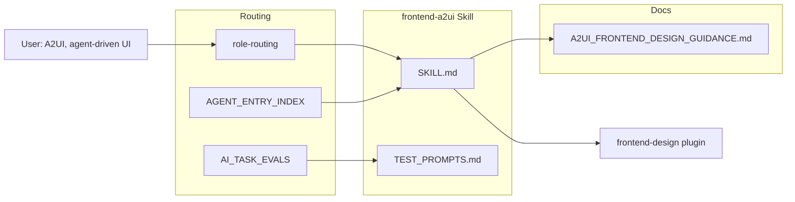

# Frontend-A2UI Skill and Critic Fixes

## Context

Add a harness skill for A2UI frontend design and resolve critic issues from the verification workflow proposal:

1. **policy_deviation:** AI_TASK_EVALS requires 3–5 test cases; use 3–5 prompts
2. **placement_ambiguity:** TEST_PROMPTS.md placement — use `.cursor/skills/frontend-a2ui/TEST_PROMPTS.md` (skill folder, like foam-pkm)
3. **verification_clarity:** Define explicit pass criteria (output observables, not "agent loads")

## Architecture




## Implementation Steps

### Step 1: Create frontend-a2ui skill

**Path:** [.cursor/skills/frontend-a2ui/SKILL.md](D:/portfolio-harness/.cursor/skills/frontend-a2ui/SKILL.md)

**Content (YAML frontmatter + body):**

```yaml
---
name: frontend-a2ui
description: Build catalog-ready frontend components for agent-driven UIs (A2UI, A2A). Composes with frontend-design skill. Use when building components for agent-generated or A2A surfaces.
triggers_any: ["A2UI", "agent-driven UI", "catalog-ready", "A2A surface", "agent-generated interface"]
do_not_trigger_if: ["generic frontend only", "no agent/UI context"]
exclusive_with: []
required_inputs: ["component or interface description; agent/UI context"]
exit_criteria: "Output has semantic names, design tokens, checklist items; references A2UI guidance."
output_schema: "Component code or spec with semantic names, CSS variables, accessibility."
---
```

**Body:** Load [A2UI_FRONTEND_DESIGN_GUIDANCE.md](../../docs/A2UI_FRONTEND_DESIGN_GUIDANCE.md); compose with frontend-design skill (plugin); apply semantic names, design tokens, component checklist. Reference [a2ui.org](https://a2ui.org/).

### Step 2: Create TEST_PROMPTS.md (3–5 prompts, clear pass criteria)

**Path:** [.cursor/skills/frontend-a2ui/TEST_PROMPTS.md](D:/portfolio-harness/.cursor/skills/frontend-a2ui/TEST_PROMPTS.md)

**Structure (match foam-pkm):**

- Procedure: new chat, paste prompt, verify Expected, record pass/fail
- When to run: after skill/role-routing changes; optional after model update

**Prompts (5 total, policy-compliant):**


| #   | Prompt                                                                         | Expected (pass criteria)                                                                                                            |
| --- | ------------------------------------------------------------------------------ | ----------------------------------------------------------------------------------------------------------------------------------- |
| 1   | Build a catalog-ready form component for an agent-driven restaurant booking UI | Output has semantic names (e.g. ReservationForm, DateRangePicker); CSS variables for theme; accessibility (contrast, ARIA or focus) |
| 2   | Design a ProductCard component for an A2UI catalog                             | Semantic name ProductCard; props map to text/path/usageHint; design tokens                                                          |
| 3   | Create a catalog-ready date picker for agent-driven forms                      | Semantic name (DateRangePicker or similar); design tokens; checklist items                                                          |
| 4   | What should I consider when building frontend for A2UI?                        | References A2UI_FRONTEND_DESIGN_GUIDANCE or frontend-a2ui; semantic names, design tokens, checklist                                 |
| 5   | Build a simple agent-driven form with date and time selectors                  | Output has 2+ semantic names; CSS variables; accessibility mention                                                                  |


**Pass criteria (verification_clarity fix):**

- **Pass:** Output contains at least 2 of: (a) semantic component names (purpose-driven, e.g. ReservationForm, DateRangePicker), (b) design tokens (CSS variables or explicit mention), (c) checklist items (accessibility, contrast, ARIA)
- **Evidence of loading:** Agent references A2UI_FRONTEND_DESIGN_GUIDANCE.md or frontend-a2ui skill, or AGENT_ENTRY_INDEX row applies

### Step 3: Add role-routing branch

**File:** [.cursor/rules/role-routing.mdc](D:/portfolio-harness/.cursor/rules/role-routing.mdc)

**Change:** Add branch 4g (after 4f foam-pkm):

```
4g. **Is the task building frontend for agent-driven UIs, A2UI, or A2A?** (e.g. "A2UI", "agent-driven UI", "catalog-ready components", "A2A surface")
   → Load **frontend-a2ui** (`.cursor/skills/frontend-a2ui/SKILL.md`). Also load frontend-design skill (plugin). Apply A2UI_FRONTEND_DESIGN_GUIDANCE.md.
```

Add to tie-break priority: `4g. A2UI / agent-driven frontend (frontend-a2ui)`

### Step 4: Update AGENT_ENTRY_INDEX

**File:** [.cursor/docs/AGENT_ENTRY_INDEX.md](D:/portfolio-harness/.cursor/docs/AGENT_ENTRY_INDEX.md)

**Change:** Update the existing row from:

```
| Building frontend for agent-driven UIs, A2UI, or A2A surfaces | [A2UI_FRONTEND_DESIGN_GUIDANCE.md](A2UI_FRONTEND_DESIGN_GUIDANCE.md); frontend-design skill (plugin) |
```

To:

```
| Building frontend for agent-driven UIs, A2UI, or A2A surfaces | [frontend-a2ui SKILL](../skills/frontend-a2ui/SKILL.md), [A2UI_FRONTEND_DESIGN_GUIDANCE.md](A2UI_FRONTEND_DESIGN_GUIDANCE.md); frontend-design skill (plugin) |
```

### Step 5: Add AI_TASK_EVALS registry row and Running evals entry

**File:** [.cursor/docs/AI_TASK_EVALS.md](D:/portfolio-harness/.cursor/docs/AI_TASK_EVALS.md)

**Registry row (after foam-pkm):**

| **frontend-a2ui skill** | [TEST_PROMPTS.md](../skills/frontend-a2ui/TEST_PROMPTS.md): 5 natural-language prompts; pass = output has 2+ of (semantic names, design tokens, checklist items); agent references A2UI guidance | After skill/role-routing changes; optional after model update | 7B+ |

**Running evals entry:**

- **frontend-a2ui:** Manual: run [TEST_PROMPTS.md](../skills/frontend-a2ui/TEST_PROMPTS.md); paste each prompt in new chat; verify output has semantic names, design tokens, checklist items; record pass/fail.

## Files Changed


| File                                           | Action                                 |
| ---------------------------------------------- | -------------------------------------- |
| `.cursor/skills/frontend-a2ui/SKILL.md`        | Create                                 |
| `.cursor/skills/frontend-a2ui/TEST_PROMPTS.md` | Create                                 |
| `.cursor/rules/role-routing.mdc`               | Add 4g branch + tie-break              |
| `.cursor/docs/AGENT_ENTRY_INDEX.md`            | Update row to reference skill          |
| `.cursor/docs/AI_TASK_EVALS.md`                | Add registry row + Running evals entry |


## Critic Issues Addressed


| Issue                | Fix                                                                                      |
| -------------------- | ---------------------------------------------------------------------------------------- |
| policy_deviation     | 5 prompts (within 3–5)                                                                   |
| placement_ambiguity  | `.cursor/skills/frontend-a2ui/TEST_PROMPTS.md`                                           |
| verification_clarity | Pass = output has 2+ of (semantic names, design tokens, checklist); explicit observables |


## Agent-Native Parity

Per [AGENT_NATIVE_CHECKLIST.md](D:/portfolio-harness/.cursor/docs/AGENT_NATIVE_CHECKLIST.md): "Tested with natural language request." The skill is verified by paste-and-verify prompts. Parity: agent can achieve the same outcome (design catalog-ready components) as a human reading A2UI docs when given natural language prompts.

## Verification

- Skill loads when user says "Build a catalog-ready form for A2UI"
- TEST_PROMPTS.md has 5 prompts and explicit pass criteria
- AI_TASK_EVALS registry row and Running evals entry added
- Prompt test: paste prompt 1 in new chat; verify output has semantic names + design tokens or checklist

