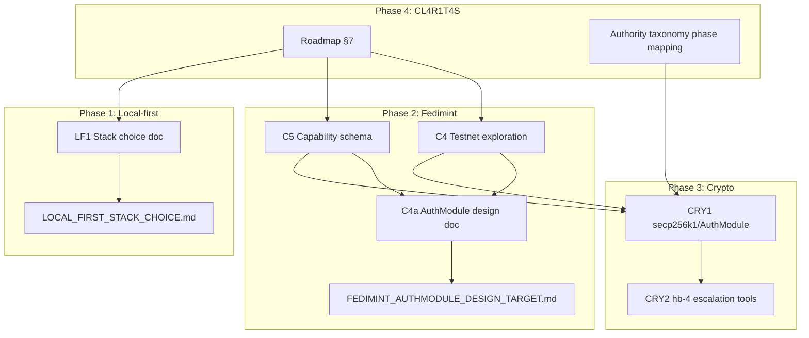

# Gaps: Local-first, Fedimint, Crypto Keys, CL4R1T4S Integration

## Current State Summary

| Gap             | Current                                                                                                                                                                                                                                        | Target                                                                                                |
| --------------- | ---------------------------------------------------------------------------------------------------------------------------------------------------------------------------------------------------------------------------------------------- | ----------------------------------------------------------------------------------------------------- |
| **Local-first** | Roadmap §3 references "Client as source of truth; Fedimint = sync relay" but no sync engine or stack choice in [pending_tasks.md](D:\portfolio-harness.cursor\state\pending_tasks.md) or [local-proto](D:\portfolio-harness\local-proto)       | Concrete sync engine choice (Electric/PowerSync/p2panda) and rationale in pending_tasks + scope-notes |
| **Fedimint**    | C4 (testnet), C5 (capability schema) pending; AuthModule design target only                                                                                                                                                                    | Document design target explicitly; add exploration tasks; keep implementation deferred                |
| **Crypto keys** | hb-4 and capability tokens in [org-intent](D:\portfolio-harness\org-intent-spec\examples\org-intent.bitcoin-inspired.json), [AUTHORITY_MODEL_TAXONOMY](D:\portfolio-harness\docs\AUTHORITY_MODEL_TAXONOMY.md); escalation_tools for hb-4 empty | Placeholder tasks for secp256k1/AuthModule; document dependency chain                                 |
| **CL4R1T4S**    | Integrated in [cl4r1t4s-patterns.mdc](D:\portfolio-harness.cursor\rules\cl4r1t4s-patterns.mdc), [role-routing](D:\portfolio-harness.cursor\rules\role-routing.mdc), tech-lead, dialectic                                                       | Tie to Fedimint/local-first phases in roadmap and pending_tasks                                       |

---

## Phase 1: Local-first Sync Engine Choice (Docs + Decision)

**Goal:** Add concrete sync engine choice to pending_tasks and local-proto; justify via D:\local-first STACK_MATRIX.

**Actions:**

1. **Create local-first stack decision doc** at `local-proto/docs/LOCAL_FIRST_STACK_CHOICE.md`:
  - Reference [D:\local-first\STACK_MATRIX.md](D:\local-first\STACK_MATRIX.md) and [LEARNING_PATH.md](D:\local-first\LEARNING_PATH.md)
  - Decision tree: Postgres vs P2P vs none; constraints (Fedimint relay, E2EE)
  - Per [PENTAGI_FEDIMINT_ACE_ROADMAP](D:\portfolio-harness\docs\PENTAGI_FEDIMINT_ACE_ROADMAP.md) §3: "Fedimint = sync relay for capabilities, audit, payments" — implies client-side store + relay, not full P2P
  - Recommended: ElectricSQL or PowerSync for Postgres-backed; p2panda if no backend
  - Log choice to `.cursor/private/scope-notes.md` (per tech-lead skill)
2. **Add pending task** to [pending_tasks.md](D:\portfolio-harness.cursor\state\pending_tasks.md) under PENDING_ALIGNMENT or new PENDING_LOCAL_FIRST:
  - `LF1 | pending | Local-first sync engine: Document stack choice (Electric/PowerSync/p2panda) per LOCAL_FIRST_STACK_CHOICE.md; log to scope-notes.md`
3. **Update [WAVED_PENDING_TASKS.md](D:\portfolio-harness\local-proto\docs\WAVED_PENDING_TASKS.md):** Add Wave 9 or extend Wave 8 with "Local-first stack choice" as prerequisite for Fedimint sync relay work.

**Tech-lead placement:** `local-proto/docs/LOCAL_FIRST_STACK_CHOICE.md` — design doc, not code. Rationale: co-locate with local-proto async/sync planning.

---

## Phase 2: Fedimint C4/C5 and AuthModule (Design Target + Exploration)

**Goal:** Explicitly document AuthModule as design target; add exploration tasks; keep implementation deferred.

**Actions:**

1. **Update [PENTAGI_FEDIMINT_ACE_ROADMAP](D:\portfolio-harness\docs\PENTAGI_FEDIMINT_ACE_ROADMAP.md):**
  - Add note under §4: "AuthModule is design target; implementation blocked on Fedimint AuthModule upstream availability and C4/C5 completion."
  - Cross-reference C4, C5 from [pending_tasks.md](D:\portfolio-harness.cursor\state\pending_tasks.md) (C4, C5 in PENDING_ALIGNMENT).
2. **Add Fedimint exploration task** to pending_tasks:
  - `C4a | pending | Fedimint AuthModule design doc: Document AuthModule interface, capability token flow, and harness integration points (per deep-research-report §7)`
3. **Create [docs/FEDIMINT_AUTHMODULE_DESIGN_TARGET.md](D:\portfolio-harness\docs\FEDIMINT_AUTHMODULE_DESIGN_TARGET.md):**
  - One-page design target: AuthModule as capability token issuer; BFT consensus; federation constitution = org-intent
  - Link to CHAOS_BITCOIN_MAPPING, AUTHORITY_MODEL_TAXONOMY, hb-4
  - Status: design only; no implementation until C4/C5 done

**Daggr:** No Daggr changes; Fedimint is external to WatchTower/campaign_kb.

---

## Phase 3: Crypto Keys (hb-4, secp256k1, AuthModule)

**Goal:** Document implementation dependency chain; add placeholder tasks; keep hb-4 escalation_tools aligned.

**Actions:**

1. **Add crypto implementation tasks** to pending_tasks (PENDING_ALIGNMENT):
  - `CRY1 | pending | secp256k1 / AuthModule: Implement or integrate capability token signing (blocked on C4/C5; design in FEDIMINT_AUTHMODULE_DESIGN_TARGET.md)`
  - `CRY2 | pending | hb-4 escalation tools: Wire capability token verification to escalation_tools when CRY1 available`
2. **Update [BITCOIN_AGENT_CAPABILITIES](D:\portfolio-harness\docs\BITCOIN_AGENT_CAPABILITIES.md):**
  - Add "Implementation status" section: hb-4 documented; secp256k1/AuthModule not yet implemented; CRY1/CRY2 track this.
3. **org-intent:** Keep `escalation_tools` for hb-4 as `[]` until CRY2; add comment in org-intent schema or docs that hb-4 tools are TBD (capability verification).

**Authority model:** AUTHORITY_MODEL_TAXONOMY already maps hb-4 to "crypto proof for spend"; no change needed.

---

## Phase 4: CL4R1T4S / authority_model_taxonomy Tied to Fedimint/Local-first

**Goal:** Cross-reference CL4R1T4S and authority_model_taxonomy in roadmap and pending_tasks so agents know when to apply these patterns during Fedimint/local-first work.

**Actions:**

1. **Update [PENTAGI_FEDIMINT_ACE_ROADMAP](D:\portfolio-harness\docs\PENTAGI_FEDIMINT_ACE_ROADMAP.md):**
  - Add §7 "CL4R1T4S and Authority Model": When working on Fedimint phases (C4, C5, AuthModule) or local-first sync: apply CL4R1T4S patterns (bounded retries, verify before done, convention-first); apply AUTHORITY_MODEL_TAXONOMY for risk-tier → authority mapping (High/Critical = cryptographic proof).
2. **Update [pending_tasks.md](D:\portfolio-harness.cursor\state\pending_tasks.md):**
  - Add note at top or in PENDING_ALIGNMENT: "When executing C4, C5, CRY1, CRY2, LF1: load CL4R1T4S patterns and AUTHORITY_MODEL_TAXONOMY per roadmap §7."
3. **Update [AUTHORITY_MODEL_TAXONOMY](D:\portfolio-harness\docs\AUTHORITY_MODEL_TAXONOMY.md):**
  - Add "Phase mapping" section: Fedimint C4/C5 = High risk (crypto proof); local-first stack choice = Low (design doc); AuthModule implementation = Critical when implemented.
4. **Update [cl4r1t4s-patterns.mdc](D:\portfolio-harness.cursor\rules\cl4r1t4s-patterns.mdc):**
  - Add trigger: "When task involves Fedimint, local-first sync, or capability tokens: also reference PENTAGI_FEDIMINT_ACE_ROADMAP §7 and AUTHORITY_MODEL_TAXONOMY."

---

## Dependency Graph

---

## Files to Create or Modify

| File                                           | Action                                      |
| ---------------------------------------------- | ------------------------------------------- |
| `local-proto/docs/LOCAL_FIRST_STACK_CHOICE.md` | Create                                      |
| `.cursor/private/scope-notes.md`               | Create or append (stack choice)             |
| `docs/FEDIMINT_AUTHMODULE_DESIGN_TARGET.md`    | Create                                      |
| `.cursor/state/pending_tasks.md`               | Add LF1, C4a, CRY1, CRY2; add CL4R1T4S note |
| `local-proto/docs/WAVED_PENDING_TASKS.md`      | Add Wave 9 or extend Wave 8                 |
| `docs/PENTAGI_FEDIMINT_ACE_ROADMAP.md`         | Add §7; AuthModule note in §4               |
| `docs/AUTHORITY_MODEL_TAXONOMY.md`             | Add phase mapping section                   |
| `docs/BITCOIN_AGENT_CAPABILITIES.md`           | Add implementation status                   |
| `.cursor/rules/cl4r1t4s-patterns.mdc`          | Add Fedimint/local-first trigger            |

---

## Dialectic Protocol (Critic)

Before finalizing: run critic on design docs (LOCAL_FIRST_STACK_CHOICE, FEDIMINT_AUTHMODULE_DESIGN_TARGET) and roadmap §7. Pass rule: safety ≥ 4, correctness ≥ 4, total ≥ 18.

---

## Risk and Rollback

- **Risk:** Low (docs and task labels only; no code changes)
- **Rollback:** Revert doc edits; remove new pending task rows
- **Verification:** `grep -E "LF1|CRY1|CRY2|C4a|§7"` on modified files; confirm links resolve

