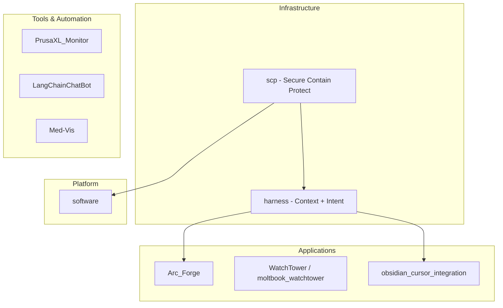

# GitHub Portfolio Reorganization and Segmentation

## Current State Audit

### GitHub Repos (ManintheCrowds)

| Repo                | Description                                                               | Status                              |
| ------------------- | ------------------------------------------------------------------------- | ----------------------------------- |
| LangChainChatBot    | (empty)                                                                   | Needs description                   |
| Med-Vis             | (empty)                                                                   | Needs description                   |
| PrusaXL_Monitor     | "Seeking to identify, monitor and suggest fixes on Prusa XL 3d Printing." | Good                                |
| moltbook_watchtower | "Pending"                                                                 | Placeholder; needs real description |
| Arc_Forge           | "TTRPG RAG AI system. From Concept to Alpha MVP"                          | Good                                |

### Component Locations (Workspace)

| Component                           | Current Location                                                                                                            | Notes                                                                                |
| ----------------------------------- | --------------------------------------------------------------------------------------------------------------------------- | ------------------------------------------------------------------------------------ |
| **SCP** (Secure Contain Protect)    | [D:\local-proto\scripts\scp_mcp.py](D:\local-proto\scripts\scp_mcp.py), [scp_utils.py](D:\local-proto\scripts\scp_utils.py) | MCP server + utils; threat registry in portfolio-harness                             |
| **Harness core** (context + intent) | [D:\portfolio-harnesscursor\docs(D:\portfolio-harness/.cursor/docs/)                                                        | CONTEXT_ENGINEERING.md, INTENT_ENGINEERING.md, HARNESS_ARCHITECTURE.md, state schema |
| **Handoff flow**                    | [D:\portfolio-harnesscursor\HANDOFF_FLOW.md](D:\portfolio-harness/.cursor/HANDOFF_FLOW.md), state/README.md                 | Document-then-continue pattern                                                       |
| **Skills, rules, role-routing**     | [D:\portfolio-harnesscursor(D:\portfolio-harness/.cursor/)                                                                  | JIT-loaded by role-routing                                                           |
| **local-proto**                     | D:\local-proto                                                                                                              | SCP, provenance, credential vault, orchestrator, tool safeguards                     |

---

## Phase 1: Fill Repo Descriptions (Quick Wins)

Proposed descriptions for repos missing or with placeholder text:

| Repo                    | Proposed Description                                                                                                                 |
| ----------------------- | ------------------------------------------------------------------------------------------------------------------------------------ |
| **LangChainChatBot**    | "LangChain-powered chatbot with memory and tool use. Python, conversational AI."                                                     |
| **Med-Vis**             | "Medical visualization dashboard. TypeScript, data viz for clinical workflows."                                                      |
| **moltbook_watchtower** | "Passive monitoring and analysis for the Moltbook agent network. Collect posts, run analyzers, view findings in a static dashboard." |

**Source:** Derive from [portfolio-harness README](D:\portfolio-harness/README.md), [PORTFOLIO.md](D:\portfolio-harness/docs/PORTFOLIO.md), and project READMEs. Validate against actual code before finalizing.

---

## Phase 2: Extract SCP as Standalone Repo

**Rationale:** SCP is a reusable security primitive (inspect, sanitize, contain, quarantine) used across portfolio-harness, local-proto, and TOOL_SAFEGUARDS. It deserves its own repo for discoverability and reuse.

**Proposed repo name:** `scp` or `secure-contain-protect`

**Contents to extract:**

- [local-proto/scripts/scp_mcp.py](D:\local-proto/scripts/scp_mcp.py) — MCP server
- [local-proto/scripts/scp_utils.py](D:\local-proto/scripts/scp_utils.py) — Core logic
- Threat registry (currently [portfolio-harness/.cursor/scripts/scp_threat_registry.json](D:\portfolio-harness/.cursor/scripts/scp_threat_registry.json))
- [secure-contain-protect SKILL.md](D:\portfolio-harness/.cursor/skills/secure-contain-protect/SKILL.md) — As docs
- [TOOL_SAFEGUARDS.md](D:\local-proto/docs/TOOL_SAFEGUARDS.md) SCP sections — As reference

**Dependencies:** `mcp` (FastMCP), Python 3.10+. Minimal surface.

**Post-extraction:** local-proto and portfolio-harness reference SCP as MCP server (pip install or submodule). Pre-commit hooks call SCP or sanitize_input.py (which can wrap SCP).

---

## Phase 3: Extract Harness (Context + Intent) as Standalone Repo

**Rationale:** Harness architecture, context engineering, and intent engineering are portable concepts. Extracting them creates a shareable "AI harness" package for Cursor/Codex users.

**Proposed repo name:** `harness` or `cursor-harness` or `intent-harness`

**Contents to extract:**

- [.cursor/docs/CONTEXT_ENGINEERING.md](D:\portfolio-harness/.cursor/docs/CONTEXT_ENGINEERING.md)
- [.cursor/docs/INTENT_ENGINEERING.md](D:\portfolio-harness/.cursor/docs/INTENT_ENGINEERING.md)
- [.cursor/docs/HARNESS_ARCHITECTURE.md](D:\portfolio-harness/.cursor/docs/HARNESS_ARCHITECTURE.md)
- [.cursor/HANDOFF_FLOW.md](D:\portfolio-harness/.cursor/HANDOFF_FLOW.md)
- [.cursor/state/README.md](D:\portfolio-harness/.cursor/state/README.md) — State schema
- Handoff scripts (copy_continue_prompt, validate_handoff_scp)
- Optional: portable subset of [cl4r1t4s_analysis](D:\portfolio-harness/docs/cl4r1t4s_analysis/) for workflow design

**Scope boundary:** Docs + schema + scripts. Skills and rules stay in portfolio-harness (project-specific). This repo is the "harness spec" and reference implementation.

**Post-extraction:** portfolio-harness references harness as submodule or doc source; `.cursorrules` points to harness docs.

---

## Phase 4: Naming and Grouping Pattern

**Proposed taxonomy** (aligned with tech-lead structure, frontier-ops seam design):

**Naming conventions:**

- **Infrastructure:** Short, memorable (`scp`, `harness`). Lowercase, no underscores.
- **Applications:** Descriptive (`Arc_Forge`, `moltbook_watchtower`). Keep existing names.
- **Tools:** `{Domain}_{Purpose}` (e.g. `PrusaXL_Monitor`, `Med-Vis`).

**Memorable pattern:** "Guard, Guide, Build"

- **Guard** = SCP (content safety)
- **Guide** = Harness (context, intent, handoff)
- **Build** = Applications (Arc_Forge, WatchTower, etc.)

This maps to frontier-ops: Guard = input verification; Guide = seam design; Build = deliverables.

---

## Phase 5: portfolio-harness Subdirectory Reorganization

**Current:** Monorepo with harness infra + multiple projects (WatchTower, obsidian_cursor_integration, berserk_custom_bit, pentagi, GhostTrack, LangChainChatBot, Med-Vis) + org-intent-spec, frontier-ops-kb, portable-skills, docker-mcp, osint-tools.

**Options:**

| Option                                   | Structure                                                                                                       | Pros                                   | Cons                                    |
| ---------------------------------------- | --------------------------------------------------------------------------------------------------------------- | -------------------------------------- | --------------------------------------- |
| **A: Keep monore, add docs/**            | Add `docs/REPO_MAP.md` and `docs/COMPONENT_AUDIT.md`                                                            | Minimal change; single source of truth | Still mixed concerns                    |
| **B: Extract projects to sibling repos** | LangChainChatBot, Med-Vis, GhostTrack, pentagi as separate repos; portfolio-harness = harness + shared projects | Clear separation; matches GitHub       | More repos to maintain; some may be WIP |
| **C: Subdirectories by tier**            | `infra/`, `apps/`, `tools/`, `docs/`                                                                            | Clear grouping                         | Requires moves; breaks some paths       |

**Recommendation:** Start with **Option A** — document the component map and audit. After SCP and harness are extracted, reassess. Option B only if those projects are ready for independent release.

**Component audit table** (for `docs/COMPONENT_AUDIT.md`):

| Path                                                             | Type         | Extract?                          | Notes   |
| ---------------------------------------------------------------- | ------------ | --------------------------------- | ------- |
| .cursor/docs (context, intent, harness)                          | Harness core | Yes → harness repo                | Phase 3 |
| .cursor/skills/secure-contain-protect                            | SCP skill    | Reference only; SCP repo has impl | Phase 2 |
| .cursor/scripts (sanitize, validate, mask)                       | SCP-related  | Some → SCP repo; rest stay        | Phase 2 |
| org-intent-spec                                                  | Spec         | Could be own repo later           | Defer   |
| frontier-ops-kb                                                  | KB           | Keep in harness or extract        | Defer   |
| portable-skills                                                  | Skills       | Keep; harness references          | —       |
| WatchTower_main, obsidian_cursor_integration, berserk_custom_bit | Apps         | Keep in portfolio-harness         | —       |
| pentagi, GhostTrack, LangChainChatBot, Med-Vis                   | Apps/tools   | Evaluate per-project              | Phase 5 |

---

## Implementation Order

1. **Phase 1** — Fill descriptions (manual or script via GitHub API). Low risk.
2. **Phase 2** — Create `scp` repo; extract code; add README; wire local-proto and portfolio-harness to use it.
3. **Phase 3** — Create `harness` repo; extract docs and scripts; add README; wire portfolio-harness.
4. **Phase 4** — Update portfolio-harness README with "Guard, Guide, Build" taxonomy and repo map.
5. **Phase 5** — Add `docs/COMPONENT_AUDIT.md`; optionally extract projects per Option B.

---

## CL4R1T4S / Frontier-Ops Alignment

- **Seam design:** SCP = input seam (verify before persist); Harness = handoff seam (human gate, latency negotiation).
- **Bounded retries:** Both SCP and harness docs reference max 3 retries, then escalate.
- **Convention-first:** Before adding new repos, check existing patterns (tech_lead_extracts).
- **Verify before done:** Run critic on new READMEs and descriptions before publishing.

---

## Open Questions

1. **LangChainChatBot / Med-Vis:** Are these in portfolio-harness as subfolders or separate clones? If subfolders, do they match the GitHub repos?
2. **local-proto visibility:** Should local-proto become a public repo, or stay private with SCP and harness extracted?
3. **org-intent-spec:** Extract now or keep in portfolio-harness? It's referenced by harness and TOOL_SAFEGUARDS.

