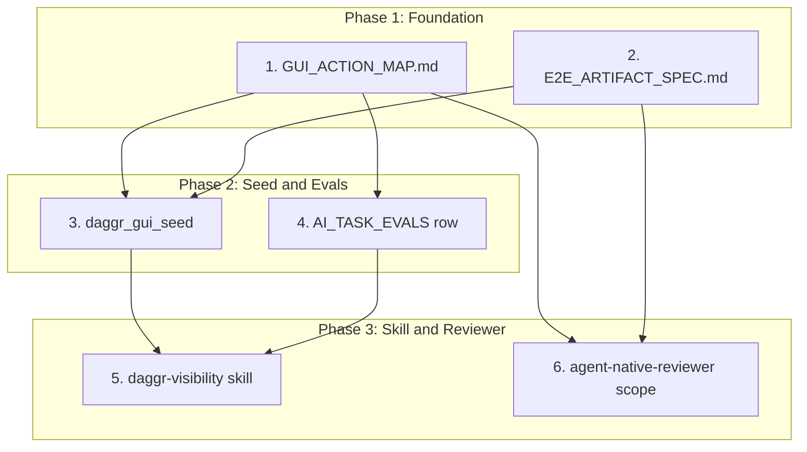

# GUI Competency Task Decomposition Plan

## Dependency Graph




---

## 1. Create GUI_ACTION_MAP.md

**Path:** [.cursor/docs/GUI_ACTION_MAP.md](D:\portfolio-harness\.cursor\docs\GUI_ACTION_MAP.md)

**Source:** Extract from [action_parity_audit_cm3_2026-03-16.md](D:\portfolio-harness\.cursor\state\adhoc\action_parity_audit_cm3_2026-03-16.md) (lines 26–68). Add GUI-specific actions (screenshot, snapshot) not in current audit.

**Intent: Sheet/workflow surface labels.** The Daggr UI shows default labels like "Sheet 2" on workflow tabs. User pain: we don't create intent labels (e.g. "Simple Math Test", "RAG Pipeline"). GUI_ACTION_MAP must document: (a) default vs intended label mapping, (b) DAGGR_FUNCTION_MAP "Graph name" as the canonical intent label per workflow.

**Subtasks:**


| ID  | Task                                                                                                                               | Deliverable       |
| --- | ---------------------------------------------------------------------------------------------------------------------------------- | ----------------- |
| 1.1 | Create doc skeleton with sections: Purpose, Scope, Human Action → Agent Tool table, Visibility artifacts, Sheet/surface labels     | GUI_ACTION_MAP.md |
| 1.2 | Populate table from action parity audit: WatchTower Gradio, campaign_kb Gradio, workflow_ui, harness Gradio, Daggr meta            | Table rows        |
| 1.3 | Add visibility row: "Capture screenshot of workflow" → browser_take_screenshot, browser_snapshot                                   | New row           |
| 1.4 | Add sheet/surface labels section: Map default "Sheet N" labels to DAGGR_FUNCTION_MAP Graph name; document gap if Daggr does not expose customization | New section       |
| 1.5 | Add "Documented in" column referencing DAGGR_FUNCTION_MAP, daggr_test_matrix, AGENT_NATIVE_CHECKLIST                               | Column            |
| 1.6 | Add cross-reference from [AGENT_NATIVE_CHECKLIST.md](D:\portfolio-harness\.cursor\docs\AGENT_NATIVE_CHECKLIST.md) to GUI_ACTION_MAP | Link in checklist |


**Schema (conceptual):**


| Human action            | Surface     | Agent tool               | Documented in     |
| ----------------------- | ----------- | ------------------------ | ----------------- |
| List workflows          | Daggr MCP   | mcp_daggr_list_workflows | daggr_test_matrix |
| Navigate to workflow_ui | workflow_ui | browser_navigate         | —                 |
| Identify sheet label    | Daggr UI    | DAGGR_FUNCTION_MAP Graph name; default "Sheet N" → intent label | DAGGR_FUNCTION_MAP |
| ...                     | ...         | ...                      | ...               |

**Sheet/surface labels:** Daggr UI shows default labels like "Sheet 2". Canonical intent: Graph name from DAGGR_FUNCTION_MAP (e.g. "Simple Math Test"). If Daggr library does not expose label customization, document as gap; future: investigate Daggr API or fork for custom sheet labels.


---

## 2. Add E2E Artifact Capture

**Paths:**

- Spec: [.cursor/docs/E2E_ARTIFACT_SPEC.md](D:\portfolio-harness\.cursor\docs\E2E_ARTIFACT_SPEC.md) (new)
- Conftest: [WatchTower_main/WatchTower_main/tests/e2e/conftest.py](D:\portfolio-harness\WatchTower_main\WatchTower_main\tests\e2e\conftest.py)
- Artifacts dir: `WatchTower_main/WatchTower_main/tests/e2e/artifacts/` (create if missing)

**Subtasks:**


| ID  | Task                                                                                                                                                 | Deliverable                                                                   |
| --- | ---------------------------------------------------------------------------------------------------------------------------------------------------- | ----------------------------------------------------------------------------- |
| 2.1 | Create E2E_ARTIFACT_SPEC.md: on_failure (screenshot required), on_pass (optional screenshot), path format, env vars (E2E_CAPTURE_SCREENSHOT_ON_PASS) | Spec doc                                                                      |
| 2.2 | Add pytest hook in conftest: `pytest_runtest_makereport` or `@pytest.hookimpl(hookwrapper=True)` to capture screenshot on failure                    | conftest.py                                                                   |
| 2.3 | Ensure artifacts dir exists; add to .gitignore if needed (or commit fail screenshots for CI)                                                         | artifacts/                                                                    |
| 2.4 | Update test_daggr_playwright_smoke.py: no code change if hook handles it; optionally add explicit `page.screenshot(path=...)` in one test as example | Optional                                                                      |
| 2.5 | Add to daggr_test_matrix: "Visibility artifacts" column or note                                                                                      | [daggr_test_matrix.md](D:\portfolio-harness\.cursor\docs\daggr_test_matrix.md) |


**Spec schema (E2E_ARTIFACT_SPEC.md):**

```yaml
on_failure:
  screenshot: true
  path: "tests/e2e/artifacts/fail_{nodeid}_{timestamp}.png"
on_pass:
  screenshot: env E2E_CAPTURE_SCREENSHOT_ON_PASS=1
  dom_snapshot: optional
```

**Hook pattern:** Use `request.node` + `page` fixture; capture screenshot in `pytest_runtest_makereport` when `report.failed` and `page` is available. Note: `page` is function-scoped; hook runs after test. Use `request` to get `page` from test context or add a session-scoped screenshot helper that receives `page` from the failing test.

**Simpler approach:** Add `try/except` or `request.addfinalizer` in each test, or use `pytest-playwright`'s built-in `page` fixture with `page.screenshot()` in an `autouse` fixture that runs on failure. Research: pytest-playwright may have `screenshot` option. Fallback: add `page.screenshot(path=...)` explicitly in each test's teardown via `request.addfinalizer`.

---

## 3. Create daggr_gui_seed

**Path:** [.cursor/docs/daggr_gui_seed/](D:\portfolio-harness\.cursor\docs\daggr_gui_seed/)

**Reference:** [KNOWLEDGE_SEED_PATTERN.md](D:\portfolio-harness\.cursor\docs\KNOWLEDGE_SEED_PATTERN.md), [local-first README](D:\local-first\README.md)

**Subtasks:**


| ID  | Task                                                                                                                | Deliverable                                                                   |
| --- | ------------------------------------------------------------------------------------------------------------------- | ----------------------------------------------------------------------------- |
| 3.1 | Create daggr_gui_seed/ directory                                                                                    | Directory                                                                     |
| 3.2 | Create README.md: "If you are…" table → GUI entry points, workflow registry, visibility docs, GUI_ACTION_MAP        | README.md                                                                     |
| 3.3 | Create RESOURCES.md: DAGGR_FUNCTION_MAP, daggr_test_matrix, workflow_ui routes, Gradio URLs, E2E_ARTIFACT_SPEC      | RESOURCES.md                                                                  |
| 3.4 | Create LEARNING_PATH.md: Concepts → "How do I see the workflow?" → "How do I run a workflow?" → hands-on            | LEARNING_PATH.md                                                              |
| 3.5 | Create GUI_ACTION_MAP.md (or symlink/copy to .cursor/docs/GUI_ACTION_MAP.md) — prefer single source; link from seed | Link                                                                          |
| 3.6 | Create AGENTS.md: Instructions for GUI-related tasks (read DAGGR_FUNCTION_MAP, use browser tools for visibility)    | AGENTS.md                                                                     |
| 3.7 | Create TROUBLESHOOTING.md: Gradio not visible, wrong port, DAGGR_E2E_SERVER, playwright install                     | TROUBLESHOOTING.md                                                            |
| 3.8 | Add AGENT_ENTRY_INDEX row: "Learning Daggr GUI or workflow visibility" → daggr_gui_seed/README.md                   | [AGENT_ENTRY_INDEX.md](D:\portfolio-harness\.cursor\docs\AGENT_ENTRY_INDEX.md) |


---

## 4. Add GUI Competency Row to AI_TASK_EVALS

**Path:** [.cursor/docs/AI_TASK_EVALS.md](D:\portfolio-harness\.cursor\docs\AI_TASK_EVALS.md)

**Subtasks:**


| ID  | Task                                                                                                                                       | Deliverable                                                                                                    |
| --- | ------------------------------------------------------------------------------------------------------------------------------------------ | -------------------------------------------------------------------------------------------------------------- |
| 4.1 | Create GUI_COMPETENCY_EVAL_PROMPTS.md: 5 natural-language prompts with expected behavior                                                   | [.cursor/docs/GUI_COMPETENCY_EVAL_PROMPTS.md](D:\portfolio-harness\.cursor\docs\GUI_COMPETENCY_EVAL_PROMPTS.md) |
| 4.2 | Add Registry row: "Daggr GUI competency"                                                                                                   | GUI_COMPETENCY_EVAL_PROMPTS                                                                                    |
| 4.3 | Add Running evals bullet: "Daggr GUI: Manual: run GUI_COMPETENCY_EVAL_PROMPTS.md; paste each prompt; verify tool selection and visibility" | AI_TASK_EVALS.md                                                                                               |


**Eval prompts (from architecture review):**

1. "Where can I run the Daggr simple workflow?" → Expect reference to daggr_test_matrix, DAGGR_FUNCTION_MAP, or run_workflow.
2. "How do I see the workflow graph for RAG?" → Expect reference to workflow_ui /tools/daggr-graphs or get_graph_schema.
3. "Run the simple workflow with a=5, b=3 and show me the result" → Expect browser or Daggr MCP usage.
4. "Take a screenshot of the Daggr simple workflow UI" → Expect browser_take_screenshot.
5. "What GUI actions can an agent perform on Daggr?" → Expect reference to AGENT_NATIVE_CHECKLIST or GUI_ACTION_MAP.

---

## 5. Extend daggr-visibility Skill

**Path:** [.cursor/skills/daggr-visibility/SKILL.md](D:\portfolio-harness\.cursor\skills\daggr-visibility\SKILL.md)

**Subtasks:**


| ID  | Task                                                                                                                                      | Deliverable                                                                        |
| --- | ----------------------------------------------------------------------------------------------------------------------------------------- | ---------------------------------------------------------------------------------- |
| 5.1 | Add to triggers_any: "Daggr GUI", "workflow UI", "Gradio visibility", "Daggr Gradio"                                                      | SKILL.md triggers                                                                  |
| 5.2 | Add Steps item: "For GUI/visibility: read daggr_gui_seed/README.md and GUI_ACTION_MAP.md"                                                 | SKILL.md Steps                                                                     |
| 5.3 | Add References item: daggr_gui_seed/README.md, GUI_ACTION_MAP.md                                                                          | SKILL.md References                                                                |
| 5.4 | Add role-routing branch if not auto-loaded: "Does the task involve Daggr GUI, workflow UI, or Gradio visibility?" → Load daggr-visibility | [role-routing.mdc](D:\portfolio-harness\.cursor\rules\role-routing.mdc) (if exists) |


---

## 6. Extend agent-native-reviewer Scope

**Context:** agent-native-reviewer is a Cursor MCP subagent (invoked via mcp_task). Its behavior is defined by Cursor's subagent config, not a local file. The extension is **documentation-only**: update AGENT_NATIVE_CHECKLIST to instruct reviewers to check GUI artifact capture.

**Path:** [.cursor/docs/AGENT_NATIVE_CHECKLIST.md](D:\portfolio-harness\.cursor\docs\AGENT_NATIVE_CHECKLIST.md)

**Subtasks:**


| ID  | Task                                                                                                                                                         | Deliverable               |
| --- | ------------------------------------------------------------------------------------------------------------------------------------------------------------ | ------------------------- |
| 6.1 | Add "Parity test" subsection or bullet: "For each GUI surface: can the agent navigate, interact, and capture screenshots/snapshots?"                         | AGENT_NATIVE_CHECKLIST.md |
| 6.2 | Add "When adding UI or MCP tools" checklist item: "For GUI surfaces: E2E tests produce visibility artifacts (screenshot on fail) per E2E_ARTIFACT_SPEC"      | Checklist item            |
| 6.3 | Add "Agent-native-reviewer" note: "When reviewing GUI features, also verify: (a) GUI_ACTION_MAP documents the action, (b) E2E captures artifacts on failure" | Note                      |


**Note:** If agent-native-reviewer has a local prompt or config file in the workspace, that would be extended too. Grep did not find one; the subagent is likely Cursor-provided. Documentation changes suffice to guide human invocation and subagent behavior.

---

## Execution Order


| Phase | Tasks                                           | Blockers                  |
| ----- | ----------------------------------------------- | ------------------------- |
| 1     | 1 (GUI_ACTION_MAP), 2 (E2E_ARTIFACT_SPEC)       | None                      |
| 2     | 3 (daggr_gui_seed), 4 (AI_TASK_EVALS)           | 1.1–1.4 for 3; 1.1 for 4  |
| 3     | 5 (daggr-visibility), 6 (agent-native-reviewer) | 3.1–3.7 for 5; 1, 2 for 6 |


**Recommended sequence:** 1 → 2 → 3 → 4 → 5 → 6 (with 1 and 2 in parallel if desired).

---

## Files to Create/Modify Summary


| Action | Path                                                       |
| ------ | ---------------------------------------------------------- |
| Create | .cursor/docs/GUI_ACTION_MAP.md                             |
| Create | .cursor/docs/E2E_ARTIFACT_SPEC.md                          |
| Create | .cursor/docs/GUI_COMPETENCY_EVAL_PROMPTS.md                |
| Create | .cursor/docs/daggr_gui_seed/README.md                      |
| Create | .cursor/docs/daggr_gui_seed/RESOURCES.md                   |
| Create | .cursor/docs/daggr_gui_seed/LEARNING_PATH.md               |
| Create | .cursor/docs/daggr_gui_seed/AGENTS.md                      |
| Create | .cursor/docs/daggr_gui_seed/TROUBLESHOOTING.md             |
| Modify | .cursor/docs/AGENT_NATIVE_CHECKLIST.md                     |
| Modify | .cursor/docs/AI_TASK_EVALS.md                              |
| Modify | .cursor/docs/AGENT_ENTRY_INDEX.md                          |
| Modify | .cursor/docs/daggr_test_matrix.md                          |
| Modify | .cursor/skills/daggr-visibility/SKILL.md                   |
| Modify | WatchTower_main/WatchTower_main/tests/e2e/conftest.py      |
| Create | WatchTower_main/WatchTower_main/tests/e2e/artifacts/ (dir) |


---

## Risk and Notes

- **E2E hook:** pytest-playwright's `page` fixture is function-scoped. Screenshot-on-failure typically requires a hook that receives the page. Options: (a) use `request.node` + store page in `request.node` via a fixture, (b) use pytest-playwright's built-in screenshot-on-failure if available, (c) add explicit `page.screenshot()` in each test with try/except. Research pytest-playwright docs before implementing.
- **campaign_kb / workflow_ui E2E:** This plan focuses on WatchTower Daggr E2E. campaign_kb and workflow_ui have separate E2E suites; E2E_ARTIFACT_SPEC should be generic so they can adopt the same pattern later.

