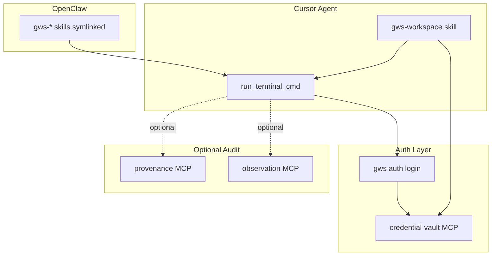

# gws (Google Workspace CLI) Integration Plan

## Context

[gws](https://github.com/googleworkspace/cli) is a CLI that dynamically builds commands from Google Discovery Service for Drive, Gmail, Calendar, Sheets, Docs, Chat, Admin. It emits structured JSON and ships 100+ agent skills. It is a CLI, not an MCP server.

## Architecture

## Phase 1: Prerequisites and OpenClaw

**1.1 Install gws**

- `npm install -g @googleworkspace/cli`
- Verify: `gws --help`

**1.2 One-time auth**

- Run `gws auth setup` (or manual OAuth if no gcloud)
- Run `gws auth login -s drive,gmail,sheets` (or scopes needed; testing mode limits ~25 scopes)
- For headless/CI: `gws auth export --unmasked > credentials.json`; store path in credential-vault

**1.3 OpenClaw skills**

- Symlink: `ln -s <gws-repo>/skills/gws-* ~/.openclaw/skills/`
- Or: `npx skills add https://github.com/googleworkspace/cli`
- Reference: [local-proto/docs/OPENCLAW.md](D:\portfolio-harness\local-proto\docs\OPENCLAW.md)

## Phase 2: Harness Skill (gws-workspace)

**2.1 Create skill**

- Path: [.cursor/skills/gws-workspace/SKILL.md](D:\portfolio-harness.cursor\skills\gws-workspace\SKILL.md)
- Follow pattern from [.cursor/skills/browser-web/SKILL.md](D:\portfolio-harness.cursor\skills\browser-web\SKILL.md)

**2.2 Skill metadata**

| Field             | Value                                                                                    |
| ----------------- | ---------------------------------------------------------------------------------------- |
| triggers_any      | Drive, Gmail, Sheets, Docs, Calendar, Chat, Workspace, Google Drive, list files in Drive |
| do_not_trigger_if | API-only, no Workspace context                                                           |
| required_inputs   | Service (drive/gmail/sheets/etc), action (list/create/get)                               |
| forbidden_actions | Hardcode credentials; run without human auth gate                                        |

**2.3 Skill behavior**

1. Check `gws` on PATH; if missing, suggest `npm install -g @googleworkspace/cli`
2. Before first use: require human to run `gws auth login` (or use credential-vault for `GOOGLE_WORKSPACE_CLI_CREDENTIALS_FILE`)
3. Run `gws <service> <resource> <method>` via terminal with `--params` / `--json` as needed
4. Parse JSON output; apply output limits per [.cursorrules](D:\portfolio-harness.cursorrules) (e.g. `| head -50` for large lists)

**2.4 Credential-vault integration**

- Store key: `gws` or `google_workspace_cli`
- Value: path to `credentials.json` (from `gws auth export`) or `GOOGLE_WORKSPACE_CLI_CREDENTIALS_FILE`
- Skill reads via `credential_vault_get`; sets env before invoking gws

## Phase 3: Role Routing and Docs

**3.1 Role-routing**

- Add gws-workspace to [.cursor/rules/role-routing.mdc](D:\portfolio-harness.cursor\rules\role-routing.mdc) decision tree: load when task mentions Workspace services

**3.2 Documentation**

- Add entry to [.cursor/docs/AGENT_ENTRY_INDEX.md](D:\portfolio-harness.cursor\docs\AGENT_ENTRY_INDEX.md): "Managing Google Workspace (Drive, Gmail, Sheets)" -> gws-workspace skill
- Optional: [docs/GWS_INTEGRATION.md](D:\portfolio-harness\docs\GWS_INTEGRATION.md) with auth flow, scope limits, troubleshooting

## Phase 4: Optional Audit and Provenance

**4.1 Script wrapper (Option B)**

- Create `local-proto/scripts/gws_wrapper.py` that:
  - Accepts gws subcommand + args
  - Calls `observation_log_append` or `document_provenance_record` with command + timestamp
  - Executes gws via subprocess
  - Returns stdout/stderr

**4.2 MCP server (Option A, higher effort)**

- MCP server exposing `run_gws_command` tool, wrapped by [audit_wrapper.py](D:\portfolio-harness\local-proto\scripts\audit_wrapper.py) for org-intent
- Add to [mcp.json](D:\portfolio-harness.cursor\mcp.json) and [mcp_server_tiers.json](D:\portfolio-harness\local-proto\config\mcp_server_tiers.json)

**Recommendation:** Start with Phase 1–3; add Phase 4 only if auditability is required for Workspace operations.

## Risk and Safeguards

- **Risk:** Medium (OAuth credentials, Workspace data access)
- **Human gate:** Auth must be done by human; agent runs only after `gws auth login` or credentials in vault
- **Scope limits:** Use `-s drive,gmail` etc. to avoid testing-mode scope cap (~25)
- **Output limits:** Apply `| head -N` or `--params '{"pageSize": N}'` per .cursorrules

## Verification

1. `gws drive files list --params '{"pageSize": 5}'` returns JSON
2. gws-workspace skill loads when user says "list my Drive files"
3. OpenClaw agent can invoke gws after symlinking skills
4. credential-vault stores and retrieves credentials path (if used)

