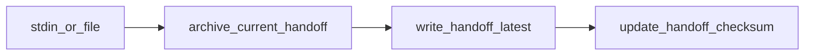

# Handoff archive enforcement (Layers 1–2 + optional 3)

## Scope and canonical repo

All implementation lives in **[portfolio-harness](D:\portfolio-harness)** where handoff tooling already exists: `[check_handoff_integrity.py](D:\portfolio-harness\.cursor\scripts\check_handoff_integrity.py)`, `[validate_handoff_scp.py](D:\portfolio-harness\.cursor\scripts\validate_handoff_scp.py)` (used by `[.pre-commit-config.yaml](D:\portfolio-harness\.pre-commit-config.yaml)`), and handoff docs under `[.cursor/](D:\portfolio-harness\.cursor)`.

**OpenHarness** (`[docs/HANDOFF_FLOW.md](D:\openharness\docs\HANDOFF_FLOW.md)`) has no `.cursor/scripts/` today; optional follow-up is a short pointer to portfolio-harness scripts or copying the two CLIs if OpenHarness is used standalone—defer unless you want parity in the same PR.

## Layer 1: Shared library + `archive_handoff_latest.py`

- Add `**handoff_archive_utils.py`** (same directory as other scripts) with a single function, e.g. `archive_current_handoff(state_dir: Path, *, dry_run: bool = False) -> Path | None`:
  - Resolve `handoff_latest.md`; if missing or empty, return `None` (no-op).
  - Ensure `.cursor/state/handoff_archive/` exists.
  - Destination filename: `**YYYYMMDD-HHMMSS.md` in UTC** (matches existing doc convention in `[HANDOFF_FLOW.md](D:\portfolio-harness\.cursor\HANDOFF_FLOW.md)` and `[state/README.md](D:\portfolio-harness\.cursor\state\README.md)`).
  - Binary copy (preserve exact bytes for any future hash checks).
  - `--dry-run`: print intended path without writing.
- Add thin CLI `**archive_handoff_latest.py`**: default `STATE_DIR` = `Path(__file__).resolve().parent.parent / "state"`, `--dry-run`, exit 0 always for no-op; print human-readable line + archive path on success.

## Layer 2: `write_handoff.py` (prefer over raw `Write`)

- CLI behavior:
  1. Call shared `archive_current_handoff` (same rules as Layer 1).
  2. Write new body to `handoff_latest.md` from `**--file path**` or **stdin** (UTF-8).
  3. Optionally run the same checksum update as `[check_handoff_integrity.py](D:\portfolio-harness\.cursor\scripts\check_handoff_integrity.py)` (either `subprocess` call to avoid duplication or extract `compute_checksum` + write to `handoff_checksum.txt` into a tiny shared helper imported by both—prefer **small refactor** of `check_handoff_integrity.py` to import from `handoff_archive_utils.py` or a `handoff_checksum.py` to avoid drift).
- Flags: `--no-integrity-update` to skip checksum step (edge cases); document default is to update checksum after write.

## Documentation and rule updates (enforcement by contract)

Update these so agents are instructed to **run Layer 1 or 2** instead of overwriting `[handoff_latest.md](D:\portfolio-harness\.cursor\state\handoff_latest.md)` directly:

| File                                                                                      | Change                                                                                                                                            |
| ----------------------------------------------------------------------------------------- | ------------------------------------------------------------------------------------------------------------------------------------------------- |
| `[.cursor/commands/handoff.md](D:\portfolio-harness\.cursor\commands\handoff.md)`         | Step 2: run `python .cursor/scripts/archive_handoff_latest.py` **or** `python .cursor/scripts/write_handoff.py --file ...`; forbid raw overwrite. |
| `[.cursor/HANDOFF_FLOW.md](D:\portfolio-harness\.cursor\HANDOFF_FLOW.md)`                 | Same; add one-line command examples.                                                                                                              |
| `[.cursor/state/README.md](D:\portfolio-harness\.cursor\state\README.md)`                 | Context handoff section: point to scripts as **required** path.                                                                                   |
| `[.cursor/docs/COMMANDS_README.md](D:\portfolio-harness\.cursor\docs\COMMANDS_README.md)` | New row in Handoff table for `archive_handoff_latest.py` and `write_handoff.py`.                                                                  |
| `[.cursorrules](D:\portfolio-harness\.cursorrules)`                                       | Handoff section: after "archive", name the scripts explicitly.                                                                                    |

## Tests

- Add `**test_handoff_archive_utils.py`** next to scripts (or under `.cursor/scripts/tests/`) using `**unittest**` (no new dependency; `requirements-dev.txt` has no pytest). Cover: no file → no archive; non-empty file → archive created with expected prefix; dry-run does not create file.
- **Verification command** (definition of done): `python -m unittest` with the correct path, or `python .cursor/scripts/test_handoff_archive_utils.py` if run as script.

## Layer 3 (optional, same PR or follow-up)

**Goal:** When both `handoff_latest.md` **and** at least one `handoff_archive/*.md` are part of a commit, verify the staged archive contains a **byte-identical** copy of `**HEAD`’s** `handoff_latest.md` (proves archive-before-edit workflow when committing).

- New script e.g. `**verify_handoff_staged_archive.py`**: use `git show HEAD:.cursor/state/handoff_latest.md` (if path exists on HEAD) and compare SHA-256 to staged files under `handoff_archive/`. Skip if `handoff_latest.md` is new on HEAD (first handoff). **Caveat:** requires operators to `**git add` the new archive file** together with `handoff_latest.md`; document this in hook comment and HANDOFF_FLOW.
- Register in `[.pre-commit-config.yaml](D:\portfolio-harness\.pre-commit-config.yaml)` with `files` matching `handoff_latest` **or** `handoff_archive` (local hook, `pass_filenames: false`, run script that inspects index). **Recommendation:** implement Layers 1–2 first; add Layer 3 only if you want commit-time strictness despite occasional unstaged-handoff workflows.

## Risk

- **Low** for Layers 1–2 (new files + doc edits; checksum refactor stays behavior-compatible).
- **Medium** for Layer 3 (can surprise users who commit only `handoff_latest.md`); keep optional or documented.

## Out of scope

- Cursor cannot block the `Write` tool at the IDE level; enforcement remains **policy + scripts + optional git hook**.

