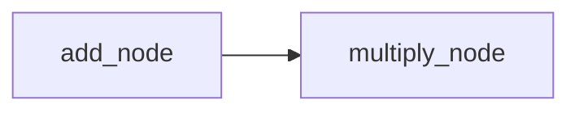
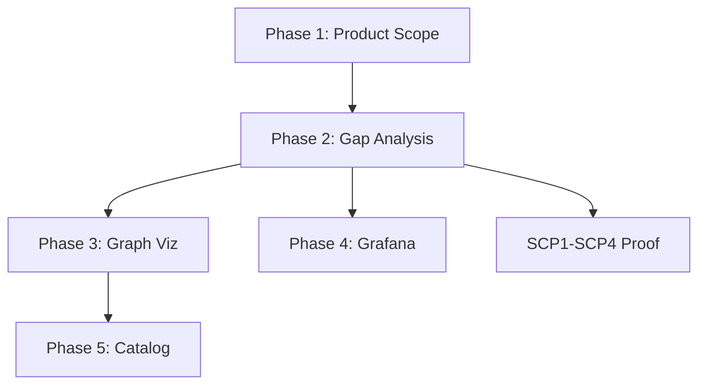

# Human Interfacing Stack — Scope, Gap Analysis, Graph Viz

## Prerequisites

- **scope_human_interfacing_stack.md** does not exist yet; create in Phase 1.
- **pending_tasks SCP1–SCP4:** SCP1 (SCP Daggr UI visible), SCP2 (Foam/Playwright proof), SCP3 (feature-video), SCP4 (pre-commit).
- **DAGGR schema source:** Daggr MCP `get_graph_schema(workflow_name, stack)` returns `{name, nodes, edges}` by loading workflow scripts via runpy ([daggr_mcp.py](D:\portfolio-harness\local-proto\scripts\daggr_mcp.py) L131–222).
- **Grafana stack:** Lives in D:\software (outside portfolio-harness); [GRAFANA_DAGGR_MONITORING_PROMPT.md](D:\portfolio-harness.cursor\docs\GRAFANA_DAGGR_MONITORING_PROMPT.md) defines scope.

---

## Phase 1: Product Scope

**Deliverable:** [.cursor/state/scope_human_interfacing_stack.md](D:\portfolio-harness.cursor\state\scope_human_interfacing_stack.md)

**Content:**

- Requirements (numbered) for: (1) DAGGR graph visibility, (2) Grafana + DAGGR metrics, (3) frontend-a2ui templated.
- Acceptance criteria (Given/When/Then) per user story.
- Dependency order: graph viz unblocks workflow_ui integration; Grafana independent; catalog can start in parallel.
- Constraints: Reuse DAGGR_FUNCTION_MAP, daggr_test_matrix, get_graph_schema; A2UI conventions; D:\software runs Grafana.

**Reference:** product-scope skill; [A2UI_FRONTEND_DESIGN_GUIDANCE.md](D:\portfolio-harness.cursor\docs\A2UI_FRONTEND_DESIGN_GUIDANCE.md).

---

## Phase 2: Gap Analysis

**Deliverable:** Gap table and WBS in scope doc or [.cursor/docs/HUMAN_INTERFACING_STACK_GAPS.md](D:\portfolio-harness.cursor\docs\HUMAN_INTERFACING_STACK_GAPS.md)

**Gaps to document:**

| Area            | Exists                                                | Missing                                                               |
| --------------- | ----------------------------------------------------- | --------------------------------------------------------------------- |
| DAGGR graph viz | DAGGR_FUNCTION_MAP, get_graph_schema, Gradio forms    | No UI renders nodes/edges; no WorkflowGraphViewer                     |
| Grafana         | GRAFANA_DAGGR_MONITORING_PROMPT, OBSERVABILITY_LAYER  | Metrics not emitted; scrape configs not added; dashboards not created |
| frontend-a2ui   | Skill, A2UI guidance, TEST_PROMPTS, AI_TASK_EVALS row | No component catalog; no templates; workflow_ui not A2UI-styled       |

**WBS:** P1 graph viz → P2 Grafana → P3 catalog/templates. SCP1–SCP4 (proof) can run in parallel with P1.

---

## Phase 3: DAGGR Graph Visualization (Priority)

### 3.1 WorkflowGraphViewer Component

**Location:** New shared component. Options:

- **A)** [portfolio-harness/docs/demo/](D:\portfolio-harness\docs\demo/) — static HTML + Mermaid (no server).
- **B)** [workflow_ui](D:\Arc_Forge\ObsidianVault\workflow_ui\app.py) — Flask route + template (requires API to fetch schema).
- **C)** Gradio component — add graph panel above each workflow form.

**Recommendation:** B — workflow_ui already has graph patterns (`/api/workbench/idea-web`, `/api/workbench/dependencies` return nodes/edges). Add `/api/daggr/graph/<stack>/<workflow_name>` that calls Daggr MCP logic or parses DAGGR_FUNCTION_MAP.

**Schema source:** Either (1) subprocess call to Daggr MCP tool, or (2) static JSON derived from DAGGR_FUNCTION_MAP (no MCP dependency at runtime). Prefer (2) for simplicity: build a `daggr_schemas.json` at docs time from DAGGR_FUNCTION_MAP or get_graph_schema output.

**Rendering:** Mermaid flowchart. DAGGR_FUNCTION_MAP has flow summaries (e.g. "add_numbers → multiply"); nodes and edges can be derived. Example Mermaid:

### 3.2 Integration Points

- **workflow_ui:** New route `/tools/daggr-graphs` or `/workflows` — page listing workflows (harness, WatchTower, campaign_kb) with links to graph view. Each graph view fetches schema and renders Mermaid.
- **Index/nav:** Add "Workflow Graphs" link alongside "KB Workflows" ([app.py](D:\Arc_Forge\ObsidianVault\workflow_ui\app.py) L325–334).

### 3.3 A2UI Conventions

- Component name: `WorkflowGraphViewer` (semantic).
- Props: `workflowName`, `stack`, `schema` (or `path` to fetch).
- Design tokens: CSS variables for colors, spacing.
- Accessibility: focus, ARIA for interactive graph.

---

## Phase 4: Grafana + DAGGR Metrics

**Scope:** Per [GRAFANA_DAGGR_MONITORING_PROMPT.md](D:\portfolio-harness.cursor\docs\GRAFANA_DAGGR_MONITORING_PROMPT.md).

**Note:** Grafana, Prometheus, Alertmanager live in D:\software. portfolio-harness and app repos only expose metrics and document config.

**Tasks:**

1. **DAGGR metrics emission:** Add Prometheus client to Daggr workflow runners (harness, WatchTower, campaign_kb). Emit: `daggr_workflow_runs_total`, `daggr_workflow_duration_seconds`, `daggr_workflow_errors_total` with labels `workflow`, `stack`, `project`.
2. **Scrape configs:** Document or add to D:\software `prometheus.yml` for WatchTower, workflow_ui, campaign_kb, moltbook. Shared label `project=`.
3. **Dashboards:** Create "DAGGR health" dashboard JSON for D:\software Grafana (or document provisioning path).
4. **Runbooks:** Update D:\software monitoring README.

**Blockers:** D:\software may be a separate repo; coordinate or document handoff for scrape/dashboard changes.

---

## Phase 5: Frontend-A2UI Catalog and Templates

### 5.1 Component Catalog

Create 3–5 A2UI-style components in a shared location (e.g. `portfolio-harness/docs/demo/components/` or `workflow_ui/static/components/`):

| Component           | Purpose                                  | Props                                        |
| ------------------- | ---------------------------------------- | -------------------------------------------- |
| WorkflowGraphCard   | Card for workflow name, node count, link | `workflowName`, `stack`, `path`, `nodeCount` |
| WorkflowGraphViewer | Renders Mermaid from schema              | `schema`, `workflowName`                     |
| DaggrNodeCard       | Single node display (name, I/O)          | `nodeId`, `label`, `inputs`, `outputs`       |

### 5.2 Design Tokens

CSS variables file: `--color-primary`, `--spacing-md`, `--font-body`, etc. Reference in [A2UI_FRONTEND_DESIGN_GUIDANCE.md](D:\portfolio-harness.cursor\docs\A2UI_FRONTEND_DESIGN_GUIDANCE.md).

### 5.3 Apply to workflow_ui and Daggr

- **workflow_ui:** Refactor index/nav to use WorkflowGraphCard; add design tokens to templates.
- **Daggr Gradio:** Shared theme/tokens where Gradio allows (or document in GRADIO_FRAMEWORK).

### 5.4 AI_TASK_EVALS

frontend-a2ui already in [AI_TASK_EVALS.md](D:\portfolio-harness.cursor\docs\AI_TASK_EVALS.md) L54. No change unless adding new eval for graph components.

---

## SCP1–SCP4 (Proof Tasks)

| ID   | Action                                                                                                                     |
| ---- | -------------------------------------------------------------------------------------------------------------------------- |
| SCP1 | Run `python -m daggr_workflows.run_workflow scp` from portfolio-harness; open Gradio URL in browser; verify SCP UI visible |
| SCP2 | Use cursor-ide-browser or Playwright to navigate to Foam/Obsidian or run Playwright smoke                                  |
| SCP3 | Record walkthrough (screenshots → video/GIF) per feature-video pattern                                                     |
| SCP4 | `pre-commit install` and `pre-commit run --all-files`                                                                      |

---

## Execution Order

1. Phase 1 → Phase 2 (scope then gaps).
2. Phase 3 (graph viz) — implement WorkflowGraphViewer, integrate into workflow_ui.
3. SCP1 in parallel: run SCP Gradio, verify visible.
4. Phase 4 (Grafana) — requires D:\software access; can be deferred or handoff.
5. Phase 5 (catalog) — after P3 or in parallel.

---

## Files to Create/Modify

| File                                             | Action                                                                 |
| ------------------------------------------------ | ---------------------------------------------------------------------- |
| `.cursor/state/scope_human_interfacing_stack.md` | Create (Phase 1)                                                       |
| `.cursor/docs/HUMAN_INTERFACING_STACK_GAPS.md`   | Create (Phase 2)                                                       |
| `workflow_ui/app.py`                             | Add `/api/daggr/graph/<stack>/<workflow>`, `/tools/daggr-graphs` route |
| `workflow_ui/templates/daggr_graphs.html`        | Create — WorkflowGraphViewer page                                      |
| `portfolio-harness/daggr_workflows/` or shared   | Add schema export script (DAGGR_FUNCTION_MAP → JSON)                   |
| `workflow_ui/static/css/design-tokens.css`       | Create — A2UI design tokens                                            |
| D:\software (Grafana)                            | Scrape configs, dashboards, runbooks (Phase 4)                         |

---

## Critic Checklist (Before Done)

- scope_human_interfacing_stack.md has requirements + AC
- WorkflowGraphViewer renders at least harness (scp) and one WatchTower workflow
- workflow_ui nav includes "Workflow Graphs" or equivalent
- A2UI conventions applied (semantic names, design tokens)
- SCP1 verified: SCP Gradio visible in browser

